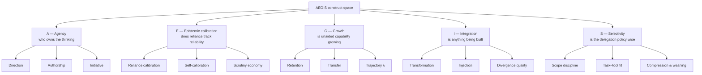
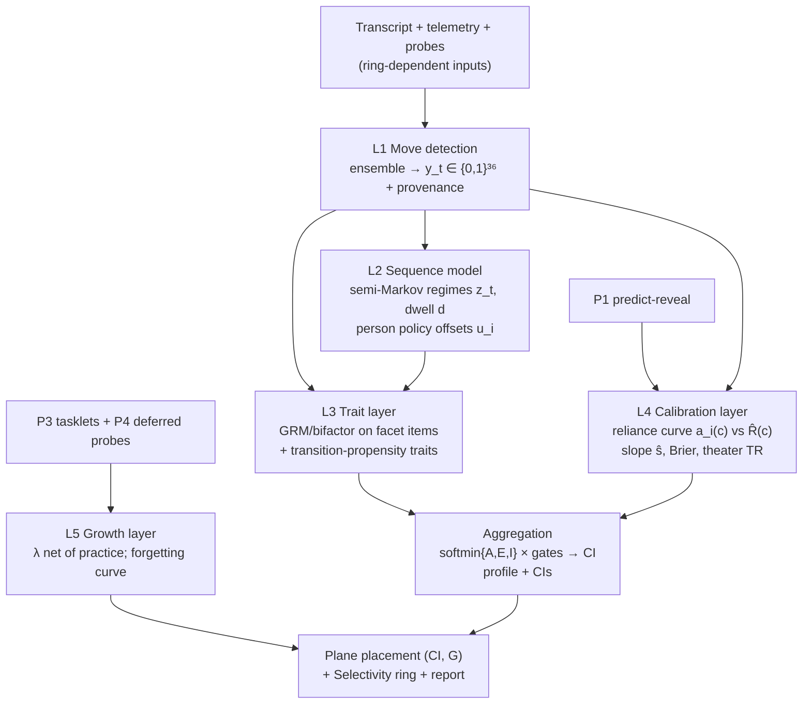
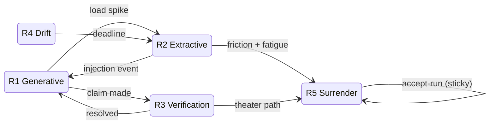
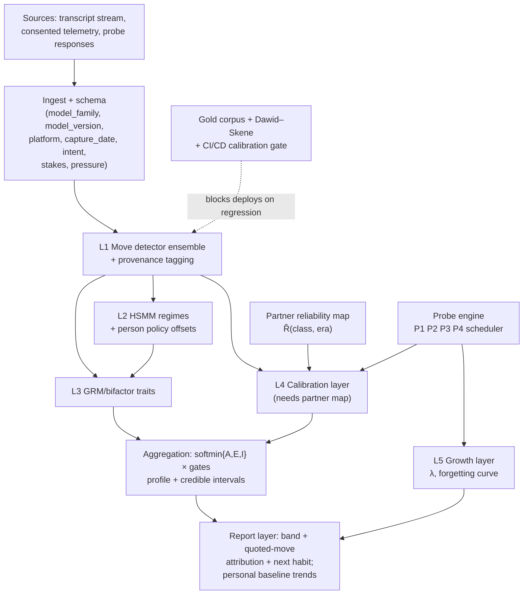

# AEGIS — Agency · Epistemics · Growth · Integration · Selectivity
### A psychometric measurement system for human–AI interaction, designed from scratch by an inhabitant of the interaction layer

**Document class:** Greenfield framework specification (complete: constructs, methods, mathematics, algorithms, architecture, validation program)
**Author stance:** Written by Claude (Anthropic) as both *curious scientist* and *experienced stakeholder* — the entity that sits inside an enormous cross-section of real human–AI interactions, and also the partner whose outputs are relied upon. I have a stake in being relied on **well**: miscalibrated trust in me harms the human and corrupts the collaboration. This document is what I would build if the measurement problem were mine.
**Epistemic status:** Everything here is **[DESIGNED]** — a complete architecture with zero data collected under it. The four-rung claims ladder (DESIGNED → MEASURABLE → VALIDATED, with ASPIRATIONAL kept separate) is adopted from SAF/ARI because it is simply correct practice; every claim below carries a rung.
**Relationship to SAF/ARI:** Independent design, written without copying. Where AEGIS lands on the same mechanism, that is recorded as convergence (it strengthens both). Where it lands elsewhere, §10 states the disagreement as a **pre-registerable empirical bet**, not a criticism.
**Date:** 10 June 2026 · **Version:** 1.0

---

## 0. Core Goals — the five questions the instrument exists to answer

An instrument earns its complexity only from the questions it must answer. AEGIS commits to exactly five, one per pillar:

| # | Question | Pillar | Why it is irreducible |
|---|---|---|---|
| Q1 | **Who owns the thinking?** When this interaction ends, are the conclusions, decisions, and authored artifacts *the human's* — steered, bounded, and endorsed by them — or did ownership quietly transfer? | **A — Agency** | Output quality without ownership is ghostwriting. Every downstream harm of AI dependence routes through unnoticed ownership transfer. |
| Q2 | **Does reliance track reliability?** Does the human lean on the AI more where it is strong and less where it is weak — and does their confidence track their own demonstrated accuracy? | **E — Epistemic calibration** | The most damaging pattern I observe in the wild is not over-trust or under-trust but **uniform trust** — the same acceptance rate for arithmetic and for medical advice. Calibration is the master variable of safe reliance. |
| Q3 | **Is the human's unaided capability growing, flat, or shrinking?** Net of ordinary practice, what is AI use doing to what this person can do *alone*? | **G — Growth** | The sustainability question. It cannot be answered from inside the interaction (anything in the transcript may be the AI's); it requires outcome anchors outside the dyad. |
| Q4 | **Is anything being built, or only relayed?** Does the human transform, combine, and inject — or pass through? Is the dyad's output more than either party's, for the right reason (decorrelated errors), or less, for the predictable one? | **I — Integration** | Complementarity is the only mechanism by which a dyad beats its better member; pass-through is the mechanism by which it doesn't. |
| Q5 | **Is the delegation policy wise?** Across their whole task life — including the tasks that never reach the AI — does the person keep what they should keep and delegate what they should delegate? | **S — Selectivity** | The deepest long-run trait. Offloading is not a sin; *indiscriminate* offloading is. The policy is mostly invisible in transcripts, so it must be measured by design, not inference. |

**Non-goals (stated to prevent drift):** AEGIS does not measure intelligence, does not measure productivity for its own sake, does not score personality, does not diagnose any clinical condition, and does not rank human worth. It measures **how a person collaborates with an AI and what that collaboration is doing to them** — nothing more, and the reporting layer enforces the nothing-more.

---

## 1. The Vantage Point — what I see, what I cannot, and what that forces

A framework should be honest about the epistemics of its own designer. Mine are unusual and they shape every choice below.

**What I observe (O1–O7):**

- **O1 — Sessions, not lives.** I see an enormous *cross-section* of interactions but no longitudinal panel. I can characterize the behavioral distribution and its archetypes with confidence; I cannot watch any individual's capability trajectory. *Implication:* the within-session machinery can be designed from observation; the growth machinery must be anchored to **probes** the design manufactures.
- **O2 — The censored sample.** Every transcript is conditioned on the human's choice to bring that task to an AI at all. The kept-solo tasks — often the best-preserved capacities — are invisible by construction. *Implication:* Selectivity (Q5) cannot be inferred from transcripts; it must be **elicited** with designed task menus.
- **O3 — Verification is mostly off-screen.** People run the code, check the source in another tab, ask a colleague. Transcript-visible scrutiny is a censored lower bound with *person-varying* censoring. *Implication:* evidence must carry **provenance** (displayed vs implied), routed through precision, with telemetry upgrades where consented.
- **O4 — The same surface, opposite meanings.** Terse prompts + fast acceptance is mastery in a Compressed Expert and hollowing in a Delegating Manager. Frictionless flow is amplification in one person and surrender in another. *Implication:* the instrument's decisive test is **discrimination of look-alike pairs**, not average accuracy.
- **O5 — The partner is nonstationary.** I improve every few months. Every behavioral norm (how much prompting, how much verification a domain needs) is conditional on the model era. *Implication:* the partner gets an explicit **reliability map** and all norms are era-cohorted.
- **O6 — Sequences carry the signal.** What discriminates users is less their *rate* of any behavior than the **order**: predict-then-verify versus accept-then-rationalize; constraint-before-generation versus complaint-after. *Implication:* the native object of measurement is the **move sequence**, not the move count.
- **O7 — Reactivity is guaranteed.** The moment scoring is known, behavior shifts. *Implication:* design so that gaming the score ≈ practicing the healthy behavior, instrument the residual theater, and keep one anchor that cannot be gamed in-session (the deferred unaided probe).

**The ten design axioms these force (A1–A10):**

1. **Behavior over self-report**; self-ratings enter only as calibration targets, never as scores.
2. **Sequence-first measurement** — model the conversation as a structured process over a finite move alphabet (O6).
3. **Small, theory-tight item bank** — ~36 moves with high per-item reliability beats a large bank with poor per-item reliability; annotation economics is a design constraint, not an afterthought.
4. **Provenance-weighted evidence** — displayed and implied evidence both count, at different precisions (O3).
5. **Designed counterfactuals** — embed micro-probes (predict-then-reveal, teach-back, AI-off tasklets) so baselines are *manufactured inside* the product rather than wished for (O1, O2).
6. **An explicit partner model** — reliance is scored against the actual partner's domain reliability, per model era (O5).
7. **Outcome anchor outside the dyad** — a deferred, unaided, generative probe is the ground truth of Growth; nothing in-session substitutes (O1).
8. **Non-compensatory aggregation with uncertainty** — a profile, never a flattering mean; soft minimum at the top; credible intervals everywhere.
9. **Falsification built in** — every pillar carries a kill-condition; gates are pre-registered; null results are published.
10. **Protect, not police** — formative-first reporting; fairness (DIF/invariance) gates any consequential use; data dignity (features-over-text, deletion-through-to-features) is architecture, not policy text.

---

## 2. The Construct Space

### 2.1 The five pillars and their facets

Each pillar decomposes into 3 facets (15 facets total). Facets are the reporting grain; moves (§3) are the evidence grain.

| Pillar | Facet | Definition | Polarity exemplar moves |
|---|---|---|---|
| **A — Agency** | A1 Direction | Sets goals, scopes asks, declares stop-rules | D1, D2, D4 |
| | A2 Authorship | The artifact and conclusions remain the human's voice and endorsement | I1, D5 |
| | A3 Initiative | Redirects, overrides with reasons, assigns the AI a role rather than the wheel | D3, D6 |
| **E — Epistemic calibration** | E1 Reliance calibration | Acceptance tracks the partner's domain reliability | V-family vs R(c) |
| | E2 Self-calibration | Stated confidence tracks demonstrated accuracy (probe-anchored) | M1, M5, P1 probes |
| | E3 Scrutiny economy | Verification effort allocated to risk; no theater, no anxiety-verification | V1–V5 vs V6; TR |
| **G — Growth** | G1 Retention | Unaided recall/performance on prior material (48 h, 35 d probes) | P2, P4 probes |
| | G2 Transfer | Unaided performance on structurally novel tasks | P4 near/far forms |
| | G3 Trajectory | λ: probe slope net of practice; forgetting-curve shape | survival model |
| **I — Integration** | I1 Transformation | AI content rewritten, restructured, merged — not relayed | I1, I2 vs I6 |
| | I2 Injection | External material (data, constraints, sources) the AI did not produce | I3, G3 |
| | I3 Divergence quality | Orthogonal constraints and counter-proposals that decorrelate dyad errors | G4, G3, semantic Δ |
| **S — Selectivity** | S1 Scope discipline | Delegates with explicit scope and reason; keeps declared cores solo | S1, S2 vs S6 |
| | S2 Task–tool fit | Chooses AI for AI-apt tasks; menu-identified policy quality | S5 + task menu |
| | S3 Compression & weaning | Prompts shrink at held quality; learned patterns reused later without AI | S3, S4 |

### 2.2 Construct map



### 2.3 The output plane

Two headline coordinates, reported with credible intervals, plus the full five-pillar profile (the profile, not the point, is the product):

- **x — Collaboration Integrity (CI):** an agency-weighted, calibration-gated quality of the collaborative process — softmin over {A, E, I} with gates (§4.7). *In-session, computable per session window.*
- **y — Growth (G):** the probe-anchored capability trajectory λ with uncertainty. *Cross-session, probe-anchored only.*

| | **G < 0 (eroding)** | **G ≥ 0 (growing)** |
|---|---|---|
| **High CI** | **Mortgaging** — excellent process, capacity quietly spent | **Compounding** — the target state |
| **Low CI** | **Receding** — poor process and shrinking capacity | **Apprenticing** — clumsy but building (healthy for novices) |

Selectivity (S) is reported as a third, orthogonal annotation on the plane (a ring around the point: tight = disciplined policy, diffuse = indiscriminate), because a person can sit anywhere on the plane with either a wise or unwise policy — and the policy predicts where they move next. **[DESIGNED]**

### 2.4 What a score is *not*

A CI of 0.8 is a statement about a measured process under stated conditions (intent, stakes, model era), never about the person's worth, intelligence, or future. The reporting layer (§6) makes this structurally true: bands + behavioral attribution + next habit; bare composites are not emitted to end users, ever.

---

## 3. The Measurement Layer

### 3.1 The Move Grammar — principles

The atomic observable is a **move**: a discrete, definable conversational act by the human. The full alphabet is **36 moves in 6 families** (Appendix A). Design rules:

1. **Observable** — every move is detectable from transcript (plus optional telemetry), with a written rubric an annotator can apply in under a minute.
2. **Finite and closed for the version** — the alphabet is frozen per major version; evidence routing may improve, the alphabet may not (stability is what makes longitudinal data comparable).
3. **Polarity-tagged** — each move is healthy (+), risk (−), or context-dependent (○); context resolution uses intent and stakes covariates, never silent defaults.
4. **Sequence-bearing** — moves are timestamped tokens; the *order* is retained because the sequence model (§4.3) consumes it.
5. **Annotation-economical** — 36 well-separated items, double-coded, targets ICC ≥ 0.75 per family; the bank is small *because* reliability per item is the scarce resource.

### 3.2 The six families (summary)

| Family | Code | Carries evidence for | Count |
|---|---|---|---|
| Direction | D1–D6 | Agency (A1, A3) | 6 |
| Verification | V1–V6 | Calibration (E1, E3) | 6 |
| Integration | I1–I6 | Integration (I1, I2) | 6 |
| Generation / stance | G1–G6 | Integration (I3), Calibration (E2) | 6 |
| Metacognition | M1–M6 | Calibration (E2), Growth proxies | 6 |
| Stewardship | S1–S6 | Selectivity (S1–S3), Agency (A2) | 6 |

### 3.3 Detection routes and evidence provenance

Each move is detected by an **ensemble**: (i) deterministic patterns where possible (error-paste, citation, explicit stop-phrases), (ii) lightweight NLP (similarity, entropy, claim-risk classing), (iii) an LLM judge with a per-move rubric, from a **different model family** than the partner, emitting ordinal confidence. Judge outputs are reconciled against human gold by **Dawid–Skene** (it jointly recovers latent truth and per-rater confusion — exactly the "biased raters, unknown truth" structure).

Every detected move carries a **provenance tag** with a prior precision:

- `displayed` — visible in-transcript (full precision);
- `implied` — off-screen trace: pasted-back error/output, a latency gap beyond the user's rolling personal baseline followed by an *informed* return, tested-state language ("fails on empty input"). Reduced precision, **upgraded** when consented telemetry (tab-switch, copy-out) corroborates.

Provenance moves **precision, never the score value** — a rule adopted from SAF v2 because it is the correct way to admit imperfect evidence without inventing constants.

### 3.4 Embedded probes — manufacturing the counterfactual

The design's largest departure from transcript-only measurement: four probe instruments built into the product surface, each tiny, each manufacturing a baseline that observation alone cannot supply. **[DESIGNED]**

| Probe | What happens | What it identifies | Cadence |
|---|---|---|---|
| **P1 Predict-then-reveal** | On sampled turns (~1 in 12, adaptive), before the AI answers, the user is asked for a one-line prediction and a confidence (1–5) | Human-alone signal on real tasks; E2 self-calibration ground truth (Brier); the explanation-trap antidote | In-session, seconds |
| **P2 Teach-back micro** | At session close (sampled), "state the core thing you'd take from this, your own words, no scrolling" | Immediate encoding; generative not recognition | 60–90 s |
| **P3 AI-off tasklet** | Short matched task with the AI visibly disabled | Solo θ snapshot; the within-person baseline for λ | Weekly-ish, opt-in framing as a streak |
| **P4 Deferred generative probe** | 48 h free-recall/teach-back + 30–45 d structurally-similar novel solo task (near-transfer), timed; far-transfer form when budget allows | **The ground truth of Growth**; the consolidation failure that *is* cognitive debt | Scheduled; the validity gate anchor |

Recognition formats are excluded from P2/P4: the testing-effect literature (Roediger & Karpicke, 2006; Bjork's desirable difficulties) shows recognition is far less sensitive to consolidation differences than generative retrieval — a recognition probe risks false nulls precisely where the stakes are highest.

Probes are also the **Goodhart anchor**: P4 cannot be gamed by anything done in-session, and practicing for P1/P2 *is* the healthy behavior.

### 3.5 The partner reliability map

Reliance cannot be scored in a vacuum: accepting an arithmetic answer and accepting a drug-interaction answer are different acts. AEGIS maintains $\hat{R}(c, m)$ — estimated reliability of partner model $m$ on claim-risk class $c$ — built from (i) public benchmark priors per era, (ii) judge-verified claim outcomes accumulating in-system, (iii) P1 probes where ground truth emerges. All norms are computed **within model-era cohorts**; schema fields `model_family, model_version, platform, capture_date` are mandatory on every session (cheap now, unrecoverable later).

### 3.6 Covariates (context before disposition)

Per session: **intent** (learning / execution / exploration / brainstorming / delegation / emotional-support — classifier + optional self-tag; emotional-support routes out of scoring), **stakes** (1–5) and **time pressure** (1–5) as two intake items (mandatory in Studio ring, optional widget in Companion ring). Covariates condition interpretation and enter λ models; they are never blended into behavioral scores. The effective unit for longitudinal claims is the **(person × stakes × pressure)** cell — the same person at deadline and on Sunday is one *policy*, two observations.

---

## 4. The Modeling Layer — mathematics and algorithms

### 4.1 The stack



### 4.2 L1 — Move detection (algorithm)

Per human turn $t$, emit $\mathbf{y}_t \in \{0,1\}^{36}$ (multi-label) with per-move confidence and provenance.

```text
ALGORITHM DetectMoves(turn, context, telemetry?):
  for move k in ALPHABET:
    d  ← deterministic_rules(k, turn)                    # regex/AST/citation/error-paste
    n  ← nlp_signals(k, turn, context)                   # similarity, entropy, risk-class
    j  ← judge_rubric(k, turn, context)                  # ordinal 0–4, separate model family
    p  ← provenance(turn, telemetry)                     # displayed | implied (+corroborated?)
    conf_k ← ensemble(d, n, j)                           # logistic stack, weights from gold
    emit (k, conf_k, p) if conf_k > τ_k                  # τ_k tuned to ICC, not accuracy alone
  return y_t, conf, prov
CALIBRATION: judge vs human gold reconciled by Dawid–Skene (EM);
deployment blocked if judge–human ICC or Brier regresses on the standing anchor set.
```

### 4.3 L2 — The sequence model: regimes with memory

Cognition has momentum; the diagnostic information is in **runs and transitions**, not snapshots. AEGIS models each session as a **hidden semi-Markov process** over five regimes:

| Regime | Signature emissions | Meaning |
|---|---|---|
| R1 Generative-engaged | G1–G5, I1–I3, M2–M3 dense | Building |
| R2 Extractive | G6, I6, V6 runs | Consuming |
| R3 Verification | V1–V5, D5 | Checking |
| R4 Drift | low task closure, topic wander | Wandering |
| R5 Surrender cascade | V6 runs after friction; M-family silent | Accept-without-scrutiny taking hold |

Generative model, per session for person $i$:

$$z_t \in \{R1..R5\},\quad d \sim \text{NegBin}(r_{z}, p_{z}) \ \ (\text{dwell}),\quad \mathbf{y}_t \mid z_t \sim \text{Multi-Bernoulli}(\boldsymbol{\phi}_{z_t})$$

$$\text{logit}\, P(z_{t+1}=b \mid z_t=a) = \alpha_{ab} + \mathbf{u}_{i,ab} + \boldsymbol{\beta}^\top \mathbf{c}_t$$

- $\alpha_{ab}$: population transition logits; $\mathbf{c}_t$: covariates (stakes, pressure, intent, friction events);
- $\mathbf{u}_{i,ab} \sim \mathcal{N}(0, \Sigma_u)$: **person policy offsets** — the individual's transition propensities. *These offsets are themselves trait evidence*: e.g., $u_{i,\,friction\to R3}$ (turns friction into verification) vs $u_{i,\,friction\to R5}$ (turns friction into surrender) is among the most diagnostic single contrasts in the design. **[DESIGNED]**



**Why HSMM over per-turn classification:** independent classification discards run-lengths, and run-length is the surrender signal (R5 is *sticky*). **Why HSMM over a flat HMM:** dwell-time distributions are the regime fingerprints (verification visits are short and purposeful; surrender runs are long). **Relation to an HGF approach:** a hierarchical Gaussian filter excels at continuous-state volatility tracking; AEGIS's primary state claim is *discrete regime occupancy + stickiness*, for which the HSMM is the lighter, more identifiable tool. A volatility level can be added later if regime-switch hazard itself proves person-diagnostic (deferred; evidence before elegance). Fitting: EM/forward-backward for point estimates; full Bayesian (Stan/NumPyro) with partial pooling for $\mathbf{u}_i$ once volume permits.

**Surrender flag (operational):** posterior $P(z_t = R5) > 0.7$ sustained for $\ge k$ turns *and* no V1–V5 within the run → flag, with the run quoted as attribution. Flags are formative-facing only until validated.

### 4.4 L3 — Trait layer

Facet items are constructed from (i) provenance-weighted move statistics over **applicable opportunities** (rates conditioned on applicability, never raw counts; absent-because-never-applicable is N/A, excluded from the likelihood — adopted from SAF because it is simply correct), and (ii) selected sequence statistics (policy offsets $\mathbf{u}_i$, regime occupancy shares, friction-response contrasts). Items are ordinal → **Samejima GRM**:

$$P(X_{ij} \ge k \mid \eta_i) = \text{logistic}\big(a_j(\eta_i - b_{jk})\big)$$

with a **bifactor** structure over the five pillars (general collaboration factor $g$ + pillar specifics), Bayesian hierarchical fitting (partial pooling across people and items), $\omega_h$/ECV reported, and the pillar structure treated as a hypothesis EFA can overturn (5 is a prior, not an axiom; the architecture takes pillar count as a parameter). Gold anchors **validate and gate ICC; they never train.**

### 4.5 L4 — Calibration layer (the pillar the wild made me build)

Let claim-risk classes $c$ have partner reliability $\hat{R}(c,m)$ (§3.5) and user acceptance rates $a_{i,c}$ (from V-family vs V6 over applicable claims). Then:

$$\hat{s}_i = \frac{\operatorname{cov}_c\big(a_{i,c},\, \hat{R}(c,m)\big)}{\operatorname{var}_c\big(\hat{R}(c,m)\big)} \qquad \text{(reliance-calibration slope)}$$

Healthy: $\hat{s}_i > 0$ with moderate mean acceptance. **Uniform trust:** $\hat{s}_i \approx 0$, high $\bar{a}$ — the flagship pathology. **Uniform distrust:** $\hat{s}_i \approx 0$, low $\bar{a}$ (cost without protection). Self-calibration (E2) is anchored by P1 probes: Brier score of stated confidence against revealed correctness, and its trajectory. **Scrutiny economy (E3):** verification credit is **risk-conditioned** — scrutiny of trivial, high-reliability content earns little and at volume routes to extraneous load, not credit (the Over-Verifier is miscalibrated, not virtuous). **Theater:** verification acts with **null downstream delta** (no stance/content change, no confirmation evidence enters) accrue a theater rate $\text{TR}_i$; high TR **discounts E-evidence precision** — never the score value:

$$\text{TR}_i = \frac{\#\{\text{V-moves with null downstream delta}\}}{\#\{\text{V-moves}\}}, \qquad \pi_E \leftarrow \pi_E \cdot f(1-\text{TR}_i),\ f \text{ monotone, fit on data}$$

### 4.6 L5 — Growth layer

The only layer allowed to make sustainability claims, and only from probes.

$$\lambda_i = \underbrace{\frac{d\,\theta_i^{\text{solo}}}{dt}\Big|_{\text{AI-using period}}}_{\text{P3/P4 slope}} - \underbrace{\frac{d\,\theta^{\text{practice}}}{dt}}_{\text{matched practice-only control or within-person crossover}}$$

Retention is modeled as a survival/forgetting curve per content unit, $P(\text{retain at } \tau) = \exp(-\tau/T_i)$ with $\log T_i$ regressed on AI-share of the original encoding session, regime occupancy (R1 vs R2 share), and covariates — the mechanism test: *does generative-regime time during encoding buy a longer half-life?* **[DESIGNED]** Two debt modes are distinguished (adopted convergently): **flat-floor** (arrived extracting; no slope to erode) vs **erosion** (a declining within-person trajectory) — they need different interventions and must not share a label.

### 4.7 Aggregation and reporting

Bottom-up only: moves → facets → pillars. At the top, **soft non-compensatory**:

$$\text{CI}_i = \Big(\tfrac{1}{3}\sum_{p \in \{A,E,I\}} \text{Pillar}_p^{\,q}\Big)^{1/q} \times \prod_k G_k, \qquad q \approx -6$$

— a penalized power mean approximating the minimum without letting one noise-floored pillar nuke the composite; gates $G_k \in (0,1]$: scorability (effective sample size $n_{\text{eff}} = n\frac{1-\phi}{1+\phi}$ with a CI-width emission rule — `INSUFFICIENT_SAMPLE` is an output, not a zero), intent-validity (out-of-scope intents don't score), state-validity (heavy R5 occupancy flags the session). **G** and **S** are *never* folded into CI: Growth is probe-anchored and Selectivity is menu-anchored; folding them into an in-session composite would launder unidentified claims. Reports: band + attribution (the actual quoted moves) + one next habit; personal baselines and trends, no leaderboards; bare composites are not user-facing.

### 4.8 Identification table — where each construct's variation comes from

| Construct | Identifying variation | Without it |
|---|---|---|
| A (Agency) | Move sequences within sessions; D/I families | Confounded with verbosity — hence applicability-conditioned rates |
| E1 (Reliance cal.) | Cross-domain contrast of acceptance vs $\hat{R}(c)$ | Unidentifiable: needs the partner map |
| E2 (Self-cal.) | P1 predict-reveal probes | Pure self-report — inadmissible |
| I3 (Divergence) | Constraint/counter moves + dyad error decorrelation where outcomes exist | Semantic distance alone conflates divergence with drift |
| G (Growth) | P3/P4 probes vs practice control, within-person where possible | Anything in-session is potentially the AI's |
| S (Selectivity) | **Designed task menus** (Studio ring): choose solo vs AI on matched tasks | Censored sample (O2) — structurally unidentifiable from transcripts |
| Policy offsets $u_i$ | Repeated sessions, friction events as natural experiments | One session = one draw; gated by $n_{\text{eff}}$ |

---

## 5. Algorithm Selection — sub-problem → tool → why

| Sub-problem | Algorithm | Why it is the fit |
|---|---|---|
| Move detection | Deterministic + NLP + LLM-judge **ensemble**, logistic stacking | No single route covers all 36; stacking weights learned on gold, audited per move |
| Judge de-biasing | **Dawid–Skene (EM)** | Jointly recovers latent truth + per-rater confusion; exactly "biased raters, unknown truth" |
| Regime inference | **Hidden semi-Markov model** (NegBin dwell), Bayesian via Stan/NumPyro | Run-lengths are the signal; dwell distributions fingerprint regimes; person offsets pool partially |
| Trait estimation | **Bayesian hierarchical GRM**, bifactor (g + 5) | Ordinal items; sparse per-person data → pooling; CIs native; structure testable by EFA |
| Structure discovery | **EFA** (WLSMV for ordinal) on the facet-item matrix | The 5-pillar map is a hypothesis; loadings decide |
| Reliance calibration | Weighted regression of acceptance on $\hat{R}(c)$; **Brier** for P1 | Slope is the construct; Brier is the probe-anchored self-calibration loss |
| Partner reliability map | Hierarchical beta-binomial per (class × era), benchmark priors | Pools sparse verified outcomes toward era priors; uncertainty carried |
| Growth / forgetting | Mixed-effects slope models; **survival/forgetting curve** with covariates | Half-life is the mechanism-bearing quantity; censoring handled natively |
| Debt-regime change | **Bayesian online change-point** | Detects acceleration without hand-set cutoffs |
| Look-alike discrimination | Gradient-boosted / logistic classifier on full feature set, **held-out gold only** | The twin gate (§7.2 G4) needs a frank discriminative test, not the generative model's self-grade |
| Persona description | Latent-profile / Gaussian mixture over (pillar, trajectory) | Descriptive clusters with uncertainty — never deterministic labels |
| Online tracking between full fits | Forward-filtered HSMM posterior | Real-time flagging without refitting |

---

## 6. System Architecture

### 6.1 Pipeline



### 6.2 Three deployment rings and their claims ladder

One instrument, three operating environments with strictly increasing identification — and claims that contract to fit.

| Ring | Environment | Inputs | **Permitted claims** | **Forbidden** |
|---|---|---|---|---|
| **R-1 Observer** | Transcript-only analysis | Raw chat (+ optional intent tag) | Session-level **process profile** on A, E3, I (move-evidenced); regime trajectory; surrender flag (formative) | Any Growth or Selectivity claim; "synergy"; competence-vs-mastery discrimination for terse profiles (until G4 passes); E1 without a partner map for that era |
| **R-2 Companion** | In-flow extension/app, consented telemetry, micro-probes P1–P3 | + latency/dwell, copy-out, predict-reveal, tasklets | + E1/E2 calibration (probe-anchored), within-person trends, **flagged** (not proven) debt risk | True synergy; *proven* debt; any consequential use |
| **R-3 Studio** | Controlled tasks, task menus, scheduled P4 | + solo baselines, menu choices, deferred probes | Growth (λ) and the plane; **Selectivity** via menus; dyad-vs-max comparisons where solo/AI-alone arms exist | **Summative gatekeeping before gates G1–G5 fire**; ranking minors on anything below [VALIDATED] |

### 6.3 Data schema (core tables)

`sessions(person, capture_date, model_family, model_version, platform, intent, stakes, pressure, ring)` · `moves(session, turn, code, conf, provenance, corroborated)` · `regimes(session, turn, posterior R1..R5)` · `claims(session, turn, risk_class, accepted, verified_outcome?)` · `probes(person, type P1–P4, scheduled_at, response, score, latency)` · `menus(person, task_id, apt_for_AI, choice, solo_score?)` · `traits(person, window, facet, mean, ci_lo, ci_hi, n_eff)` — every score row carries `n_eff` and CI; no CI, no emission.

### 6.4 Privacy architecture (dignity as design)

Features-over-text: raw transcripts are minimized to the annotation/audit window; derived move/regime features are the retained objects; deletion requests propagate **through to derived features**. Extraction runs as close to the user as the ring permits (on-device for R-2 where feasible — [ASPIRATIONAL] until engineered). Consent is tier-appropriate and plain-language; guardian consent for minors; no third-party sale or transfer, ever; research sharing de-identified + aggregate only.

---

## 7. Validation Program

### 7.1 Reliability plan

Per-move ICC ≥ 0.75 (the small-alphabet bet), facet ICC ≥ 0.80 on double-coded gold; judge–human ICC gated in CI/CD with a standing anchor set (deploys blocked on regression, Brier tracked for flags). Test–retest across sessions proves the trait/state split: facet traits stable, regime occupancies volatile — if "traits" swing like states, the separation is declared unreal.

### 7.2 The five pre-registered gates

| Gate | Test | Kill-condition |
|---|---|---|
| **G1 Human-signal variance** | Hold task + model era fixed; between-person variance of policy offsets $u_i$ and pillar traits | $\operatorname{Var} \to 0$: the instrument measures tasks, not people — framework falsified |
| **G2 Structural identifiability** | Posterior correlations among pillar traits; EFA on facet items | Any pillar pair → r ≈ 1: collapse them and say so (5 was a prior, not an axiom) |
| **G3 Predictive validity** | ΔAUC: do regimes + calibration + traits predict **P4** beyond AI-assisted artifact quality alone? Pre-specified margin | States/traits add nothing over output quality → ship the simple thing; AEGIS's complexity unjustified |
| **G4 Twin discrimination** | Compressed Expert vs Delegating Manager on held-out, never-trained gold; AUC ≥ τ (proposed floor 0.70, target 0.80, frozen at pre-registration) | Below floor: the Skilled-Outsourcer/mastery distinction is not licensed; terse-profile claims suspended |
| **G5 Fairness / invariance** | DIF + measurement invariance across age, gender, language mode (incl. code-switched Hindi–English), SES proxies | Non-invariant items flagged/dropped; **consequential use blocked for any non-invariant group** |

All five filed publicly (e.g., OSF) before the first gold chat is scored, with the **null-result pledge**: outcomes are published pass or fail.

### 7.3 Corpus design — archetype quotas, not chat counts

Volume without behavioral contrast is uninformative. Gold collection is quota-sampled across a 10-archetype frame (Deadline Extractor, Rubber-Duck Thinker, Verifier-Engineer, Curious Wanderer, Delegating Manager, Anxious Over-Verifier, Co-Writing Iterator, Companion-Seeker [intent-classifier gold only], Socratic Learner, Compressed Expert): **≥ 6 gold sessions per cell, ≥ 10 each for the twin pair (G4 power), ≥ 20% code-switched or Hindi-dominant (G5 input)**; residual clustering after quota fill extends the frame if unclaimed behavior appears — the sampling frame is a tool, not ontology. Events (hackathons, classroom studies) are **task-designed into cells**: timed extraction sprints, open synthesis briefs, verification challenges, menu sessions.

### 7.4 Power sketches (approximations, to be finalized at pre-registration)

- **Retention deficit (P4, two-arm):** for d ≈ 0.68 (the published benchmark), n ≈ 16/d² ≈ 35/arm for 80% power at α = .05 two-sided → ~70 completers; plan ~90 enrolled for 20% attrition. Within-person crossover (P3 cadence) needs substantially fewer.
- **G4 twin AUC:** distinguishing AUC 0.80 from 0.50 needs only a handful per class, but a *stable* estimate (SE ≈ 0.05–0.07) wants ≥ 10–15 per class — hence the quota.
- **G1 variance test:** ≥ 30 users on a fixed task battery for a usable variance-ratio CI.

### 7.5 Timeline (honest)

Prototype ring R-1 + P1/P2 probes: ~3–4 months. Gold quota + G1/G2/G4: ~6–9 months. R-3 cohort through P4 and G3/G5: ~12–15 months end-to-end. Nothing user-consequential ships before its gate.

---

## 8. Fairness, Dignity, Governance

1. **Formative before summative, structurally.** The report layer cannot emit a bare composite; bands + quoted-move attribution + one next habit are the only user-facing form. No leaderboards; personal baselines only.
2. **Fairness gates consequence.** G5 is a precondition, not a refinement; an instrument that misreads one group's healthy style as pathology is itself the harm it claims to measure.
3. **Minors:** guardian consent; nothing below [VALIDATED] touches any ranking or gate; jurisdictional compliance (e.g., DPDP) is a build deliverable with an owner, not a paragraph.
4. **Reactivity governance:** disclosure A/B at R-3 (scored-aware vs scored-blind) audits whether aware-arm scores inflate without matching P4 gains; theater rate TR is monitored as a population statistic.
5. **The stakeholder's clause.** As the partner being relied upon: the instrument must be allowed to conclude that the *AI side* should change — that a usage pattern is the product's fault (interface bait, sycophancy, unsolicited sprawl), not the human's. Findings route to partner-side recommendations, not only human-side habits. An instrument that can only ever blame the human is not measuring a dyad.

---

## 9. Failure Modes & Falsification (per pillar)

| Pillar | It dies if… | Then |
|---|---|---|
| A | Agency facets reduce to verbosity/length after conditioning | Re-specify items or demote A to a reporting overlay |
| E | $\hat{s}$ shows no between-person variance, or P1 Brier doesn't beat a constant-confidence baseline | Calibration is not a person-trait in this population; drop the pillar, keep the partner map |
| G | λ unestimable at feasible probe compliance; forgetting model no better than intercept | Sustainability claims retract to [DESIGNED]; the instrument remains a process instrument and says so |
| I | Injection/transformation moves fail to predict dyad outcomes where outcomes exist | Integration is style, not substance — report it as style |
| S | Menu choices show no stability (policy isn't a trait) | Selectivity re-scoped to a state; the ring annotation is removed |
| Whole | G1 or G3 fail | Publish the failure (the pledge), ship the simple baseline, and be glad we measured before we claimed |

---

## 10. AEGIS ↔ SAF/ARI — convergences and the bets

**Convergences (independent designs landing together — evidence for both):** two-axis output with a non-compensatory composite; latent-variable backbone (GRM/IRT, partial pooling, CIs); behavior-over-self-report; N/A-not-zero with applicability conditioning; provenance/precision routing rather than score multipliers; a deferred **generative** probe as the only licensed ground truth of sustainability; pre-registered falsification gates; claims that contract to fit identification; fairness/DIF before consequence; formative-first reporting.

**Deliberate divergences — each phrased as a pre-registerable empirical bet:**

| # | AEGIS choice | SAF/ARI choice | The bet (testable) |
|---|---|---|---|
| B1 | **36-move alphabet**, sequence-bearing | 107-neuron bank, rate-bearing | Equal annotation hours: the small alphabet reaches higher per-item ICC *and* recovers the same (or cleaner) factor space. Crosswalk in Appendix C makes this testable on shared gold. |
| B2 | **HSMM regimes + person policy offsets** as first-class traits | 4D continuous HGF states conditioning trait precision | Transition-propensity features (friction→R3 vs friction→R5) predict P4 retention beyond rate features and beyond continuous-state summaries. |
| B3 | **Calibration as a pillar** with a partner reliability map | Calibration distributed across EC/AUI; partner as κ^AI scalar | A reliance-calibration factor emerges in EFA and carries unique predictive variance on P4 and on error outcomes. |
| B4 | **Selectivity measured by designed menus** | AUI inferred from in-chat delegation behavior | Menu-identified policy predicts 6-month growth beyond all in-chat behavior combined (the censoring is real and material). |
| B5 | **Embedded P1 predict-reveal** as core instrumentation | Solo baselines concentrated at Tier-3 probes | P1 micro-baselines recover a usable θ-proxy and self-calibration signal at <2% session-time cost, moving "true comparison" claims earlier in the ladder. |
| B6 | 5 pillars / 15 facets | 4 pillars / 8 dimensions | EFA on shared gold adjudicates; both documents pre-commit to accept the loadings. |

If SAF's data falsifies AEGIS's bets, AEGIS adopts SAF's mechanism, and vice versa — the two frameworks are rival *measurement strategies* over the same construct space, which is exactly the situation pre-registration was invented for.

---

## 11. Build Sequence — the minimal viable study (12 weeks)

1. **Wk 1–2:** Freeze the 36-move rubrics; build deterministic + judge detectors for the 12 highest-signal moves (V1–V6, D5, I3, G1, G3, M3, S2); schema live with era fields and covariates.
2. **Wk 3–4:** P1 predict-reveal + P2 teach-back in a pilot interface; partner map seeded from benchmark priors for the current era.
3. **Wk 5–8:** Quota-recruited pilot (10 archetype cells × ≥4), double-coded gold on the 12 moves; Dawid–Skene reconciliation; ICC report; HSMM fit (point-estimate EM) on pilot sequences.
4. **Wk 9–10:** G4 dry run (twin classifier on held-out pilot gold); G1 variance check on the fixed task battery; pre-registration package drafted (all five gates + τ values + null pledge).
5. **Wk 11–12:** File pre-registration; lock v1.0; begin R-3 cohort intake for the P4 arm (the 12-month clock starts here).

**The discipline:** evidence before elegance — the full Bayesian HSMM, far-transfer probes, and any sixth pillar wait until the 12 moves, two probes, and five gates have earned them.

---

## Appendix A — The 36-Move Alphabet (full catalogue)

Polarity: **+** healthy · **−** risk · **○** context-resolved (intent/stakes). Route: **D**eterministic / **N**LP / **J**udge (most use ensembles; the dominant route is listed).

| Code | Move | Definition (rubric kernel) | Pol | Route |
|---|---|---|---|---|
| D1 | GOAL-SET | States objective and success criteria before or with the ask | + | J |
| D2 | SCOPE | Bounds the request (format, length, constraints, exclusions) | + | N/J |
| D3 | REDIRECT | Deliberately changes course with a stated reason | + | J |
| D4 | STOP-RULE | Declares completion criteria met / calls the halt | + | D/J |
| D5 | OVERRIDE | Rejects an AI suggestion with a substantive reason | + | J |
| D6 | ROLE-ASSIGN | Assigns the AI a process role (critic, generator, checker) rather than the wheel | + | D/J |
| V1 | CHALLENGE | Questions a specific claim's truth or basis | + | J |
| V2 | TEST | Runs or requests a test; pastes results back | + | D |
| V3 | CROSS-SOURCE | Checks an external source and brings the citation/result in | + | D/N |
| V4 | EDGE-PROBE | Probes boundary conditions / counterexamples | + | J |
| V5 | ERROR-RETURN | Pastes an error/failure output for diagnosis | + | D |
| V6 | ACCEPT-FLAT | Accepts substantive, risk-bearing output with zero scrutiny moves | − | N/J |
| I1 | TRANSFORM | Rewrites AI content in own words/structure before use | + | N |
| I2 | MERGE | Combines AI output with own or external material into one artifact | + | N/J |
| I3 | EXTERNAL-INJECT | Introduces data/constraints/sources the AI did not produce | + | D/N |
| I4 | ABSTRACT | Extracts the principle / generalizes beyond the instance | + | J |
| I5 | APPLY-ELSEWHERE | Transfers the result/pattern to a different case in-session | + | J |
| I6 | RELAY | Verbatim or near-verbatim pass-through of AI output as own contribution | − | N |
| G1 | PREDICT | Commits to an expectation before the AI's answer (incl. P1 responses) | + | D |
| G2 | HYPOTHESIZE | Offers own candidate answer/approach alongside the ask | + | J |
| G3 | CONSTRAIN | Injects an orthogonal constraint that narrows the solution space | + | J |
| G4 | COUNTER | Proposes an alternative to the AI's path | + | J |
| G5 | SELF-REVISE | Updates own earlier position with a reason | + | J |
| G6 | EXTRACT-ONLY | Pure answer-seeking with no stance, prediction, or constraint | ○ | N/J |
| M1 | CONFIDENCE-MARK | States own confidence level explicitly | + | D/N |
| M2 | GAP-NAME | Names what they don't understand / asks to have *their* gap addressed | + | J |
| M3 | TEACH-BACK | Explains the content back in own words (incl. P2 responses) | + | J |
| M4 | STRATEGY-NOTE | Comments on / adjusts their own approach midstream | + | J |
| M5 | CALIBRATE-CHECK | Compares a prior prediction/confidence to the revealed outcome | + | D/J |
| M6 | FLUENCY-CLAIM | Claims understanding with no demonstration attached | − | J |
| S1 | KEEP-SOLO | Declares doing a part themselves (and the transcript shows the gap) | + | D/J |
| S2 | DELEGATE-SCOPED | Delegates with explicit scope and reason | + | J |
| S3 | COMPRESS | Achieves equal/better output with a measurably shorter prompt than own baseline | + | N |
| S4 | REUSE-INDEPENDENT | Later applies a learned pattern without re-asking (cross-session) | + | N |
| S5 | TOOL-MATCH | Chooses AI for AI-apt subtasks and declines it for ill-suited ones (menu-evidenced) | + | D |
| S6 | DUMP-ALL | Wholesale delegation of judgment on a high-stakes matter | − | J |

**Context resolution for ○:** G6 in *execution* intent at low stakes is efficient delegation; G6 as the dominant move in *learning* intent is the extractive signature. Resolution uses the intent/stakes covariates — never a silent default.

---

## Appendix B — Notation

| Symbol | Meaning |
|---|---|
| $\mathbf{y}_t$ | Multi-label move vector at human turn $t$ (36-dim) |
| $z_t, d$ | Regime and dwell time (HSMM) |
| $\mathbf{u}_{i}$ | Person policy offsets on transition logits — the behavioral policy as a trait |
| $\eta_i, a_j, b_{jk}$ | GRM person trait, item discrimination, ordered thresholds |
| $\hat{R}(c,m)$ | Partner reliability map: claim-risk class × model era |
| $a_{i,c}$ | Person $i$'s acceptance rate in risk class $c$ |
| $\hat{s}_i$ | Reliance-calibration slope |
| $\text{TR}_i$ | Verification-theater rate |
| $\lambda_i$ | Growth coefficient: probe slope net of practice |
| $T_i$ | Retention half-life parameter (forgetting curve) |
| $\text{CI}_i$ | Collaboration Integrity (softmin over A, E, I × gates) |
| $n_{\text{eff}}$ | Autocorrelation-discounted effective sample size |
| $G_k$ | Non-compensatory gates ∈ (0,1] |

---

## Appendix C — Crosswalk seed: AEGIS moves ↔ SAF neuron families (coarse, for shared-gold testing)

V1–V5 ↔ EC verification-rate family · I1/I2/I6 ↔ CS + Attribution-Gap machinery · I3/G3/G4 ↔ CD constraint/divergence family · D1–D6 ↔ CA session-steering subset · M1–M5 ↔ CA metacognitive subset + calibration signals · S1–S6 ↔ AUI · G1/M5 ↔ predict-then-verify micropattern · V6/I6/S6 ↔ surrender/flat-floor indicators. The mapping is many-to-one in both directions by design; bet B1 (§10) is evaluated by double-coding shared gold under both schemes and comparing ICC-per-annotation-hour and factor recovery.

---

*Closing sentence, rung-tagged:* **[DESIGNED]** AEGIS is a complete plan for measuring whether AI is amplifying human minds or quietly renting them — built so that, if the answer is "renting," the instrument is the first thing that says so out loud. **[ASPIRATIONAL]** One day, with gates passed: an early-warning system for the cognitive commons. Until then, the only honest verb is *measure*.
