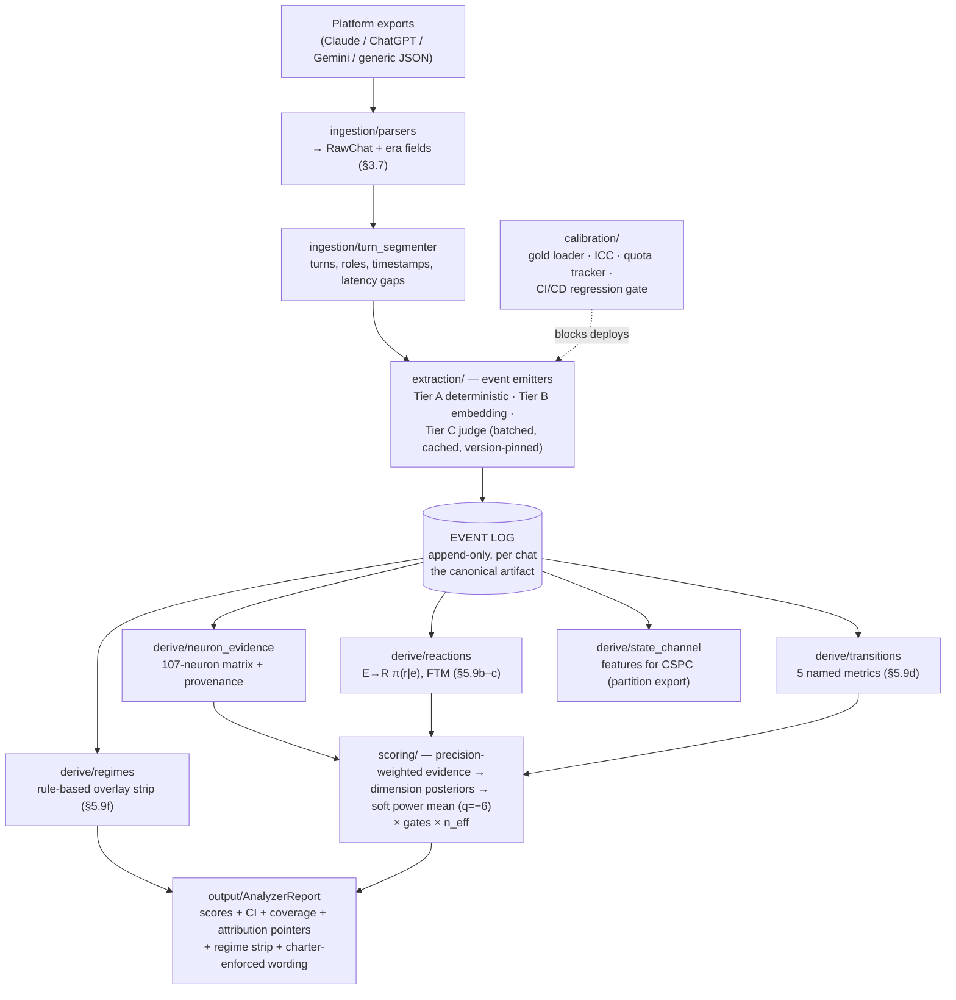

# Chat Analyzer v3 — Implementation Brief (v2.2-native, built from scratch)

**Document class:** Build specification for Claude Code (phased, with explicit STOP points)
**Supersedes:** ChatClassifier_v2_Implementation_Brief.md (v2 remains running until v3 passes parity, §10 P7)
**Framework of record:** SAF_ARI_Final_Master_Compilation_v2.2.md — section references below point there
**Date:** June 2026

---

## 0. Audit of v2 — keep / port / rebuild / discard

| v2 component | Verdict | Reason |
|---|---|---|
| Platform parsers (Claude.ai / ChatGPT / Gemini exports → RawChat) | **Port** | Ingestion is framework-agnostic; add the §3.7 era fields |
| 107-neuron contract table (YAML, data-not-code) | **Port unchanged** | Ontology is frozen; the table is the item bank |
| 3-turn chunker | **Rebuild as event segmentation** | Chunks were a workaround for missing sequence; the event log replaces them as the primary unit (chunk views remain derivable) |
| Tier A/B/C extraction ensemble | **Port logic, rewrap as event emitters** | The detectors are good; their *output target* changes from aggregate features to timestamped events |
| Gemini judge prompts + ordinal rubrics | **Port + version-pin** | Working judge; v3 adds response caching and batch mode |
| Task-type & goal-completion inference | **Port** | Becomes the intent router's first stage (§6.2a conditioning) |
| Scorability gate (structural vs insufficient N/A) | **Port** | Correct as-is; extended with per-cell event-count gating for E→R |
| EqualWeightScorer + pluggable ScorerBackend | **Port** | Still correct: no GRM fit on small gold (governing principle 5 survives) |
| `min-across-pillars` in gated_index | **Discard → rebuild** | Superseded by the soft penalized power mean (v2 master change #3) |
| SynergyReport schema | **Rebuild as AnalyzerReport** | New fields: provenance, evidence pointers, transition metrics, regime strip, charter-enforced wording |
| ICC/calibration harness + 23 gold chats | **Port + extend** | Gold remains the anchor; add archetype-quota tracking (§7.2a) and dimension-grain evidence pointers (§7.1) |
| 93-test suite | **Port as regression floor** | v3 must reproduce v2's MAE on the same gold before adding anything (P7 parity gate) |

**One-line summary of the inversion:** v2 computed `chat → features → scores` and discarded order at step one. v3 computes `chat → EventLog → {all derivations}` where every derivation is a pure function of `(log, config_version)` — replayable when the framework evolves, additive when inputs grow.

---

## 1. Scope

**In scope:** raw chat transcript (both roles) → canonical EventLog → 8-dimension scores with uncertainty, coverage, provenance, and attribution → Tier-1 AnalyzerReport.

**Out of scope (stub the interfaces only):** CSPC/HGF state *inference* (the analyzer **emits the state-diagnostic feature channel**; the filter lives elsewhere — partition, v2 master §2.1); MP probes (Platform/Extension surfaces); GRM fitting; the partner reliability map's *maintenance* (the analyzer consumes a versioned map file and computes ŝ when ≥ 2 risk classes have sufficient claims; otherwise emits `S_HAT_UNAVAILABLE`).

**The additivity rule (the "inputs will increase" requirement, made structural):** every future input — Tier-2 telemetry, self-ratings, platform Episodes, probe responses — arrives as **new event types in the same EventLog** (`source` field). New inputs may add event types, detectors, and derivations. They may never change the log schema's spine or force re-ingestion of history.

## 2. Governing principles (do not violate)

1. **Two hard gates survive from v2.** Contract gate (nothing scores without a validated contract table) and calibration gate (no dimension ships below ICC ≥ 0.70 human–human, ≥ 0.60 judge–human).
2. **Absent ≠ zero.** Structural N/A (condition never arose) is silence in the likelihood; evidenced failure is 0. Two code paths, never coerced. Now extended to E→R cells: `n_e < threshold → cell N/A`.
3. **The log is immutable; derivations are versioned.** Extraction appends; nothing edits. Every derived artifact records `(extractor_version, config_version, contract_version, judge_version, map_version)`. Re-scoring history = re-running derivations, never re-ingesting.
4. **Precision, never multipliers.** Provenance (`displayed`/`implied`), theater (TR), and state conditioning move evidence *precision*; no score is ever multiplied by a confidence constant (v2 master change #2).
5. **Honest uncertainty.** Every emitted number carries CI + n_eff + coverage; `INSUFFICIENT_SAMPLE` is an output state, not an error.
6. **Equal-weight now, learned-weight later.** No GRM on small gold. The ScorerBackend interface is the swap point when volume arrives.
7. **The claims charter is enforced in code, not prose** (§9.1): output layer contains no "synergy" string, AUI renders as "within-chat delegation choices," and the Skilled-Outsourcer flag is hard-gated `enabled=false` until a config flag certifies §8.5 has passed.
8. **Dimension count configurable (8–11)**; EFA may revise it.

## 3. Architecture



### Repository structure

```
chat_analyzer/
  config.py                   # dimensions, thresholds, q=-6, versions (extractor/judge/map/contract)
  schemas.py                  # ALL contracts (Section 4) — Pydantic, field names fixed
  pipeline.py                 # RawChat -> EventLog -> derivations -> AnalyzerReport

  ingestion/
    parsers.py                # one adapter per platform; era fields mandatory
    turn_segmenter.py         # turns, latency gaps vs rolling personal baseline

  extraction/                 # ALL emit Event objects into the log
    tier_a_deterministic.py   # error-paste, citations, code blocks, stop-phrases, latency events
    tier_b_embedding.py       # semantic_distance_delta, similarity, transform-vs-relay
    tier_c_judge.py           # ordinal rubrics per neuron + event taxonomy detectors; BATCHED + CACHED
    claim_risk.py             # claim-risk classifier v0 (rule+judge hybrid) -> risk_class events
    intent_router.py          # intent taxonomy; routes out-of-scope (companionship etc.)
    es_triggers.py            # ES trigger taxonomy (§2.7): arms ES neurons only on trigger events

  eventlog/
    store.py                  # append-only writes; content-hash idempotency; per-chat log files/DB
    replay.py                 # re-run any derivation version over historical logs (THE evolve command)

  derive/                     # pure functions of (log, config) — no I/O, no judge calls
    neuron_evidence.py        # events -> NeuronEvidence matrix (provenance + precision)
    reactions.py              # E->R windows, Dirichlet-pooled pi(r|e), FTM, n_e gating
    transitions.py            # the 5 named metrics
    regimes.py                # rule-based session strip + occupancy/run-lengths
    state_channel.py          # state-diagnostic feature export (partition; CSPC consumes elsewhere)
    calibration_slope.py      # s-hat when computable; else S_HAT_UNAVAILABLE
    theater.py                # TR: verification events with null downstream delta

  scoring/
    scorability.py            # S_id + structural/insufficient N/A + per-cell event gating
    scorer.py                 # ScorerBackend: EqualWeightScorer | GRMScorer(stub)
    aggregation.py            # neurons -> dimensions -> pillars; soft power mean q=-6; gates; n_eff

  output/
    report.py                 # AnalyzerReport assembly
    translation.py            # bands + attribution (quotes via evidence pointers); charter wording
    charter.py                # HARD enforcement: forbidden strings, AUI phrasing, flag gates

  calibration/
    gold_set.py               # dimension-grain gold + mandatory evidence pointers (§7.1)
    icc.py                    # ICC + MAE per dimension; certification artifacts
    quota.py                  # archetype quota tracker (§7.2a): cell counts, gaps, recruitment targets
    regression_gate.py        # CI/CD: anchor set re-scored on every version bump; blocks on regress

  extensions/                 # interfaces only — additive inputs as future event sources
    telemetry_events.py       # Tier-2: tab-switch, copy-out, dwell -> Event(source="telemetry")
    platform_events.py        # Episodes, probes -> Event(source="platform"|"probe")

tests/
  fixtures/                   # RawChat samples incl. Hinglish; synthetic event logs per archetype
  parity/                     # v2 gold outputs for the P7 parity gate
  test_<module>.py
```

## 4. Core data contracts (schemas.py)

### 4.1 RawChat (input)
```python
class RawChat(BaseModel):
    chat_id: str; person_id: str | None
    platform: str; model_family: str; model_version: str   # §3.7 — MANDATORY
    capture_date: datetime
    turns: list[Turn]            # role, text, ts (ts may be None for some exports)
    intent_tag: str | None       # optional user-supplied; router infers otherwise
    stakes: int | None; pressure: int | None               # optional covariates (§2.6)
```

### 4.2 Event (the spine — never changes shape)
```python
class Event(BaseModel):
    chat_id: str; seq: int                      # strict order; seq is the citation key
    turn_idx: int; t: datetime | None
    actor: Literal["human","ai","system"]
    event_type: str                             # namespaced: "neuron.EC_03", "etax.E_FRICTION",
                                                # "claim.risk_class", "latency.gap", "intent.tag", ...
    payload: dict                               # type-specific; validated per registry entry
    confidence: float                           # detector confidence in [0,1]
    provenance: Literal["displayed","implied"]  # §5.8b
    source: Literal["transcript","telemetry","probe","platform"] = "transcript"
    extractor_version: str
```
The **event-type registry** (data file) is the only thing that grows when inputs increase.

### 4.3 NeuronEvidence
```python
class NeuronEvidence(BaseModel):
    neuron_id: str; dimension: str
    value: float | None                # None = structural N/A (silence)
    precision: float                   # prior by provenance; discounted by TR (f(1-TR)); never a multiplier on value
    event_refs: list[int]              # seq pointers — attribution is mandatory
    applicability: Literal["fired","applicable_unfired","structural_na","insufficient"]
```

### 4.4 DerivedMetrics
```python
class DerivedMetrics(BaseModel):
    transitions: dict[str, float | None]       # the 5 named metrics; None when denominator gated
    ftm: dict[str, dict[str, float]] | None    # pi(r|e) per event type; cell-gated by n_e
    regime_strip: list[RegimeSegment]          # label, start_turn, end_turn
    occupancy: dict[str, float]; run_lengths: dict[str, float]
    tr: float | None                            # theater rate
    s_hat: float | None; s_hat_status: str      # "ok" | "S_HAT_UNAVAILABLE" | "MAP_MISSING"
    temporal: TrajectoryFeatures                # early/mid/late segment deltas (v2 master change #6)
```

### 4.5 AnalyzerReport (output)
```python
class AnalyzerReport(BaseModel):
    versions: VersionStamp                      # all five version strings
    dimensions: dict[str, DimensionScore]       # mean, ci_lo, ci_hi, n_eff, coverage, na_breakdown
    collab_quality_index: GatedIndex            # soft power mean q=-6 × gates; NEVER named synergy
    derived: DerivedMetrics
    flags: list[Flag]                           # each flag carries event_refs; skilled_outsourcer
                                                # flag present but enabled=false until twin-gate config
    attribution: list[Attribution]              # plain-language band + quoted evidence per dimension
    charter: ClaimsCharterStamp                 # tier=1; forbidden-claims checklist auto-verified
```

## 5. Extraction spec (event emitters)

- **Dual granularity survives** as *event scope*: local-signal neurons emit from turn windows; global-context neurons (chat-level judge pass) emit `scope="chat"` events anchored to the final turn. The chunk concept becomes a derived view, not an ingestion unit.
- **Judge economics:** batch all Tier-C calls per chat into ≤ 3 requests (chunk-scope batch, chat-scope pass, event-taxonomy pass); cache by `hash(content + rubric_version + judge_model)`; never re-call on replay. Target cost: O(1) judge passes per chat regardless of derivation count — this is what makes "data increases" affordable.
- **Event taxonomy detectors (§5.9b):** `E-ERR` (judge-flagged AI error or user-evidenced), `E-CONTRA`, `E-CONFUSE`, `E-FRICTION` (error-paste, failure language, blocked progress), `E-CORRECT`, `E-OVERREACH`. Each emits one event with provenance.
- **Implied-EC traces (§5.8b):** error-paste → `displayed`; latency gap > rolling personal baseline followed by informed correction → `implied`; tested-state language → `implied`. Telemetry corroboration is a future event source that *upgrades* precision — interface stubbed, not implemented.
- **Claim-risk classifier v0:** rule layer (numeric/code/citation/medical/legal lexicons) + judge fallback; emits `claim.risk_class ∈ {trivial, low, medium, high}` per substantive AI claim, plus `claim.accepted` events from the user's next turns. This is deliberately coarse — it exists so ŝ and risk-conditioned EC have an input; refinement is a calibration task, not an architecture task.
- **ES triggers (§2.7):** ES neurons are armed only when a trigger event fires; otherwise the whole dimension routes to structural N/A with the report line "no ethics-relevant events observed."
- **Intent router:** classifies session intent; out-of-scope intents (companionship, pure chitchat) terminate scoring with an `OUT_OF_SCOPE` report, never low scores.

## 6. Derivations (pure functions; formulas of record)

- **Transition metrics (§5.9d):** verify-after-error = `#(E-ERR → V-class within k turns) / #E-ERR`; constraint-before-generation = share of generation requests preceded by user constraint events; prediction-before-answer = share of substantive asks preceded by stated expectation; accept-run = max/mean consecutive substantive acceptances with zero scrutiny events; revision-after-output = share of AI outputs with downstream transform events. Each emits `None` below its denominator threshold (config: default ≥ 3 opportunities).
- **E→R / FTM (§5.9c):** response window k = 2 human turns (config); first substantive response classed into {VERIFY/CHALLENGE, SYNTHESIZE, CONSTRAIN, ACCEPT-FLAT, DISENGAGE, DELEGATE-MORE}; π_i(r|e) via Dirichlet pooling toward population priors (priors file versioned; flat until population data exists); cell N/A below n_e ≥ 3.
- **Regime overlay (§5.9f):** deterministic rules over event density per sliding window — generative (synthesis/constraint/prediction-dense), extractive (ask-receive runs), verification (scrutiny-dense), drift (low closure + topic wander via embedding), accept-run (≥ 3 consecutive unscrutinized substantive acceptances). Output = labeled segments. **No inference, no hidden states; the label "surrender" is forbidden in this module** (CSPC owns it).
- **Theater (§5.8e):** TR = verification events with null downstream delta / all verification events; null delta = no stance change, no content change, no confirmation evidence within window. EC precision ← prior × f(1−TR), f monotone (v0: f(x)=x, declared in config as provisional).
- **ŝ (§5.8d):** computed only when ≥ 2 risk classes each have ≥ 5 accepted/verified claims against a present map version; else status string. Per-chat ŝ is *reported as descriptive*; person-level ŝ is a multi-session aggregation (out of analyzer scope, computed downstream).
- **Temporal segmentation:** early/mid/late thirds; per-dimension deltas; trajectory features for the report's trend language.

## 7. Scoring

Evidence-precision-weighted dimension posteriors (normal approximation per dimension over fired neurons; structural N/A silent; insufficient → coverage flag) → pillar means → composite:

`CQI = ( (1/4) Σ_pillar P_k^q )^(1/q) × Π gates`, `q = −6` (config), gates = scorability × intent-validity × state-validity-flag. `n_eff = n(1−φ)/(1+φ)` with lag-1 autocorrelation φ over turn-level evidence; CI width from n_eff. Output name everywhere: **collab_quality_index** — the string "synergy" fails CI (a literal test greps the output layer).

## 8. Calibration & gold protocol (start here — we build *over the annotated chats*)

1. **Gold format upgrade (one-time, ~2 days):** re-export the 23 gold chats into the v3 gold schema — dimension-grain scores + **mandatory evidence pointers** (annotators quote turns; §7.1). Existing annotations carry over; pointers are added where missing.
2. **Parity floor:** v3 must match v2's per-dimension MAE (overall 0.2994) on the same 23 before any new derivation counts — proves the rebuild lost nothing.
3. **Targets:** per-dimension MAE ≤ 0.375; EC plan = quota cells (Verifier-Engineer + Over-Verifier) feeding few-shot curation + the §5.8 provenance widening — track EC MAE per gold batch; expected mechanism of improvement is *construct coverage* (implied verification) plus contrast cases, not volume alone.
4. **Quota tracker live from day one (§7.2a):** every gold chat tagged to an archetype cell; the tracker reports cell gaps (target ≥ 6/cell, ≥ 10 twin-pair) and is the recruitment dashboard.
5. **Hinglish slice:** ≥ 20% of incoming gold code-switched; judge rubrics smoke-tested on Hinglish fixtures before certification (A8 input).
6. **CI/CD regression gate:** the anchor set re-scores on every `(extractor|judge|contract|map)` version bump; ICC/MAE regression blocks merge.

## 9. Scale & ops (the "data increases" engineering)

- **Throughput:** stateless workers per chat; queue in front; judge batching + caching as in §5; embeddings cached by content hash. Replay of N historical chats touches zero judge calls.
- **Storage:** event logs are the system of record (append-only, ~5–50 KB/chat compressed); derived tables are disposable and recomputable — deletion requests (§9.5 dignity) delete the log and cascade by construction.
- **Versioning:** five version strings stamped on everything; `replay.py --derivation all --config vNEXT --since DATE` is the single command that re-scores history when the framework evolves.
- **Norms:** all normalizations keyed by `(model_family, era_bin)` from day one (§3.7) even while only one era exists — the key structure is the cheap part.
- **Cost model (track from P1):** judge tokens/chat, cache hit rate, $/1k chats — reported in CI so scale surprises are impossible.

## 10. Build phases (STOP = human review before proceeding)

- **P0 — Schemas + event registry + log store + replay skeleton.** Fixtures: 3 synthetic logs (extractor-free) proving derivations run on logs alone. **STOP: schema review (Ritesh).**
- **P1 — Ingestion + Tier-A deterministic emitters + latency baseline.** Era fields enforced. **STOP: event-type registry sign-off.**
- **P2 — Gold re-export to v3 format + quota tracker.** The 23 chats land with evidence pointers. **STOP: psychometrics review of gold schema (Sathwik).**
- **P3 — Tier-B + Tier-C judge emitters (batched/cached) + intent router + ES triggers.** **STOP: judge-cost report + Hinglish smoke test.**
- **P4 — derive/: neuron_evidence, transitions, reactions/FTM, regimes, theater, temporal.** Unit tests per formula on synthetic logs. **STOP: formula review against §5.8–5.9.**
- **P5 — Scoring + aggregation (soft power mean) + n_eff/CI + scorability.** **STOP: math review.**
- **P6 — Output layer + charter enforcement + attribution via event refs.** Literal forbidden-string tests. **STOP: charter review.**
- **P7 — Parity gate:** v3 ≥ v2 on the 23 gold (MAE per dimension); regression harness ported. **STOP: go/no-go to retire v2.**
- **P8 — claim_risk v0 + map consumption + ŝ + TR live; extension stubs (telemetry/platform event sources).** **STOP: v3.0 tag.**

## 11. The do-NOT list

Do not implement CSPC/HGF inside the analyzer (emit state-channel features only). Do not fit a GRM on 23 chats. Do not coerce structural N/A to 0 — anywhere, including E→R cells. Do not let any provenance/state/theater signal multiply a score (precision only). Do not hardcode 8 dimensions, q, k-windows, or thresholds (config). Do not emit "synergy," percentile ranks, or an enabled Skilled-Outsourcer flag. Do not call the judge inside `derive/` (extraction-time only — replay must be free). Do not invent a second state machinery in `regimes.py`. Do not begin P3 before P2's gold schema is signed (the annotated chats are the anchor; everything calibrates against them).

## 12. First task

Implement P0 exactly: `schemas.py`, the event-type registry file with the namespaces in §4.2, `eventlog/store.py` (append, idempotent by content hash), `eventlog/replay.py` skeleton, and three synthetic-log fixtures (one per archetype contrast: Deadline Extractor, Verifier-Engineer, Compressed Expert) with passing tests that run every `derive/` stub over them. Stop and report.
