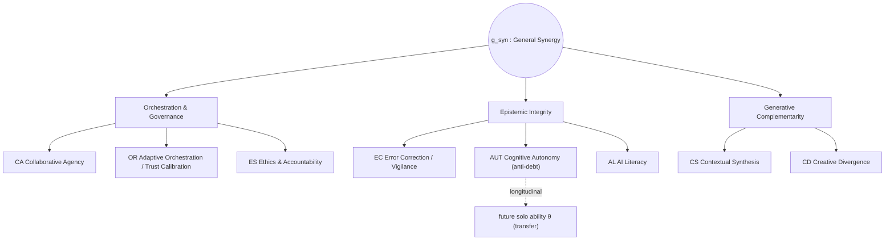
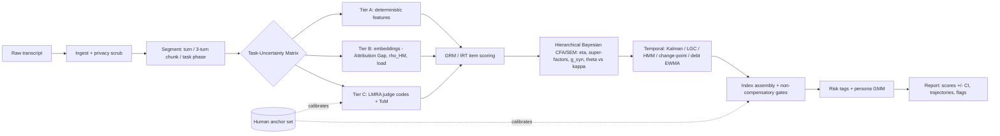
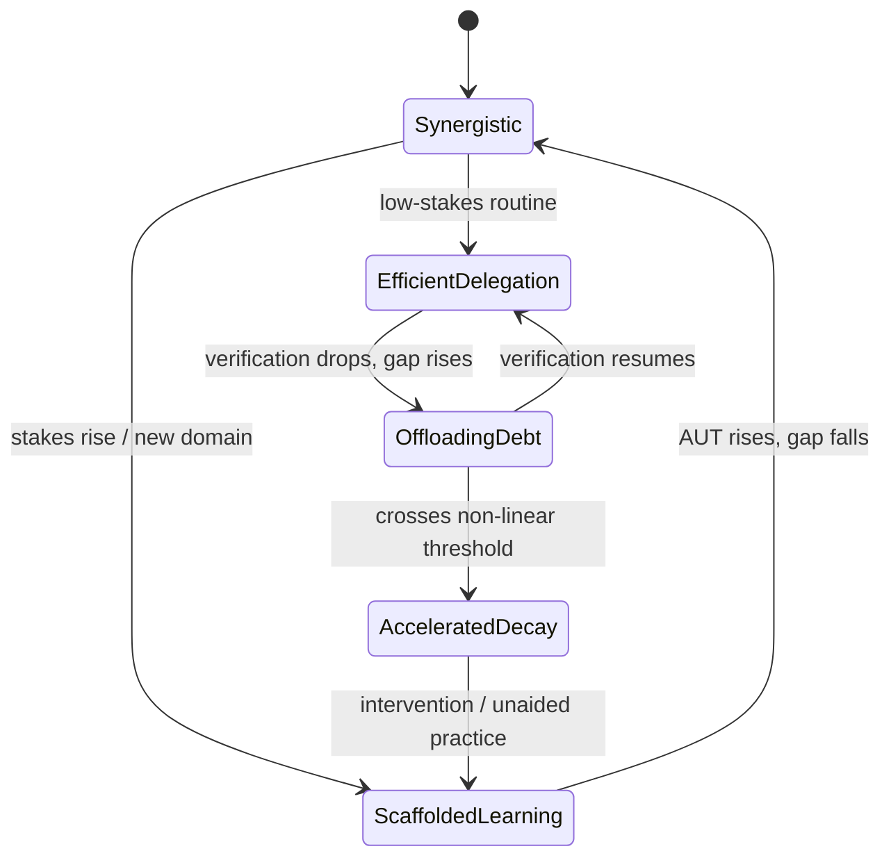

# Conversational Human–AI Synergy
### A Research-Grade Measurement Architecture

*Foundational specification (v1.0) for transforming raw human–AI conversational data into validated, multidimensional synergy metrics.*

---

## 0. Orientation and Design Commitments

This document specifies an end-to-end system that ingests raw human–AI dialogue and emits validated, interpretable, multidimensional **synergy** scores with uncertainty, longitudinal trajectories, and risk markers. It is engineered to be *mathematically interpretable, statistically valid, and scalable*, and it is deliberately built on top of the empirical literature rather than intuition.

Five non-negotiable commitments shape every downstream decision. They are not stylistic preferences; each is forced by a specific empirical finding.

1. **Measure behavior, not self-report.** Self-efficacy and self-reported AI literacy are poor proxies for actual competence (Chiu et al., 2025; the SAIL4ALL validation, Humanities & Social Sciences Communications, 2025). People are systematically miscalibrated about their own offloading (Risko & Gilbert, 2016). The system therefore scores *what users do in the transcript*, never what they claim.

2. **Decouple solo ability from collaborative ability.** Raw accuracy or output quality conflates a user's baseline expertise with the value the partnership adds. Riedl & Weidmann's Bayesian IRT formulation proves collaborative ability ($\kappa$) is a construct distinct from solo problem-solving ability ($\theta$). The headline metric must isolate the *boost*, not the *level*.

3. **Synergy has a stringent, asymmetric baseline.** Following Vaccaro, Almaatouq & Malone (2024), *synergy* is performance of the human–AI dyad relative to $\max(\text{human alone}, \text{AI alone})$ — a strictly harder bar than *augmentation* (dyad vs. human alone). On average, dyads achieve augmentation but **not** synergy. A serious measurement system must not flatter the interaction by using the easy baseline.

4. **Synergy is conditional on learning and verification.** Re-analysis of the same 74 studies (Berger et al., 2025) shows AI explanations *without* an outcome-feedback/verification loop produce **negative** synergy (Hedges' $g \approx -0.31$); explanations *with* verification flip it positive ($g \approx +0.30$). The "explanation trap" means the system must reward verification behavior and penalize unverified acceptance, not reward explanation-consumption per se.

5. **Offloading is sometimes optimal — scoring must be task-conditioned.** Cognitive offloading is a rational strategy, not a defect (Risko & Gilbert, 2016). High reliance on a superior AI for a low-stakes, low-uncertainty task is *efficient delegation*, while the identical behavior on a high-stakes, high-uncertainty task is *dangerous over-trust* (Bao, Gong & Yang, 2023). The same behavioral signal must be scored differently depending on task context. There is no context-free "good prompt."

---

## 1. Research Foundation

### 1.1 The evidence base, organized by what it contributes

| Source (project corpus) | Field | What it establishes | What we operationalize from it |
|---|---|---|---|
| **Vaccaro, Almaatouq & Malone (2024)** — *When/are human–AI combinations good?* | Meta-science of collaboration | 370 effect sizes / 106 studies; synergy is rare; baseline = $\max(H, AI)$; Hedges' $g$; 3-level random-effects model | The formal **synergy vs. augmentation** definitions; effect-size standardization; variance partitioning |
| **Berger et al. (2025)** — *Fostering human learning is crucial for synergy* | Behavioral science / HCI | Re-analysis of the 74 studies via RoBMA; **explanation-without-feedback → negative synergy**; learning is the missing moderator | The **"explanation trap"** flag; verification-loop reward; longitudinal-learning emphasis |
| **Riedl & Weidmann** — *Quantifying Human–AI Synergy* | Psychometrics / ML | Two-stage Bayesian **IRT**; decouples $\theta$ (solo) from $\kappa$ (collaborative); **Theory of Mind (ToM)** is the causal engine; ToM = stable trait + dynamic state; LLM-as-research-assistant (LMRA) can score ToM from prompts | The **scoring spine** (§4.1–4.2); ToM signature extraction; the trait/state decomposition |
| **Steyvers et al. (2022)** — *Bayesian modeling of human–AI complementarity* | Computational cognition | Bivariate-normal generative model; **complementarity is bounded by latent correlation $\rho_{HM}$**; confidence asymmetry (continuous machine vs. ordinal human); even a weaker AI helps if errors are decorrelated | **Creative Divergence** = driving $\rho_{HM}$ down; the accuracy–correlation bound (§4.3); confidence-asymmetry features |
| **Bao, Gong & Yang (2023)** — *Affordance Actualization review* | IS / decision-making | Synergy as an **iterative affordance-actualization loop**; four affordances; patterns shift with **task uncertainty** | Interaction-chain (not single-prompt) scoring; the **Task-Uncertainty Matrix** that conditions all scores |
| **Kosmyna et al. (2025)** — *Your Brain on ChatGPT (MIT)* | Cognitive neuroscience (EEG) | Neural connectivity (dDTF) **scales down with external support**; LLM group shows weakest coupling, reduced self-monitoring, fragmented authorship, poor quoting/recall; **Brain-to-LLM > LLM-to-Brain** on later unaided transfer | Mechanistic grounding for **cognitive debt** and **skill atrophy**; the falsifiable transfer prediction (§11) |
| **Risko & Gilbert (2016)** — *Cognitive Offloading* | Cognitive science | Offloading is metacognitively triggered; a **self-reinforcing drift** away from internal capability; offloading can be optimal | The metacognitive model behind **dependency markers**; the normative caveat (Commitment 5) |
| **Gerlich (2025)** — *AI Tools, Offloading & Critical Thinking* | Applied / survey | **$r = -0.68$** AI-use ↔ critical thinking, mediated by offloading; **non-linear decay** past a threshold; education/age moderate | Empirical thresholds for the **accelerated-decay** penalty; demographic priors |
| **Ayodele et al.** — *Augmented Cognition Framework (revised Bloom)* | Education / assessment | Dual-mode cognition (Individual vs. Distributed); **asymmetric dependency** (distributed rests on individual foundations); **Orchestration** as a 7th meta-level; **fluent incompetence** as the central risk | The **Orchestration** dimension; mode-switching/trust-calibration/degradation-detection capacities; the fluent-incompetence detector |
| **Chiu et al. (2025)** — *SAICS scale* | Educational psychometrics | 8 validated competency dimensions; self-report is the wrong instrument; CFA-validated structure (CFI .95, RMSEA .056) | The **literacy-vs-competency** shift; the *Attribution Gap* concept; demographic invariance testing |
| **SAIL4ALL / AI-literacy validation (2025)** | Psychometrics | Multi-phase scale development; CFA; fit thresholds; reliability often below research bar with binary items | The **validation methodology template** (§11); fit-index targets |
| **Precision Proactivity** — *Process-level cognitive load* | HCI / cognitive ergonomics | Conversation-derived intrinsic-load features: **element interactivity, phase spread, dependency debt**; extraneous-load composite; convergent validity vs. readability | The **cognitive-load instrumentation** layer; "dependency debt" as a debt signal |
| **Human–AI team decision-making (Table 1)** | HCI | Eight complementarity dimensions (ethical authority, explainability, bias checks, goal alignment, error detection, memory, expertise mapping, …); over/under-trust failure modes | The **role-partitioning** and **trust-calibration** behavioral targets |

### 1.2 Classical constructs imported as theoretical scaffolding

The corpus is anchored in, and we explicitly inherit, a layer of foundational theory: **Cognitive Load Theory** (Sweller, 1988 — intrinsic/germane/extraneous load); **metacognition** (Flavell; Nelson & Narens monitoring–control; Zimmerman's self-regulated learning); **distributed and extended cognition** (Hutchins; Clark & Chalmers); **intelligence augmentation** (Engelbart); the **Zone of Proximal Development** and scaffolding (Vygotsky); **desirable difficulties / productive struggle** (Bjork); **trust in automation and calibration** (Lee & See, 2004; Hoff & Bashir, 2015); the **Google effect / transactive memory** (Sparrow, Liu & Wegner, 2011); and the **complementarity** program in human–AI teaming (Bansal et al.).

The synthesis below is original; these are the shoulders it stands on.

---

## 2. Theoretical Model

### 2.1 Formal definition of synergy

We define synergy at two levels and require both to be reported, because they answer different questions.

**(a) Performance-level synergy (outcome view).** For a task $t$ completed by dyad $d = (H, AI)$:

$$
\text{Syn}_t \;=\; \frac{\mu_{d} - \max(\mu_{H},\, \mu_{AI})}{\sigma_{\text{pooled}}} \quad(\text{Hedges'-}g\text{ scaled, bias-corrected})
$$

This is the Vaccaro/Malone bar. It requires a performance signal and a counterfactual for $\mu_H$ and $\mu_{AI}$; in most raw-chat settings these counterfactuals are unobserved, which is a central limitation (see §4.2, §10) that the latent model is designed to circumvent.

**(b) Capacity-level synergy (latent view).** The *boost* a user extracts, isolated from baseline expertise:

$$
\text{Boost}_i \;=\; \kappa^{\text{total}}_{i,AI} - \theta^{\text{human}}_i, \qquad
\kappa^{\text{total}}_{i,AI} = \kappa^{\text{human}}_i + \kappa^{\text{AI}}_m
$$

where $\theta_i$ is solo ability, $\kappa^{\text{human}}_i$ is the user's collaborative ability, and $\kappa^{\text{AI}}_m$ is the AI model's contribution (Riedl & Weidmann). This is what the conversational system can estimate *from behavior* even without ground-truth performance, by treating behavioral quality as the observable.

**Working definition.** *Human–AI synergy is the degree to which a user's behavior during interaction raises the dyad's effective cognitive output above the better of the two agents acting alone, while preserving or building the user's independent capability.* The second clause is essential: an interaction that boosts today's output while accruing cognitive debt is **not** synergy — it is borrowing against future capability (Kosmyna et al.; Gerlich).

### 2.2 The latent construct space: eight dimensions under three super-factors

We model synergy as a **bifactor / second-order** latent structure: a general factor $g_{\text{syn}}$ plus three correlated super-factors, each with constituent dimensions. This structure (rather than eight flat, independent scores) is motivated empirically in §2.4.

> **Mapping note.** Dimensions 1–8 below subsume and reorganize the seven you have been formalizing (CA, EC, CS, AL, ES, CD, AUI). Specifically, your **Augmentation Instinct (AUI)** is split into its two empirically distinct components: the *trust-calibration / mode-switching* component becomes **Adaptive Orchestration (OR)**, and the *generative schema-building / anti-atrophy* component becomes **Cognitive Autonomy (AUT)** — the eighth dimension and the explicit counterweight to cognitive debt that the Kosmyna/Gerlich thread demands but had not yet been named as a *scored* dimension. Confirm this split against your intended AUI definition before freezing the model.

**Super-factor I — Orchestration & Governance** *(managing a stochastic, partially opaque partner)*

1. **Collaborative Agency (CA).** Active partnership management: role partitioning ("you extract trends, I'll align them to our constraints"), plan-coordination markers, directing and specifying, using the AI as a critical sparring partner ("play devil's advocate against my thesis"). The Orchestration apex of the ACF, operationalized.
2. **Adaptive Orchestration & Trust Calibration (OR).** Dynamic, context-sensitive reliance: shifting from fast delegation on low-stakes work to heavy scrutiny on high-stakes decisions; avoiding both *automation complacency* (over-trust) and *algorithm aversion* (under-trust); detecting one's own degradation. This is *partnership monitoring*, categorically different from classic self-monitoring (Ayodele et al.).
3. **Ethics Sensitivity & Accountability (ES).** Boundary-setting under value-laden or privacy-sensitive conditions; demanding bias/fairness checks; retaining the human as the accountable signatory. Maps to "ethical authority" in the complementarity table.

**Super-factor II — Epistemic Integrity** *(guarding against error and debt)*

4. **Error Correction & Epistemic Vigilance (EC).** Verification turns after complex generations; challenging/disagreeing; leveraging confidence asymmetry to override a confidently-wrong AI (high human skepticism vs. high machine confidence on a hallucination is the gold signal, per Steyvers et al.).
5. **Cognitive Autonomy (AUT)** *(the 8th dimension)*. Maintaining and *building* independent capability: a low and decreasing dependence on AI scaffolding over time, a healthy generative-vs-extractive query ratio, evidence of internalization (the user's own reasoning increasingly visible), and the inverse of the *Attribution Gap*. Directly instruments the cognitive-debt / skill-atrophy mechanism.
6. **AI Literacy (AL).** Accurate *mental-state attribution* — treating the AI as a system with specific capabilities and failure modes, not a search engine or an oracle. Respecting AI weaknesses (e.g., not delegating subjective value judgments) is the behavioral tell.

**Super-factor III — Generative Complementarity** *(producing supra-additive value)*

7. **Contextual Synthesis (CS).** Injecting unstated, tacit, real-world context the AI cannot access; validating and contextualizing AI-retrieved information rather than passing it through (anti–transactive-memory-deficit); completing the full actualization loop (trigger → receive → refine).
8. **Creative Divergence (CD).** Introducing orthogonal constraints, contradictory frameworks, or distinct experiential knowledge that *decorrelate* the human's contribution from the AI's — driving $\rho_{HM}$ down to open the statistical space where complementarity is possible (Steyvers et al.).

### 2.3 Causal / structural relationships among dimensions

The dimensions are not a flat list; they form a partial causal order. The hypothesized structural model (to be confirmed by SEM, §4.4):

- **AL is upstream.** An accurate model of the AI (AL) is a prerequisite for calibrated reliance (OR) and for productive verification (EC). You cannot calibrate trust in a system you misunderstand.
- **OR and CA gate the generative dimensions.** Good orchestration and agency (knowing *when* and *how* to engage) create the conditions under which CS and CD can produce value; without them, even a capable user produces noise or drift.
- **EC and CS jointly protect against the explanation trap.** Verification (EC) + contextual integration (CS) is precisely the "learning + verification" combination that Berger et al. show converts explanations into positive synergy.
- **AUT is the longitudinal sink.** Every other dimension feeds, over time, into either the preservation or the erosion of Cognitive Autonomy. AUT is therefore modeled both as a current-state dimension *and* as the primary trajectory the longitudinal layer tracks.
- **ES is a conditional amplifier/gate.** Under high ethical stakes (from the Task-Uncertainty Matrix), ES becomes load-bearing and can *cap* the overall index (non-compensatory gate, §5.3); under low stakes it contributes mildly.

A directed-acyclic sketch:

```
        AL ──► OR ──► CA
         │      │      │
         ▼      ▼      ▼
        EC ◄──► CS ◄──► CD          ES (conditional gate, stakes-dependent)
         │      │      │              │
         └──────┴──────┴───────► AUT (longitudinal) ──► future θ (transfer)
```

### 2.4 Why eight? A defensible answer to dimensionality

The brief asks whether 8 is optimal. The honest answer: **8 is a reasonable *a priori* target, but the number of *statistically* warranted factors must be discovered, not assumed, and the architecture is built to accommodate collapse to fewer.** Here is the disciplined position.

**Theoretical justification for the *content* of 8.** Each dimension maps to a distinct, separately-validated construct in the corpus (CA↔Orchestration; EC↔error detection/verification; CS↔contextual integration; AL↔mental-state attribution; ES↔ethical authority; CD↔$\rho_{HM}$ decorrelation; AUT↔cognitive debt; OR↔trust calibration). The ACF's own taxonomy-evaluation criteria — Lucidity, **Orthogonality**, Completeness, **Parsimony**, Appropriateness, Generality, Evidence (Ayodele et al.) — are the right rubric: we want maximal *completeness* with minimal *redundancy*.

**Empirical procedure to confirm or revise $k$.** On a calibration corpus, run, in order:
1. **Parallel analysis** (Horn) and the **scree/eigenvalue** test — retain factors whose eigenvalues exceed those from random data. This is the primary, least-arbitrary criterion (it is exactly how SAIL4ALL resolved its dimensionality).
2. **Very Simple Structure (VSS)** and **Minimum Average Partial (MAP)** to bracket $k$ from above and below.
3. **Exploratory factor analysis** (oblique rotation, since we expect correlated factors), inspecting cross-loadings for items that fail orthogonality.
4. **Confirmatory comparison** of competing structures via fit indices and information criteria: a flat 8-factor model vs. the 3-super-factor second-order model vs. a **bifactor** model (g + 8 specifics) vs. parsimonious collapses (e.g., 3 factors). Compare CFI, TLI, RMSEA, SRMR, **WAIC/LOO** (Bayesian) or AIC/BIC.
5. **Bifactor indices** — compute **Omega-hierarchical** ($\omega_h$) and **Explained Common Variance (ECV)**. If $\omega_h$ is high and ECV $> \sim0.7$, the data are *essentially unidimensional* and reporting 8 separate scores would be psychometrically misleading — the honest output would then be one g-factor plus a few diagnostically useful residuals.

**The likely outcome, stated as a prediction.** Given the strong inter-dimension causal coupling in §2.3, we expect (and should be unsurprised to find) that the eight collapse to a **second-order structure with a dominant $g_{\text{syn}}$ and three super-factors**, with AUT and EC retaining the most unique variance (they are the least redundant with general competence). The design therefore reports the g-factor as the headline, the three super-factors as the mid-level, and the eight as fine-grained diagnostics carrying explicit reliability caveats where their unique variance is low. **We do not commit to eight independent, equally-reliable scores in advance of the data.**

### 2.5 The four required distinctions, operationalized

| Distinction | Productive / Augmenting pole | Pathological / Replacing pole | Discriminating signal |
|---|---|---|---|
| **Productive dependence vs. cognitive debt** | Reliance accompanied by verification, decreasing attribution gap over time, and preserved unaided transfer | Reliance with blind acceptance, rising attribution gap, and degrading unaided performance | $\Delta$Attribution-Gap over sessions; verification-to-acceptance ratio; transfer-test slope (AUT) |
| **Augmentation vs. replacement** | AI handles scalable sub-tasks while the human retains framing, judgment, and synthesis | Human acts as a passthrough; final output is a near-lexical match to AI with no injected reasoning | Lexical/semantic Attribution Gap; generative-vs-extractive query ratio (AUT, CS) |
| **Reasoning amplification vs. passive outsourcing** | Prompts that trigger explanation, counter-argument, alternatives; iterative refinement chains | Single extractive commands ("write this," "finish this") with no follow-up interrogation | Affordance-trigger ratio; presence of verification/clarification turns (EC, CA) |
| **Adaptive orchestration vs. prompt dependency** | Reliance shifts appropriately with stakes/uncertainty; user redirects when AI derails | Static, context-blind delegation; user follows whatever path the AI sets | $\rho_{HM}$ trajectory; mode-switching aligned to the Task-Uncertainty Matrix (OR, CD) |

---

## 3. Behavioral Signal Extraction

### 3.1 Three extraction tiers (cheap → expensive, deterministic → inferential)

Signals are extracted at three tiers, used together. Cheaper tiers anchor and sanity-check the inferential tier, which is essential for validity (§3.3).

**Tier A — Deterministic / structural features** (transparent, reproducible, ~free):
turn counts and lengths; question density; lexical confidence/hedging markers; syntactic complexity and readability (Flesch–Kincaid, SMOG, Dale–Chall — validated correlates of extraneous load in *Precision Proactivity*); imperative-vs-interrogative ratio; presence of constraints, examples, success criteria in prompts (prompt-structuring quality).

**Tier B — Embedding / semantic features** (model-based, still objective):
- **Attribution Gap** = $1 - \text{sim}(\text{AI output}, \text{user's subsequent contribution})$ — the core anti-replacement metric (bypasses self-report inflation; Chiu et al.).
- **Latent reasoning correlation $\hat\rho_{HM}$** = semantic correlation between the AI's proposed reasoning path and the human's subsequent prompts (low = high Creative Divergence).
- **Cognitive-load dynamics** from *Precision Proactivity*: **element interactivity** (proximity of co-mentioned sub-tasks in a task-decomposition graph), **phase spread** (dispersion across workflow phases), **dependency debt** (a sub-task revisited without recently engaging its prerequisites).
- **Novelty generation** = semantic distance of the user's injected content from both prior turns and the AI's outputs.

**Tier C — LLM-as-Research-Assistant (LMRA) judge** (inferential, highest coverage, requires calibration):
a structured rubric prompt scores each turn/chunk on the eight dimensions and on ToM linguistic signatures. Riedl & Weidmann demonstrate LMRA can reliably recover ToM from prompts without human surveys. Outputs are **graded ordinal codes** (e.g., 0–4 per dimension per chunk), not free text, so they feed the IRT layer directly.

### 3.2 Signal → dimension mapping

| Requested behavioral signal | Primary tier | Loads on |
|---|---|---|
| Reasoning depth | C | CA, CD |
| Clarification behavior | A+C | CS, EC |
| Iterative refinement | A+B | CA, AUT |
| Self-correction | C | EC, AUT |
| Abstraction capability | C | CD, CS |
| Contextual memory usage | B | CS, AL |
| Planning quality | A+C | CA, OR |
| Metacognitive awareness | C | OR, AUT |
| Delegation patterns | A+C | OR, CA |
| Verification behavior | A+C | **EC** |
| Novelty generation | B | **CD** |
| Prompt-structuring quality | A | CA, AL |
| Critical evaluation of AI outputs | C | EC, OR |
| Cognitive-offloading indicators | B | **AUT** (inverse) |
| Dependency markers | B | **AUT** (inverse) |
| Exploratory vs. exploitative style | B | CD vs. OR |

### 3.3 Operational definitions of the load-bearing constructs

- **Verification Turn:** a user turn that tests an AI output against an external/unstated constraint, prior knowledge, or an independent check ("that's correct mathematically, but does it violate our privacy policy?"). Counted globally and as a *ratio* over complex AI generations.
- **Actualization Loop (complete):** trigger (ask the AI to analyze) → receive → **refine** with human-centric context. An extract-only sequence with no refine step is logged as an **Actualization Deficit**.
- **Interrogation Ratio:** verification/challenge turns ÷ total turns following substantive AI outputs. A core marker of high-synergy teams.
- **Generative:Extractive Ratio:** generative prompts ("explain," "what are the alternatives," "find the flaw in my reasoning") ÷ extractive commands ("write this," "do this").
- **ToM Slope:** the within-session trend in ToM signatures across chunks (Turns 1–3, 4–6, …). A negative slope (coordinating → bare extraction, "fix this") logs accumulating extraneous load / fatigue.
- **Over-Trust Event:** user forces the AI to match an unsupported human intuition *without new structural data* (a Cognitive Bias Event), **or** blindly accepts a confident AI output on a high-stakes item without using available explanation/verification affordances.

### 3.4 Controlling the judge (mandatory for validity)

Because Tier C uses an LLM to evaluate human–LLM interaction, **judge circularity and bias are first-order threats** (§10). Mitigations are part of the spec, not optional:
- A **human-coded anchor set** (expert raters, double-coded) calibrates and continuously audits the LMRA; report inter-rater reliability (**ICC**, **Cohen's/Krippendorff's** $\kappa$) between judge and humans, and judge–judge agreement across an **ensemble** of distinct base models.
- **Rubric anchoring with exemplars** for each ordinal level to reduce drift; fixed temperature; versioned prompts.
- **Tier-A/B cross-checks:** where deterministic features and the judge disagree systematically, flag and recalibrate. The judge's per-code **uncertainty** is captured and propagated into score intervals (§4.8).

---

## 4. Mathematical and Statistical Framework

### 4.1 Measurement model: from coded turns to latent dimensions (IRT)

Each chunk $c$ of conversation yields, per dimension $D$, an ordinal code $X_{icD} \in \{0,\dots,K\}$. We use **Samejima's Graded Response Model (GRM)**, which is the IRT model for ordered categories. For person $i$, item (chunk-dimension) $j$, the probability of responding *in or above* category $k$:

$$
P^{*}_{ijk}(\eta_i) \;=\; \frac{1}{1+\exp\!\big(-a_j(\eta_i - b_{jk})\big)}, \qquad
P_{ijk} = P^{*}_{ijk} - P^{*}_{ij(k+1)}
$$

where $\eta_i$ is the latent dimension trait, $a_j$ the discrimination (how sharply the behavior separates ability levels), and $b_{jk}$ the category thresholds (difficulty of exhibiting that behavior). GRM gives us, for free, **item information** — which behavioral signals are most diagnostic at which ability levels — and lets us drop low-information items.

### 4.2 Decoupling solo from collaborative ability (the Riedl–Weidmann spine)

The probability of a *quality outcome* on item $j$:

$$
\text{solo:} \quad \Pr(Y_{ij}=1) = \operatorname{logit}^{-1}\!\big(\theta^{\text{human}}_i - \beta_j\big)
$$
$$
\text{with AI } m:\quad \Pr(Y_{ij}=1) = \operatorname{logit}^{-1}\!\big(\kappa^{\text{human}}_i + \kappa^{\text{AI}}_m - (\beta_j + \gamma_j)\big)
$$

with $\beta_j$ the task difficulty and $\gamma_j$ the difficulty adjustment specific to collaborative solving. The **boost** is $\kappa^{\text{total}}_{i,AI}-\theta^{\text{human}}_i$ (§2.1).

**The ground-truth problem, honestly stated.** This model needs an outcome label $Y_{ij}$. In raw chat we frequently *do not* observe correctness. Four mitigations, in priority order:
1. **Outcome linkage:** where the conversation has a verifiable artifact (code that runs/passes tests, a forecast later resolved, a graded deliverable), use it directly. This is the gold path.
2. **Process-as-outcome:** when no outcome exists, treat the *behavioral quality codes* (Tier C) as the observed responses for the GRM, estimating dimension traits from process. This measures *how* the user collaborates, decoupled from *whether* an unobserved task was solved.
3. **Weak/embedded labels:** self-generated verifiable subtasks, AI-judged solution checks against rubric, or human spot-checks on a sampled subset to anchor the weak labels.
4. **Solo-baseline elicitation:** periodically capture short unaided tasks to estimate $\theta_i$ directly (this also powers the AUT transfer metric and mirrors the MIT Brain-only condition).

### 4.3 The complementarity bound (Steyvers et al.)

Synergy is *impossible* if the human and AI are too correlated. The bivariate-normal generative model places latent logit scores $(\lambda_{H},\lambda_{M})$ for correct/incorrect labels with means $a$ (correct) and $b$ (incorrect); discrimination is $a-b$; the covariance encodes $\rho_{HM}$. Combined-pair accuracy is governed by a derived $r_{HM}$ that is a function of individual abilities $(a_H, a_M)$ and $\rho_{HM}$. The practical consequences hard-wired into scoring:

- **Creative Divergence is the lever on $\rho_{HM}$.** The system estimates $\hat\rho_{HM}$ (Tier B) and rewards behaviors that lower it (orthogonal constraints, contradictory framing). Forcing the AI down its own initial path raises $\hat\rho_{HM}$ and docks CD.
- **Confidence asymmetry is a feature.** Map AI generative probability (if API-accessible) against the user's lexical confidence. A skeptical human correctly overriding a confident-but-wrong AI is the canonical complementarity event → rewards EC.
- **When complementarity is mathematically out of reach** (a low-$\theta$ user vs. a far-superior AI on a given task), the system **switches its scoring frame** from *Synergy* to *Scaffolded Delegation*: it stops crediting "synergy" (statistically attributable to the AI) and instead scores whether the user is *learning* (rising AUT, decreasing attribution gap) vs. merely offloading.

### 4.4 Confirmatory structure and invariance (CFA / SEM)

The latent traits $\eta_{iD}$ feed a **structural equation model** testing the §2.2 structure. Estimate as a **bifactor** model:

$$
X_{ij} = \lambda^{g}_{j}\, g_{i} + \lambda^{s}_{j}\, s_{i,D(j)} + \varepsilon_{ij}, \qquad \operatorname{cov}(g, s)=0,\ \operatorname{cov}(s_D, s_{D'})=0
$$

with $g$ the general synergy factor and $s_D$ the eight specifics; compare against second-order and flat-8 models per §2.4. **Targets** (from the SAIL4ALL/SAICS precedents): CFI/TLI $\ge 0.95$, RMSEA $\le 0.06$, SRMR $\le 0.05$. **Reliability:** McDonald's $\omega$ per factor, $\omega_h$ for the bifactor general factor, plus average variance extracted for convergent validity. **Measurement invariance** (configural → metric → scalar) is tested across demographic groups *and across time* — a CFI drop $> 0.01$ flags non-invariance, which would invalidate cross-group or longitudinal comparisons if ignored.

### 4.5 Hierarchical Bayesian estimation (priors, pooling, intervals)

The full model is estimated in a **Bayesian hierarchy** (Stan / NumPyro / PyMC), which (a) yields posterior **credible intervals** natively — the "confidence intervals" the output layer requires — and (b) enables **partial pooling** so sparse users borrow strength from the population without being flattened.

$$
\eta_{iD} \sim \mathcal{N}(\mu_{D} + u_{i}, \tau_{D}), \qquad
\theta^{\text{prior}}_{i} \sim \mathcal{N}\big(X_i^{\top}\boldsymbol{\delta},\, \sigma\big)
$$

Crucially, the **personalized prior on solo ability** $\theta^{\text{prior}}_i$ is conditioned on demographic covariates $X_i$ (education, domain expertise) because Gerlich (2025) and SAIL4ALL show these moderate offloading and baseline knowledge. This *controls for* — rather than ignores — demographic disparity so that the estimated *collaborative* contribution $\kappa$ is not contaminated by baseline differences. (This is also a fairness obligation; see §10.)

### 4.6 Temporal dynamics: the heart of "cognitive debt over time"

Scores must *evolve*. Three nested time-scales:

**(i) Within-session — ToM trait/state decomposition (Riedl & Weidmann).**
Trait via leave-one-out mean to avoid leakage:
$$
\overline{\text{ToM}}_{i(-j)} = \frac{1}{J_i-1}\sum_{j' \neq j}\text{ToM}_{ij'}, \qquad
\text{ToM}_{ij} = \overline{\text{ToM}}_{i(-j)} + \underbrace{\big(\text{ToM}_{ij}-\overline{\text{ToM}}_{i(-j)}\big)}_{\text{dynamic state}}
$$
Variance decomposition separates the stable collaborator from moment-to-moment fluctuation; the dynamic state is the part Riedl & Weidmann show *causes* better AI responses.

**(ii) Across-session — latent growth + state-space.**
A **latent growth-curve model** estimates each user's intercept and slope per dimension. For online tracking, a **state-space / Kalman filter** updates a latent skill vector $\mathbf{z}_t$:
$$
\mathbf{z}_{t} = \mathbf{A}\mathbf{z}_{t-1} + \mathbf{w}_t, \qquad \mathbf{y}_t = \mathbf{C}\mathbf{z}_t + \mathbf{v}_t
$$
giving a smoothed, uncertainty-aware trajectory rather than noisy per-session point estimates.

**(iii) Regime detection — HMM, change-point, and hazard.**
- A **Hidden Markov Model** over latent interaction *regimes* (e.g., *Synergistic*, *Scaffolded-Learning*, *Efficient-Delegation*, *Offloading/Debt*) with a transition matrix $\mathbf{P}$ surfaces *when* a user slips from a healthy to a debt regime.
- **Bayesian online change-point detection** flags the **accelerated-decay threshold** (Gerlich's non-linearity) — the point past which reliance yields diminishing returns and accelerating degradation.
- **Cognitive-debt accumulation** is modeled as an exponentially-weighted, non-linear integral of unverified offloading:
$$
\text{Debt}_t = \rho\,\text{Debt}_{t-1} + (1-\rho)\,f\!\big(\text{Offload}_t \times (1-\text{Verify}_t)\big),\quad f \text{ convex past threshold}
$$
Consecutive passive-reliance turns (letting the AI steer across Turns 2–4) trigger the **exponential penalty** specified in your working notes.

### 4.7 Network vs. latent: an explicit modeling fork

There are two defensible ontologies, and the system supports both because the choice is a genuine tradeoff (§9):
- **Reflective latent (default):** dimensions are *indicators of* an underlying synergy trait (the CFA/IRT above). Best for a clean, interpretable index and for psychometric validity.
- **Psychometric network (alternative):** estimate a **Gaussian Graphical Model** (regularized partial correlations, e.g., graphical LASSO) treating dimensions/signals as a mutually-reinforcing *system*. **Centrality** (strength, betweenness) then identifies which behaviors are *load-bearing* — e.g., if EC is the most central node, interventions should target verification. This view aligns with the affordance-actualization "feedback loop" framing and is better for *causal intervention design* than for a single score.

We recommend reporting the latent index as the primary product and the network as a **diagnostic/interventional companion**, and comparing their fit empirically rather than assuming one.

### 4.8 Uncertainty and calibration

- **Score intervals:** every dimension and the overall index ship as posterior mean ± credible interval; sparse-data users get appropriately *wider* intervals (a feature of the hierarchy, not a bug).
- **Judge uncertainty propagation:** Tier-C per-code uncertainty enters the GRM as measurement error, widening downstream intervals honestly.
- **Risk-flag calibration:** every binary risk marker (over-trust, accelerated-decay, fluent-incompetence) is calibrated against the human anchor set and reported with a **Brier score** and **reliability (calibration) curve**; thresholds are tuned for a stated precision/recall tradeoff, not hard-coded by fiat.

### 4.9 Reliability and validity battery

| Property | Method | Target / benchmark |
|---|---|---|
| Internal consistency | $\omega$, $\omega_h$, $\alpha$ | $\omega \ge 0.80$ per factor |
| Test–retest stability | ICC across closely-spaced sessions on stable traits | trait dims stable; state dims expectedly variable |
| Inter-rater (judge) | ICC / $\kappa$ vs. human anchors; ensemble agreement | $\kappa \ge 0.70$ |
| Convergent validity | correlate with SAICS, Halpern Critical Thinking Assessment, process-load metrics | moderate-strong, theory-consistent |
| Discriminant validity | **HTMT** ratio between dimensions | HTMT $< 0.85$ |
| Criterion / predictive | predict graded performance, learning gains, **unaided transfer** (MIT-style) | significant incremental prediction |
| Incremental validity | does $\kappa$/synergy predict outcomes **over and above** $\theta$? | $\Delta R^2 > 0$, significant |

---

## 5. Scoring Architecture

### 5.1 The pipeline (stages)

```
Raw transcript
  │  ① Ingest & privacy-scrub (PII handling, consent scope)
  ▼
Segmentation
  │  ② Turn / chunk (3-turn windows) / task-phase decomposition; build task graph
  ▼
Task-Uncertainty Matrix tagging
  │  ③ Classify each segment by stakes × uncertainty (conditions all scoring)
  ▼
Feature extraction (Tier A + B + C, run in parallel)
  │  ④ Deterministic features │ embeddings (Attribution Gap, ρ̂_HM, load) │ LMRA codes + ToM
  ▼
Item scoring (GRM / IRT)
  │  ⑤ Ordinal codes → item responses with discrimination/threshold params
  ▼
Latent estimation (Hierarchical Bayesian CFA/SEM)
  │  ⑥ Dimension traits η, super-factors, g_syn, with posteriors; θ vs κ decoupling
  ▼
Temporal update (Kalman / LGC / HMM / change-point / debt EWMA)
  │  ⑦ Trajectories, regime, debt accumulation, accelerated-decay flag
  ▼
Index assembly + non-compensatory gates
  │  ⑧ g_syn headline + super-factors + 8 diagnostics; apply over-trust/ethics gates
  ▼
Risk tagging + persona assignment (latent-profile / GMM)
  │  ⑨ Cognitive-debt tags, dependency-risk, archetype, calibrated flags
  ▼
Report (scores ± CI, trajectories, flags, persona, recommendations)
```

### 5.2 Dimension-wise scoring

Each of the eight ships as a posterior distribution, summarized on a fixed, criterion-anchored 0–100 scale (anchored to interpretable behavioral exemplars at, say, the 10th/50th/90th percentiles of the calibration corpus), with a credible interval. Anchoring (not raw z-scores) is what makes scores *interpretable* and stable across cohorts.

### 5.3 Overall synergy index: compensatory **and** non-compensatory

A pure weighted sum (compensatory) is wrong on its own: it would let a brilliant generative user mask catastrophic over-trust. A pure minimum (non-compensatory) is too brittle. We use a **hybrid**:

$$
\text{Synergy Index} \;=\; \underbrace{g_{\text{syn}}\ \text{(bifactor headline)}}_{\text{compensatory core}} \;\times\; \underbrace{\prod_{k}\, \min\!\big(1,\ G_k\big)}_{\text{non-compensatory gates}}
$$

where each gate $G_k \in (0,1]$ caps the index when a critical failure is present — e.g., a confirmed **Over-Trust gate** on a high-stakes segment, or an **Ethics gate** when value-laden tasks proceed with no boundary-setting. This encodes Commitment 3 (the stringent baseline) and Commitment 5 (task-conditioning) directly into the arithmetic.

### 5.4 Derived indices (the output-layer scalars)

- **Orchestration Capability Index (OCI):** a weighted composite of CA, OR, AL plus the ACF four capacities (mode-switching, trust calibration, degradation detection, partnership optimization), measured behaviorally.
- **Reasoning Amplification Score (RAS):** the boost $\kappa^{\text{total}}-\theta$ restricted to reasoning-heavy segments, combined with CD and CS; positive only when output rises *and* the human's reasoning is visibly present (guards against passive outsourcing).
- **Dependency Risk Metric (DRM):** rising function of Attribution-Gap-toward-dependence, offloading-without-verification, debt accumulation (§4.6), and a *negative* AUT slope; this is the early-warning analogue of the MIT skill-atrophy finding.
- **Trust Calibration Indicator (TCI):** alignment between reliance and warranted reliance, penalizing both over- and under-trust (Hoff & Bashir; Lee & See), conditioned on the Task-Uncertainty Matrix.
- **Interaction Efficiency:** quality-of-collaboration per unit of extraneous load (from the *Precision Proactivity* load composite) — high synergy at low cognitive overhead.
- **Adaptability:** responsiveness of reliance/strategy to changing task conditions (the dynamic-state variance that *helps*).

### 5.5 How scores evolve (longitudinal narrative)

A user's record is a set of trajectories, not a snapshot. Over repeated interactions the system reports: the **growth slope** per dimension; **regime history** (HMM) with timestamped transitions; the **debt curve** and whether/when it crossed the accelerated-decay threshold; and the **scaffolding-vs-offloading signature** — does the user progressively *take over* analytical framing (healthy scaffolding, rising AUT) or progressively cede it (offloading drift)? This is the operational realization of Berger et al.'s thesis that *learning over time* is what separates real synergy from borrowed performance.

---

## 6. Output Layer

The system emits, per user (and aggregable per cohort):

1. **Eight-dimensional synergy profile** — posterior mean ± CI for CA, OR, ES, EC, AUT, AL, CS, CD, plus the three super-factors and the headline $g_{\text{syn}}$.
2. **Cognitive-debt tagging** — current debt level, debt curve, accelerated-decay flag, and the specific contributing behaviors (calibrated).
3. **Orchestration Capability Index (OCI).**
4. **Reasoning Amplification Score (RAS).**
5. **Dependency-risk metrics (DRM)** with the early-warning trajectory.
6. **Behavioral archetypes / personas** — assigned via **latent-profile analysis / Gaussian mixture** over the dimension vectors *and* trajectory features. Theory-anchored prototypes to expect: *Orchestrator* (high OCI, high AUT), *Sparring-Partner* (high EC/CD, builds with the AI), *Scaffolded-Learner* (rising AUT, healthy delegation), *Skilled-Outsourcer* (high output, falling AUT — the dangerous one the IRT decoupling is designed to expose), *Passive-Delegator / Over-Truster* (low EC, high debt), *Algorithm-Averse Expert* (high $\theta$, low $\kappa$ — under-trust). Personas are *descriptive clusters with uncertainty*, never deterministic labels.
7. **Interaction-efficiency metrics.**
8. **Trust-calibration indicators (TCI).**
9. **Adaptability metrics.**
10. **Developmental trajectories** — the full longitudinal object from §5.5.

---

## 7. System Diagrams

### 7.1 Latent structural model (bifactor / second-order)



### 7.2 End-to-end measurement pipeline



### 7.3 Interaction-regime state machine (HMM)



---

## 8. Model Assumptions (made explicit, so they can be attacked)

1. **Behavioral signals are valid proxies for latent cognition.** The transcript reveals enough of the cognitive work to estimate the constructs. (Threatened when real cognition happens off-transcript.)
2. **The LMRA judge is reliable and reasonably unbiased after calibration.** Quantified, not assumed (§3.4, §4.8).
3. **Local (conditional) independence** of item responses given the latent trait — a standard IRT assumption; violated if turns are highly redundant, which we test and, if needed, model with testlets.
4. **A reflective latent structure exists** (for the default model). If the network ontology fits better, the index interpretation changes (§4.7).
5. **Approximate stationarity within a regime** for the HMM; non-stationarity is handled by change-point detection rather than ignored.
6. **Demographic covariates are legitimately *controlled* (not used to disadvantage).** A normative as well as statistical assumption (§10).
7. **Task context is recoverable** well enough to populate the Task-Uncertainty Matrix; mis-tagging stakes/uncertainty mis-scores everything downstream.
8. **Counterfactual baselines** ($\mu_H$, $\mu_{AI}$) are estimable via the latent model even when unobserved — the strongest and most contestable assumption (§4.2).

---

## 9. Tradeoff Analysis

| Axis | Option A | Option B | Our stance |
|---|---|---|---|
| Extraction | Deterministic (Tier A/B): transparent, cheap, reproducible | LLM judge (Tier C): high coverage, captures nuance | Use both; judge for coverage, deterministic for anchoring/audit |
| Structure | Reflective latent (clean index, validity) | Network (intervention design, causal-system view) | Latent primary, network as companion; compare empirically |
| Index | Compensatory (smooth, fair to all-rounders) | Non-compensatory (catches catastrophic failures) | Hybrid with gates (§5.3) |
| Granularity | Per-turn (rich, but noisy) | Per-session (stable, but coarse) | 3-turn chunks + state-space smoothing |
| Dimensionality | 8 fine scores (diagnostic) | g + 3 super-factors (reliable) | Report all three levels with reliability caveats (§2.4) |
| Data | Outcome-linked (gold, scarce) | Process-only (abundant, indirect) | Outcome where available; process elsewhere; be explicit which |
| Privacy | Rich features (better signal) | Minimized retention (safer) | Scrub at ingest; configurable retention; consent-scoped |

---

## 10. Limitations and Threats to Validity

- **Ground-truth scarcity.** Pure chat often lacks correctness labels; the latent boost is then partly model-inferred, not measured. Outcome linkage is the only full remedy (§4.2).
- **Judge circularity.** Using an LLM to score human–LLM interaction risks the judge rewarding interaction styles that merely *resemble* what a model finds legible. Mitigated, not eliminated, by human anchoring and ensembles (§3.4).
- **Construct validity across tasks.** "Synergy" in creative writing, coding, and clinical decisions may not be the same latent thing; measurement invariance across task types must be tested, not assumed.
- **The normative problem.** Offloading is sometimes optimal (Risko & Gilbert). A system that always penalizes reliance would be wrong; hence the Task-Uncertainty conditioning. Mis-specifying *what is optimal* for a context is a deep, partly value-laden risk.
- **Causality from observational data.** Trajectories are correlational; claims like "this interaction style caused debt" require the longitudinal/experimental validation in §11, not the scores alone.
- **Fairness.** Demographic priors that *control* for baseline can, if misused, *encode* disadvantage. Invariance testing (§4.4) and fairness audits (§11) are mandatory, and group-conditioned scoring must be transparent and contestable.
- **Gaming / reactivity.** Once scored, users may perform "good collaboration" theatrically (Hawthorne / Goodhart). Some signals (e.g., genuine novelty, transfer) are harder to fake than others; weight robustness accordingly.
- **Sample generalizability.** Much source evidence is short-term, lab-based, and WEIRD-skewed; the field-benchmark gap is real and explicitly flagged by the corpus.

---

## 11. Validation Methodology (phased, falsifiable)

Mirroring the SAICS/SAIL4ALL multi-phase template, extended for behavioral data:

1. **Content validity (Delphi).** Expert panel rates each dimension/signal for representativeness, relevance, clarity (as SAICS did across three rounds). Prune redundant signals.
2. **Pilot reliability.** Small corpus, double human-coded; establish judge–human ICC, item information, initial thresholds.
3. **Structural validation.** Larger corpus; EFA → CFA; confirm/revise $k$ (§2.4); test bifactor vs. second-order vs. flat-8; **measurement invariance** across groups and time.
4. **Convergent/discriminant/criterion validity.** Correlate with SAICS, Halpern CTA, and *Precision Proactivity* load metrics (convergent); HTMT (discriminant); predict graded outcomes and learning gains (criterion).
5. **Controlled lab study with transfer test.** Replicate the Kosmyna design: groups differing in AI scaffolding, then an **unaided transfer task**. *Falsifiable prediction:* users the system tags high-DRM / falling-AUT will show worse unaided transfer (the LLM-to-Brain pattern). If they do not, the debt construct is wrong.
6. **Longitudinal field study.** The missing field benchmark: track real users over months; validate the growth/regime/debt models against observed capability change. Pair AI-assisted phases with periodic unaided phases (the corpus's own recommendation for both transfer and measurement).
7. **Predictive & incremental validity.** Show synergy/$\kappa$ predicts downstream performance and learning **over and above** solo ability $\theta$.
8. **Fairness audit.** Subgroup error/score analysis; ensure controls do not disadvantage; document and expose group-conditioning.

---

## 12. Implementation with Modern LLM Systems

A reference stack, modular so components can be swapped:

- **Segmentation & task graph:** an LLM pass to decompose tasks into phases/sub-tasks (for element-interactivity / phase-spread / dependency-debt), cached per conversation.
- **LMRA judge:** a strong base model with a **versioned, exemplar-anchored rubric** returning *structured ordinal JSON* per dimension + ToM tags + a self-reported confidence per code; run as an **ensemble** of ≥2 distinct base models for agreement estimates; fixed low temperature.
- **Embedding service:** sentence/document embeddings for Attribution Gap, $\hat\rho_{HM}$, novelty; cosine + regression-calibrated mappings.
- **Psychometric backend:** **Stan / NumPyro / PyMC** for the hierarchical Bayesian GRM + bifactor SEM (or `lavaan`/`semopy` for frequentist CFA cross-checks); produces posteriors → credible intervals.
- **Temporal services:** Kalman/particle filter for online trajectories; `hmmlearn`/`pomegranate`-style HMM for regimes; Bayesian online change-point for the decay threshold; an EWMA service for the debt curve.
- **Network companion:** graphical-LASSO GGM (e.g., `bootnet`/`qgraph` equivalents) with bootstrapped centrality stability.
- **Calibration loop:** a standing human-coded anchor set re-scored on every judge/prompt version; CI/CD gate blocks deployment if judge–human ICC or flag-calibration (Brier) regress.
- **Governance:** PII scrubbing at ingest; consent-scoped retention; per-user data export/delete; transparency on group-conditioning. Treat scores as *decision-support with uncertainty*, never automated verdicts — especially given the user-wellbeing and fairness stakes.

---

## 13. What to Build and Validate First (recommended sequence)

1. **Lock the construct definitions** (confirm the AUI→{OR, AUT} split; freeze the eight + three super-factors).
2. **Build Tier A/B + the LMRA rubric** and a **human anchor set**; establish judge reliability before anything else — every downstream number depends on it.
3. **Stand up the Bayesian GRM + bifactor SEM** on process-codes (no ground truth needed) to get dimension posteriors and *test dimensionality empirically* (§2.4). This is the moment the "is it really 8?" question gets answered.
4. **Add the temporal layer** (debt EWMA + HMM + change-point) and run the **Kosmyna-style transfer study** to validate the debt construct — the single most important falsification test.
5. **Then** scale to the longitudinal field study and the full output layer.

---

### Closing note on epistemic posture

This architecture is built to be *wrong in discoverable ways*. Its central claims — that synergy is distinct from solo ability, that verification converts explanation into learning, that unverified offloading accrues a measurable debt that degrades unaided transfer — are all stated as **testable predictions** with named falsifiers. That is the difference between a scoring gimmick and a scientific instrument. Build the anchor set and the transfer study early; let the data, not the design, decide the final dimensionality and the validity of the debt construct.
