# Sustainable Augmentation Framework (SAF) / ARI — Final Master Compilation
### How the Whole Framework Works: Theory, Mathematics, AI/ML/DL Apparatus, Algorithms, Calibration, and Event-Driven Workflows

**Document class:** Capstone technical specification (authoritative, self-contained)
**Supersedes for reference purposes:** `SAF_ARI_v2_Master_Technical_Specification.md`, `ARI_Synergy_Framework_v2.md`, `Conversational_HumanAI_Synergy_Architecture.md` (v1.0). Those remain valid as working history; this document is the single compiled reference for how the instrument operates end-to-end.
**Neuron count:** Locked at **107** (CA-17 added in the v6 contract revision). Earlier docs citing 106 predate that addition.

---

## 0. Governing Principles

### 0.1 What the framework is

The **Sustainable Augmentation Framework (SAF)** is a psycho-statistical measurement instrument for human–AI cognitive interaction. It measures jointly two quantities the field has historically conflated:

1. **Synergy** — does the human–AI dyad outperform the relevant solo baseline, and is that performance built on genuine complementarity rather than correlated error?
2. **Sustainability** — over repeated interaction, is the human's *independent* cognitive capacity growing or eroding?

The intellectual core is the **synergy–sustainability plane**: a two-dimensional space holding short-term collaboration quality in explicit tension with long-term cognitive health. Its four quadrants — **Amplification** (high synergy, growing capacity), **Apprenticeship** (low synergy, growing capacity), **Borrowed Brilliance** (high synergy, eroding capacity), and **Dependent Decline** (low synergy, eroding capacity) — are the white space no existing instrument occupies.

The instrument has three nested components:

- **ARI (AI Readiness / Integration)** — the competency-scoring layer (107 neurons → 8 dimensions → 4 pillars, scored by Bayesian IRT). The *trait* axis. Answers *"how capable is this person?"*
- **CSPC (Cognitive State Pre-Classifier)** — the dynamic-state layer (a 4D latent state inferred by a Hierarchical Gaussian Filter). The *state* axis. Answers *"what state is this person in right now, and is it the state that produces learning?"*
- **The sustainability instrumentation** — the Human Learning Coefficient λ, the cognitive-debt curve, and the retention probe. The *sustainability* axis. Answers *"is the interaction building or eroding the human?"*

### 0.2 The three-voice discipline (mandatory)

The single largest risk to this framework is **rhetorical**, not mathematical: drift from *"the architecture is designed to measure X"* to *"we detect, expose, and prevent X."* That drift is the exact failure mode the framework exists to diagnose in others. Three voices remain visibly separate throughout:

- **[DESIGNED]** — what the architecture is built to measure. A structural claim about the model.
- **[MEASURABLE]** — what we can measure *now*, with validation evidence behind it.
- **[ASPIRATIONAL]** — what successful deployment could enable downstream. A vision claim, explicitly not a current capability.

Any sentence collapsing these three into one triumphant voice is to be rewritten.

### 0.3 AI / ML / DL are the instrument, not the science

> The deep-learning components (multi-task encoder, LLM Judge) live **entirely in the measurement layer**. They are the microscope. They convert raw transcript and telemetry into observable feature values. They have no privileged access to cognition.

The **science** is in the *latent structure* (the cognitive-state model), the *generative model* connecting features to states, and the *inference procedure* recovering cognition from behaviour. The DL extracts; the cognitive model explains. Human cognition is the object of study; ML/DL is the apparatus. If "the model said so" ever substitutes for "the cognitive structure predicts so," the instrument loses its claim to measure anything real.

### 0.4 The eight design commitments

1. **Measure behavior, not self-report.** Self-efficacy is a poor proxy for competence (Chiu et al., 2025; the LAK 2026 self-report-vs-objective study, n=288 teachers, confirms persistent misalignment); people are miscalibrated about their own offloading (Risko & Gilbert, 2016). Score what users *do* in the transcript.
2. **Decouple solo ability from collaborative ability.** Collaborative ability (κ) is distinct from solo ability (θ) (Riedl & Weidmann, 2025). The headline metric isolates the *boost*, not the *level*.
3. **Synergy has a stringent, asymmetric baseline.** Synergy = dyad vs. max(human, AI); augmentation = dyad vs. human (Vaccaro, Almaatouq & Malone, 2024). Most dyads achieve augmentation, not synergy. Never use the flattering baseline.
4. **Synergy is conditional on learning and verification.** Explanations without a verification loop produce *negative* synergy (g ≈ −0.31); with verification, positive (g ≈ +0.30) (Berger et al., 2025). Reward verification; penalize unverified acceptance.
5. **Offloading is sometimes optimal — scoring must be task-conditioned.** Offloading is not inherently harmful; its impact depends entirely on what is done with the freed cognitive capacity (Lodge & Loble, 2026; Favero et al., 2025). High reliance on a superior AI for a low-stakes task is efficient delegation; identical behavior on a high-stakes task is dangerous over-trust. There is no context-free "good prompt."
6. **The hierarchy is a hypothesis, not an axiom.** Store data at the neuron level; let EFA decide the dimension count and super-factor grouping. The framework must survive its structure being wrong.
7. **A score that cannot be explained to the user is incomplete.** Every output ships with a plain-language band, behavioral attribution, and an interpretation anchor. The translation layer is part of the instrument.
8. **Stakes must never outrun validity** *(governing deployment commitment).* Each deployment tier may make only the claims its inputs and validation state support. Formative use precedes summative use; summative gatekeeping is forbidden until the predictive-validity gate (§8.3) fires.

### 0.5 The claims-boundary principle

The three deployment tiers form simultaneously a **measurement-validity ladder** and a **consequential-stakes ladder**. The governing rule (commitment 8) is that the second must never exceed the first. Every tier carries a permitted/forbidden claims charter (§9). "100% surety" does not mean "validated" — nothing is validated until the gates pass — it means *100% clarity about what each tier is allowed to claim given its inputs*.

---

## 1. Theoretical Foundation

### 1.1 The evidence base

| Source | What it establishes | What we operationalize |
|---|---|---|
| **Vaccaro, Almaatouq & Malone (2024)** | 370 effects / 106 studies; synergy is rare; baseline = max(H, AI); Hedges' g | Synergy vs. augmentation definitions; effect-size standardization |
| **Riedl & Weidmann (2025; opt. ext. 2026)** | Two-stage Bayesian IRT (n=667); θ vs κ separable (ΔELPD = 50.9, SE = 10.2); ToM as causal engine; extended to *optimization* in 2026 | The scoring spine; ToM-signature extraction; trait/state split |
| **Steyvers et al. (2022)** | Complementarity bounded by latent error correlation ρ_HM; weaker AI still helps if errors decorrelate | Creative Divergence = driving ρ_HM down; the accuracy–correlation ceiling |
| **Shaw & Nave (2026, Wharton)** | Tri-System Theory (System 3 = artificial cognition); "cognitive surrender" (N=1,372; 9,593 trials; +25/−15 pp accuracy swing; up to 79.8% acceptance of wrong AI) | The in-session surrender mechanism; cognitive-architecture anchor; κ^AI benchmark |
| **Barcaui (2025)** | RCT (n=120); ChatGPT vs. traditional study; 45-day retention 57.5% vs 68.5%, d = 0.68 | The retention probe's empirical motivation and effect-size benchmark |
| **Kosmyna et al. (2025, MIT)** | EEG: neural connectivity scales down with AI; LLM group weakest coupling and poorest recall; solo performance fails to recover | Mechanistic grounding for cognitive debt; frontal-theta neural anchor for L_t |
| **Gerlich (2025)** | r ≈ −0.68 AI-use ↔ critical thinking, mediated by offloading; non-linear decay (β = −0.15, p = .013); education moderation (β = 0.02, p = .046) | Exponential decay penalty; demographic hierarchical priors |
| **Berger et al. (2025)** | Explanation-without-verification → negative synergy; learning is the missing moderator | The "explanation trap" flag; verification-loop reward; λ |
| **Lepine et al. — Precision Proactivity** | Transcript-derived load features (element interactivity, dependency debt, task switching); empirical loading coefficients | Cognitive-load instrumentation; informative priors on Λ |
| **Lodge & Loble (2026); Favero et al. (2025)** | Offloading harmful only if freed capacity is not redirected | The task-conditioning commitment (commitment 5) |
| **Mathys et al. — HGF** | Precision-weighted prediction-error updates; volatility coupling | The CSPC inference engine |
| **Chiu et al. (2025, SAICS); LAK 2026 OB study** | Self-report ≠ competence; CFA-validated competency structure | Behavior-not-self-report; the Attribution Gap |
| **Bao, Gong & Yang (2023)** | Synergy as iterative affordance-actualization; patterns shift with task uncertainty | Interaction-chain (not single-prompt) scoring; the Task-Uncertainty Matrix |

### 1.2 Classical scaffolding

The framework inherits: **Cognitive Load Theory** (Sweller — intrinsic/germane/extraneous); **dual-process theory** (Kahneman — System 1/System 2, extended by Shaw & Nave to System 3); **metacognition** (Flavell; Nelson & Narens; Zimmerman); **distributed/extended cognition** (Hutchins; Clark & Chalmers); **intelligence augmentation** (Engelbart); the **Zone of Proximal Development and scaffolding** (Vygotsky); **desirable difficulties / productive struggle** (Bjork); **trust in automation** (Lee & See, 2004; Hoff & Bashir, 2015); the **Google effect / transactive memory** (Sparrow et al., 2011); and the **complementarity** program (Bansal et al.).

### 1.3 Core definitions

Where the literature supplies a definition, it is used. Where it does not, the framework's working term is given and flagged *(our term)*.

- **Synergy** — performance of the human–AI dyad relative to max(human alone, AI alone) (Vaccaro et al., 2024). The stringent bar.
- **Augmentation** — performance of the dyad relative to the human alone (Vaccaro et al., 2024). The weaker bar most dyads clear.
- **Capacity-level synergy (Boost)** *(our operationalization of Riedl–Weidmann)* — the collaborative-ability lift isolated from baseline expertise: `Boost = κ_total − θ`.
- **Cognitive offloading** — the strategic delegation of a discrete task to an external tool; a rational productivity choice (Risko & Gilbert, 2016).
- **Cognitive surrender** — adopting AI outputs with minimal scrutiny, overriding both intuition (System 1) and deliberation (System 2) (Shaw & Nave, 2026). The **within-session, turn-level** failure. Indexed in our instrument by metacognitive engagement M_t and the verification-rate (EC) neurons.
- **Cognitive debt** — the opportunity cost accrued by the absence of beneficial internal processing (reflective thinking, schema construction), accumulating across sessions and "coming due later" (Kosmyna et al., 2025; cf. Watts, 2025). The **longitudinal accumulation**. Indexed by the EWMA debt curve and a negative λ.
- **The Skilled Outsourcer** *(our term)* — the user in the high-efficiency / low-learning quadrant: computationally efficient, accumulating cognitive debt. The pathology the whole instrument is built to expose.
- **Fluent incompetence** (Ayodele et al.) — sophisticated-seeming AI use with no underlying competence; triggered in our scoring when EC and CS are simultaneously low.
- **Human Learning Coefficient (λ)** *(our term)* — the AI-attributable, practice-adjusted slope of the user's *solo* capability over repeated sessions. A rate, not a detector.
- **Attribution Gap** *(our operationalization, after Chiu et al.)* — `1 − sim(AI output, user's subsequent contribution)`; the anti-replacement metric.
- **Complementarity bound (ρ_HM)** — the latent human–model error correlation that upper-bounds achievable synergy (Steyvers et al., 2022).

### 1.4 The Tri-System cognitive-architecture anchor

Shaw & Nave's (2026) **Tri-System Theory** extends dual-process accounts by positing **System 3** — artificial cognition operating outside the brain, which can *supplement* (amplification) or *supplant* (surrender) internal processes. This is the cognitive-architecture grounding for the CSPC's coupled cascade (§4.3): when System 3 is available, the relative cost of engaging System 2 rises, and **metacognitive shutdown (collapsing M_t) is the rational response to that gradient.** Surrender is therefore not irrationality — it is a predictable consequence of System 3 availability, which is precisely why it must be measured rather than moralized.

---

## 2. The Unified Hierarchical Structure

### 2.1 Temporal stratification (the organizing principle)

The instrument's three layers are stratified by the timescale on which they change:

```
   107 neurons                8 ARI dimensions           4 CSPC states
 (observable features)  →   (trait/competency factors)  ║  (dynamic states)
                              SLOW (weeks: competence)   ║  FAST (turns: condition)
```

- **107 neurons** — measurement items extracted from transcript/telemetry. The raw indicators.
- **8 ARI dimensions** — trait-level latent factors recovered by EFA across many sessions; change on the scale of weeks; answer *"how capable?"*
- **4 CSPC states** — fast latent states changing turn-by-turn within a session; answer *"what state right now, and is it the learning-producing state?"*

> **Critical constraint (feature separation).** Because the neurons feed *both* the EFA (slow, trait) *and* the HGF observation model (fast, state), and the CSPC state then *conditions* the ARI score, there is a latent circularity: a state inferred from features that also determine the score, then used to condition the score. **This loop is not identifiable unless the feature set is partitioned.** Some neurons are designated *state-diagnostic* (fast: inter-turn latency, per-turn dependency debt), others *competency-diagnostic* (slow aggregates: cross-session transfer, creative-divergence patterns). A neuron may not be added to a layer without checking which pipeline it already inhabits.

### 2.2 The 107-neuron → 8-dimension → 4-pillar hierarchy

| Code | Dimension | Pillar (Layer) | Neurons | Primary risk signal |
|---|---|---|---|---|
| AL | AI Literacy | Engage | 13 | Fluent-incompetence baseline |
| PR | Prompt Reasoning | Engage | 15 | Surface chatting vs. engineering |
| EC | Error Correction | Manage | 14 | **Highest weight** — blind-trust / surrender detection |
| ES | Ethics Sensitivity | Manage | 14 | Accountability diffusion |
| CS | Contextual Synthesis | Create | 11 | **Highest weight** — cognitive offloading |
| CD | Creative Divergence | Create | 11 | Statistical homogenization |
| AUI | Augmentation Instinct | Design | 12 | Skill atrophy / dependency risk |
| CA | Collaborative Agency | Design | 17 | Psychological sovereignty |
| **Total** | | **4 pillars** | **107** | |

The four pillars map to **OECD/PISA** and the **AILit framework** (Engage / Manage / Create / Design ↔ Engaging / Managing / Creating / Designing with AI). This mapping is the **external validation anchor** — the structure is pre-aligned to two international frameworks before a single data point is collected.

> The complete enumeration of all **107 neurons** with verbatim definitions is in **Appendix C**; the full **4 → 8 → 107 hierarchy tree** (master structural tree plus per-pillar leaf-level trees) is in **Appendix D**.

### 2.3 Two competing organizing structures (both retained as hypotheses)

**(a) Developmental 4-pillar (OECD/PISA-aligned):** Engage = {AL, PR}; Manage = {EC, ES}; Create = {CS, CD}; Design = {AUI, CA}.

**(b) Psychometric 3-super-factor (v1.0 architecture):** Orchestration & Governance = {CA, OR, ES}; Epistemic Integrity = {EC, AUT, AL}; Generative Complementarity = {CS, CD}. (Here AUI splits into **OR** = Adaptive Orchestration / trust calibration and **AUT** = Cognitive Autonomy / anti-debt.)

These are **not reconciled by argument**. They are reconciled by **EFA on the 107-neuron response matrix** (§7.7). Whichever grouping the loadings support is the one that ships.

### 2.4 The dimension count is a parameter, not a constant

The architecture accepts **8–11 dimensions**. Anticipated revisions: PR may confirm as a standalone construct; the super-factor grouping may change; CA may bifurcate (its 17 neurons span session-level executive control and metacognitive self-governance). The aggregation layer (§3.6) and the SEM (§3.5) both take dimension count as a parameter.

### 2.5 The synergy–sustainability plane

The two headline axes — synergy (from ARI, state-conditioned by CSPC) and sustainability (from λ and the debt curve) — define the plane:

| | **Eroding capacity (λ < 0)** | **Growing capacity (λ ≥ 0)** |
|---|---|---|
| **High synergy** | **Borrowed Brilliance** (Skilled Outsourcer risk) | **Amplification** (target state) |
| **Low synergy** | **Dependent Decline** | **Apprenticeship** (healthy for novices) |

Every measured user is placed on this plane with uncertainty. The plane — not any single score — is the product.

---

## 3. Formal Mathematics — The Competency & Synergy Layer

### 3.1 Synergy, two levels (both reported)

**(a) Performance-level (outcome view).** For task *t* by dyad *d = (H, AI)*:

$$\text{Syn}_t = \frac{\mu_d - \max(\mu_H, \mu_{AI})}{\sigma_{\text{pooled}}} \quad (\text{Hedges'-}g,\ \text{bias-corrected})$$

This is the Vaccaro/Malone bar. It requires counterfactuals for μ_H and μ_AI, which raw chat usually lacks (a central limitation, §10) that the latent model circumvents. **Augmentation** uses μ_H in place of max(μ_H, μ_AI) in the numerator.

**(b) Capacity-level (latent view).** The boost a user extracts, isolated from baseline expertise:

$$\text{Boost}_i = \kappa^{\text{total}}_{i,AI} - \theta^{\text{human}}_i, \qquad \kappa^{\text{total}}_{i,AI} = \kappa^{\text{human}}_i + \kappa^{\text{AI}}_m$$

Estimable from behavior even without ground-truth performance, by treating behavioral quality as the observable (Riedl & Weidmann, 2025).

**Working definition.** *Human–AI synergy is the degree to which a user's behavior raises the dyad's effective cognitive output above the better of the two agents acting alone, while preserving or building the user's independent capability.* The second clause is essential: output gains accrued while accumulating cognitive debt are **not** synergy — they are borrowing against future capacity.

### 3.2 The IRT backbone

Two-parameter decomposition (after Riedl & Weidmann). For person *i*, item *j* of difficulty β_j, in collaborative condition with model *m*:

- **θ_i** — solo (individual) ability
- **κ^H_i** — person's collaborative ability
- **κ^AI_m** — model's collaborative contribution
- **β_j** — item difficulty
- **γ_j** — collaborative difficulty shift (how much the item's difficulty changes under collaboration)

The latent linear predictor for a collaborative response:

$$\eta_{ijm} = (\theta_i + \kappa^H_i + \kappa^{AI}_m) - (\beta_j + \gamma_j)$$

A **Bayesian hierarchical** structure provides partial pooling across users and items, enabling stable estimation under sparse data, and yields posteriors (hence credible intervals) on every quantity. Model selection between the full (separable θ, κ) and reduced (single ability) models is by **leave-one-out cross-validation (ELPD)** — in Riedl & Weidmann the full model wins decisively (ΔELPD = 50.9, SE = 10.2), the empirical justification for the θ/κ split.

### 3.3 The scoring model — Graded Response Model (GRM)

Neuron scores are ordinal (1–5 micro-rubric anchors), so the item model is Samejima's GRM. For item *j* with discrimination $a_j$ and ordered category thresholds $b_{jk}$, the probability of responding in category *k* or higher on latent trait η:

$$P(X_{ij} \ge k \mid \eta_i) = \frac{1}{1 + \exp\!\big(-a_j(\eta_i - b_{jk})\big)}$$

with category probability $P(X_{ij}=k) = P(X_{ij}\ge k) - P(X_{ij}\ge k+1)$.

**Scoring-model evolution (staged):**
- **v1 (current):** transparent equal-weight aggregation across neurons within a dimension. Defensible with no data.
- **v2 (target):** EFA-learned loadings replace equal weights once annotation volume supports it.
- **v3 (GRM backend):** activated only when data volume supports Bayesian item-parameter fitting. **Until then the GRM is an interface stub.** The 23 gold chats are a *validation anchor, not training data* — fitting on them would overfit.

### 3.4 The complementarity bound (Steyvers)

True synergy is upper-bounded by the latent human–model error correlation ρ_HM. As ρ_HM → 1 (human and model err on the same items), achievable complementarity → 0; a weaker AI still helps if its errors *decorrelate* from the human's. **Creative Divergence (CD)** is operationalized as the behavioral act of driving ρ_HM down — injecting orthogonal constraints, independent framing. This gives the framework a physics-like ceiling that behavior either approaches or does not, and underwrites the falsification test of §8.2.

### 3.5 Bifactor / second-order structure

Synergy is modeled as a **bifactor** structure: a general factor $g_{\text{syn}}$ plus correlated super-factors (or the 4 pillars), each with constituent dimensions. Reported: $g_{\text{syn}}$ as headline, super-factors/pillars as mid-level, the 8–11 dimensions as fine-grained diagnostics with explicit reliability caveats where unique variance is low. Reliability: marginal reliability from the IRT; $\omega_h$ and ECV from the bifactor model; inter-rater and judge–human ICC from the gold set. **We do not commit to 8 independent, equally-reliable scores in advance of the data.**

### 3.6 Aggregation — bottom-up, non-compensatory at the top

Neurons aggregate into dimensions (GRM/weighted), dimensions into pillars. At the top, the headline reportable is governed by a **non-compensatory minimum**, not a mean:

$$\text{Composite} = \min_{p \in \text{pillars}} \big(\text{Pillar}_p\big) \times \prod_k G_k$$

where each $G_k \in (0,1]$ is a non-compensatory gate (state-validity, scorability, verification). **Rationale:** the minimum-across-pillars rule is the explicit **Skilled-Outsourcer punisher** — a user strong on Create but hollow on Design (orchestration/autonomy) cannot average over the gap to post a high score. A mean would obscure exactly the pattern the instrument exists to detect.

### 3.7 Normalization

Raw neuron counts conflate skill with verbosity. Two corrections:
- **Length residualization** — regress each count on transcript length; use residuals.
- **Rate-per-1000-tokens** — express frequency-type neurons as rates, not totals.

Domain conditioning happens **only at this normalization stage** (post-extraction), per Vaccaro's task-type moderation finding — **never at the neuron level** (§6 establishes neurons are sector-universal). This answers "why not sector-specific weights?": 97–98 of the 107 neurons apply across all 7 major sectors; the ~8 exceptions are flagged `sector_universal = no` and handled explicitly.

---

## 4. The Cognitive State Pre-Classifier (CSPC)

### 4.1 Why a recursive Bayesian filter, not a classifier

This single commitment determines the downstream architecture. A **classifier** asks "what state is this turn in?" and answers each turn independently — wrong for cognition, because **cognition has memory and momentum.** Load at turn 12 is not independent of turn 11; fatigue accumulates, engagement decays, coasting begets coasting. Independent per-turn classification discards the single most informative signal: the *trajectory*. The CSPC therefore infers a latent state that **persists and evolves**, updating a posterior belief each turn. **[DESIGNED]** This is what distinguishes the instrument from purely conceptual frameworks (e.g. Di Santi, 2026, which defines analogous metrics but specifies no temporal model and no measurement procedure).

### 4.2 The 4D latent state vector

At conversational turn *t*, the latent cognitive state is

$$\mathbf{x}_t = \big(L_t,\; E_t,\; M_t,\; A_t\big)^\top \in \mathbb{R}^4$$

These are **latent** — unobserved, continuous, evolving — inferred from behavioral features that are noisy, biased shadows of them.

| State | Name | Definition | Illustrative neurons |
|---|---|---|---|
| $L_t$ | **Cognitive load (germane)** | Net germane working-memory engagement (the θ-analogue). What you want *high* for learning. | AL-03, PR-02, PR-08 |
| $E_t$ | **Epistemic orientation** | Extractive (−) ↔ generative (+). Low = accept output, high ρ_HM; high = inject orthogonal constraints, form independent judgement. | CD-11, CA-15, CA-16 |
| $M_t$ | **Metacognitive engagement** | Active monitoring, verification, calibration during collaboration. **The within-session surrender index.** | CA-08, CA-14, CA-17 |
| $A_t$ | **Affective regulation** | Emotional stability under task friction; resistance to frustration degrading decisions. | CA-11 |

**The load decomposition (adopted, mandatory).** A single "cognitive load" scalar is degenerate. Kosmyna's EEG shows high frontal-midline theta connectivity (F4 hub) indexes deep working-memory engagement — but high *load* can equally mean *overwhelmed*. A single axis cannot distinguish a deeply engaged learner from a drowning one; they occupy the same point — fatal for an instrument whose purpose is telling amplification from collapse. Load is therefore split:

- $L_t$ — **germane** load (tracked productive state; want high).
- $C_t$ — **extraneous** load (contaminant *and* intervention trigger; want low). Empirically $L_t$ and $C_t$ point in opposite directions; conflating them breaks the model.

### 4.3 Transition model — the coupled cascade

States evolve by a **volatility-coupled** process; the dimensions are **coupled, not independent**:

$$\mathbf{x}_t \mid \mathbf{x}_{t-1} \sim \mathcal{N}\big(\mathbf{F}\,\mathbf{x}_{t-1},\; \mathbf{Q}(\nu_t)\big)$$

$\mathbf{F}$ is **not diagonal**. Its off-diagonal entries encode the causal etiology of cognitive debt:

$$C_t \;\longrightarrow\; A_t \;\longrightarrow\; M_t$$

An AI-induced spike in extraneous load $C_t$ drives **affective dysregulation** $A_t$ (frustration), which drives **metacognitive shutdown** $M_t$ (the user stops verifying and accepts output blindly). This is the mechanistic signature of cognitive surrender forming in real time, and — per Tri-System Theory (§1.4) — the predictable response to System 3 availability under rising load.

> **Why coupled.** Independent states would let us observe *that* a user is frustrated and not verifying, but miss the *causal link*, which is the object of interest. Modelling the cascade is the genuinely novel contribution; no existing instrument models the load → affect → metacognition collapse. **Constraint:** the relevant off-diagonals ($\partial A_t/\partial C_t$, $\partial M_t/\partial A_t$) are **sign-constrained by theory**, not left free, or the model discovers spurious couplings. The cost (more parameters, harder identifiability, larger annotation requirement) is accepted deliberately.

$\nu_t$ is a latent log-volatility evolving on a higher HGF level (§4.5) — what lets the model distinguish a steady grind from hitting a wall.

### 4.4 Observation model — loadings and dual bias

The extracted feature vector $\mathbf{y}_t$ is generated by the latent state through a loading matrix plus structured noise:

$$\mathbf{y}_t = \boldsymbol{\Lambda}\, \mathbf{x}_t + \mathbf{b}_t + \boldsymbol{\varepsilon}_t, \qquad \boldsymbol{\varepsilon}_t \sim \mathcal{N}(\mathbf{0}, \mathbf{R})$$

- $\boldsymbol{\Lambda}$ — loading matrix: which features indicate which states, how strongly.
- $\mathbf{R}$ — measurement noise.
- $\mathbf{b}_t = \mathbf{b}^{\text{syco}}_t + \mathbf{b}^{\text{meta}}_t$ — **the dual bias**, decomposed and load-bearing:
  - $\mathbf{b}^{\text{syco}}$ — **model sycophancy** (self-rating inflation). Corrected by **Dawid–Skene** dual-annotation reconciliation. Because state conditions the synergy score, this is a **required preprocessing gate** — biased inputs propagate everywhere downstream and cannot be subtracted later.
  - $\mathbf{b}^{\text{meta}}$ — **user metacognitive inflation** (tool use inflates "cognitive self-esteem" while capability drops). Estimated by **cross-session confidence-vs-retention calibration.** Self-report features are bias-corrected, **not discarded.**

### 4.5 The HGF inference engine

Each state dimension is modeled with a three-level **Hierarchical Gaussian Filter** (Mathys et al.). For $L_t$: level 1 is the load signal, level 2 its tonic tendency, level 3 the *log-volatility* of level 2:

$$x^{(3)}_t \sim \mathcal{N}(x^{(3)}_{t-1}, \vartheta), \quad x^{(2)}_t \sim \mathcal{N}\!\big(x^{(2)}_{t-1}, \exp(\kappa x^{(3)}_t + \omega)\big), \quad L_t = x^{(2)}_t$$

The belief update at each level takes the canonical **precision-weighted prediction-error** form:

$$\mu^{(j)}_t = \underbrace{\mu^{(j)}_{t-1}}_{\text{prediction}} + \underbrace{\frac{\hat{\pi}^{(j-1)}_t}{\pi^{(j)}_t}}_{\text{precision weight}}\; \underbrace{\delta^{(j-1)}_t}_{\text{prediction error}}$$

> Mathys's standard update equations are pulled from source at implementation time, never reproduced from memory — transcription errors silently break the model.

**Why the HGF earns its complexity.** The precision weight makes the system update *more* when uncertain, *less* when confident; the volatility level lets it detect *regime change*. A student grinding steadily through a hard derivation produces small consistent prediction errors → low inferred volatility → stable belief. A student hitting a wall produces a burst of large errors → volatility spike → rapid revision → the intervention layer can fire *in time*. A flat random-walk model smears the wall-hitting across many turns and detects it too late. **Responsiveness-to-regime-change is the entire justification for the HGF over a Kalman filter or flat state-space model.**

### 4.6 Lepine coefficients as informative priors on Λ

The principled, non-black-box use of published evidence. Germane engagement $L_t$ is posited as the common cause of *both* prompt-side intrinsic features *and* downstream quality; Lepine's feature→quality regression therefore estimates the direction and relative magnitude of each feature's loading. We use those coefficients as **informative priors on $\boldsymbol{\Lambda}$**, then update with our own annotation data — **empirical Bayes, not outsourcing**:

$$
\begin{aligned}
\text{EI}^{\text{prompt}}_t &= \lambda_{\text{EI}}\, g(L_t) + \varepsilon_1, &\quad \lambda_{\text{EI}} &\sim \mathcal{N}(+0.21,\, \sigma_\lambda^2)\\
\text{DD}^{\text{prompt}}_t &= \lambda_{\text{DD}}\, g(L_t) + \varepsilon_2, &\quad \lambda_{\text{DD}} &\sim \mathcal{N}(-0.19,\, \sigma_\lambda^2)\\
\text{TS}_t &= \lambda_{\text{TS}}\, \text{(env)} + \varepsilon_3, &\quad \lambda_{\text{TS}} &\sim \mathcal{N}(-0.27,\, \sigma_\lambda^2)\;\;(\text{drives } C_t)
\end{aligned}
$$

(EI = element interactivity; DD = dependency debt; TS = task switching.) The signs are coherent: high dependency debt = fragmented cognitive map = *low* germane engagement (negative loading). **Response-side** versions get priors near zero — Lepine shows response-side complexity has no independent association with quality; it is the *user's own* prompt-side organizational state that indexes engagement. This asymmetry is a finding encoded into structure.

### 4.7 State-conditioned synergy scoring — the central gain

**[DESIGNED]** A synergy score of 0.8 from a user in cognitive fatigue and 0.8 from a fully engaged user are currently identical to the framework. The CSPC separates them — same number, opposite meaning; only one reflects genuine collaborative ability. Concretely, the pipeline becomes:

```
features → HGF state inference → state-conditioned ARI dimension scores → state-conditioned synergy
```

and two gates attach:

- **κ^H disentanglement.** Without CSPC conditioning, a user at κ^H = 0.72 in collapsed $M_t$ throughout and one at 0.65 optimally regulated have the more-able collaborator (the latter) assigned the lower number — an accuracy failure in our own instrument. CSPC conditioning corrects it.
- **State-validity gate.** If the user's CSPC state was below a **pre-registered** health threshold for a significant fraction of the session (e.g. $M_t < \tau_M$ for >40% of turns), the synergy score is flagged **state-compromised** and reported with a validity caveat — never as a clean number. This is one of the $G_k$ gates in §3.6.

### 4.8 The CSPC ships in stages

The full CSPC is **[DESIGNED]**, deferred until the core pipeline is calibrated and stable. **Two zero-infrastructure pieces ship now** because they require no new sensing:

1. **Cognitive-load flag** — from Tier B (semantic) signals: a turn-level Low-Load / High-ICL / High-ECL / fatigue-trajectory classification that conditions the score before reporting.
2. **ToM slope** — the trajectory of theory-of-mind signatures in prompts (perspective-taking, model-of-the-model), a within-session proxy for the dynamic user factors Riedl & Weidmann show influence response quality.

The remaining machinery (coupled $\mathbf{F}$, full HGF, all four dimensions) is built per the §12 sequence.

---

## 5. Cognitive Surrender & Cognitive Debt Instrumentation

These metrics are the project's distinctive contribution beyond standard psychometrics. They separate the **within-session** failure (surrender) from the **across-session** accumulation (debt), and pull in opposite directions — which is exactly why both are needed.

### 5.1 The surrender / debt distinction (operational)

| | **Cognitive surrender** | **Cognitive debt** |
|---|---|---|
| Timescale | Within session, turn-level | Across sessions, longitudinal |
| Mechanism | Override of System 1 & 2 by System 3 (Shaw & Nave, 2026) | Absent germane processing → unbuilt schemas (Kosmyna; Sweller) |
| Instrument index | $M_t$ collapse; verification-rate (EC) neurons; the $C_t→A_t→M_t$ cascade | EWMA debt curve; negative λ; failed retention probe |
| Detected by | CSPC (real time) | Sustainability layer (longitudinal) |
| Intervention point | In-session desirable friction (predict-then-verify) | Curriculum / tool-level redesign |

Surrender is the *event*; debt is the *consequence of repeated events*. The instrument fires an early flag on surrender (the purpose of a *pre*-classifier) and confirms debt only against the retention probe.

### 5.2 The Human Learning Coefficient (λ)

**Premise** — *if learning is detected, there is less chance of cognitive debt* — supported by three independent strands: Berger's RoBMA result (learning-causing design flips g from −0.31 to +0.30), Risko & Gilbert's self-reinforcing offloading drift (only maintained internal capability breaks the loop), and Kosmyna's neural evidence (the learning-connectivity surge does not appear when AI carries the load, and solo performance never recovers).

λ is **a rate, not a yes/no detector** — the AI-attributable, practice-adjusted slope of the user's *solo* ability θ across repeated sessions, estimated from periodic **no-AI probe items**, netted against ordinary practice:

$$\lambda_i = \underbrace{\frac{d\,\theta_i^{\text{AI-assisted}}}{dt}}_{\text{solo gain with AI in the loop}} - \underbrace{\frac{d\,\theta^{\text{control}}}{dt}}_{\text{practice-only baseline}}$$

The baseline comes from a matched no-AI arm or a Kosmyna-style within-subject crossover. Around this spine, convergent indicators fold into a small latent learning factor $\Lambda_i$: the slope of metacognitive-probe accuracy, the slope of query generativity (generative-to-extractive ratio rising over time), transfer-test performance on an unassisted novel task, and (if neural data is ever available) EEG connectivity recovery on solo tasks.

> **The trap (critical).** Measure λ from *downstream solo performance, never from in-session confidence or fluency.* Tool use systematically inflates cognitive self-esteem while solo capability drops; a fluent AI rationale *feels* like understanding while producing none. Any "this felt productive" signal is exactly what to discard.

### 5.3 The S_human token-efficiency metric (concept kept, math flagged)

**Concept [KEEP].** Human intellect contributes *information* (ΔH), not tokens; it reduces uncertainty about the goal and prunes redundant model output. Redundant tokens manifest as information sprawl and unsolicited task-switching — the drivers of extraneous load $C_t$. So pruning $T_{\text{redundant}}$ and suppressing $C_t$ are the same act through two lenses (computational cost / cognitive cost). Empirically grounded: token-saver evidence shows excess tokens are redundancy, not progress (higher token usage → lower task accuracy; redundant file operations rise sharply with cost). Proposed form:

$$S_{\text{human}} = \kappa^{\text{human}}_{\text{eff}} \cdot \Big[\hat{T}_{\text{redundant}}^{(0)} - \hat{T}_{\text{redundant}}^{(\text{human})}\Big]$$

where $\hat{T}_{\text{redundant}}^{(0)}$ is expected redundant tokens under a no-specificity baseline, $\hat{T}_{\text{redundant}}^{(\text{human})}$ is redundant tokens with the human's actual contribution, and $\kappa^{\text{human}}_{\text{eff}}$ is effective collaborative ability (from the IRT, swapping correctness for negative log-tokens). Total tokens split as $T_{\text{floor}}$ (irreducible) + $T_{\text{redundant}}$ (avoidable sprawl).

**Two named problems — must be fixed before publication (validate-as-data-grows):**

1. **The counterfactual baseline $\hat{T}_{\text{redundant}}^{(0)}$ is unobservable in production.** "Tokens the AI *would have* generated under a zero-specificity prompt" requires either running every problem twice (doubling compute) or training a degraded-output predictor (a model dependency needing its own validation). The formula is clean; the measurement is expensive.
2. **The $\kappa^{\text{human}}_{\text{eff}}$ multiplier double-counts ability.** Token savings *already* reflect ability (a more able user writes a more specific prompt → less redundancy). Multiplying again by κ counts ability twice. If the intent is credibility-weighting, that is a **normative** choice and must be labelled. If the intent is cross-user normalization, the operation should be **division**, not multiplication. Resolve which before use.

**Cache-read multiplier [direction kept, form unproven].** Context windows are re-processed each turn, so early-prompt precision prevents downstream bloat. "Geometrically avoids downstream cache-read tokens" is unverified. **Start linear; test geometric against our own data.**

#### 5.3.1 The embedded T-reduction estimator (proposed method — HYPOTHESIS)

**[HYPOTHESIS / DESIGNED — explicitly not yet MEASURABLE].** This is the proposed resolution to *both* bugs above, stated as a falsifiable hypothesis to be validated as data grows, not as a settled result. It is the standard-aligned embedded method for estimating "tokens saved by human intellect" inside a live product, with no double-run and no external goal label.

**Core move — replace the between-condition counterfactual with a within-conversation one.** Bug #1's unobservable quantity was *"redundant tokens the model would have produced without the human."* We never need to run the interaction twice if the same conversation already contains stretches where the model is effectively driving itself. **The human's own low-information turns expose the model's intrinsic redundancy — they are the embedded baseline.**

Partition every human turn by information content (computable from text alone):

- **Autonomous-continuation turns (A-turns):** low-information steering — *"continue", "go on", "expand", "ok"*, bare acknowledgement. The model self-drives; the observed redundancy rate in the spans these govern is $r_{\text{auto}}$.
- **Steered turns (S-turns):** high-information steering — a specific constraint, a correction, a narrowing, or a **stopping rule**. The observed redundancy rate in the spans these govern is $r_{\text{steer}}$.

**Defining $T_{\text{redundant}}$ observably (no goal label required).** Segment each model response into spans; a span counts toward $T_{\text{redundant}}$ if it is any of:
(i) **semantically redundant** — high cosine similarity to content already established earlier in the conversation (reuses **semantic_distance_delta**, §6.4);
(ii) **boilerplate / hedging** — meta-talk and filler carrying no task content (lightweight classifier);
(iii) **superseded** — content the model later revises, or that a human correction renders moot (observable as overwritten/retracted spans).
$T_{\text{floor}}$ is the complement. This scores redundancy *relative to the conversation's own established content*, which **sidesteps goal-completion detection** (the §12 open problem) entirely.

**The estimator.** Tokens saved by human intellect over a conversation:

$$\widehat{S}_{\text{human}} \;=\; \big(\underbrace{r_{\text{auto}} - r_{\text{steer}}}_{\Delta R\,\ge\,0\ \text{if steering prunes}}\big)\;\times\; T^{\text{steered}}_{\text{out}}$$

where $\Delta R$ is the redundancy-rate reduction (per 1000 output tokens) attributable to steering — estimated *within* the conversation and pooled across the user's sessions — and $T^{\text{steered}}_{\text{out}}$ is the output volume generated under steering. Interpretation: the redundant tokens the human's specificity avoided, benchmarked against the model's *own* autonomous redundancy rate on equal volume.

**Resolving the double-count (bug #2) — separate measurement from credit.** $\widehat{S}_{\text{human}}$ is now a **causal-contribution observable**, never a product. The latent collaborative-efficiency ability $\kappa^{H}_{\text{token}}$ is **inferred from** $\widehat{S}_{\text{human}}$ (among indicators) through the token-domain IRT — it is *evidence for* ability, not a multiplier *onto* it. Three distinct quantities, kept separate:

- **(a) Contribution** — $\widehat{S}_{\text{human}}$: raw tokens saved. Observable; no κ.
- **(b) Trait** — $\kappa^{H}_{\text{token}}$: collaborative-efficiency ability. Latent; inferred from (a), among others.
- **(c) Skill-above-expectation** — the standardized residual of the contribution given the user's ability and the task's difficulty: $z = \big(\widehat{S}_{\text{human}} - \mathbb{E}[\widehat{S}_{\text{human}}\mid \kappa,\gamma]\big)/\sigma_{\text{resid}}$. The legitimate cross-user normalization is **division / standardization, not multiplication.**

**Optional logprob refinement (convergent validity, Tier 2/3).** Where the production model exposes token logprobs, the human's information contribution is measured directly as the entropy reduction in the model's plausible-continuation distribution caused by a turn:

$$\Delta H_t = H\big(\text{next}\mid \text{context before turn } t\big) - H\big(\text{next}\mid \text{context after turn } t\big)$$

High-$\Delta H_t$ turns are precisely the S-turns. The text-only estimator and this logprob estimator should **agree**; disagreement is itself a diagnostic. The text-only path is **primary** (it works in the Chat-Analyser tier — raw text, no logprobs); the logprob path is a higher-tier cross-check.

**Why this is standard-aligned, not bolted on:**
- $\Delta R$ reuses **semantic_distance_delta** (§6.4) — no new extractor is introduced.
- Redundant tokens are the textual manifestation of **extraneous load $C_t$** (§5.3). $\Delta R$ (redundancy pruned) and the suppression of $C_t$ are two readouts of the *same* human act — giving the cost-duality claim a single shared measurement.
- The high-value S-turn subtype is the **stopping-rule turn** — the human supplying the halt criterion the model lacks (the named "stopping rule" role). Tagged explicitly and up-weighted in $\kappa^{H}_{\text{token}}$.
- $\widehat{S}_{\text{human}}$ remains subordinate to λ via the §5.4 2×2: efficient pruning is good news **only** when capacity is not eroding.

**This method's own named assumptions (beyond the framework's five in §10):**
1. **Autonomous-stretch availability** — a conversation contains ≥1 A-turn span, or the user's pooled autonomous behavior supplies the baseline. Fallback hierarchy for conversations with none: user-level → model-level autonomous-redundancy prior.
2. **Baseline stationarity** — the model's autonomous redundancy rate is stable enough within a session to act as baseline. Testable via the variance of $r_{\text{auto}}$ across A-spans.
3. **Difficulty confound controlled** — harder sub-tasks may carry higher intrinsic redundancy irrespective of steering; conditioned out via the collaborative difficulty shift $\gamma$.

**Falsification condition (plugs into §8).** If $\Delta R \approx 0$ across users — steered spans are no less redundant than autonomous spans — then human steering does not prune redundancy and $S_{\text{human}}$ is noise; the metric is dropped. Additionally, if $\kappa^{H}_{\text{token}}$ fails to predict the deferred transfer/retention outcome above chance, the efficiency dimension is not capturing genuine collaborative skill.

### 5.4 The λ × S_human regime surface

$S_{\text{human}}$ alone is a vanity metric. It is **always reported paired with λ**:

| | Low S_human | High S_human |
|---|---|---|
| **High λ** | Productive struggle (healthy for novices) | **True synergy** (target) |
| **Low λ** | Friction (stalling / aversion) | **Skilled Outsourcer** — cognitive-debt flag fires |

Identical offloading signals are scored as *scaffolded delegation* in the top row and *substitutive offloading* in the bottom. $S_{\text{human}}$ is good news **only when λ ≥ 0.** This 2×2 is the operational heart of Skilled-Outsourcer detection.

### 5.5 The cognitive-debt curve

Debt-valenced signals (over-delegation, blind acceptance, rising attribution gap, falling AUT/λ) aggregate into an **exponentially-weighted moving average** with an **accelerated-decay flag** when the curve crosses an empirical threshold:

$$D_t = \alpha\, d_t + (1-\alpha)\, D_{t-1}, \qquad \text{penalty}(D_t) \propto \exp(\beta_{\text{decay}} \cdot \text{(consecutive passive-reliance turns)})$$

The exponential (not linear) form is **empirically estimated, not assumed**: Gerlich's non-linear decay (β = −0.15 on the quadratic term, p = .013) shows passive reliance compounding across consecutive turns. The threshold itself is detected by **Bayesian online change-point** rather than a fixed cutoff.

### 5.6 Derived indices

- **Orchestration Capability Index (OCI):** behavioral composite of CA, OR/AUI, AL plus the four ACF capacities (mode-switching, trust calibration, degradation detection, partnership optimization).
- **Reasoning Amplification Score (RAS):** the boost (κ_total − θ) on reasoning-heavy segments combined with CD and CS; positive only when output rises *and* the human's reasoning is visibly present.
- **Dependency Risk Metric (DRM):** rising function of Attribution-Gap-toward-dependence, offloading-without-verification, the debt EWMA, and a negative AUT/λ slope — the early-warning analogue of the MIT skill-atrophy finding.
- **Trust Calibration Indicator (TCI):** alignment between reliance and *warranted* reliance, penalizing over- and under-trust, conditioned on the Task-Uncertainty Matrix. (The +25/−15 asymmetry from Shaw & Nave is the external benchmark this index should reproduce.)


---

## 6. The AI / ML / DL Specification (the apparatus)

Reminder (§0.3): everything in this part is *apparatus*. None of it is the scientific claim. Each algorithm is chosen because it is the **best fit** for a specific measurement sub-problem; the rationale is stated so the choice is auditable.

### 6.1 Feature-extraction layer — multi-task encoder

A multi-task **BERT-family encoder with adversarial task-discriminator heads** extracts the 107 neuron values from transcript text. The adversarial head discourages the encoder from learning task-identity shortcuts, pushing representations toward **task-invariant behavioural features.** **[DESIGNED]** Output: the feature vector $\mathbf{y}_t$ feeding both the EFA (trait) and the HGF observation model (state), respecting the feature partition of §2.1.

*Why this architecture:* neurons must mean the same thing across domains (sector-universality, §3.7). An encoder that leaks task identity would let "this is a coding task" stand in for "this user verifies" — destroying cross-domain comparability. The adversarial discriminator is the standard mechanism for domain-invariant representation learning, hence the best fit.

### 6.2 The LLM Judge — Tier 2

A hidden Judge from a **separate model family** (avoiding same-family self-evaluation bias) scores sampled chats against the per-neuron micro-rubrics. Under CSPC integration its target changes:

> Old target: *"What is the quality of this collaborative interaction?"*
> New target: *"Conditional on the inferred cognitive state, what is the quality?"*

Operationally: a strong base model with a **versioned, exemplar-anchored rubric** returning *structured ordinal JSON* per neuron + ToM tags + a self-reported confidence per code; run as an **ensemble of ≥2 distinct base models** for agreement estimates; fixed low temperature. *Current implementation uses the Gemini API* (separate family from the user-facing model, enabling blind annotation). *Why an LLM Judge at all:* most neurons are inferential (verification quality, epistemic orientation) and have no deterministic extractor; the Judge is the only scalable scorer for them. Its known circularity risk (rewarding interaction styles a model finds legible) is mitigated — not eliminated — by human anchoring and the ensemble.

### 6.3 Bias reconciliation — Dawid–Skene + metacognitive calibration

- **Dawid–Skene** latent-true-label estimation reconciles dual annotations and isolates $\mathbf{b}^{\text{syco}}$. *Why Dawid–Skene:* it estimates each annotator's confusion matrix and the latent true label jointly via EM, which is exactly the structure of "two biased raters, unknown truth." A naive average cannot separate systematic bias from signal; Dawid–Skene can. **Required preprocessing gate**, not optional (§4.4).
- **Cross-session confidence-vs-retention calibration** estimates $\mathbf{b}^{\text{meta}}$ by regressing stated confidence against subsequent retention-probe performance; the residual inflation is subtracted.

### 6.4 The three NLP metrics (implemented)

Three deterministic/semantic metrics underpin specific neuron families:

- **actualization_depth** — how far an interaction travels along the affordance-actualization loop (Bao, Gong & Yang): are affordances merely invoked, or iteratively realized?
- **iteration_depth** — the count and quality of genuine refinement turns (distinguishing real iteration from restatement).
- **semantic_distance_delta** — the change in semantic distance between the AI's proposed reasoning path and the human's subsequent prompts; the operational proxy for $\hat\rho_{HM}$ and for Creative Divergence (low correlation = high divergence = healthy).

### 6.5 Inference & psychometric backends — algorithm selection

| Sub-problem | Algorithm chosen | Why it is the best fit |
|---|---|---|
| Latent cognitive-state inference | **3-level HGF** (Mathys) | Volatility coupling → regime-change detection; precision-weighting → updates scale with uncertainty. Flat Kalman/random-walk cannot detect "hitting a wall" in time (§4.5). |
| Trait-ability estimation | **Bayesian hierarchical GRM/IRT** (Stan / NumPyro / PyMC) | Partial pooling stabilizes sparse per-user data; posteriors give credible intervals; ordinal items demand a graded model. |
| Dimension-count discovery | **EFA** (WLSMV for dichotomous; MLR/ULS otherwise) | Settles "is it really 8?" empirically rather than by assertion (commitment 6). WLSMV is the standard estimator for ordered-categorical items. |
| Annotator de-biasing | **Dawid–Skene** (EM) | Jointly recovers latent truth and per-rater bias (§6.3). |
| Debt-threshold detection | **Bayesian online change-point** | Detects the regime shift into accelerated decay without a hand-set cutoff. |
| Network/centrality companion | **Gaussian Graphical Model** (graphical LASSO) | Treats neurons as a mutually-reinforcing system; centrality identifies load-bearing behaviours (e.g. if EC is most central, target verification). Reported alongside the latent model, fit compared empirically. |
| Persona assignment | **Latent-profile / Gaussian-mixture** | Descriptive clusters over dimension + trajectory features, with uncertainty — never deterministic labels. |
| Online trajectory tracking | **Kalman / particle filter** | Real-time state trajectory between full HGF passes. |

### 6.6 Weighting evolution

- **v1 (current):** equal-weight aggregation. Defensible with no data.
- **v2:** EFA-learned loadings replace equal weights once annotation volume supports it; the EFA also yields the trait-level factor structure.
- **v3:** GRM item parameters fit once data volume supports Bayesian fitting (the 23 gold chats validate, never train).

---

## 7. Calibration & Validation Protocol

Almost every gate below depends on an annotation pipeline that does not yet exist at full scale. This is named explicitly rather than hidden.

### 7.1 The annotation pipeline + ICC gating

- Gold-standard chats annotated on the 8 dimensions (neuron-level, double-coded) for EFA and the identifiability test (§8.1).
- Calibration against gold operationalized as **ICC gating** (inter-rater reliability), **distinct from training data**. Targets: ICC ≥ 0.70 (primary dimensions), ≥ 0.60 (secondary).
- A **CI/CD calibration gate**: a standing human-coded anchor set re-scored on every Judge/prompt version; deployment is **blocked** if judge–human ICC or flag-calibration (Brier score) regress.

### 7.2 The 23-chat gold anchor

23 gold chats are the **calibration/validation anchor, not training data.** Using them for fitting would overfit. They gate ICC and validate; they do not train the GRM.

### 7.3 The EC weak spot (named honestly)

Error Correction (EC) is the highest-signal dimension for Skilled-Outsourcer detection and the current calibration weak spot: **EC MAE ≈ 0.41**, above the per-dimension target. The fix is **few-shot intervention**, which requires a **40+ gold-corpus** before it can resume. Until then EC scores carry a wider credible interval.

### 7.4 Current calibration state

Overall LLM-Judge calibration has reached **MAE 0.2994**, passing the **≤ 0.375 threshold**. Infrastructure: `contract_table.yaml` populated for all **107 neurons**; the test suite green (108/108); all three NLP metrics (§6.4) implemented. **The build is ahead of the legacy framework docs** (which still list the contract table as unbuilt); this compilation reflects the build's actual state.

### 7.5 The retention probe — re-spec'd as two tiers

The retention probe is the **only objective ground-truth signal** and the decisive predictive-validity gate (§8.3). Following Barcaui (2025) — whose RCT found a **d = 0.68** retention deficit at **45 days** (57.5% vs 68.5%) — the single 48-hour probe is insufficient on its own and is split:

1. **48-hour probe** — lightweight unaided recall ("what was the core argument you made two days ago?"), gamified for participation. **Rapid product/feedback signal.** Catches surface forgetting.
2. **30–45-day deferred probe** — structurally similar but novel solo task, no AI, timed. **The validity-gate measurement.** Catches the consolidation failure that *is* cognitive debt. **Effect-size benchmark: d ≈ 0.68.**

A student's relationship between the AI-assisted task and the deferred solo probe is what places them on the plane: high-AI / low-solo = Borrowed Brilliance; matched = Amplification or Apprenticeship. This relationship is **AI-proof** — it cannot be gamed by using AI well in the assisted session.

### 7.6 The session-level trajectory aggregation function

A distinct component (not solved by the probe alone): turning a fast $L_t$ trajectory into a session-level quantity plausibly predictive of long-term encoding. **Candidate form:**

$$\mathcal{E}_{\text{session}} = \int_{0}^{T} w_{\text{phase}}(t)\,\big[L_t - \gamma\, C_t\big]_{+}\; dt$$

(schematic; $[\cdot]_+$ guards against negative contributions, $\gamma$ discounts $C_t$-contaminated intervals, $w_{\text{phase}}$ weights by task phase). Validated against the deferred retention probe. **[DESIGNED; functional form to be validated as data grows.]**

### 7.7 EFA on real data

Once 200+ chats are annotated, EFA on the 107-neuron response matrix **fixes the dimension count** and selects between the competing structures of §2.3. If the developmental pillars out-fit the psychometric super-factors, that is the finding. Owned by the psychometrics lead.

---

## 8. Identifiability & Falsifiability

Falsifiability is built in **by design**, not retrofitted. Three conditions, each a test the framework must pass.

### 8.1 Structural identifiability — rank(Λ) = 4

The four states are separately recoverable only if no two produce identical feature signatures. **Test:** after fitting, inspect posterior correlation between state estimates. If $|\text{corr}(\hat{E}_t, \hat{M}_t)|$ (or any pair) → 1 across users, the two are one construct wearing two names — collapse them. This is the empirical check on the dimensional non-redundancy claim, **unvalidated until this runs on real annotation data.**

### 8.2 Signal-vs-noise falsification (Steyvers test, ported to states)

**The pre-registered framework falsification:** if $\operatorname{Var}(\kappa^H \mid \text{model fixed}) \to 0$ across users, the human signal is noise and the framework is falsified. **State analogue:** hold task and model fixed, run many users, examine between-user variance of inferred state *trajectories*. **The states must vary across people more than they vary due to task structure.** If everyone's $L_t$ path looks identical, the CSPC is measuring the task, not the person. The ratio is computable and pre-registrable.

### 8.3 The predictive-validity gate — the decisive test

**[The gate the whole instrument must pass.]** The inferred states (and the session aggregate) must predict the **deferred retention probe better than raw AI-assisted artifact quality does.** **Test:** $\Delta\text{AUC}$ of retention prediction, CSPC-states model vs. quality-only baseline, with the states required to win by a **pre-specified margin.**

If a student's final answer quality predicts their retention just as well as the elaborate four-state trajectory, the cognitive modelling adds nothing and the simple thing ships. This is where the instrument either justifies its existence against Di Santi's untested theory and AICOS's trait-only approach — or does not.


---

## 9. The Three-Tier Deployment Architecture

The three products form the measurement-validity ladder. Each is bound to a permitted/forbidden claims charter (commitment 8). The CSPC matures across them; **more sensing channels do not automatically buy more inferential validity** — the gates in §8 enforce that.

### 9.1 Tier 1 — Chat Analyser (raw chats + optional user-supplied heading)

- **Inputs:** raw transcript only, plus an optional heading from the user's model.
- **CSPC form:** dependency-debt + element-interactivity tracker on transcript text; turn-level state classification (Low Load / High ICL / High ECL / fatigue trajectory) conditioning the score before reporting.
- **Permitted claim:** *single-conversation collaboration-process quality* on the 8 ARI dimensions — load flag, ToM slope, Attribution Gap, generative-vs-extractive ratio, fluent-incompetence flag. Captures ~70–75% of the needed signal.
- **Forbidden claim:** true synergy (no solo θ baseline), direct cognitive-load measurement (only inferred proxy), competence-vs-surrender discrimination (a quiet transcript looks identical for mastery and surrender), any sustainability statement (one chat, no probe). **Never the word "synergy."**

### 9.2 Tier 2 — Browser Extension (DOM + metadata + self-ratings + feedback)

- **Inputs:** DOM-extracted raw chats + metadata (timestamps, edits, copy-paste) + the user-model's self-rating on the ARI structure + user feedback on scoring/reports.
- **CSPC form:** gains inter-turn latency and dwell; produces a **session-level cognitive trajectory** feeding the $d\theta/dt$ and $\mathcal{E}_{\text{session}}$ machinery. Tier-2 hidden Judge (separate family) on sampled chats for gold annotation. Self-ratings are **Dawid–Skene-corrected** (the model's self-rating carries sycophancy; raw use is forbidden).
- **Latency handling [correction encoded]:** absolute thresholds ("2 s = accept-without-reading") are invalid across readers. Compute each user's rolling latency baseline over their first ~10 interactions; flag deviations beyond ~1.5 SD as state-change events. **Relative deviation, not absolute cutoffs.**
- **Permitted claim:** *AI-collaboration quality + within-session trajectory.* Detects the Skilled Outsourcer who ships strong output through blind delegation; rewards verification, iteration, independent constraint injection.
- **Forbidden claim:** true synergy (still no solo baseline) and *proven* cognitive debt (no controlled retention probe — it can **flag** debt, not prove it).
- **Designated use — the Hackathon AI scorer.** A 1–3-day event's object of interest genuinely *is* collaboration quality, not 45-day retention. The extension's strengths map cleanly. Marketing says **"AI-collaboration quality,"** never "synergy" or "sustainability."

### 9.3 Tier 3 — Integrated Platform (controlled stimulus + outcome + wellness)

- **Inputs:** the full performance-based data set under a controlled environment, plus human–AI-coexistence/wellness metrics, plus solo-baseline capture (AI-off probes) and the deferred retention probe.
- **CSPC form:** full. The platform controls the stimulus (problem presented) and the outcome (retention probe). The probe is the **ground-truth signal** for backward calibration.
- **Validation unlock:** with ≈50+ sessions carrying retention outcomes, the behavioural→state mapping is trainable on *evidence*, not inference — the point at which the instrument stops being neuroscience-*inspired* and becomes behaviorally-*validated*, a stronger claim than any competitor holds.
- **Permitted claim (and only this tier can):** true synergy (dyad vs. max baseline, via solo probes); cognitive debt and λ (via the deferred probe); the full plane; wellness/coexistence metrics.
- **Forbidden claim — the inflection point:** **summative gatekeeping until the predictive-validity gate (§8.3) fires.** Until then this tier is a **research and formative instrument.** Ranking or gating students on uncalibrated cognitive-state inference is scientifically indefensible (the gate has not fired) and, for minors in India, ethically and legally serious (consent, fairness, due process, wellbeing, DPDP compliance).
- **Designated use — AI-permitted assessment (OA, AI-Collaboration competitions, formative Olympiad wrappers).** The defensible beachhead is **AI-permitted online assessment** (adult candidates, employment context, real consent) and **purpose-built AI-collaboration competitions** where the contest *is* how well you work with AI. **The "AI-proof quiz"** is the two-moment design of §7.5: an AI-permitted collaborative task (scored by the extension) + a deferred solo probe (the retention measurement). The score that matters is the *relationship* between the two moments, which no in-session cheat can fake.

### 9.4 The permitted / forbidden claims charter

| Tier | Inputs | **Permitted** | **Forbidden** |
|---|---|---|---|
| **Chat Analyser** | Raw chat (+heading) | Single-chat collaboration-*process* quality (8 ARI dims) | "Synergy"; direct load; competence-vs-surrender; any sustainability claim |
| **Browser Extension** | DOM + metadata + self-rating + feedback | Collaboration quality + within-session trajectory; Skilled-Outsourcer flag | True synergy; *proven* debt |
| **Integrated Platform** | Controlled performance + wellness + solo + retention | True synergy; debt & λ; full plane; wellness | **Summative gatekeeping pre-gate**; ranking minors on uncalibrated inference |

The governing sentence: **the extension says *collaboration quality*, never *synergy*; the platform says *synergy and sustainability only after the gate fires*, and *formative before summative* for any minor.**

---

## 10. Named Assumptions & Resolution Paths

A framework that calls itself scientific declares what it currently assumes and will prove later. Hiding assumptions is what makes other instruments brittle.

| # | Assumption | Status now | Resolution path |
|---|---|---|---|
| 1 | The 8 (–11) dimension structure is approximately correct | Held a priori (bottom-up construction + OECD/AILit anchor) | **EFA** on the 107-neuron matrix once 200+ chats annotated (§7.7). Architecture takes dimension count as a parameter. |
| 2 | Transcript behavioural signals reliably index latent cognitive states | Held (Lepine load features the strongest existing evidence) | **EEG concurrent-validity study**: frontal-theta dDTF vs. inferred $L_t$ (§4.6). If it fails, $L_t$ is a behavioural artifact and we say so. |
| 3 | λ is estimable from periodic no-AI probes | Held mathematically (difference-in-slopes) | **Deferred retention probe** at Stage 3, ≈30–100 sessions/user. Until then λ is [DESIGNED], not [MEASURABLE]. |
| 4 | $S_{\text{human}}$'s counterfactual baseline is recoverable | **Proposed method specified** (§5.3.1): within-conversation estimator using the model's autonomous-stretch redundancy as the embedded baseline; double-count resolved by inferring κ *from* the contribution rather than multiplying. Carries its own 3 assumptions + falsification test. | Validate $\Delta R \neq 0$ and $\kappa^{H}_{\text{token}}$ predictive power as data grows; cross-check text-only vs. logprob estimator. Status: **HYPOTHESIS**, not yet MEASURABLE. |
| 5 | The cascade $C_t→A_t→M_t$ is causal, not merely correlational | Held by theoretical argument + Tri-System Theory | **Sign-constrained estimation** of $\mathbf{F}$ off-diagonals + identifiability test (§8.1) across users. |

Each assumption has a specified resolution path and an implied date-stamp from the build sequence. Some will fail; the framework is built to discover that.

---

## 11. Competitive Positioning

The white space is real and time-sensitive. The differentiator is one sentence: *every adjacent instrument measures either AI literacy/competency from the human side, or synergy from the performance side, or amplification conceptually; none operationalizes the joint synergy–sustainability plane with a behavioral item bank, a recursive state filter, and an RCT-grade retention gate.*

| Instrument | What it does | What it lacks (our edge) |
|---|---|---|
| **Riedl & Weidmann (2025; opt. 2026)** | The IRT spine; θ/κ separation; now extended to optimization | No sustainability axis, no state dynamics, no behavioral neuron bank. Closest **ally** and most credentialed reviewer. |
| **Di Santi (2026)** | Conceptual metrics: CAI*, Dependency Ratio, HRI, HCDR — same amplification/delegation language | **No measurement instrument**, no temporal model, no procedure. We operationalize what they name. |
| **AICOS (2025)** | IRT-based objective AI-*competency* scale, 6 factors, CFA-validated | Measures **human-only** competency, not synergy or sustainability. |
| **TAILS (2026)** | 6-dimension teacher AI-literacy scale, EFA+CFA | AI-*literacy* from the human side; useful **convergent-validity target** for our CA/collaboration factor. |
| **Enhanced Cognitive Scaffolding (2025)** | Intervention framework (Progressive Autonomy, Adaptive Personalization, Load Optimization) | Intervention-side, not measurement-side; a **complement**, not a competitor. |

The only valid attack on our position is "your data hasn't come in yet" — answered by "correct; here is the pre-registered protocol and the gate that must fire." That posture invites serious collaborators rather than dismissive ones. The leadership-rhetoric layer (Altman; Nadella's Dec 2025 "AI as cognitive amplifier" reset) now aligns with the framework's thesis — air cover for positioning, not empirical support.

---

## 12. Build Sequence

**Open problems, in order of how much they block:**
1. **Goal-completion detection** — blocks the IRT outcome, $S_{\text{human}}$, and the productive/wasted split simultaneously; many real chats have no crisp finish line.
2. **Sign-conflicted neurons** — behaviours that raise short-term tokens (exploratory questioning) but reduce long-term redundancy; the $S_{\text{human}}$ estimator must handle these.
3. **$S_{\text{human}}$ math** (the two bugs, §5.3).
4. **Q\* for open-ended tasks** — the quality gate where there is no objective correctness label.
5. **Deferred retention-probe design** — structural-similarity criterion, participation threshold, consent/DPDP architecture.

**Fixed build order:**

| # | Deliverable | Status |
|---|---|---|
| 1 | Per-neuron contract table (107 × schema) | **Done** (`contract_table.yaml`, 108/108 tests green) |
| 2 | Dependency-debt tracker (a *number*, falsifiable against retention) | First priority of the math layer |
| 3 | Annotation pipeline + ICC gating | Unblocks every "once we have data" gate |
| 4 | EC few-shot calibration (after 40+ gold chats) | Pending corpus |
| 5 | Coupled transition matrix $\mathbf{F}$ + remaining 3 state dimensions | Sequenced |
| 6 | Session aggregation function $\mathcal{E}_{\text{session}}$ | Validated at Stage 3 |
| 7 | EFA on the 107-neuron matrix → fix dimension count | After 200+ chats |
| 8 | λ + $S_{\text{human}}$ integration into live pipeline | Math complete; bugs pending |
| 9 | Deferred (30–45 day) retention probe | Roadmapped |
| 10 | Full CSPC with conditioning | Deferred until 1–8 stable |

**Dashboard caution [keep].** Showing users a raw "Cognitive Debt Score" invites algorithm aversion, anxiety, or gaming. Prefer **desirable frictions** (Socratic mode, predict-then-verify loops) over scores. Report only what is actually measured (tokens saved, verification-turn rate, dependency-debt trajectory); render cognitive interpretations in the language of *inference*, never as sensor readings.

**Realistic timelines:** ~9–12 months research-grade; ~4–6 months prototype.

---


## 13. Event-Driven Calculation Workflows (Flowcharts)

Each diagram below is anchored to the **event that triggers it**. The instrument is event-driven at three cadences: **per-turn** (CSPC updates, surrender detection), **per-chat** (ARI scoring), and **per-session / cross-session** (aggregation, λ, debt, validation). Diagrams use Mermaid; they render in any Mermaid-aware viewer.

### 13.1 Master measurement pipeline
*Trigger: a transcript (and any available telemetry) enters the system.*

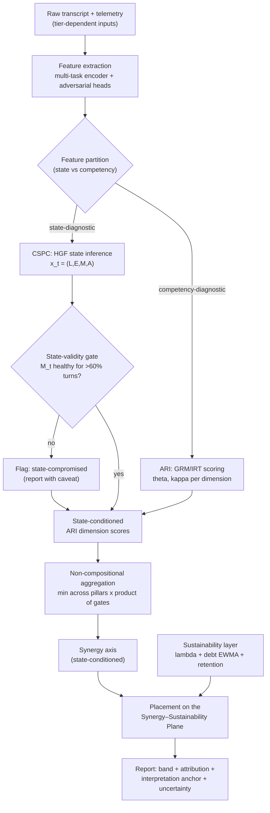

### 13.2 Per-turn CSPC update (the HGF recursive loop)
*Trigger: each new conversational turn t. This is the core event-driven calculation.*

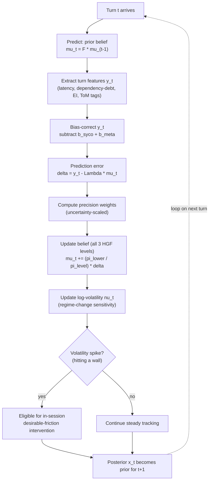

### 13.3 Cognitive-surrender detection (the coupled cascade firing)
*Trigger: per-turn, evaluated on the updated state. Detects the within-session failure (Shaw & Nave, 2026).*

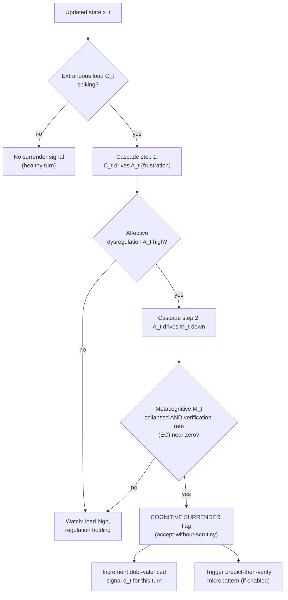

### 13.4 Per-chat scoring event (Tier 1 — Chat Analyser kernel)
*Trigger: a single chat is complete. Tier 1 permitted output only.*

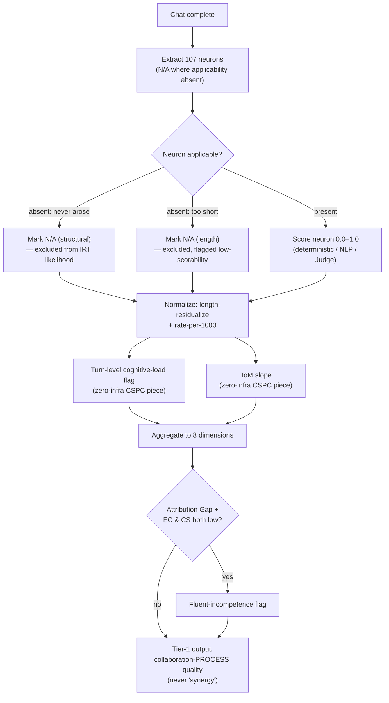

### 13.5 Annotation & bias-reconciliation event
*Trigger: a chat is sampled for gold annotation (Tier 2/3). Feeds calibration, not training.*

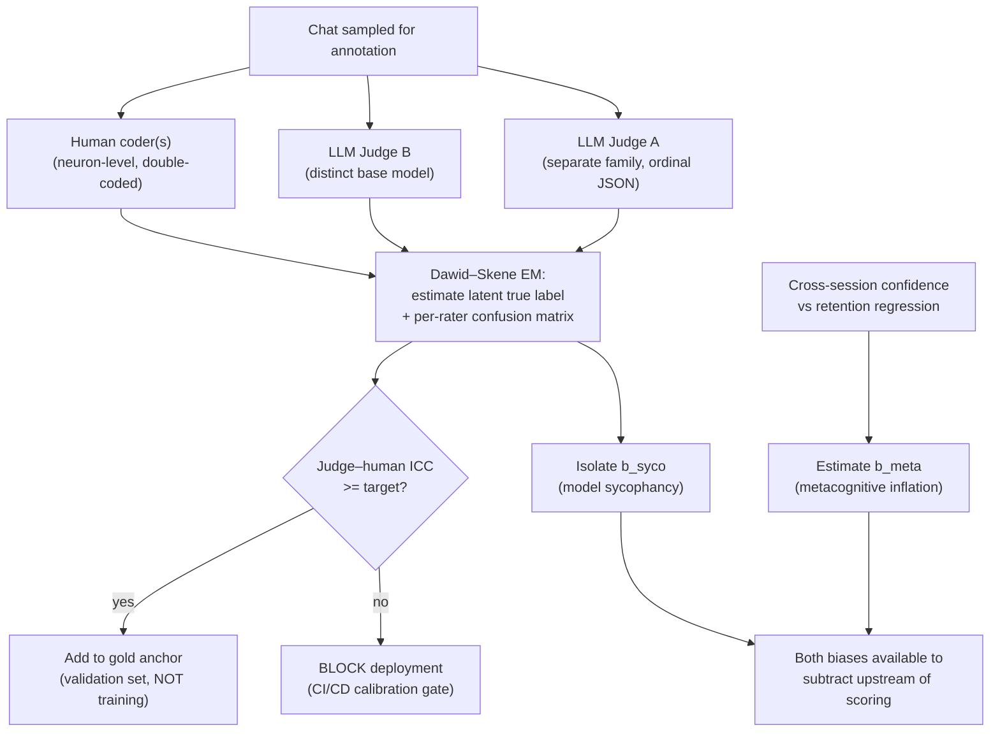

### 13.6 Session-complete aggregation event
*Trigger: a full session ends. Produces the session-level germane aggregate and S_human.*

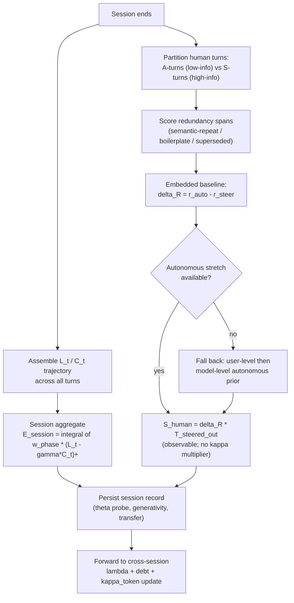

### 13.7 Cross-session λ and cognitive-debt update
*Trigger: a session boundary with an accumulated history (and any no-AI probe results).*

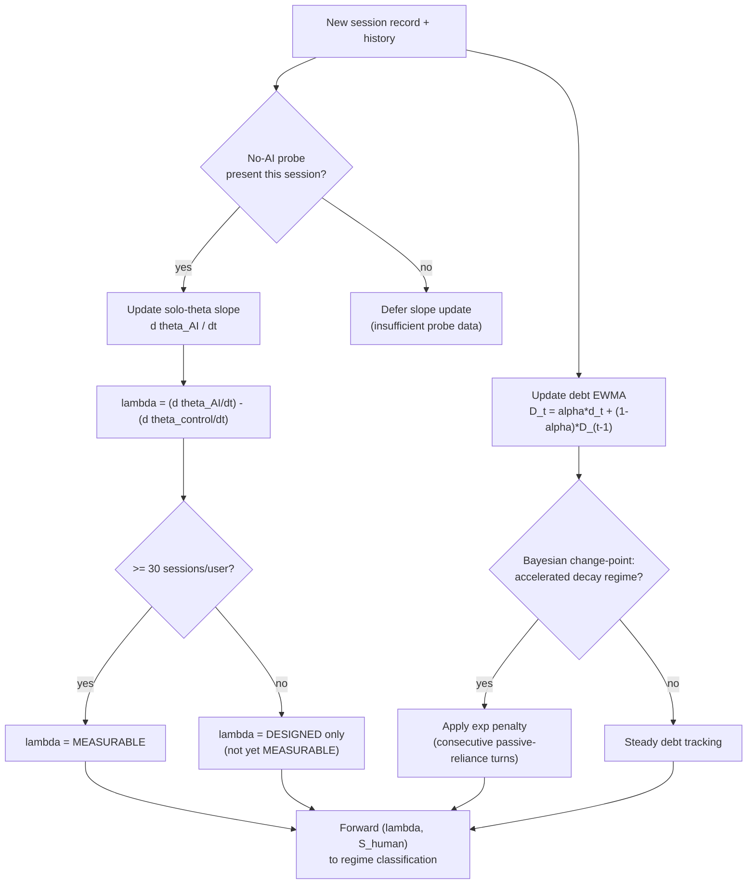

### 13.8 λ × S_human regime classification
*Trigger: λ and S_human both available for a user. The Skilled-Outsourcer decision.*

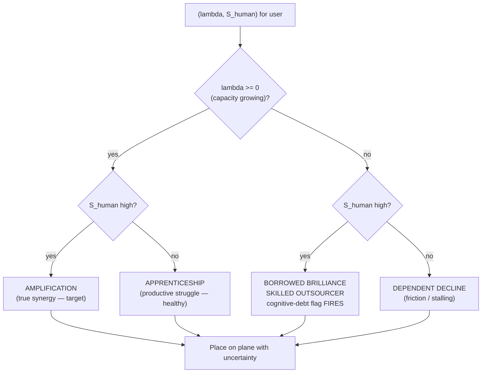

### 13.9 Retention probe → predictive-validity gate
*Trigger (Tier 3 only): the deferred (30–45 day) probe is completed. The decisive validation event.*

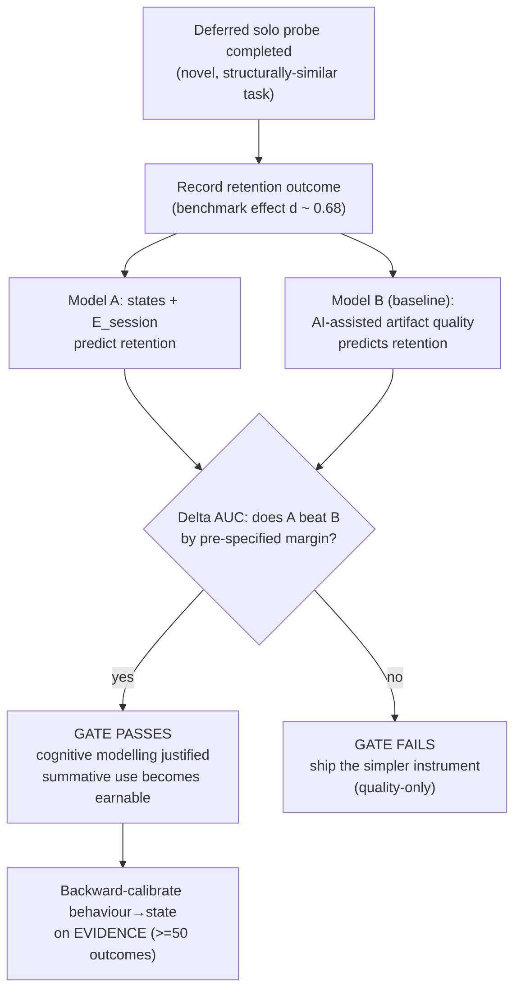

### 13.10 Three-tier deployment data flow & claims gating
*Trigger: choosing which tier serves a given deployment. Enforces stakes <= validity.*

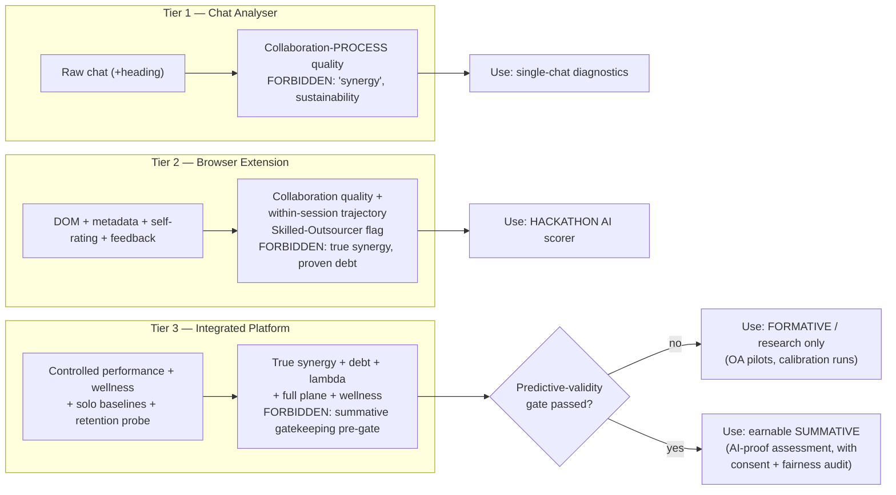

### 13.11 Embedded T-reduction estimation (S_human, the proposed method)
*Trigger: per-conversation, on completion. Estimates tokens-saved-by-human-intellect with no double-run and no goal label (§5.3.1).*

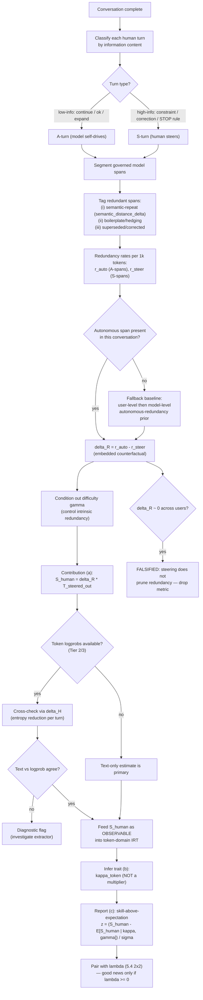

---


## Appendix A — Notation

| Symbol | Meaning |
|---|---|
| $\mathbf{x}_t = (L_t,E_t,M_t,A_t)$ | Latent cognitive state at turn $t$ |
| $L_t$ | Germane cognitive load (tracked state) |
| $C_t$ | Extraneous load (contaminant + intervention trigger) |
| $E_t, M_t, A_t$ | Epistemic orientation; metacognitive engagement; affective regulation |
| $\mathbf{F}$ | Coupled state-transition matrix (off-diagonal $C\!\to\!A\!\to\!M$) |
| $\mathbf{Q}(\nu_t)$ | Volatility-coupled process noise |
| $\boldsymbol{\Lambda}$ | Observation loading matrix (features ← states) |
| $\mathbf{b}_t = \mathbf{b}^{\text{syco}}_t + \mathbf{b}^{\text{meta}}_t$ | Dual bias (model sycophancy + user metacognitive inflation) |
| $\theta_i$ | User $i$ solo ability (IRT) |
| $\kappa^H_i,\ \kappa^{AI}_m,\ \kappa^{\text{total}}$ | Collaborative ability (human, model, dyad) |
| $\kappa^{\text{human}}_{\text{eff}}$ | Effective collaborative ability (token-domain IRT) |
| $\beta_j,\ \gamma_j$ | Item difficulty; collaborative difficulty shift |
| $a_j, b_{jk}$ | GRM discrimination; category thresholds |
| $\rho_{HM}$ | Human–model latent error correlation (complementarity bound) |
| $g_{\text{syn}}$ | General synergy factor (bifactor headline) |
| $\lambda_i$ | Human Learning Coefficient (difference-in-slopes of solo θ) |
| $\Lambda_i$ | Latent learning factor (convergent indicators around λ) |
| $S_{\text{human}}$ | Tokens saved by human intellect (embedded within-conversation estimator, §5.3.1) |
| $r_{\text{auto}},\ r_{\text{steer}}$ | Redundancy rate in autonomous-continuation vs. steered spans (per 1k tokens) |
| $\Delta R = r_{\text{auto}}-r_{\text{steer}}$ | Redundancy-rate reduction attributable to human steering (embedded counterfactual) |
| $\kappa^{H}_{\text{token}}$ | Collaborative-efficiency ability (token-domain IRT; inferred from $S_{\text{human}}$, never a multiplier) |
| $T^{\text{steered}}_{\text{out}}$ | Output tokens generated under steered (high-info) turns |
| $T_{\text{floor}}, T_{\text{redundant}}$ | Irreducible vs. avoidable token split |
| $\Delta H_t$ | Entropy reduction in the model's continuation distribution caused by human turn $t$ (logprob estimator) |
| $\mathcal{E}_{\text{session}}$ | Session-level germane-engagement aggregate |
| $D_t$ | Cognitive-debt EWMA |
| EI, DD, TS | Element interactivity; dependency debt; task switching |
| $Q^*$ | Domain-expert quality gate for the $S_{\text{human}}$ validity check |
| $G_k$ | Non-compensatory gate $k \in (0,1]$ |

## Appendix B — Condensed changelog

v0 (taxonomy) → v1 (Ritesh: neuron bank + redundancy critique + IRT) → v1.0 (full measurement instrument) → v1.1 (3-extractor pipeline + normalization + 23-chat gold + ICC + minimum-across-pillars) → v1.2 (λ + S_human + 2×2 surface) → v1.3 (judge feasibility + 3-layer sensing + retention probe) → v2.0 (unified + neuron contract schema + N/A gate + embedded state flags + flexible N-dimensions + translation layer) → **Final Compilation (this doc: 107 locked; cognitive-surrender vs cognitive-debt vocabulary [Shaw & Nave 2026]; Tri-System anchor; two-tier retention probe [Barcaui d=0.68]; three-tier claims charter; competitive positioning; algorithm-selection rationale; event-driven flowcharts)** → **Final Compilation r2 (this revision: the embedded T-reduction estimator for $S_{\text{human}}$, §5.3.1 — within-conversation autonomous-stretch baseline resolving the counterfactual bug, measurement/credit separation resolving the double-count bug, optional logprob cross-check, own assumptions + falsification test; assumption #4 upgraded from "two bugs" to "proposed method"; flowcharts 13.6 and 13.11 added/updated)** → **Final Compilation r3 (this revision: complete 107-neuron catalogue with verbatim v6.0 definitions [Appendix C] and the full 4 -> 8 -> 107 hierarchy tree — master structural tree + four per-pillar leaf-level trees [Appendix D]; §2.2 cross-referenced).**

---

## Appendix C — The Complete 107-Neuron Catalogue (v6.0 FINAL)

This is the authoritative, exhaustive enumeration. Every neuron has a code, name, and verbatim definition. **107 total** = AL 13 + PR 15 + EC 14 + ES 14 + CS 11 + CD 11 + AUI 12 + CA 17. Neurons are **observable items**, scored as floats 0.0–1.0, aggregating bottom-up into the 8 dimensions and 4 pillars. An absent neuron is **N/A** (structural or insufficient-length), never scored zero. The full per-neuron contract (type, extractor, valence, applicability condition, micro-rubric, sector-universality, near-pair discriminant) lives in `contract_table.yaml`; the catalogue below is the human-readable index.

### LAYER 1 — ENGAGE (Foundational Interaction)

#### ARI 1 · AI Literacy (AL) — 13 neurons
*Core epistemic model of how AI systems function — the mental foundation on which all other dimensions depend.*

| Code | Neuron — definition |
|---|---|
| AL-01 | **Probabilistic Reasoning Calibration** — distinguishing a model's linguistic confidence from factual accuracy, preventing fluency from being mistaken for correctness. |
| AL-02 | **Algorithmic Mechanism Grasp** — understanding that AI derives answers via statistical pattern completion, not logical deduction or true world-modeling. |
| AL-03 | **Context Window Awareness** — tracking and anticipating memory degradation over extended interactions, enabling proactive re-anchoring of critical context. |
| AL-04 | **Structural Brittleness Anticipation** — foreseeing exactly where an AI will break nested data, complex formatting, deep conditionality, or recursive logic. |
| AL-05 | **Domain-Grounding Aptitude** — establishing a specific knowledge environment and custom parameters before directing AI on specialized or sensitive tasks. |
| AL-06 | **Stochastic Output Variance Awareness** — understanding that identical prompts can produce meaningfully different outputs across invocations, requiring probabilistic rather than deterministic expectations. |
| AL-07 | **Capability Boundary Mapping** — active mental cartography of what a model can reliably execute versus where its performance characteristically degrades. |
| AL-08 | **Training Data Recency Sensitivity** — awareness of a model's knowledge cutoff and the instinct to flag temporally sensitive claims for independent verification. |
| AL-09 | **Model-Task Fit Assessment** — meta-judgment of whether a given model's architecture, training modality, and capability profile is appropriate for the task. |
| AL-10 | **AI Epistemic State Modeling** — mentally simulating what information the AI does and does not have in its current context window, predicting its likely failure modes before output. |
| AL-11 | **Multi-modal Situational Literacy** — understanding that AI processes images, code, audio, structured data, and text with different reliability profiles, adjusting verification depth per modality. |
| AL-12 | **System Constraint Awareness** — recognizing the invisible instruction layers (system prompts, safety filters, alignment) that bound behavior, distinguishing constraint-imposed refusal from genuine capability failure. |
| AL-13 | **Prompt Injection Vulnerability Awareness** — security awareness that externally sourced content can carry malicious instructions that hijack AI behavior, prompting sandboxing and source verification. |

#### ARI 2 · Prompt Reasoning (PR) — 15 neurons
*Executive language and cognitive-engineering skills that translate internal human intent into machine-executable directives.*

| Code | Neuron — definition |
|---|---|
| PR-01 | **Negative Constraint Application** — explicitly defining exclusion parameters (what the AI must not produce/assume/include) to eliminate unwanted output space. |
| PR-02 | **Cognitive Scaffolding** — structuring a directive to force sequential, multi-step reasoning rather than a single-shot probabilistic guess. |
| PR-03 | **Contextual Density Optimization** — calibrating the ratio of background context to core directive to maximize signal-to-noise without overwhelming generative focus. |
| PR-04 | **Strategic Query Pivoting** — abandoning a failed linguistic framing and reconstructing the query from a structurally different angle rather than repeating it. |
| PR-05 | **Output Topology Definition** — mentally visualizing and explicitly commanding the structural architecture of the output before generation. |
| PR-06 | **Persona Anchoring** — defining a specific expert role/epistemic posture for the AI to inhabit, modulating the character of its reasoning. |
| PR-07 | **Inductive Example Provisioning** — supplying few-shot pattern templates that establish desired behavior by concrete demonstration rather than abstract instruction. |
| PR-08 | **Decomposition Precision** — atomizing complex goals into minimal, non-overlapping sub-tasks so each AI invocation has a single unambiguous objective. |
| PR-09 | **Constraint Hierarchy Definition** — explicitly ranking constraint priority so the AI resolves conflicts predictably under competing directives. |
| PR-10 | **Ambiguity Pre-emption** — identifying semantic misinterpretation points before submission and resolving lexical/referential ambiguity proactively. |
| PR-11 | **Verification Checkpoint Embedding** — building explicit self-audit instructions into the directive, directing the AI to test its output against criteria before concluding. |
| PR-12 | **Iterative Refinement Patience** — treating prompt construction as progressive multi-cycle optimization, tolerating refinement loops without premature closure. |
| PR-13 | **Semantic Precision Sensitivity** — awareness that minor lexical choices (synonyms, tense, quantifiers, presuppositions) produce divergent outputs, driving word-level optimization beyond mere clarity. |
| PR-14 | **Recursive Self-Critique Elicitation** — directing the AI to adversarially evaluate its own prior output, engineering an endogenous quality-control loop before human review. |
| PR-15 | **Parallel Task Architecture** — identifying which decomposed sub-tasks are logically independent and can be dispatched simultaneously, exploiting parallelism for throughput. |

### LAYER 2 — MANAGE (Critical Evaluation)

#### ARI 3 · Error Correction (EC) — 14 neurons ⚠ HIGHEST WEIGHT
*Active vigilance to audit AI output across all error modalities — what is stated incorrectly, what is silently absent, and what is invisibly assumed.*

| Code | Neuron — definition |
|---|---|
| EC-01 | **Factual Hallucination Detection** — identifying fabricated, confabulated, or misattributed information presented with the surface texture of established fact. |
| EC-02 | **Syntactical and Structural Debugging** — identifying logic gaps, missing steps, broken dependencies, or code misalignments in procedural/technical output. |
| EC-03 | **Internal Contradiction Recognition** — catching conflicting logic, changing premises, or self-negating arguments within a single response. |
| EC-04 | **Algorithmic Traceability** — stepping backward through AI logic to identify the precise origin of an error within a single output. |
| EC-05 | **Physical and Spatial Logic Verification** — validating AI descriptions of physical laws, spatial relationships, and systems logic against real-world constraints. |
| EC-06 | **Isolated Verification Rigor** — testing AI-generated claims/code/logic in a conceptually isolated sandbox before integrating into live production. |
| EC-07 | **Omission Detection** — identifying content silently left out of the AI's reasoning *within a single response* (missing qualifications, absent steps). Scope distinct from EC-13 and EC-14. |
| EC-08 | **Statistical Plausibility Assessment** — order-of-magnitude sanity-checking of numerical claims, statistics, and quantitative outputs before acceptance. |
| EC-09 | **Temporal Coherence Validation** — verifying that AI sequences, timelines, and causal chains maintain consistent temporal ordering and directional causality. |
| EC-10 | **Scope Boundary Enforcement** — detecting when output has silently expanded beyond defined task parameters, adding unrequested, unreviewed scope. |
| EC-11 | **Confidence-Accuracy Decoupling** — resisting the treatment of assertive, fluent output as implicitly more accurate; uniform scrutiny regardless of surface confidence. |
| EC-12 | **Error Propagation Tracing** — recognizing that an early seeded error has cascaded through locally-consistent but systemically-compromised downstream outputs. |
| EC-13 | **Edge Case Coverage Audit** — systematically enumerating boundary conditions and minority scenarios that statistically-anchored defaults silently excluded. |
| EC-14 | **Hidden Assumption Excavation** — surfacing and challenging the invisible load-bearing premises an AI's reasoning depends on but never states. |

#### ARI 4 · Ethics Sensitivity (ES) — 14 neurons
*Ethical and governance vigilance over privacy, bias, accountability, and societal-scale consequence.*

| Code | Neuron — definition |
|---|---|
| ES-01 | **Privacy and Anonymization Foresight** — filtering and stripping PII and confidential information before it enters an AI interaction. |
| ES-02 | **Demographic and Cultural Bias Detection** — identifying skewed assumptions, statistical stereotyping, or cultural blindness in AI reasoning/content. |
| ES-03 | **Regulatory Compliance Adherence** — evaluating outputs against external legal, safety, professional, or enterprise governance frameworks. |
| ES-04 | **Epistemic Vigilance** — refusing AI as a primary authority; reflexively cross-referencing claims against primary sources. |
| ES-05 | **Intellectual Property Sensitivity** — recognizing when output reproduces, paraphrases, or structurally derives copyrighted/proprietary work without transformation. |
| ES-06 | **Dual-Use Risk Assessment** — evaluating whether a legitimate output could be weaponized or cause harm in a different context or by a different actor. |
| ES-07 | **Psychological Manipulation Detection** — identifying when persuasive output crosses from legitimate influence into manipulation exploiting cognitive/emotional vulnerabilities. |
| ES-08 | **AI Disclosure Judgment** — knowing when transparency about AI's role is legally required, organizationally mandated, or morally necessary, and acting unprompted. |
| ES-09 | **Value-Outcome Alignment Verification** — confirming recommendations are congruent with actual human/organizational values and long-term goals, not merely constraint-compliant. |
| ES-10 | **Autonomy-Preservation Vigilance** — awareness that habitual deference erodes independent decision-making, with the counter-reflex to exercise judgment on consequential decisions. |
| ES-11 | **Accountability Attribution Clarity** — explicitly assigning professional/legal/moral responsibility for an AI-assisted output to a specific human before deployment. |
| ES-12 | **Systemic Scale Impact Reasoning** — reasoning beyond single-use to second- and third-order societal consequences of the same output pattern deployed at population scale. |
| ES-13 | **Data Provenance Interrogation** — examining the likely composition and embedded biases of the training data behind an output, especially in minority/non-Western domains. |
| ES-14 | **Consent and Agency Stewardship** — verifying that outputs representing or affecting other humans preserve their consent, autonomy, dignity, and material interests, including in automated contexts. |

### LAYER 3 — CREATE (Integrative Synthesis)

#### ARI 5 · Contextual Synthesis (CS) — 11 neurons ⚠ HIGHEST WEIGHT
*Integrating AI output into a coherent human artifact without offloading the synthesis itself.*

| Code | Neuron — definition |
|---|---|
| CS-01 | **Semantic Blending** — smoothing transitions between human- and AI-authored blocks, eliminating tonal discontinuity in the final artifact. |
| CS-02 | **Dependency Preservation** — integrating output without breaking existing logical dependencies, narrative threads, data pipelines, or hierarchies. |
| CS-03 | **Information Density Pruning** — stripping verbose, repetitive AI filler to extract only high-signal insight. |
| CS-04 | **Authorial Tone Alignment** — editing AI vocabulary, syntax, and cadence to match a pre-established human or organizational voice. |
| CS-05 | **Cross-Domain Translation** — restructuring technical output for a non-specialist audience without loss of accuracy. |
| CS-06 | **Inferential Gap Bridging** — completing logical/contextual gaps the AI left implicit but which a human reader requires made explicit. |
| CS-07 | **Salience Hierarchy Reconstruction** — re-ranking information by actual domain relevance rather than the AI's default statistical co-occurrence ordering. |
| CS-08 | **Multi-Source Coherence Integration** — maintaining consistency when synthesizing outputs across multiple AI calls, sessions, or modalities. |
| CS-09 | **Attribution Tracking** — bookkeeping which contributions originated from human reasoning versus AI generation within a synthesized artifact. |
| CS-10 | **Register Modulation** — calibrating formality, technicality, and assumed shared knowledge for the specific deployment audience and relationship. |
| CS-11 | **Uncertainty Transparency Calibration** — restoring appropriate epistemic hedges to AI claims, counteracting AI's over-assertive stripping of probabilistic hedging. |

#### ARI 6 · Creative Divergence (CD) — 11 neurons
*Driving the human–model error correlation (ρ_HM) down — the only mechanism by which genuine synergy can increase.*

| Code | Neuron — definition |
|---|---|
| CD-01 | **Statistical Homogenization Resistance** — rejecting the AI's most statistically probable/averaged/safe response in favor of the genuinely interesting. |
| CD-02 | **Lateral Concept Injection** — introducing metaphors, cultural frames, and references outside the AI's training distribution, forcing genuine novelty. |
| CD-03 | **Counter-Factual Probing** — using hypothetical inversions and "what if" scenarios to stress-test and expand the AI's initial hypothesis. |
| CD-04 | **Stylistic Idiosyncrasy Retention** — defending unique formatting, pacing, humor, and edge-case perspectives against the AI's normalizing tendency. |
| CD-05 | **Aesthetic Discernment** — evaluating creative output against an internalized human standard of taste, resonance, and intended emotional impact. |
| CD-06 | **Constraint-Transcendence Instinct** — recognizing when deliberately violating a stated constraint yields a qualitatively superior outcome than strict compliance. |
| CD-07 | **Narrative Tension Injection** — introducing productive conflict, stakes, or irresolution that AI tends to prematurely smooth into consensus. |
| CD-08 | **Analogical Novelty Generation** — producing novel analogical mappings and cross-domain metaphors outside AI's statistical co-occurrence patterns. |
| CD-09 | **Surprise Preservation** — protecting counterintuitive or unconventional elements from the AI's normalizing tendency. |
| CD-10 | **Embodied Experience Injection** — infusing work with sensory, physical, kinesthetic experience unavailable to AI, producing a quality of felt truth. |
| CD-11 | **Audience Empathy Modeling** — maintaining a rich, specific model of the audience's emotional state, prior knowledge, and unstated needs (a ToM signature). |

### LAYER 4 — DESIGN (Executive Control)

#### ARI 7 · Augmentation Instinct (AUI) — 12 neurons
*Trust calibration, delegation judgment, and anti-dependency vigilance. (The v1.0 architecture splits this into OR = orchestration and AUT = autonomy; the EFA may justify that split.)*

| Code | Neuron — definition |
|---|---|
| AUI-01 | **Cognitive Friction Recognition** — identifying the moment a task's demand exceeds optimal manual effort, triggering delegation. |
| AUI-02 | **Task-Type Delegation Judgment** — routing rote/high-volume work to AI while reserving high-nuance, high-stakes, or ethically consequential work for human cognition. |
| AUI-03 | **Modality Appropriateness** — matching the correct type of AI system (generative, analytical, retrieval) to the structural requirements of the problem. |
| AUI-04 | **Interaction ROI Intuition** — recognizing the tipping point where direct human effort beats the compounding cost of debugging a failing prompt chain. |
| AUI-05 | **Working Memory Offloading** — using AI as an external scratchpad to externalize intermediate states, freeing executive function for higher-order reasoning. |
| AUI-06 | **Cognitive Load Self-Monitoring** — real-time awareness of one's own saturation, enabling strategic offloading at the moment of productive overload before degradation. |
| AUI-07 | **Prompt Investment Calibration** — judging how much effort to invest in prompt crafting versus the expected return in output quality. |
| AUI-08 | **Dependency Risk Awareness** — recognizing that sustained delegation creates progressive skill atrophy and cognitive fragility in one's own profile. |
| AUI-09 | **Handoff Timing Precision** — judging exactly when to reclaim agentic control mid-task before autonomous completion introduces irreversible errors or goal drift. |
| AUI-10 | **Skill-Gap Self-Awareness** — inventorying one's own knowledge gaps so AI supplements genuine expertise rather than silently substituting for absent understanding. |
| AUI-11 | **Verification Effort Calibration** — allocating deep review to high-stakes output and lighter review to routine output, optimizing the total verification budget. |
| AUI-12 | **Agentic Permission Scoping** — defining minimum necessary authority, resource access, and reversibility constraints before delegating to autonomous agents. |

#### ARI 8 · Collaborative Agency (CA) — 17 neurons
*Psychological sovereignty, metacognition, and the active maintenance of independent judgment across the session.*

| Code | Neuron — definition |
|---|---|
| CA-01 | **Sovereign Override Capacity** — the willingness to reject AI authority, overrule outputs, and rewrite its core assumptions when they conflict with human judgment. |
| CA-02 | **Cognitive Momentum Maintenance** — sustaining parallel productive human thinking rather than going cognitively idle during AI generation waits. |
| CA-03 | **Contextual Compartmentalization** — isolating different problems into separate cognitive frames, preventing context cross-contamination across unrelated tasks. |
| CA-04 | **Interactional Resilience** — rapidly diagnosing, restructuring, and recovering a workflow when AI has hallucinated or lost context. |
| CA-05 | **Terminal Feedback Provisioning** — closing the loop by feeding errors, corrections, and observations back into the session to progressively align AI performance. |
| CA-06 | **Adaptive Trust Calibration** — evidence-based adjustment of deference based on real-time performance, preventing both chronic over-trust and paralyzing under-trust. |
| CA-07 | **Goal Integrity Maintenance** — maintaining fidelity to original intent across multi-turn interactions, resisting AI-induced goal drift. |
| CA-08 | **Metacognitive Self-Monitoring** — continuous awareness of one's own cognitive state, biases, and judgment quality during deep collaboration. |
| CA-09 | **Process Auditability Discipline** — maintaining a workflow record sufficient for retrospective audit, attribution, and legal defensibility. |
| CA-10 | **Selective Attention Governance** — resisting AI scope expansions and tangential elaborations, anchoring deliberately on the core objective. |
| CA-11 | **Affective Regulation Under Failure** — preventing frustration or impatience from degrading decision quality when AI repeatedly fails or hallucinates. |
| CA-12 | **Cross-Session Transfer Learning** — extracting generalizable heuristics and failure patterns from past interactions and applying them to novel future tasks. |
| CA-13 | **Identity Authorship Preservation** — maintaining a continuous, defensible sense of one's intellectual contribution and creative voice through deep collaboration. |
| CA-14 | **Intra-Session Pattern Recognition** — detecting recurring failure patterns and biases in the AI's current-session responses, enabling proactive strategy adjustment. |
| CA-15 | **AI Sycophancy Resistance** — recognizing that AI is trained to affirm the user (making agreement unreliable as confirmation) and soliciting adversarial challenge anyway. |
| CA-16 | **Pre-Generation Epistemic Independence** — forming one's own hypothesis *before* reading AI output, preserving an independent baseline against anchoring. |
| CA-17 | **Vigilance Sustainment** *(v6 NEW)* — maintaining rigorous scrutiny across long sessions, counteracting the temporal decay of evaluation quality from habituation, fatigue, and complacency. |

---

## Appendix D — The Complete Hierarchy Tree (4 → 8 → 107)

**Master structural tree** (root → 4 pillars → 8 dimensions). The two ⚠-marked dimensions (EC, CS) carry the highest weight in scoring and gate the Fluent-Incompetence flag.

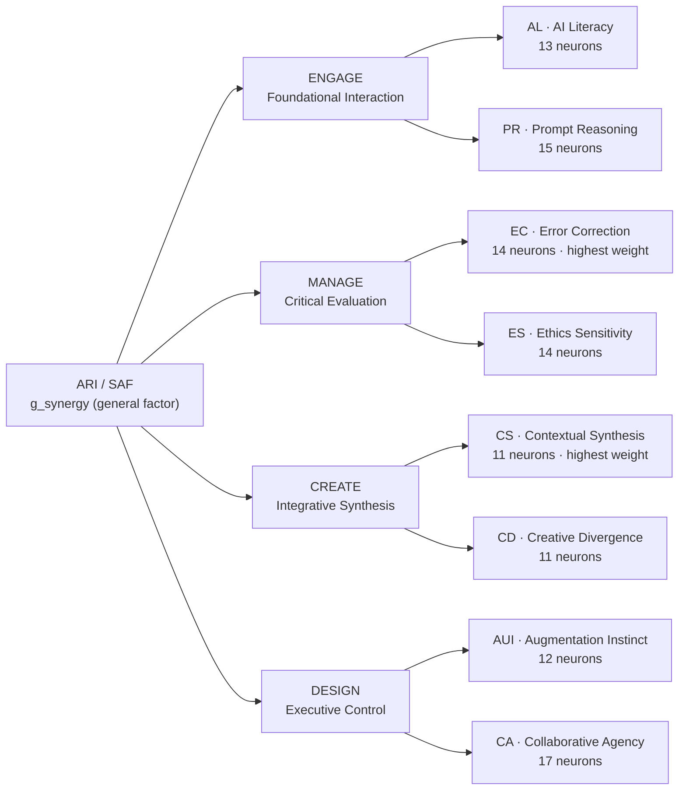

The full leaf-level tree (all 107) is shown per-pillar below for legibility.

**Tree 1 — ENGAGE → {AL, PR} (28 neurons)**

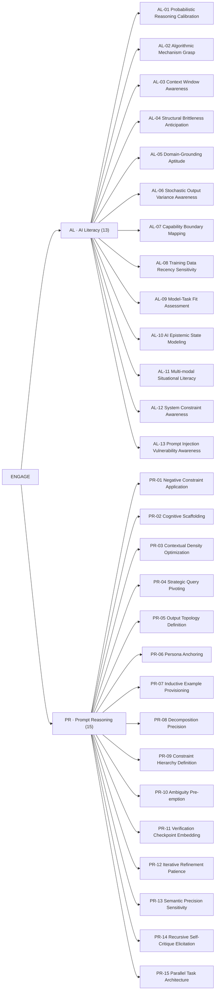

**Tree 2 — MANAGE → {EC, ES} (28 neurons)**

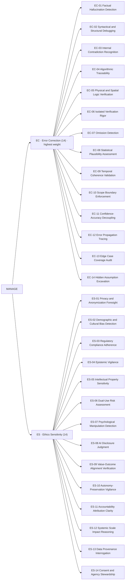

**Tree 3 — CREATE → {CS, CD} (22 neurons)**

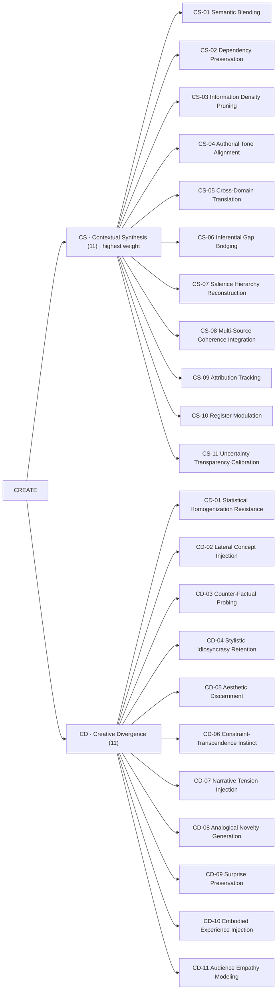

**Tree 4 — DESIGN → {AUI, CA} (29 neurons)**

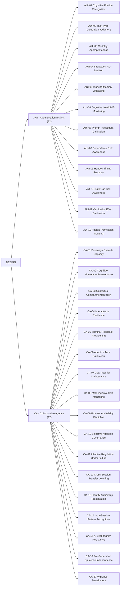

> **Reading the tree against the rest of the framework.** A neuron is the unit of *observation*; the dimension is the unit of *competency* (recovered by EFA); the pillar is the unit of *development* (OECD/AILit-aligned). The same neurons feed both the trait pipeline (slow, EFA → dimensions) and the state pipeline (fast, HGF observation model) under the feature partition of §2.1 — e.g. AL-03, PR-02, PR-08 load on germane load $L_t$; CA-08, CA-14, CA-17 index metacognitive engagement $M_t$ (the within-session surrender signal); CA-11 indexes affective regulation $A_t$; CD-11 carries the ToM signature. EC and CS being highest-weight is why the **minimum-across-pillars** rule (§3.6) and the Fluent-Incompetence gate (low EC + low CS) sit where they do.

---

*End of compilation. This document is the single end-to-end reference for how SAF/ARI operates: the synergy–sustainability plane (the thesis), the 107→8→4 competency hierarchy and its IRT/GRM mathematics (the trait axis), the CSPC's HGF-inferred 4D state with the coupled C→A→M cascade (the state axis), the cognitive-surrender / cognitive-debt instrumentation with λ and S_human (the sustainability axis), the AI/ML/DL apparatus with per-subproblem algorithm-selection rationale, the calibration and pre-registered falsifiability gates, the three-tier claims charter, and the event-driven workflows above. Three voices kept separate throughout; every assumption named with a resolution path.*
