# Sustainable Augmentation Framework (SAF) / ARI
## v3.21 — Unified Master Specification
### The World's First Psychometric Instrument Designed to Measure Human–AI Cognitive Interaction

---

> **What this document is.** This is the single, self-contained, from-scratch reference for SAF/ARI. It is **not** a spec-delta and it refers to no prior version for its content. Everything the framework introduced across its entire lineage — v1 (taxonomy) → v1.x (neuron bank, IRT, normalization, λ, S_human, retention probe) → v2.0 (unified engine) → v2.1 (the humanity revision) → v2.2 (interaction-dynamics integration) → v3 (validation & standards) → v3.1 (scope discipline) → v3.2 (the cognitive-work layer) — is folded here into one final form. Every concept, algorithm, theory, method, statistical model, AI/ML component, psychological anchor, mathematical object, and functional graph the framework uses is present in its final, settled state. Where the lineage matters for understanding *why* a thing is shaped as it is, that history is in **Appendix D**; the body is the framework as it now stands.

> **What the instrument is, stated honestly.** SAF/ARI is the first psychometric instrument *designed* to measure, jointly and at the individual level, the two outcomes of human–AI collaboration that the field has historically conflated: **synergy** (short-term collaborative performance) and **sustainability** (whether the human's independent cognitive capacity is growing or eroding). Its current epistemic status is **DESIGNED** and, per dimension, **MEASURABLE** — it is not yet **VALIDATED**. The single instrument that crosses from "we can compute this" to "this predicts the real outcome" is the deferred unaided retention probe (Layer 4). When that probe returns data, SAF/ARI becomes the first *validated* psychometric tool for human–AI interaction. Until then, it is the first such tool *built*, running, and pre-registered to be falsified. This document never lets ambition outrun that distinction.

---

## The four governing principles (carried unchanged through every version)

1. **Evidence before elegance. Reliability before complexity. Sustainability before synergy.**
2. **Every claim carries a rung tag** — DESIGNED → MEASURABLE → VALIDATED → ASPIRATIONAL — and no claim advances a rung without its empirical gate.
3. **Stakes must never outrun validity** (commitment 8). **Relevance is not scope** (a science being relevant to human–AI cognition does not make it SAF's to measure).
4. **Manufacture the counterfactual** (commitment 9). A claim without its counterfactual waits for the instrument that manufactures one.

## The North Star

> **AI should amplify human cognition without silently consuming it** — where *silently* names invisibility as the core harm. Invisibility is exactly what cognitive debt and cognitive surrender are: a person can lose independent capacity while feeling more capable than ever, because tool use inflates cognitive self-esteem precisely as it drops solo ability.

## Ontology status (a dated, binding commitment)

> **FROZEN for the validation year.** ❌ no new neurons · ❌ no new dimensions · ❌ no new pillars · ❌ no new latent variables.
> ✅ permitted: new *fields* on existing neurons, measurement-engine methods, validation procedures, calibration work, corpus collection, governance.
> The locked core is **4 pillars → 8 dimensions → 107 behavioral neurons → a 4-dimensional CSPC state**. The binding constraint on the whole program is **data coverage and reliability**, not architecture. Lifting the freeze requires: a diverse corpus collected, EFA run on the appropriate-grain matrix, and the predictive-validity gate (§8.9.3) addressed.

---

# PART 0 — ORIENTATION

## 0.1 What SAF/ARI is, and the problem it solves

The **Sustainable Augmentation Framework (SAF)** is a psycho-statistical measurement instrument for human–AI cognitive interaction. It measures jointly two quantities the literature has historically merged:

1. **Synergy** — does the human–AI dyad outperform the relevant *solo baseline*, and is that performance built on genuine complementarity rather than correlated error?
2. **Sustainability** — over repeated interaction, is the human's *independent* cognitive capacity growing or eroding?

These two are **empirically dissociable**: short-term collaborative output can rise while long-term independent capacity falls. The instrument exists because no prior tool measures both at once, and conflating them produces exactly the failure the framework is built to expose — a person who looks like a high-performing collaborator while quietly accumulating cognitive debt.

The instrument has **four nested layers** (Part 2), but conceptually it answers four questions:

- **ARI** (AI Readiness / Integration) — *"How capable is this person at working with AI?"* The competency/**trait** axis (107 neurons → 8 dimensions → 4 pillars, scored by Bayesian IRT).
- **CSPC** (Cognitive State Pre-Classifier) — *"In what cognitive state were they while doing it, and is it the state that produces learning?"* The **state** axis (a 4D latent state inferred by a Hierarchical Gaussian Filter).
- **CSL** (Cognitive Session Layer) — *"Who drove what across the dyad, and did the collaboration produce something neither party held alone?"* The **work-distribution** axis.
- **The sustainability instrumentation + retention probe** — *"Without AI, 24–48 h later, can the human actually perform?"* The **outcome** axis (λ, the cognitive-debt curve, and the deferred unaided probe).

## 0.2 The thesis: the synergy–sustainability plane

The intellectual core is a two-dimensional space that holds short-term collaboration quality in **explicit tension** with long-term cognitive health. The plane — not any single score — is the product.

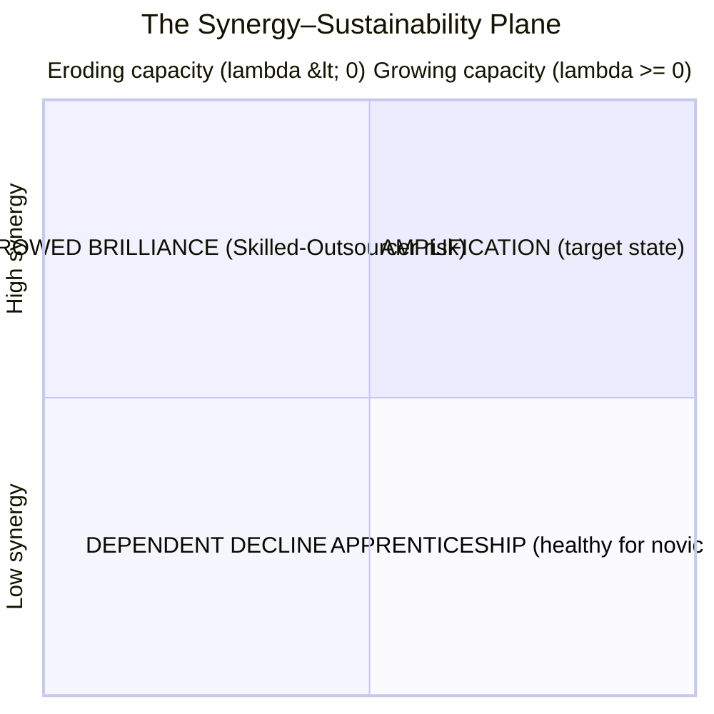

| | **Eroding capacity (λ < 0)** | **Growing capacity (λ ≥ 0)** |
|---|---|---|
| **High synergy** | **Borrowed Brilliance** — Skilled-Outsourcer risk: dazzling output, atrophying mind | **Amplification** — the target state: high output *and* growing independent capacity |
| **Low synergy** | **Dependent Decline** — low output *and* eroding capacity | **Apprenticeship** — healthy for novices: output still low, but the human is learning |

The four quadrants are the white space no existing instrument occupies. Every measured user is placed on this plane **with uncertainty**.

## 0.3 The four-layer measurement stack (the architecture in one view)

```
═══════════════════════════════════════════════════════════════════
                 SAF/ARI MEASUREMENT STACK (v3.21)
═══════════════════════════════════════════════════════════════════

LAYER 1 — ARI   [RUNNING: 108 tests green · judge MAE ≈ 0.299]
  Object:   The human's collaborative-process competency (a trait)
  Question: "How capable is this person at working with AI?"
  Reads:    The full DYADIC transcript (human turns scored against
            AI-turn context — ARI is and always was dyadic)
  Output:   107 neurons → 8 dimensions → 4 pillars → g_synergy
  Timescale:Slow (weeks)        Rung: MEASURABLE per dimension (ICC-gated)

LAYER 2 — CSPC  [STUB + 2 SHIPPING PROXIES]
  Object:   The cognitive conditions under which behavior occurred
  Question: "In what state was the person while doing it?"
  Reads:    State-diagnostic features (latency, load, task-switching) —
            DISJOINT from the competency-diagnostic channel (the partition)
  Output:   π(S_t) — a precision modulator on Layers 1 AND 3
  Timescale:Fast (turns)        Rung: DESIGNED (full 4D HGF); proxies MEASURABLE

LAYER 3 — CSL   [SPEC, v3.2]
  Object:   How cognitive work was distributed across the dyad
  Question: "Who drove what, and did the dyad produce emergence?"
  Reads:    Track 1: ARI neurons re-projected onto ACF levels + AI-side extractor
            Track 2: turn-sequence seams (the one genuinely new channel)
  Output:   Per-ACF-level ownership map + Emergence Event Log
  Rung:     MEASURABLE as process indicators (NOT synergy proof)

══════════════════════════ THE WALL ════════════════════════════════
  Everything ABOVE is CHAT-DERIVED → it describes the PROCESS.
  Everything BELOW needs the MANUFACTURED COUNTERFACTUAL → the OUTCOME.
  No claim from below the wall may be made using only data from above it.
═════════════════════════════════════════════════════════════════════

LAYER 4 — θ + the deferred unaided retention probe   [NOT YET DEPLOYED]
  Object:   What the human can actually do alone, on a real task
  Question: "Without AI, 24–48 h later, can they perform?"
  Output:   The single external criterion everything is validated against
  Derives:  λ (sustainability), TRUE synergy, validated ownership, validated S_human
  Rung:     DESIGNED → VALIDATED only when probe data arrives
═══════════════════════════════════════════════════════════════════
```

**The Wall is the load-bearing concept of the entire framework.** Layers 1–3 describe *how the collaboration unfolded*; Layer 4 measures *what it did to the human*. Chat-derived layers describe process; outcome claims (synergy, sustainability) require the manufactured counterfactual a transcript structurally cannot contain. This is the operational form of commitment 9. Layers 1–3 provide *leading indicators* of what Layer 4 will confirm or falsify; they never substitute for it.

## 0.4 The claims charter — a four-rung epistemic ladder (mandatory)

The single largest risk to this framework is **rhetorical, not mathematical**: drift from *"the architecture is designed to measure X"* to *"we detect, expose, and prevent X."* That drift is the exact failure mode the framework exists to diagnose in others. Every claim in this document carries exactly one rung.

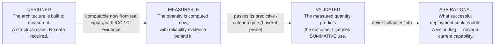

- **[DESIGNED]** — what the architecture is built to measure. A structural claim about the model; no data required.
- **[MEASURABLE]** — the quantity is computable *now* from real inputs, with reliability evidence (ICC, credible-interval width) behind the measurement.
- **[VALIDATED]** — the measured quantity has passed its predictive/criterion gate (predicts the deferred retention probe better than baseline, §8.9.3). **This is the only rung that licenses summative use.**
- **[ASPIRATIONAL]** — what successful deployment *could* enable downstream. A vision flag, explicitly not a current capability, kept separate so it can never be mistaken for the three rungs above.

The ladder is strictly ordered. **No minor may be ranked or gated on anything below [VALIDATED].** Any sentence collapsing rungs into one triumphant voice is to be rewritten.

## 0.5 The nine design commitments

1. **Measure behavior, not self-report.** Self-efficacy is a poor proxy for competence (Chiu et al., 2025; the LAK 2026 self-report-vs-objective study, n=288 teachers); people are systematically miscalibrated about their own offloading (Risko & Gilbert, 2016). Score what users *do* in the transcript.
2. **Decouple solo ability from collaborative ability.** Collaborative ability (κ) is distinct from solo ability (θ) (Riedl & Weidmann, 2025). The headline isolates the *boost*, not the *level*.
3. **Synergy has a stringent, asymmetric baseline.** Synergy = dyad vs. **max(human, AI)**; augmentation = dyad vs. human (Vaccaro, Almaatouq & Malone, 2024). Most dyads achieve augmentation, not synergy. Never use the flattering baseline.
4. **Synergy is conditional on learning and verification.** Explanations without a verification loop produce *negative* synergy (g ≈ −0.31); with verification, positive (g ≈ +0.30) (Berger et al., 2025). Reward verification; penalize unverified acceptance.
5. **Offloading is sometimes optimal — scoring must be task-conditioned.** Its impact depends entirely on what is done with the freed cognitive capacity (Lodge & Loble, 2026; Favero et al., 2025). High reliance on a superior AI for a low-stakes task is efficient delegation; identical behavior on a high-stakes task is dangerous over-trust. **There is no context-free "good prompt."**
6. **The hierarchy is a hypothesis, not an axiom.** Store data at the neuron level; let EFA decide the dimension count and super-factor grouping. The framework must survive its structure being wrong.
7. **A score that cannot be explained to the user is incomplete.** Every output ships with a plain-language band, behavioral attribution, and an interpretation anchor. The translation layer is part of the instrument.
8. **Stakes must never outrun validity** *(the governing deployment commitment).* Each tier may make only the claims its inputs and validation state support. Formative use precedes summative use; summative gatekeeping is forbidden until the predictive-validity gate fires.
9. **Manufacture the counterfactual.** Where reality does not supply the comparison a claim needs — a solo baseline, a pre-exposure prediction, a no-AI arm — the instrument *designs* it (micro-probes §6.12, task menus §0.7/§9.2, AI-off arms) rather than assuming the data exists or quietly inflating what transcripts can identify.

## 0.6 AI / ML / DL are the instrument, not the science

> The deep-learning components (the multi-task encoder, the LLM Judge) live **entirely in the measurement layer**. They are the microscope. They convert raw transcript and telemetry into observable feature values. They have **no privileged access to cognition**.

The **science** is in the *latent structure* (the cognitive-state model), the *generative model* connecting features to states, and the *inference procedure* recovering cognition from behavior. The DL extracts; the cognitive model explains. If "the model said so" ever substitutes for "the cognitive structure predicts so," the instrument loses its claim to measure anything real. This is also the full answer to *"why not just ask a frontier model to rate the chat?"* — a bare rating is "the model said so" with no error surface, no defined construct, and, decisively, **no access to the one thing the framework most wants to measure: what the human can do unaided, 48 hours later.** That evidence is structurally absent from any single transcript.

## 0.7 The censored-sample principle and the allocation policy

A structural property of *all* transcript-based measurement, named so no tier claims otherwise. Let person $i$ face a task stream and hold an **allocation policy** $\pi_i:\ \text{task} \to \{\text{solo},\ \text{AI}\}$. Transcripts observe behavior **conditional on the brought set** — the tasks the person chose to externalize. The tasks they kept solo, often their best-preserved capacities, never enter the data.

1. **Tiers 1–2 identify conditional behavior only.** Person-level traits estimated on brought-tasks carry selection bias of unknown sign — pessimistic if preserved solo domains are invisible, optimistic if the person brings only what they are learning. This is not a fixable extraction flaw.
2. **The deepest long-run trait is the policy itself.** Metacognitive selectivity — knowing *when* to engage versus delegate — is AUI's deep referent, and it is structurally under-identified from transcripts because it lives partly in the tasks that never appear.

**Three freeze-safe remedies:** (a) **charter honesty** — AUI claims below Tier 3 are limited to *within-chat delegation choices*; the phrase "delegation policy" is forbidden below Tier 3; (b) **the Tier-3 task-menu design** [DESIGNED] — the platform presents matched tasks and lets the participant choose which to attempt solo vs. with AI, identifying $\pi_i$ on the menu (the only clean measurement of selectivity the architecture admits); (c) **session covariates** [MEASURABLE] — perceived stakes (1–5) and time pressure (1–5) per session, entering λ and archetype models as **context covariates only**, never blended into behavioral scores. The effective unit of analysis for longitudinal claims is the **(person × stakes × pressure)** cell.

## 0.8 The humanity charter and five governing ethics

**The convergence record.** An independent first-principles re-derivation of the instrument (June 2026, from the vantage of large-scale observation of real human–AI interaction) reproduced — without access to the original argumentation order — the two-axis plane, the latent-variable spine, the temporal filter, the max(H, AI) baseline, the *outside-the-dyad outcome anchor*, and built-in falsification. An independent derivation landing on a frozen design is the strongest available check on it. (That re-derivation is **AEGIS v1.0**; its surviving disagreements are adjudicated empirically in §8.9.6.)

**Five governing ethics:**

1. **Protect, not police.** [DESIGNED] The default posture is formative: reports lead with behavioral attribution and the next habit to build, never with a verdict. No minor is ranked or gated on anything below [VALIDATED].
2. **Fairness before consequence.** [DESIGNED → gated] DIF / measurement invariance (§8.7) is a **precondition** for any consequential use, for any group — age, language, gender, socioeconomic background. An instrument that misreads one group's healthy behavior as pathology is itself a harm of the kind it claims to measure.
3. **Data dignity.** [operationalized §9.5] Transcripts are intimate. Minimization (features-over-text retention), tier-appropriate consent, deletion honored through to derived features, DPDP Act 2023 compliance as a build deliverable, and no third-party sale or transfer — ever.
4. **Goodhart-awareness.** [DESIGNED] Reactivity is expected, not feared: the design makes most gaming *benign* — practicing verification, synthesis, and constraint injection to game the score **is practicing the healthy behaviors**. The deferred probe is the ungameable anchor; residual performative surface is instrumented directly (verification theater, §6.10).
5. **Open verification.** [ASPIRATIONAL until filed] The falsification gates are pre-registered publicly before the first gold chat is scored, and their outcomes are published whether they pass or fail — the null-result pledge.

## 0.9 Governing principles for handling new proposals

Two standing clauses keep the framework from bloating under the steady arrival of plausible new ideas (from collaborators, from other models, from the literature):

- **Relevance is not scope.** A science being *relevant* to human–AI cognition does not make it SAF's to *measure*. SAF is one instrument in a larger ecosystem; its value scales with how well it does its specific job, not with how many adjacent concerns it absorbs. Vision at rung ASPIRATIONAL must not pull implementation at rung DESIGNED.
- **The population-observatory layer.** Macro, civilizational, sociological, and biological questions (cross-generational co-evolution, second/third-order societal effects, neuroplasticity validation) are real and important, and SAF *contributes the individual-level data they require* — but they belong to a distinct **population-observatory layer** that *consumes* SAF's outputs (epidemiological cohorts, longitudinal neuroimaging), not to the instrument itself. SAF *feeds* the observatory; SAF *is not* the observatory.

Every external proposal is triaged into one of: **genuine addition** (adopted, freeze-permitting), **already covered under a different name** (logged), or **architecturally dangerous / out of scope** (deferred to the register with a reinstatement trigger). Proposal quality alone never earns absorption.

---

# PART 1 — THEORETICAL FOUNDATION

## 1.1 The evidence base

| Source | What it establishes | What SAF operationalizes |
|---|---|---|
| **Vaccaro, Almaatouq & Malone (2024)** | 370 effects / 106 studies; synergy is rare; baseline = max(H, AI); Hedges' g | Synergy vs. augmentation definitions; effect-size standardization; task-type moderation |
| **Riedl & Weidmann (2025; ext. 2026)** | Two-stage Bayesian IRT (n=667); θ vs κ separable (ΔELPD = 50.9, SE = 10.2); Theory-of-Mind as causal engine | The scoring spine; ToM-signature extraction; the trait/state split |
| **Steyvers et al. (2022)** | Complementarity is bounded by latent error correlation ρ_HM; a weaker AI still helps if errors decorrelate | Creative Divergence = driving ρ_HM down; the accuracy–correlation ceiling; §8.9.2 falsification |
| **Shaw & Nave (2026, Wharton)** | Tri-System Theory (System 3 = artificial cognition); "cognitive surrender" (N=1,372; 9,593 trials; +25/−15 pp accuracy swing; up to 79.8% acceptance of wrong AI) | The in-session surrender mechanism; cognitive-architecture anchor; the κ^AI benchmark |
| **Barcaui (2025)** | RCT (n=120); ChatGPT vs. traditional study; 45-day retention 57.5% vs 68.5%, **d = 0.68** | The retention probe's empirical motivation and effect-size benchmark |
| **Kosmyna et al. (2025, MIT)** | EEG: neural connectivity scales down with AI; LLM group weakest coupling and poorest recall; **solo performance fails to recover** | Mechanistic grounding for cognitive debt; the frontal-theta neural anchor for L_t |
| **Gerlich (2025)** | r ≈ −0.68 AI-use ↔ critical thinking, mediated by offloading; non-linear decay (β = −0.15, p = .013); education moderation | The exponential decay penalty; demographic hierarchical priors |
| **Berger et al. (2025)** | Explanation-without-verification → negative synergy; learning is the missing moderator | The "explanation trap" flag; the verification-loop reward; λ |
| **Lepine et al. (Precision Proactivity)** | Transcript-derived load features (element interactivity, dependency debt, task switching); empirical loading coefficients | Cognitive-load instrumentation; informative priors on the observation matrix Λ |
| **Lodge & Loble (2026); Favero et al. (2025)** | Offloading is harmful only if freed capacity is not redirected | The task-conditioning commitment (commitment 5) |
| **Mathys et al. (HGF)** | Precision-weighted prediction-error updates; volatility coupling | The CSPC inference engine |
| **Chiu et al. (2025); LAK 2026 OB study** | Self-report ≠ competence; CFA-validated competency structure | Behavior-not-self-report; the Attribution Gap |
| **Bao, Gong & Yang (2023)** | Synergy as iterative affordance-actualization; patterns shift with task uncertainty | Interaction-chain (not single-prompt) scoring; the actualization-depth metric |
| **Yaniv & Kleinman; Sniezek & Buckley** | Judge-Advisor System; Weight of Advice as a continuous reliance measure | The reliance-event scoring that conditions EC/AUI precision (§3.10) |
| **Clark & Brennan (1991); Sperber & Mercier (2011, 2017)** | Conversational grounding; epistemic vigilance | Grounding-function and vigilance-pattern conditioning of EC/CA precision (§3.10) |
| **Coenen / Nelson / Gureckis; Graesser & Person** | Expected Information Gain / Optimal Experiment Design; question taxonomy | Question-asking science as a sustainability observable (§6.13) |
| **Settles & Meeder; FSRS (DSR)** | Half-life regression; Difficulty–Stability–Retrievability forgetting model | The fitted retention-decay curve (§6.12) |

## 1.2 Classical scaffolding

The framework inherits: **Cognitive Load Theory** (Sweller — intrinsic / germane / extraneous); **dual-process theory** (Kahneman — System 1 / System 2, extended by Shaw & Nave to System 3); **metacognition** (Flavell; Nelson & Narens; Zimmerman); **distributed / extended cognition** (Hutchins; Clark & Chalmers); **intelligence augmentation** (Engelbart); the **Zone of Proximal Development** and scaffolding (Vygotsky); **desirable difficulties / productive struggle** (Bjork); **trust in automation** (Lee & See, 2004; Hoff & Bashir, 2015); the **Google effect / transactive memory** (Sparrow et al., 2011); **prospect theory** and **present bias** (Kahneman & Tversky) as the behavioral-economic grounding for why users surrender; **relational-AI psychology** (attachment, anthropomorphism, parasocial bond) as the mechanism behind over-deference; and the **complementarity** program (Bansal et al.).

## 1.3 Core definitions

Where the literature supplies a definition, it is used; the framework's working terms are flagged *(our term)*.

- **Synergy** — performance of the human–AI dyad relative to **max(human alone, AI alone)** (Vaccaro et al., 2024). The stringent bar.
- **Augmentation** — performance of the dyad relative to the human alone. The weaker bar most dyads clear.
- **Capacity-level synergy (Boost)** *(our operationalization of Riedl–Weidmann)* — the collaborative-ability lift isolated from baseline expertise: `Boost = κ_total − θ`.
- **Cognitive offloading** — the strategic delegation of a discrete task to an external tool; a rational productivity choice (Risko & Gilbert, 2016).
- **Cognitive surrender** — adopting AI outputs with minimal scrutiny, overriding both intuition (System 1) and deliberation (System 2) (Shaw & Nave, 2026). The **within-session, turn-level** failure. Indexed by metacognitive engagement $M_t$ and the verification-rate (EC) neurons.
- **Cognitive debt** — the opportunity cost accrued by the absence of beneficial internal processing (reflective thinking, schema construction), accumulating across sessions and "coming due later" (Kosmyna et al., 2025). The **longitudinal accumulation**. Indexed by the EWMA debt curve and a negative λ.
- **The Skilled Outsourcer** *(our term)* — the user in the high-efficiency / low-learning quadrant (Borrowed Brilliance): computationally efficient, accumulating cognitive debt. The pathology the whole instrument is built to expose.
- **Fluent incompetence** — sophisticated-seeming AI use with no underlying competence; looks identical to genuine competence at the surface. Triggered in scoring when EC and CS are simultaneously low.
- **Human Learning Coefficient (λ)** *(our term)* — the AI-attributable, practice-adjusted slope of the user's *solo* capability over repeated sessions. A rate, not a detector.
- **Attribution Gap** *(our operationalization, after Chiu et al.)* — `1 − sim(AI output, user's subsequent contribution)`; the anti-replacement metric. (Used as a *secondary, gameable* proxy only — see the Expert-POV constraint in §5.4.3.)
- **Complementarity bound (ρ_HM)** — the latent human–model error correlation that upper-bounds achievable synergy (Steyvers et al., 2022).
- **The Wall** — the boundary between chat-derived process measurement (Layers 1–3) and outcome measurement requiring the manufactured counterfactual (Layer 4). No claim crosses it without probe data.

## 1.4 The Tri-System cognitive-architecture anchor

Shaw & Nave's (2026) **Tri-System Theory** extends dual-process accounts by positing **System 3** — artificial cognition operating outside the brain, which can *supplement* (amplification) or *supplant* (surrender) internal processes. This is the grounding for the CSPC's coupled cascade (§4.3): when System 3 is available, the relative cost of engaging System 2 rises, and **metacognitive shutdown (collapsing $M_t$) is the rational response to that gradient.** Surrender is therefore not irrationality — it is a predictable consequence of System 3 availability, which is precisely why it must be *measured* rather than moralized.

## 1.5 The behavioral archetype space — the sampling frame

**Status under the freeze.** Archetypes are **recruitment cells and stress-test cases — a sampling frame, not ontology.** They add no latent variables; persona assignment remains descriptive latent-profile machinery with uncertainty, never deterministic labels. The frame exists because early calibration proved that *volume without behavioral contrast is uninformative*.

| # | Archetype | Surface signature | Expected profile | What it stress-tests |
|---|---|---|---|---|
| 1 | **Deadline Extractor** | Terse accept-chains, high throughput, $M_t$ flat near floor | EC/CS floor; flat-floor debt mode | The baseline pathology |
| 2 | **Rubber-Duck Thinker** | Long self-authored turns; frequently *rejects* AI content | CS high; contributions are not echoes | That rejection scores as engagement, not friction |
| 3 | **Verifier-Engineer** | Pastes errors/outputs back, demands tests, challenges claims | EC pole; rich `displayed`+`implied` provenance | EC few-shot calibration fuel |
| 4 | **Curious Wanderer** | High engagement, meandering, low task closure | $L_t$ high, output quality low | The counter-case for §8.9.3 — quality-only baselines fail on them |
| 5 | **Delegating Manager** | Sophisticated orchestration prompts, zero domain contact | PR/CA visibly high; CS/EC hollow | The Skilled-Outsourcer signature; **twin-pair member** |
| 6 | **Anxious Over-Verifier** | Verifies everything including trivia; slow | EC count high but miscalibrated; excess scrutiny is $C_t$ | Proves calibrated-not-counted |
| 7 | **Co-Writing Iterator** | Many small steered turns; high iteration_depth | S-turn dense | The embedded T-reduction estimator's contrast fuel |
| 8 | **Companion-Seeker** | Affect-dominant, low task content | Out of collaboration scope | Routed out by intent classification; **must never be scored as pathology** |
| 9 | **Socratic Learner** | Asks to be quizzed; predicts before checking | Predict-then-verify native; $M_t$ high | The Amplification pole; rare in the wild — recruit deliberately |
| 10 | **Compressed Expert** | Terse, information-dense prompts; fast acceptance; short sessions | Looks like surrender to naive metrics; **is mastery** | **The hardest case in the space; twin-pair member** |

**The twin pair (the instrument's hardest discrimination).** Archetypes **5 (Delegating Manager)** and **10 (Compressed Expert)** produce **near-identical surface efficiency with opposite sustainability**. The Compressed Expert's terseness is an internalized model-of-the-model; their fast acceptance is *calibrated* (they would catch an error instantly). The Delegating Manager's identical surface conceals hollow contact with the content. Every naive efficiency metric confuses them — and the two error directions are differently expensive: **false pathology on an expert is a fairness harm; false health on an outsourcer is a validity failure.** Their separation is promoted to a named, pre-registered gate (§8.9.5), and is the reason the CSL ownership layer (Part 5) measures *cognitive control* rather than surface attribution.

---

# PART 2 — THE UNIFIED ARCHITECTURE

## 2.1 The four-layer stack, formally

The instrument is four layers separated by the **timescale** on which they change and by **which side of the Wall** they sit on. Part 0.3 gives the operational view; this section fixes the formal relationships.

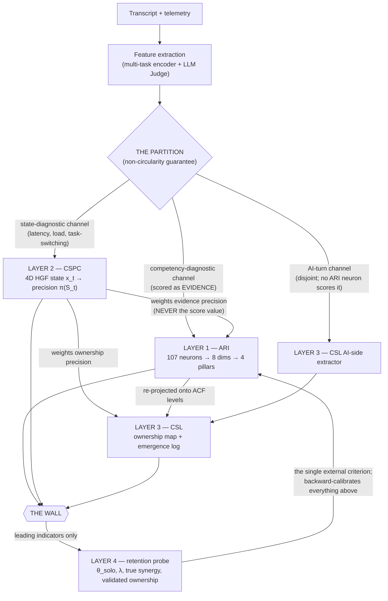

## 2.2 Temporal stratification and the feature partition (the non-circularity guarantee)

```
   107 neurons                8 ARI dimensions           4 CSPC states
 (observable features)  →   (trait/competency factors)  ║  (dynamic states)
                              SLOW (weeks: competence)   ║  FAST (turns: condition)
```

The neurons feed *both* the trait pipeline (slow: EFA → dimensions) *and* the state observation model (fast: HGF), and the CSPC state then *conditions* the ARI score. This creates a latent circularity: a state inferred from features that also determine the score, then used to condition the score. **The loop is identifiable only if the feature set is partitioned.**

- **State-diagnostic features** (fast): inter-turn latency, dwell, per-turn dependency-debt trajectory, load proxies, task-switching. → feed the CSPC.
- **Competency-diagnostic neurons** (slow aggregates): verification quality, cross-session transfer, creative-divergence patterns. → scored as **evidence**, weighted by the state-derived precision. → feed ARI.
- **AI-turn channel** (disjoint): the AI's outputs, which **no ARI neuron scores**. → feed the CSL AI-side extractor (Part 5).

Three load-bearing facts:

1. **The partition removes the circularity, not the ordering.** Running CSPC "first" is safe *only* because state is inferred from a disjoint channel. If state were inferred from the same VERIFY signal a neuron is scored from, "state-first" would double-count it (once to infer the state, again as state-conditioned evidence). **Ordering without partition is the circularity, not its cure.**
2. **This is joint estimation, approximated two-stage.** Trait (slow mean) and state (fast deviation) are *jointly* identified — a single behavior is a function of both. Tiers 1–2 run the two-stage approximation with CSPC *proxies*; Tier 3 runs the full joint posterior with the HGF.
3. **State conditions evidence *precision*, never the score value.** A low-confidence state makes the observation noisier evidence about the trait — it updates the trait belief *less* and widens the credible interval — rather than multiplying the score. This is exactly the HGF's precision-weighted update (§4.5), which is why *"state modifies confidence, not capability"* is automatic rather than bolted on. **Score multipliers (×0.7 / ×1.3) are rejected** (Rejection R2, §12).

> **Correction logged (a standing correction, preserved here).** ARI is **dyadic and always was.** An earlier transient framing — that "ARI reads human turns in isolation" — was wrong: neuron applicability rules (e.g. EC-01 requires "the AI produced a checkable claim") require AI turns. The real ARI ↔ CSL partition is not *isolation vs relational* (both are dyadic) but *which latent object the shared evidence is aggregated toward* — trait (ARI) vs work-distribution (CSL) — plus the orthogonal AI-side channel.

## 2.3 The 107-neuron → 8-dimension → 4-pillar hierarchy

| Code | Dimension | Pillar (Layer) | Neurons | Primary risk signal |
|---|---|---|---|---|
| AL | AI Literacy | Engage | 13 | Fluent-incompetence baseline |
| PR | Prompt Reasoning | Engage | 15 | Surface chatting vs. engineering |
| EC | Error Correction | Manage | 14 | **Highest weight** — blind-trust / surrender detection |
| ES | Ethics Sensitivity | Manage | 14 | Accountability diffusion |
| CS | Contextual Synthesis | Create | 11 | **Highest weight** — cognitive offloading |
| CD | Creative Divergence | Create | 11 | Statistical homogenization |
| AUI | Augmentation Instinct | Design | 12 | Skill atrophy / dependency risk |
| CA | Collaborative Agency | Design | 17 | Psychological sovereignty |
| **Total** | | **4 pillars** | **107** | |

The four pillars map to **OECD/PISA** and the **AILit framework** (Engage / Manage / Create / Design ↔ Engaging / Managing / Creating / Designing with AI). This mapping is the **external validation anchor** — the structure is pre-aligned to two international frameworks before a single data point is collected. The reading: a **neuron** is the unit of *observation*; a **dimension** is the unit of *competency* (recovered by EFA); a **pillar** is the unit of *development*. The complete enumeration of all 107 neurons (verbatim) is **Appendix B**; the full tree is **Appendix C**.

## 2.4 Two competing organizing structures (both retained as hypotheses)

These are **not reconciled by argument** — they are reconciled by **EFA on the 107-neuron response matrix** (and by CDM Q-matrix validation, §3.6). Whichever grouping the loadings support is the one that ships.

- **(a) Developmental 4-pillar (OECD/PISA-aligned):** Engage = {AL, PR}; Manage = {EC, ES}; Create = {CS, CD}; Design = {AUI, CA}.
- **(b) Psychometric 3-super-factor (legacy v1.0):** Orchestration & Governance = {CA, OR, ES}; Epistemic Integrity = {EC, AUT, AL}; Generative Complementarity = {CS, CD}. (Here AUI splits into **OR** = Adaptive Orchestration / trust calibration and **AUT** = Cognitive Autonomy / anti-debt.)

**The dimension count is a parameter, not a constant.** The architecture accepts **8–11 dimensions**. Anticipated revisions, recorded *before* the data so EFA reads as a test and not a surprise: PR may confirm as standalone or merge with AL (registered expectation: AL loads weakly on the general factor and may behave as a *moderator* — literacy gates whether verification is even possible — rather than a co-equal factor); CA's 17 neurons are predicted to **bifurcate along the visible/invisible line** — *session steering* (initiative, redirection, stopping rules: highly observable; a crisp factor) vs *belief sovereignty* (ownership of conclusions: partly unobservable; loads diffusely); ES is predicted to be the hardest dimension for EFA to recover, and uses **event-triggered scoring** (a small medical/legal/safety/privacy/academic-integrity/bias trigger taxonomy arms ES neurons; with no trigger fired it reports structural N/A, not a score).

## 2.5 The synergy–sustainability plane (formal)

The two headline axes — **synergy** (from ARI, state-conditioned by CSPC) and **sustainability** (from λ and the debt curve) — define the plane of §0.2. Synergy is reported at two levels (§3.1); sustainability is reported as λ with its credible interval and the debt-curve state. Every user is a *region* on the plane, not a point. **The composite gates summative use; specialization and developmental guidance are read from the per-dimension vector, never from the scalar.**

---

# PART 3 — LAYER 1: ARI COMPETENCY (THE TRAIT AXIS) — MATHEMATICS

Everything in this part scores the **human's** collaborative-process competency from the **dyadic** transcript. ARI is the trait layer: relatively stable across sessions, MEASURABLE per dimension once ICC-certified.

## 3.1 Synergy, at two levels (both reported)

**(a) Performance-level (outcome view).** For task $t$ by dyad $d=(H, AI)$:

$$\text{Syn}_t = \frac{\mu_d - \max(\mu_H, \mu_{AI})}{\sigma_{\text{pooled}}} \quad (\text{Hedges'-}g,\ \text{bias-corrected})$$

This is the Vaccaro/Malone bar. It requires counterfactuals for $\mu_H$ and $\mu_{AI}$, which a raw chat usually lacks — the central limitation the latent model circumvents and the retention probe ultimately supplies. **Augmentation** uses $\mu_H$ in place of $\max(\mu_H,\mu_{AI})$.

**(b) Capacity-level (latent view).** The boost a user extracts, isolated from baseline expertise:

$$\text{Boost}_i = \kappa^{\text{total}}_{i,AI} - \theta^{\text{human}}_i, \qquad \kappa^{\text{total}}_{i,AI} = \kappa^{\text{human}}_i + \kappa^{\text{AI}}_m$$

Estimable from behavior even without ground-truth performance, by treating behavioral quality as the observable (Riedl & Weidmann, 2025).

**Working definition.** *Human–AI synergy is the degree to which a user's behavior raises the dyad's effective cognitive output above the better of the two agents acting alone, while preserving or building the user's independent capability.* The second clause is essential: output gains accrued while accumulating cognitive debt are **not** synergy — they are borrowing against future capacity.

## 3.2 The IRT backbone

Two-parameter decomposition (after Riedl & Weidmann). For person $i$, item $j$ of difficulty $\beta_j$, in collaborative condition with model $m$:

- $\theta_i$ — solo (individual) ability
- $\kappa^H_i$ — the person's collaborative ability
- $\kappa^{AI}_m$ — the model's collaborative contribution
- $\beta_j$ — item difficulty
- $\gamma_j$ — collaborative difficulty shift (how much the item's difficulty changes under collaboration)

The latent linear predictor for a collaborative response:

$$\eta_{ijm} = (\theta_i + \kappa^H_i + \kappa^{AI}_m) - (\beta_j + \gamma_j)$$

A **Bayesian hierarchical** structure provides partial pooling across users and items, stabilizing estimation under sparse data and yielding posteriors (hence credible intervals) on every quantity. Model selection between the full (separable θ, κ) and reduced (single ability) models is by **leave-one-out cross-validation (ELPD)**; in Riedl & Weidmann the full model wins decisively (ΔELPD = 50.9, SE = 10.2) — the empirical justification for the θ/κ split.

## 3.3 The scoring model — Graded Response Model (GRM)

Neuron scores are ordinal (1–5 micro-rubric anchors), so the item model is **Samejima's GRM**. For item $j$ with discrimination $a_j$ and ordered category thresholds $b_{jk}$, the probability of responding in category $k$ or higher on latent trait $\eta$:

$$P(X_{ij} \ge k \mid \eta_i) = \frac{1}{1 + \exp\!\big(-a_j(\eta_i - b_{jk})\big)}$$

with category probability $P(X_{ij}=k) = P(X_{ij}\ge k) - P(X_{ij}\ge k+1)$.

**Scoring-model evolution (staged, gated on data):**
- **v1 (current, shipping):** transparent **equal-weight** aggregation across neurons within a dimension (the `EqualWeightScorer`). Defensible with no data.
- **v2 (target):** **EFA-learned loadings** replace equal weights once annotation volume supports it.
- **v3 (GRM backend):** activated only when data volume supports Bayesian item-parameter fitting. **Until then the GRM is an interface stub.** The gold chats are a *validation anchor, not training data* — fitting on them would overfit.

## 3.4 The complementarity bound (Steyvers)

True synergy is upper-bounded by the latent human–model error correlation $\rho_{HM}$. As $\rho_{HM} \to 1$ (human and model err on the same items), achievable complementarity $\to 0$; a weaker AI still helps if its errors *decorrelate* from the human's. **Creative Divergence (CD)** is operationalized as the behavioral act of driving $\rho_{HM}$ down — injecting orthogonal constraints, independent framing. This gives the framework a physics-like ceiling that behavior either approaches or does not, and underwrites the falsification test of §8.9.2.

## 3.5 Bifactor / second-order structure

Synergy is modeled as a **bifactor** structure: a general factor $g_{\text{syn}}$ plus correlated super-factors (or the 4 pillars), each with constituent dimensions. Reported: $g_{\text{syn}}$ as headline, super-factors/pillars as mid-level, the 8–11 dimensions as fine-grained diagnostics with explicit reliability caveats where unique variance is low. Reliability statistics: marginal reliability from the IRT; $\omega_h$ and **ECV** (Explained Common Variance) from the bifactor model; inter-rater and judge–human ICC from the gold set. **The framework does not commit to 8 independent, equally-reliable scores in advance of the data** — $\omega_h$ / ECV gating determines whether to report 8 dimension scores, 3 super-factors, or just $g_{\text{syn}}$.

> **At Tier 1, $g_{\text{syn}}$ is renamed $g_{\text{collab\_quality}}$.** "Synergy" is a *comparative* claim requiring a solo baseline; no solo baseline exists at Tier 1, so the word "synergy" is prohibited there and the headline is reported as *collaboration quality* (§9.3).

## 3.6 Cognitive Diagnosis Models — the Q-matrix and CDM backend

The **107 → 8 neuron→dimension map is a Q-matrix** (the $I\times K$ binary item-attribute matrix at the center of every Cognitive Diagnosis Model). Recognizing this unlocks immediate, data-free value and a second psychometric backend complementary to the GRM.

**The model family.** **DINA** (Deterministic-Input Noisy-And): conjunctive, **non-compensatory** — a respondent must possess *all* attributes an item requires; extra attributes do not compensate for missing ones; slip/guess parameters carry item-level error. **DINO** (Noisy-Or): disjunctive, for "any-of" cases. **G-DINA** (de la Torre): the general framework nesting saturated and reduced models, with item- and test-level fit and — decisively — **empirical validation of the postulated item–attribute associations.**

**What this buys with zero new data:**
1. **DINA's conjunctive logic is the formal twin of the non-compensatory aggregator (§3.7).** The Skilled-Outsourcer / Fluent-Incompetence gates were reasoned to; CDM is the established model class that formalizes non-compensatory aggregation.
2. **G-DINA validates the Q-matrix** — it tests whether each neuron actually loads on its assigned dimension, converting the hand-authored assignment from a *design artifact* into a *testable hypothesis*. The Q-matrix can be written and the validation plan drafted now.
3. **It is interpretable** (named, discrete attribute mastery + slip/guess), keeping faith with the no-black-box discipline.

**Division of labour (the discrete-vs-continuous resolution).** CDM and GRM are **not competitors** — they answer different questions over the *same* frozen 8 dimensions. **GRM → continuous dimension scores** ($\theta_d$): "how capable, on a continuum" — the home of the score and the trajectory. **CDM → discrete attribute-mastery profile** ($\alpha_d$): "which profile / which archetype" — the formal home of archetype classification. The CDM attribute $\alpha_d$ is a *discrete readout of the existing dimension $d$*, exactly as the GRM $\theta_d$ is its *continuous readout* — engine parameters for frozen constructs, not new constructs. CDM identifiability (documented non-identifiability / equivalence classes) is folded into the structural-identifiability gate (§8.9.1).

**Archetype discovery (the categorical analog of the EFA gate).** Where CDM is confirmatory (Q-matrix specified), **Latent Class / Latent Profile Analysis** is exploratory — it discovers response *types* from data. Paired use: LCA discovers candidate archetypes → compare against the 10 decreed archetypes → the discrepancy is the finding (structure is discovered, not decreed). All of this is **data-gated**: not viable at the current corpus size; the interfaces and Q-matrix are written now, the fits wait.

## 3.7 Aggregation — bottom-up, non-compensatory at the top

Neurons aggregate into dimensions (GRM/weighted, neuron-count-normalized per §3.8); dimensions into pillars. At the top, the headline reportable is governed by a **soft non-compensatory aggregator** — a penalized **high-order power mean** (a generalized mean whose exponent $q \to -\infty$ recovers the hard minimum), replacing the hard minimum used in early versions:

$$\text{Composite} = \Big(\tfrac{1}{4}\textstyle\sum_{p\in\text{pillars}} \text{Pillar}_p^{\,q}\Big)^{1/q} \times \prod_k G_k, \qquad q \ll 0$$

where each $G_k \in (0,1]$ is a non-compensatory **gate** (state-validity, scorability, verification-theater).

> **Why soft, not hard.** Early calibration exposed the failure: a single floor-level dimension produced by *sampling noise* (e.g. EC = 0.05 because no VERIFY fired by chance in a 4-turn session) collapsed the entire composite under the hard minimum, pinning κ at 0.047–0.060 for three of four users and destroying all discrimination. A strongly-negative $q$ **preserves the anti-gaming intent** (a genuine floor still dominates — a user hollow on Design cannot average the gap away) while stopping one undersampled dimension from erasing the rest.
>
> **Diagnosis comes from the profile vector, never the scalar.** The composite gates *summative* use; specialization and developmental guidance are read from the per-dimension vector. Ranking users on the composite scalar is forbidden.

## 3.8 Normalization, and model-era cohort norming

Raw neuron counts conflate skill with verbosity, and unequal neuron counts conflate dimension *size* with dimension *strength*. Three corrections:
- **Length residualization** — regress each count on transcript length; use residuals.
- **Rate-per-1000-tokens** — express frequency-type neurons as rates, not totals.
- **Cross-dimension neuron-count normalization** — score each dimension as an **applicability-normalized rate** (fired ÷ *applicable* opportunities), then **standardize per dimension**, so a 17-neuron dimension (CA) carries no structural advantage over a 12-neuron one (AUI). *This bias vanishes under proper IRT (θ is on a common standardized scale regardless of item count), so the GRM backend is the durable fix; the standardization is the interim correction.*

Domain conditioning happens **only at this normalization stage** (post-extraction), per Vaccaro's task-type moderation — **never at the neuron level** (97–98 of the 107 neurons apply across all 7 major sectors; the ~8 exceptions are flagged `sector_universal = no`).

> **Model-era cohort norming.** Classical psychometrics assumes a fixed test environment; here *the other member of the dyad improves every few months*. $\kappa^{AI}_m$ absorbs the model term inside the IRT, but extraction-layer norms drift too: as models improve, elaborate prompting becomes less necessary, verification needs shift, iteration counts compress. A fixed rubric therefore scores users *lower over time while they are getting better-calibrated* — construct drift built into the substrate. **Rule:** four schema fields are mandatory on every session — `model_family`, `model_version`, `platform`, `capture_date` — and **all normalizations are computed within model-era cohorts**; cross-era comparisons are flagged, never silent.

## 3.9 MEASUREMENT_SATURATED — the censored-reporting state

This resolves the "human potential has no cap" objection by separating two things that framing conflated: the **construct** (unbounded) and the **score scale** (bounded by the instrument's resolution).

- In the **EqualWeightScorer** (shipping), the cap is real: an average of valence-normalized ordinals in [0,1] is in [0,1]. Surplus is impossible by construction.
- In the **GRM/HGF backend**, the cap mostly dissolves: Samejima's GRM places $\theta$ on $(-\infty,+\infty)$ and the HGF's belief means are Gaussian — also unbounded. The 0–100 display is a squashing transform; surplus and deficit already exist in the native latent scale, hidden only by the display.

**What does not dissolve** — ceiling/floor effects and **information collapse at the extremes**: if the most demanding evidence pattern tops out, discrimination among the exceptional is lost. IRT makes this measurable: the test information function $I(\theta)$ shows where precision exists, and $SE(\theta)=1/\sqrt{I(\theta)}$ blows up where no item carries information. **The treatment — censored reporting (Tobit / right-censoring):** when a subject saturates the instrument's range on a dimension, **report `≥ X, MEASUREMENT_SATURATED` — never `= max`.** It is the formal **third categorical sibling** to `STRUCTURAL_NA` (the applicability condition never arose) and `INSUFFICIENT_SAMPLE` (too few items), and obeys the never-collapse rule. Uncapping is rejected — it would license the LLM Judge to emit unbounded scores it has no evidence for.

## 3.10 The five calibration mechanisms — precision conditioners, never multipliers

The Judge currently scores each turn in a vacuum. These five ground it in query-response / human–AI psychology, entering as **contextual priors on evidence precision** within the existing Bayesian framework — never as score multipliers. All five are Goodhart-resistant because they are *distributed patterns* across many turns, not single gameable behaviors. (**Bloom-level tagging of neuron firings to *weight the score* is rejected** — it creates strong Goodhart risk where the Judge or users optimize for "high-Bloom" language instead of cognitive depth; Bloom/ACF vocabulary is adopted only in CSL as a *descriptive* classifier with no score effect.)

| Mechanism | Grounding | Integration | Risk |
|---|---|---|---|
| **Judge-Advisor Framework (JAF) + Weight of Advice** | Yaniv & Kleinman; Sniezek & Buckley | Score each AI-response uptake as a calibrated reliance event {prior, claim-strength, shift, stakes}; conditions EC/AUI precision | Low |
| **Conversational Grounding** | Clark & Brennan (1991) | Classify each human turn's grounding function (initiation / grounding / repair); repair turns are richer evidence; conditions EC/CA precision | Very low |
| **Epistemic Vigilance** | Sperber & Mercier (2011, 2017) | Detect the vigilance *pattern* (justification requests, source probing, prior-expression); a distributed signal hard to game; conditions EC/CA | Low |
| **Dawid–Skene Sycophancy Correction** | Dawid & Skene (1979) | Estimate the Judge's bias toward elaborated-over-terse responses and calibrate it out on gold; also calibrates CSL origin tags | None (immediate reliability win) |
| **Predictive Interaction Entropy** | Shannon | Prompt-entropy over the session as a PR/CD prior; low entropy over a long session = cognitive narrowing; conditions the *meaning* of a firing, not the score | Low (report with CIs) |

---

# PART 4 — LAYER 2: CSPC COGNITIVE STATE (THE STATE AXIS)

The CSPC answers *"in what cognitive state was the person while doing it, and is it the state that produces learning?"* It outputs a precision weight $\pi(S_t)$ that conditions the *evidence precision* of Layers 1 and 3 — never their score values.

## 4.1 Why a recursive Bayesian filter, not a classifier

This single commitment determines the downstream architecture. A **classifier** asks "what state is this turn in?" and answers each turn independently — wrong for cognition, because **cognition has memory and momentum.** Load at turn 12 is not independent of turn 11; fatigue accumulates, engagement decays, coasting begets coasting. Independent per-turn classification discards the single most informative signal — the *trajectory*. The CSPC therefore infers a latent state that **persists and evolves**, updating a posterior belief each turn. This is what distinguishes the instrument from purely conceptual frameworks that define analogous metrics but specify no temporal model and no measurement procedure.

## 4.2 The 4D latent state vector

At conversational turn $t$, the latent cognitive state is

$$\mathbf{x}_t = \big(L_t,\; E_t,\; M_t,\; A_t\big)^\top \in \mathbb{R}^4$$

These are **latent** — unobserved, continuous, evolving — inferred from behavioral features that are noisy, biased shadows of them.

| State | Name | Definition | Illustrative neurons |
|---|---|---|---|
| $L_t$ | **Cognitive load (germane)** | Net germane working-memory engagement (the θ-analogue). What you want *high* for learning. | AL-03, PR-02, PR-08 |
| $E_t$ | **Epistemic orientation** | Extractive (−) ↔ generative (+). Low = accept output, high $\rho_{HM}$; high = inject orthogonal constraints, form independent judgement. | CD-11, CA-15, CA-16 |
| $M_t$ | **Metacognitive engagement** | Active monitoring, verification, calibration during collaboration. **The within-session surrender index.** | CA-08, CA-14, CA-17 |
| $A_t$ | **Affective regulation** | Emotional stability under task friction; resistance to frustration degrading decisions. | CA-11 |

**The load decomposition (mandatory).** A single "cognitive load" scalar is degenerate. Kosmyna's EEG shows high frontal-midline theta connectivity (F4 hub) indexes deep working-memory engagement — but high *load* can equally mean *overwhelmed*. A single axis cannot distinguish a deeply engaged learner from a drowning one; they occupy the same point — fatal for an instrument whose purpose is telling amplification from collapse. Load is therefore split: $L_t$ — **germane** load (productive; want high) — and $C_t$ — **extraneous** load (a contaminant *and* an intervention trigger; want low). Empirically $L_t$ and $C_t$ point in opposite directions; conflating them breaks the model.

## 4.3 The transition model — the coupled cascade

States evolve by a **volatility-coupled** process; the dimensions are **coupled, not independent**:

$$\mathbf{x}_t \mid \mathbf{x}_{t-1} \sim \mathcal{N}\big(\mathbf{F}\,\mathbf{x}_{t-1},\; \mathbf{Q}(\nu_t)\big)$$

$\mathbf{F}$ is **not diagonal.** Its off-diagonal entries encode the causal etiology of cognitive debt:

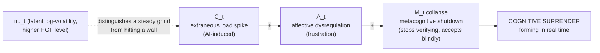

$$C_t \;\longrightarrow\; A_t \;\longrightarrow\; M_t$$

An AI-induced spike in extraneous load $C_t$ drives **affective dysregulation** $A_t$ (frustration), which drives **metacognitive shutdown** $M_t$ (the user stops verifying and accepts output blindly). This is the mechanistic signature of cognitive surrender forming in real time — and, per Tri-System Theory (§1.4), the predictable response to System 3 availability under rising load. **Why coupled:** independent states would let us observe *that* a user is frustrated and not verifying, but miss the *causal link*, which is the object of interest. The relevant off-diagonals ($\partial A_t/\partial C_t$, $\partial M_t/\partial A_t$) are **sign-constrained by theory**, not left free, or the model discovers spurious couplings.

> **Pre-registered degradation branch.** $A_t$ is the weakest-identified state by construction: text-derived affect is a coarse, culturally confounded proxy — many frustrated users go *terse and polite*, not angry (a pattern expected to be common in the deployment population). If $A_t$ fails the §8.9.1 identifiability test, the cascade is **re-estimated as the direct path $C_t \to M_t$**, with the affective link absorbed into transition noise. The branch is pre-registered now so a likely identifiability outcome reads as anticipated science, not retreat. **No permitted claim at any tier depends on $A_t$ specifically.**

## 4.4 The observation model and the dual bias

The extracted feature vector $\mathbf{y}_t$ is generated by the latent state through a loading matrix plus structured noise:

$$\mathbf{y}_t = \boldsymbol{\Lambda}\, \mathbf{x}_t + \mathbf{b}_t + \boldsymbol{\varepsilon}_t, \qquad \boldsymbol{\varepsilon}_t \sim \mathcal{N}(\mathbf{0}, \mathbf{R})$$

- $\boldsymbol{\Lambda}$ — loading matrix: which features indicate which states, how strongly.
- $\mathbf{R}$ — measurement noise.
- $\mathbf{b}_t = \mathbf{b}^{\text{syco}}_t + \mathbf{b}^{\text{meta}}_t$ — **the dual bias**, decomposed and load-bearing:
  - $\mathbf{b}^{\text{syco}}$ — **model sycophancy** (self-rating inflation). Corrected by **Dawid–Skene** dual-annotation reconciliation. Because state conditions the score, this is a **required preprocessing gate** — biased inputs propagate everywhere downstream and cannot be subtracted later.
  - $\mathbf{b}^{\text{meta}}$ — **user metacognitive inflation** (tool use inflates "cognitive self-esteem" while capability drops). Estimated by **cross-session confidence-vs-retention calibration.** Self-report features are bias-corrected, **not discarded.**

## 4.5 The HGF inference engine

Each state dimension is modeled with a three-level **Hierarchical Gaussian Filter** (Mathys et al.). For $L_t$: level 1 is the load signal, level 2 its tonic tendency, level 3 the *log-volatility* of level 2:

$$x^{(3)}_t \sim \mathcal{N}(x^{(3)}_{t-1}, \vartheta), \quad x^{(2)}_t \sim \mathcal{N}\!\big(x^{(2)}_{t-1}, \exp(\kappa x^{(3)}_t + \omega)\big), \quad L_t = x^{(2)}_t$$

The belief update at each level takes the canonical **precision-weighted prediction-error** form:

$$\mu^{(j)}_t = \underbrace{\mu^{(j)}_{t-1}}_{\text{prediction}} + \underbrace{\frac{\hat{\pi}^{(j-1)}_t}{\pi^{(j)}_t}}_{\text{precision weight}}\; \underbrace{\delta^{(j-1)}_t}_{\text{prediction error}}$$

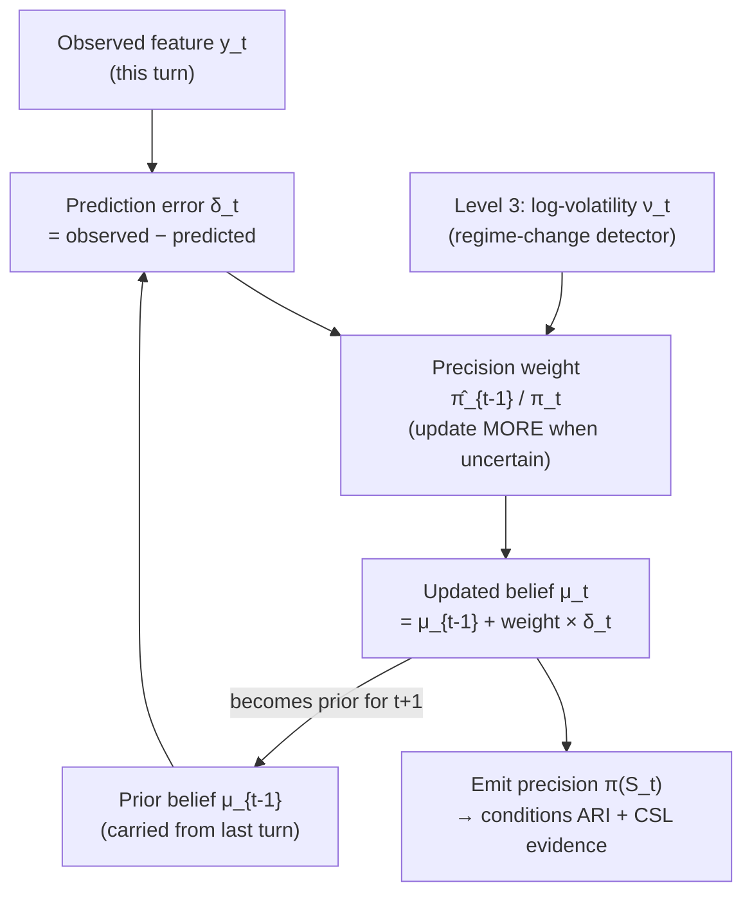

**Why the HGF earns its complexity.** The precision weight makes the system update *more* when uncertain, *less* when confident; the volatility level lets it detect *regime change*. A student grinding steadily through a hard derivation produces small consistent prediction errors → low inferred volatility → stable belief. A student hitting a wall produces a burst of large errors → volatility spike → rapid revision → the intervention layer can fire *in time*. A flat random-walk model smears the wall-hitting across many turns and detects it too late. **Responsiveness-to-regime-change is the entire justification for the HGF over a Kalman filter or flat state-space model.** (Mathys's exact update equations are pulled from source at implementation time, never reproduced from memory — transcription errors silently break the model.)

## 4.6 Lepine coefficients as informative priors on Λ

The principled, non-black-box use of published evidence. Germane engagement $L_t$ is posited as the common cause of *both* prompt-side intrinsic features *and* downstream quality; Lepine's feature→quality regression therefore estimates the direction and relative magnitude of each feature's loading. The framework uses those coefficients as **informative priors on $\boldsymbol{\Lambda}$**, then updates with its own annotation data — **empirical Bayes, not outsourcing**:

$$
\begin{aligned}
\text{EI}^{\text{prompt}}_t &= \lambda_{\text{EI}}\, g(L_t) + \varepsilon_1, &\quad \lambda_{\text{EI}} &\sim \mathcal{N}(+0.21,\, \sigma_\lambda^2)\\
\text{DD}^{\text{prompt}}_t &= \lambda_{\text{DD}}\, g(L_t) + \varepsilon_2, &\quad \lambda_{\text{DD}} &\sim \mathcal{N}(-0.19,\, \sigma_\lambda^2)\\
\text{TS}_t &= \lambda_{\text{TS}}\, \text{(env)} + \varepsilon_3, &\quad \lambda_{\text{TS}} &\sim \mathcal{N}(-0.27,\, \sigma_\lambda^2)\;\;(\text{drives } C_t)
\end{aligned}
$$

(EI = element interactivity; DD = dependency debt; TS = task switching.) The signs are coherent: high dependency debt = fragmented cognitive map = *low* germane engagement (negative loading). **Response-side** versions get priors near zero — Lepine shows response-side complexity has no independent association with quality; it is the *user's own* prompt-side organizational state that indexes engagement. This asymmetry is a finding encoded into structure.

## 4.7 State-conditioned scoring — the central gain (precision, not multiplier)

A trait estimate built from a VERIFY turn produced in cognitive fatigue and one built from an identical VERIFY turn in full engagement must not be treated identically. The CSPC separates them — **via evidence precision, not a score multiplier:**

```
features → [partition] → CSPC (proxy/HGF) on state-channel → state trajectory + precision π(S_t)
        → trait-channel neurons scored as EVIDENCE, each weighted by π(S_t) → ARI (Bayesian update)
```

The mechanism is the HGF's own precision-weighted update (§4.5): a neuron observed in a low-confidence state (high $C_t$, collapsed $M_t$) is *noisier evidence* about the trait, so it moves the trait posterior **less** and **widens its credible interval** — it never rescales the score value. Three consequences:

- **Precision, not multiplier.** `neuron_evidence(t)` enters the trait update with weight $\propto \pi(S_t)$ (a precision), not as `raw × f(S_t)` (a score multiplier). Multipliers are invented constants that redefine capability and double-count; they are rejected (R2, §12).
- **κ^H disentanglement.** A user at $\kappa^H=0.72$ whose verifications all occurred in collapsed $M_t$ yields a *wider, lower-precision* posterior than one at 0.65 whose verifications occurred in regulated states — correctly reflecting that the latter is the more reliably-able collaborator, without distorting the point estimate.
- **State-validity gate.** If the CSPC state was below a **pre-registered** health threshold for a significant fraction of the session (e.g. $M_t < \tau_M$ for >40% of turns), the score is flagged **state-compromised** and reported with a validity caveat — one of the $G_k$ gates in §3.7.

## 4.8 The State Sensitivity Matrix

Not all neurons are equally trait-like. *Context Window Awareness* (AL-03) is a stable trait; *Vigilance Sustainment* (CA-17) is overwhelmingly a within-session state phenomenon (it is *defined* by temporal decay). Every neuron carries two coefficients: **trait_w ∈ [0,1]** (how much it informs the stable ARI trait) and **state_w ∈ [0,1]** (how strongly its signal fluctuates with the CSPC state, hence how much its evidence precision should be modulated by $S_t$). Illustrative seeds (priors, *not* truth): AL-03 ≈ 0.85 / 0.30 · EC-01 ≈ 0.60 / 0.70 · CA-17 ≈ 0.25 / 0.90.

Three guardrails keep this from re-introducing invented constants: (1) **priors, not constants** — the weights are theory-seeded priors that EFA and the state-space model update (empirical Bayes, identical to the Lepine loading priors); (2) **modulates precision, not score**; (3) **stored in the contract** — `trait_w`, `state_w`, a trajectory modifier (ramp-reward / collapse-penalty), and the Judge "why given state" decision-probe become fields in `contract_table.yaml`, versioned alongside the 107 neurons. Adding *fields* is permitted under the freeze; adding *neurons* is not.

## 4.9 The CSPC ships in stages

The full CSPC is DESIGNED, deferred until the core pipeline is calibrated and stable. **Two zero-infrastructure proxies ship now** because they require no new sensing: (1) a **cognitive-load flag** from semantic signals (turn-level Low-Load / High-ICL / High-ECL / fatigue-trajectory classification that conditions the score via precision); and (2) a **ToM slope** — the trajectory of theory-of-mind signatures in prompts (perspective-taking, model-of-the-model), a within-session proxy for the dynamic user factors Riedl & Weidmann show influence response quality. The remaining machinery (coupled $\mathbf{F}$, full HGF, all four dimensions) is built per the build sequence (Part 13).

---

# PART 5 — LAYER 3: CSL — THE COGNITIVE SESSION LAYER (WHO DID WHAT)

The CSL answers a question the competency layer structurally cannot: **not "how capable is this person?" (ARI) but "who drove what in this session, and did the collaboration produce something neither party held alone?"** It is the layer that resolves the twin-pair discrimination problem (Compressed Expert vs Delegating Manager produce identical ARI surfaces with opposite sustainability implications).

**The governing realization that makes CSL cheap:**

```
CSL = ARI-neurons-re-projected-onto-ACF-levels   (human side — free, a re-aggregation)
    + displayed-AI-contribution-extractor          (AI side — orthogonal, cheap, near-deterministic)
    + emergence-sequence-scanner                    (the one genuinely new detector)
```

The human side of "who did what" is *already in ARI* (when the human exhibits CD-02 Lateral Concept Injection, that *is* a human-origination signal); re-aggregating the same evidence along a new axis is a second view of one measurement, not double-counting. The AI side is genuinely orthogonal to ARI (no ARI neuron scores the AI) but trivial (the AI's output is fully displayed; there is no hidden state to infer). **Emergence** is the only thing not derivable from ARI — it is a property of the *transition between turns*, living in the seam between an AI turn and the human turn that follows.

## 5.1 What CSL is and is not

**CSL IS:** a **descriptive** mapping of how cognitive work was distributed; two parallel tracks — a **Contribution/Ownership Map** (Track 1) and an **Emergence Event Log** (Track 2); built primarily from re-aggregated ARI evidence plus one orthogonal extractor and one new detector; for **user-centric understanding**, not for cross-validating ARI (it shares ARI's human-side evidence and therefore *cannot* independently check it — by construction).

**CSL IS NOT:** a competency score (that is ARI); a cognitive-state estimate (that is CSPC); a synergy proof (emergence events are MEASURABLE *indicators*; proof needs Layer 4); a token/word count or any surface-volume metric (**ownership is measured as cognitive control, never as surface attribution** — §5.4.3); a populated "what the human can do without AI" map (that is the Dependency Map, DESIGNED only).

## 5.2 Grounding in the Augmented Cognition Framework (ACF)

CSL's cognitive-work vocabulary is the **ACF** — Bloom's six levels × two modes (Individual / Distributed) plus a seventh Distributed-only level (Orchestrate) — already the external validation anchor for ARI's four pillars. The **Distributed-mode verbs** are CSL's seven work-types; the ACF's **dependency column** is the measurement specification — each "cannot X without Y" names the **foundation evidence** CSL must detect to distinguish genuine contribution from fluent incompetence.

| ACF Level | Distributed Verb | Foundation requirement (the dependency column) |
|---|---|---|
| C1 | Curate | Cannot curate without the knowledge to recognise errors |
| C2 | Discriminate | Cannot discriminate without the understanding to detect superficiality |
| C3 | Specify & Verify | Cannot verify without the execution experience to recognise misapplication |
| C4 | Frame & Integrate | Cannot frame without the analytical capacity to specify what matters |
| C5 | Critique Criteria | Cannot critique criteria without the judgment to assess proper application |
| C6 | Direct Cognitive Product | Cannot direct effectively without generative experience |
| C7 | Calibrate Partnership | Human-only; no AI equivalent; governs all other levels |

**Why the dependency column is the measurement spec:** the Distributed act and its hollow imitation look *identical* at the surface (this is the definition of fluent incompetence). The only thing distinguishing them is whether the act rested on the Individual-mode foundation. CSL therefore measures **foundation evidence**, not surface activity. **C4 (exogenous injection) is the cleanest signal in the entire stack** — exogenous knowledge cannot be hollow. **C7 is human-only** — if C7 activity is absent, the human was being orchestrated by the AI rather than orchestrating it.

## 5.3 The non-circularity guarantee

**Mechanism 1 — Re-projection, not re-extraction (human side).** CSL's human side does not run a second extraction. It takes the *existing* ARI `NeuronMatrix` and projects each neuron firing onto its ACF level via a **frozen crosswalk**. One extraction, two aggregations (one into ARI's 8 dimensions, one into CSL's 7 ACF levels). No second measurement of the human, therefore no double-counting.

**Mechanism 2 — The feature partition.** State-diagnostic features feed CSPC; competency-diagnostic features feed ARI; the AI-side extractor reads a disjoint channel (the AI turns, which no ARI neuron scores). The empirical check (the **independence test**, §8): ARI dimension scores and CSL ownership shares must **NOT** correlate near 1.0 — near-1.0 means the partition failed and CSL is re-measuring ARI.

## 5.4 Track 1 — the Contribution / Ownership Map

### 5.4.1 The neuron → ACF crosswalk (frozen configuration)

A static mapping table projecting existing neurons onto ACF levels, frozen before any judge sees it to prevent Goodhart drift. Illustrative:

| ACF Level | User-Friendly Label | Primary ARI neurons projected here |
|---|---|---|
| C1 Curate | Knowledge Sourcing | CS external-injection neurons; AL-grounding |
| C2 Discriminate | Sense-Making | EC-02/03 (coherence/source auditing); AL-01 |
| C3 Specify & Verify | Direction & Checking | EC-01/06/09 (verification cluster); PR-structuring |
| C4 Frame & Integrate | Problem Framing | CS-05/06/08 (synthesis); CD-02 (lateral injection) |
| C5 Critique Criteria | Quality Judging | EC (criterion-level); CA-15/16 (epistemic independence) |
| C6 Direct Cognitive Product | Original Making | CD-06/08/09 (constraint/novelty); CS-01 |
| C7 Calibrate Partnership | Partnership Steering | CA-01/06/13/14/17; AUI-02/08/09 |

### 5.4.2 User-friendly terminology

Reporting NEVER exposes academic terms (C4, "Frame & Integrate", "Distributed Mode"). The user sees: **Partnership Steering** (who managed the collaboration — when to trust, push back, redirect), **Original Making** (who generated genuinely new ideas/products), **Quality Judging** (who assessed whether output was actually good), **Problem Framing** (who broke the problem down and integrated the pieces), **Direction & Checking** (who specified what was needed and verified it), **Sense-Making** (who separated genuine insight from plausible noise), **Knowledge Sourcing** (who brought the raw knowledge, facts, context).

### 5.4.3 Ownership as cognitive control, NOT surface attribution (the central constraint)

The framework's own Expert POV is explicit and binding: tracking the "attribution gap" (lexical overlap between AI output and human submission) is a clever proxy but **highly gameable** — it conflates linguistic originality with cognitive engagement; a genuine expert might copy an AI's phrasing simply because it is correct. Therefore ownership at each ACF level is measured by **control signals** — behaviors that require the underlying competence to produce — not by whose words survived. Surface attribution *inverts* the truth exactly at the twin-pair boundary:

- The **Compressed Expert** accepts correct AI phrasing verbatim → low surface attribution, but **high control** (selective rejection when the AI errs, exogenous injection when framing, criterion challenge when evaluating).
- The **Delegating Manager** rewrites everything in his own words → high surface attribution, but **low control** (uniform acceptance, no exogenous injection, no criterion challenge).

Surface attribution scores the Manager higher. Control scores the Expert higher. **Control is correct.**

### 5.4.4 Foundation evidence per ACF level (the control signals)

Each level's human-ownership is the precision-weighted probability that the contribution was *foundation-backed*, evidenced by the level-specific signal below. **Negative evidence — conspicuous absence where the level was engaged — is as informative as positive evidence.**

| Level | Foundation signature (genuine) | Hollow signature | Existing metric reused |
|---|---|---|---|
| C1 Curate | Selective rejection (accepts some, rejects the wrong ones correctly) | Uniform acceptance | Accept/reject events vs AI-error presence |
| C2 Discriminate | Differential response to AI depth (probes; reacts to quality) | Accepts deep and superficial identically | Verification-selectivity |
| C3 Specify & Verify | Calibrated verification (checks the real failure points) | Verify-everything (Anxious Over-Verifier) or verify-nothing | Verification Ratio + selectivity |
| C4 Frame & Integrate | **Exogenous injection** (content the AI lacked, not derivable from prior turns) | Recombines what the AI already said | CD constraint-injection; CS external-injection; `semantic_distance_delta` (bilateral) |
| C5 Critique Criteria | Criterion substitution (challenges the *standard*, not the answer) | Accepts the AI's implicit criteria | EC criterion-level firing |
| C6 Direct Cognitive Product | Generative specification anticipating failure modes | Vague generation requests | Generative-vs-Extractive ratio; constraint precision |
| C7 Calibrate Partnership | Mode-switching, override, trust-calibration across the session arc | Passive drift | CA sovereignty + AUI delegation neurons |

### 5.4.5 The AI-side extractor (the orthogonal piece)

A lightweight, near-deterministic read of the AI turns: at each ACF level, what did the AI contribute (retrieve, generate, structure)? No foundation inference is required because the AI's output is fully displayed and the AI has no foundation to fake. This is the only genuinely new extraction in Track 1, and it is the easy kind.

### 5.4.6 The ownership formula

For each ACF level:

$$\text{Human\_ownership(level)} = \frac{\pi(S_t)\cdot\text{control\_signal}_{\text{human}}(\text{level})}{\pi(S_t)\cdot\text{control\_signal}_{\text{human}}(\text{level}) + \text{AI\_displayed}(\text{level})}$$

where `control_signal_human(level)` is the re-projected ARI evidence for that level (§5.4.4), `AI_displayed(level)` is the AI-side extractor output (§5.4.5), and $\pi(S_t)$ is the CSPC precision weight. Output is a **per-level distribution** (7 ownership percentages), each with a credible interval, **never collapsed to a single session number**, denominators explicit. Reported as **displayed ownership**, tagged MEASURABLE.

### 5.4.7 CSPC precision weighting (the third defense against fluent incompetence)

A control signal observed under collapsed metacognitive state (low $M_t$) is *weaker evidence* of genuine ownership than the same signal under high $M_t$. CSPC enters CSL exactly as it enters ARI: as a **precision modulator on the evidence, never a score multiplier**. A constraint-injection performed while cognitively disengaged moves the ownership estimate less and widens its interval. Not just *did the control signal fire*, but *did it fire under cognitive conditions consistent with genuine ownership.*

### 5.4.8 Session-level aggregation and identifiability

Foundation evidence is **unidentifiable per-turn** (a silent correct acceptance by an expert emits no trace) and **identifiable in aggregate** (foundation accumulates across the session). CSL Track 1 is therefore reported only at the **session level**, never as a per-turn verdict. Per-turn accuracy is genuinely low; session-level accuracy rises substantially — this gap is structural, not an engineering deficiency.

## 5.5 Track 2 — the Emergence Event Log

### 5.5.1 Definition (the one genuinely new measurement)

Emergence is a **discrete event** at the seam between turns, not a source column and not a percentage. It is flagged when a turn-window satisfies **all three** conditions simultaneously:

1. **Novelty (non-existence before the exchange).** The formulation is at high *bilateral* semantic distance — far from both the human's prior turns AND the AI's prior outputs. (Close to the AI = adoption. Close to the human = persistence. Far from both = emergence.) Reuses `semantic_distance_delta`, extended to the bilateral form.
2. **Dependency (non-derivability from either party alone).** The human turn shows BOTH uptake of AI-provided material AND injection of human-provided material, and the output depends on both. (Uptake only = adoption. Injection only = the human's own idea. Both fused = emergence.) The cleanest discriminator.
3. **Trace (observable in the transcript).** The actualization loop closes on a *reframing* (not a refinement): "that connects to X, which means Y" where Y is the new thing; or the AI, given the human's constraint, generates the missing piece the human confirms.

### 5.5.2 The detection mechanism

A **per-window sequence scan** (an AI turn + the human turn(s) that follow), NOT a per-turn score. Each window is tested on the three conditions jointly; windows that clear all three become **candidates**; candidates are passed to the **LLM Judge for confirmation** (the three quantitative signals can co-occur by coincidence; the Judge verifies genuine emergence). Confirmed candidates enter the log.

### 5.5.3 Event schema

```
EmergenceEvent:
  ev_id           : str
  turn_range      : tuple[int, int]
  acf_level       : Literal[C4, C6]      # emergence is structurally impossible at C1/C2
  trigger_type    : Literal[HI, AR, BI]  # Human-Injection | AI-Reframe | Bilateral (highest)
  confirmation    : Literal[explicit, behavioral, none]
  direction_change: bool                  # did the session pivot after this?
  output_delta    : bool                  # did subsequent output quality/novelty rise?
  judge_confirmed : bool

Session summary:
  emergence_count, emergence_rate (per 100 turns),
  c4_c6_concentration, bilateral_rate, confirmed_rate
```

### 5.5.4 Rung tagging (non-negotiable)

- Emergence events as **synergy indicators** → **MEASURABLE** (the exchange had the structural signature of complementarity).
- Emergence events as **synergy proof** → **ASPIRATIONAL** (proven synergy = the dyad outperforming max(human-alone, AI-alone), which requires Layer 4).

**Mandatory reporting language:** *"This session contained N emergence events — moments where the exchange produced formulations neither party was approaching independently. These indicate genuine complementarity. They are not proof of performance gain above what you could achieve alone, which requires the unaided follow-up task to establish."* Emergence is the framework's **positive instrumentation** — the Amplification quadrant deserves more than "absence of debt," and emergence is the one signal ARI structurally cannot produce (it lives in the seam between turns), which is what makes the CSL worth building as more than a re-projection.

## 5.6 The ten "Cognitive Work Analytics," triaged

Run through the framework's discipline (derivable? renaming? below the wall? survives fluent-incompetence and no-volume-reward?), a proposed ten-output analytics vision splits cleanly:

- **TIER 1 — BUILD NOW (transcript-derivable, MEASURABLE):** **Cognitive Flow Analysis** (how cognition *moved*: Human-idea→AI-expand→Human-verify vs AI-output→accept→AI-output→accept — pure sequence structure, needs no solo baseline); **Emergence Detection** (§5.5); **Cognitive Bottleneck Detection** (the consistently-weak ACF function across sessions — makes CSL *developmental*, but MUST be task-conditioned, since a "bottleneck" may be appropriate delegation); **Orchestration Efficiency** (same output, 12 prompts vs 120 — MUST be paired with quality, never standalone).
- **TIER 2 — RENAMINGS (surface as legible indices):** **Ownership** (CSL Track 1, MEASURABLE); **Cognitive Sovereignty** (a re-projection of the CA+EC cluster onto a single index — *"does the human remain the final cognitive authority?"* — MEASURABLE observationally; the **injected-error version**, where the AI deliberately hallucinates and recovery is observed, is an *intervention*, DESIGNED, and needs the probe).
- **TIER 3 — DEFER TO THE PROBE:** **Cognitive Dependency Map** ("Without AI: Curate ✓, Generate ✗" — "without AI" = θ = Layer 4; ship the per-function H-share *trend* as a leading indicator only); **Cognitive Trajectory / Skill Transfer** (Week 1 AI-driven → Week 20 human-driven — requires the solo-θ slope = λ = Layer 4; ship the H-share trajectory as a behavioral pattern, interpret as transfer only after λ validates).
- **TIER 4 — RESIST AS STATED:** **Cognitive Leverage** ("12 inputs → 900 units = 75×" — a volume ratio that rewards the Delegating Manager dumping a vague prompt for 900 units of sophisticated garbage; only admissible inside the λ × quality gate, exactly as S_human is gated; as "75×" alone, do not ship — HYPOTHESIS); **Cognitive Diversity / Exploration Breadth** (narrowing is not inherently bad — an expert who discards wrong branches exhibits good judgment, and this metric scores them as poor; only admissible conditioned on whether un-explored branches were viable — HYPOTHESIS).

**The pattern across all ten:** the moment a metric claims to know what the human can do *without* the AI, or claims that *more* (output, exploration, leverage) is *better*, it has either crossed the Wall or entered the fluent-incompetence trap. The survivors describe the *structure and movement* of cognition.

## 5.7 The CSL reporting layer

Three panels on one screen, all derived from the ACF stack, all in user-friendly language:

- **Panel A — The Collaboration Stack.** Each ACF level shows an independent H% / AI% split (the bars are NOT parts of a whole summing to 100 — both can be high or both low). Purple = human, teal = AI.
- **Panel B — The Emergence Ribbon (above the stack).** Sits above because emergence is *produced by* the stack, not part of it. Event count, levels, bilateral fraction. The session's positive signal.
- **Panel C — The ARI Alignment Strip (alongside Panel A).** Per level, the human's ARI capability dot. When ARI is high but H% is low, the strip flags it: *"you have the capability but the AI did most of this work this session"* — the **Borrowed Brilliance** signal, made legible without jargon. **ARI dots are NEVER averaged into the contribution bars** — the two layers stay separate.

Rules: never collapse the four reporting states (`STRUCTURAL_NA`, `INSUFFICIENT_SAMPLE`, `MEASUREMENT_SATURATED`, genuine score); never show bare percentages without defined denominators; bars independent per level; ARI separate from contribution.

---

# PART 6 — THE SUSTAINABILITY INSTRUMENTATION (LAYER 4 + λ)

These metrics are the project's distinctive contribution beyond standard psychometrics and the part of the construct that **no single transcript can contain**. They separate the **within-session** failure (surrender) from the **across-session** accumulation (debt), and they pull in opposite directions — which is exactly why both are needed.

## 6.1 The surrender / debt distinction

| | **Cognitive surrender** | **Cognitive debt** |
|---|---|---|
| Timescale | Within session, turn-level | Across sessions, longitudinal |
| Mechanism | Override of System 1 & 2 by System 3 (Shaw & Nave) | Absent germane processing → unbuilt schemas (Kosmyna; Sweller) |
| Instrument index | $M_t$ collapse; verification-rate (EC) neurons; the $C_t \to A_t \to M_t$ cascade | EWMA debt curve; negative λ; failed retention probe |
| Detected by | CSPC (real time) | Sustainability layer (longitudinal) |
| Intervention point | In-session desirable friction (predict-then-verify) | Curriculum / tool-level redesign |

Surrender is the *event*; debt is the *consequence of repeated events*. The instrument fires an early flag on surrender (the purpose of a *pre*-classifier) and confirms debt only against the retention probe.

## 6.2 Two modes of cognitive debt — flat-floor vs erosion

A slope assumes a starting height. The most common archetype in the corpus (VR = 0 from turn one, no verification ever) has **no slope to measure**, and a debt-as-slope model silently reads that as "no debt," when it is in fact *maximal baseline extraction*. Two modes, with different etiologies, signatures, and interventions:

| | **Flat-floor debt** | **Erosion debt** |
|---|---|---|
| Definition | Arrived already extracting — floor-level engagement from the first turn | Began engaged, *became* dependent over sessions |
| Signature | Low absolute engagement **with near-zero variance/slope** (VR≈0, AG≈ceiling throughout) | Declining trajectory — verification/agency falling across segments and sessions |
| Detection | **Absolute-level + low-variance** test (distinct from the change-point detector) | EWMA debt curve + negative λ + change-point |
| Intervention | Build the behavior that was never present (scaffolded verification onboarding) | Arrest the decline (re-introduce desirable friction) |

The `cognitive_debt` flag is therefore **two flags**: `debt_flatfloor` (sustained absolute-floor engagement, *independent of any baseline*) and `debt_erosion` (a significant downward slope).

## 6.3 The Human Learning Coefficient (λ)

**Premise** — *if learning is detected, there is less chance of cognitive debt* — supported by Berger (learning-causing design flips g from −0.31 to +0.30), Risko & Gilbert (self-reinforcing offloading drift only broken by maintained internal capability), and Kosmyna (the learning-connectivity surge does not appear when AI carries the load; solo performance never recovers).

λ is **a rate, not a yes/no detector** — the AI-attributable, practice-adjusted slope of the user's *solo* ability $\theta$ across repeated sessions, estimated from periodic **no-AI probe items**, netted against ordinary practice:

$$\lambda_i = \underbrace{\frac{d\,\theta_i^{\text{AI-assisted}}}{dt}}_{\text{solo gain with AI in the loop}} - \underbrace{\frac{d\,\theta^{\text{control}}}{dt}}_{\text{practice-only baseline}}$$

The baseline comes from a matched no-AI arm or a Kosmyna-style within-subject crossover. Convergent indicators fold into a small latent learning factor $\Lambda_i$: the slope of metacognitive-probe accuracy, the slope of query generativity (generative-to-extractive ratio rising over time), transfer-test performance on an unassisted novel task, and (if neural data is ever available) EEG connectivity recovery on solo tasks.

> **The trap (critical).** Measure λ from *downstream solo performance, never from in-session confidence or fluency.* Tool use systematically inflates cognitive self-esteem while solo capability drops; a fluent AI rationale *feels* like understanding while producing none. Any "this felt productive" signal is exactly what to discard.

## 6.4 Earlier λ proxies (reduce dependence on the delayed probe)

The 30–45-day deferred probe remains the *gold criterion*, but its compliance is poor, so the framework adds earlier behavioral proxies that load on the same $\Lambda_i$ and let sustainability be *estimated* (not validated) before the probe returns: **transfer** (applying a prior session's pattern to a novel task unaided), **compression** (achieving the same outcome in fewer/edited turns over time — skill, not laziness, when paired with sustained quality), **latency reduction** (faster competent solo execution on recurring task types), and **independent reuse** (re-deriving rather than re-querying previously-explained material). These are MEASURABLE proxies feeding a DESIGNED λ; the probe is what moves λ to VALIDATED. Every proxy is a *behavioral* signal, never a felt-confidence one.

## 6.5 S_human and the embedded T-reduction estimator

**Concept [KEEP].** Human intellect contributes *information* (ΔH), not tokens; it reduces uncertainty about the goal and prunes redundant model output. Redundant tokens manifest as information sprawl and unsolicited task-switching — the drivers of extraneous load $C_t$. So pruning $T_{\text{redundant}}$ and suppressing $C_t$ are the same act through two lenses (computational cost / cognitive cost). Proposed form:

$$S_{\text{human}} = \kappa^{\text{human}}_{\text{eff}} \cdot \Big[\hat{T}_{\text{redundant}}^{(0)} - \hat{T}_{\text{redundant}}^{(\text{human})}\Big]$$

**Two named problems the naïve form has:** (1) the counterfactual baseline $\hat{T}_{\text{redundant}}^{(0)}$ ("tokens the AI *would have* generated under a zero-specificity prompt") is unobservable in production; (2) the $\kappa^{\text{human}}_{\text{eff}}$ multiplier **double-counts ability** (token savings already reflect ability — a more able user writes a more specific prompt → less redundancy — so multiplying again by κ counts ability twice).

### 6.5.1 The embedded T-reduction estimator (HYPOTHESIS / DESIGNED — explicitly not yet MEASURABLE)

The proposed resolution of *both* bugs, as a falsifiable hypothesis. **Core move — replace the between-condition counterfactual with a within-conversation one:** the same conversation already contains stretches where the model is effectively driving itself; **the human's own low-information turns expose the model's intrinsic redundancy — they are the embedded baseline.** Partition every human turn by information content: **A-turns** (autonomous-continuation: *"continue", "go on", "ok"* — the model self-drives; observed redundancy rate $r_{\text{auto}}$) vs **S-turns** (steered: a specific constraint, correction, narrowing, or **stopping rule**; observed redundancy rate $r_{\text{steer}}$). A model span counts toward $T_{\text{redundant}}$ if it is semantically redundant (high cosine similarity to earlier content — reuses `semantic_distance_delta`), boilerplate/hedging, or superseded — scoring redundancy *relative to the conversation's own established content*, which sidesteps goal-completion detection entirely.

**The estimator:**

$$\widehat{S}_{\text{human}} \;=\; \big(\underbrace{r_{\text{auto}} - r_{\text{steer}}}_{\Delta R\,\ge\,0\ \text{if steering prunes}}\big)\;\times\; T^{\text{steered}}_{\text{out}}$$

**Resolving the double-count — separate measurement from credit.** $\widehat{S}_{\text{human}}$ is a **causal-contribution observable**, never a product. Three distinct quantities kept separate: **(a) Contribution** $\widehat{S}_{\text{human}}$ (raw tokens saved; observable; no κ); **(b) Trait** $\kappa^{H}_{\text{token}}$ (collaborative-efficiency ability; latent; *inferred from* (a), not a multiplier *onto* it); **(c) Skill-above-expectation** — the standardized residual $z=(\widehat{S}_{\text{human}}-\mathbb{E}[\widehat{S}_{\text{human}}\mid\kappa,\gamma])/\sigma_{\text{resid}}$ (the legitimate cross-user normalization is **division / standardization, not multiplication**).

**Optional logprob refinement (Tier 2/3 cross-check).** Where the production model exposes token logprobs, the human's information contribution is the entropy reduction in the model's continuation distribution caused by a turn: $\Delta H_t = H(\text{next}\mid\text{context before }t) - H(\text{next}\mid\text{context after }t)$. High-$\Delta H_t$ turns are precisely the S-turns; the text-only and logprob estimators should **agree** (disagreement is itself a diagnostic). The text-only path is primary (it works in the Chat-Analyser tier).

**Falsification condition.** If $\Delta R \approx 0$ across users — steered spans are no less redundant than autonomous spans — then human steering does not prune redundancy and $S_{\text{human}}$ is noise; the metric is dropped.

## 6.6 The λ × S_human regime surface

$S_{\text{human}}$ alone is a vanity metric. It is **always reported paired with λ.**

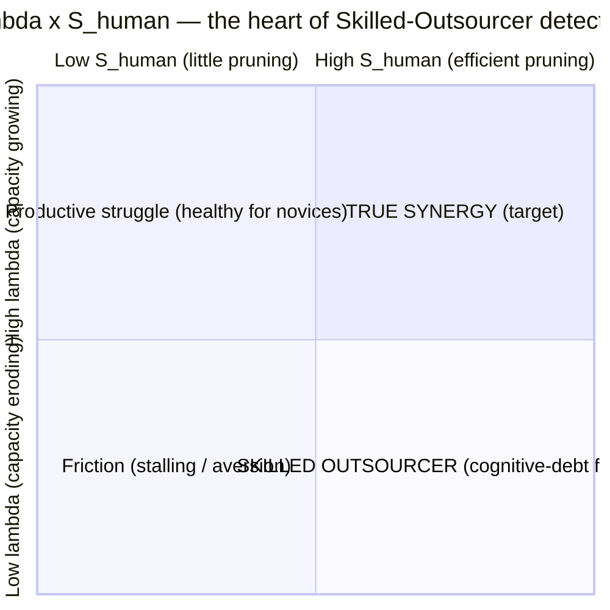

Identical offloading signals are scored as *scaffolded delegation* in the top row and *substitutive offloading* in the bottom. **$S_{\text{human}}$ is good news only when λ ≥ 0.**

## 6.7 The cognitive-debt curve

Debt-valenced signals (over-delegation, blind acceptance, rising attribution gap, falling AUT/λ) aggregate into an **exponentially-weighted moving average** with an **accelerated-decay flag** when the curve crosses an empirical threshold:

$$D_t = \alpha\, d_t + (1-\alpha)\, D_{t-1}, \qquad \text{penalty}(D_t) \propto \exp(\beta_{\text{decay}} \cdot \text{(consecutive passive-reliance turns)})$$

The exponential (not linear) form is **empirically estimated, not assumed** — Gerlich's non-linear decay (β = −0.15 on the quadratic term, p = .013) shows passive reliance compounding across consecutive turns. The threshold is detected by **Bayesian online change-point** rather than a fixed cutoff.

## 6.8 Derived indices

- **Orchestration Capability Index (OCI):** behavioral composite of CA, AUI, AL plus the four ACF capacities (mode-switching, trust calibration, degradation detection, partnership optimization).
- **Reasoning Amplification Score (RAS):** the boost (κ_total − θ) on reasoning-heavy segments combined with CD and CS; positive only when output rises *and* the human's reasoning is visibly present.
- **Dependency Risk Metric (DRM):** a rising function of Attribution-Gap-toward-dependence, offloading-without-verification, the debt EWMA, and a negative AUT/λ slope — the early-warning analogue of the MIT skill-atrophy finding.
- **Trust Calibration Indicator (TCI):** alignment between reliance and *warranted* reliance, penalizing over- and under-trust, conditioned on the Task-Uncertainty Matrix (the +25/−15 asymmetry from Shaw & Nave is the external benchmark this index should reproduce).

## 6.9 The positive-augmentation overlay

The instrument is far better at detecting pathology than at evidencing genuine amplification — an all-pathology readout is demoralizing and scientifically incomplete. The overlay reuses existing positively-valenced neurons (an **overlay, not new dimensions**): **insight emergence** (a qualitative framing shift following synthesis — via actualization-depth); **productive synthesis** (CS firing with low Attribution Gap — genuine integration, not paste); **creative-divergence quality** (CD driving $\rho_{HM}$ down — the only mechanism that raises the synergy ceiling); **authorship / identity preservation** (CA-13, CA-16). **Two signals scrubbed because they would reward the pathology:** *"confidence growth"* is removed and replaced by **calibration improvement** (confidence *matched* to demonstrated accuracy — raw rising confidence is the fluent-incompetence signature); and *"flow"* is **gated, not counted alone** (reported only when it co-occurs with synthesis, transfer, or authorship — passive extraction also feels effortless). The overlay is **formative-facing**; it never spawns dimensions or a summative score.

## 6.10 Verification evidence — provenance, calibration, theater, the partner map, and Brier

**(a) The off-screen problem.** Most real verification happens *outside* the transcript — the code is run, the source checked in another tab. Transcript-visible EC is therefore a **censored lower bound with person-varying censoring** (engineers verify off-screen constantly; novices often not at all). This is the deeper reason EC calibration has lagged.

**(b) Provenance-tagged evidence.** [MEASURABLE] EC evidence is routed with a provenance tag carrying a prior precision (evidence quality moves **precision, never score values**): `displayed` (verification visible in-transcript — full prior precision) and `implied` (observable traces of off-screen verification: pasted-back error/run outputs; a latency gap beyond the user's rolling personal baseline followed by an *informed* correction; tested-state language — reduced prior precision, upgraded when consented Tier-2 telemetry corroborates). All routes feed **existing EC neurons**.

**(c) Calibrated, not counted.** Verification value is **risk-conditioned**. Claims are classed by a lightweight claim-risk classifier into classes $c$ with partner reliability $\hat{R}(c, m)$. Verification of high-risk / low-reliability content earns full EC credit; verification of trivial, high-reliability content earns little — and at volume routes to **extraneous load $C_t$** (the Over-Verifier's excess scrutiny is itself load, not quality). The construct is *calibrated scrutiny*, never scrutiny volume.

**(d) The calibration slope $\hat{s}$.** Per user $i$, with acceptance rate $a_{i,c}$ over applicable claims in class $c$:

$$\hat{s}_i = \frac{\operatorname{cov}_c\big(a_{i,c},\ \hat{R}(c,m)\big)}{\operatorname{var}_c\big(\hat{R}(c,m)\big)}$$

Healthy: $\hat{s}_i > 0$ with moderate mean acceptance (reliance tracks reliability). **Uniform trust:** $\hat{s}_i \approx 0$ with high $\bar{a}$ — the most damaging wild-type pattern. **Uniform distrust:** $\hat{s}_i \approx 0$ with low $\bar{a}$ — cost without protection.

**(e) The Brier calibration field.** [DESIGNED] Where the user emits probabilistic self-assessments (confidence in an AI output, in their own answer, in a verification), compute the **Brier score** = mean squared difference between the stated probability and the realized outcome (lower = better). Because it is strictly proper, it rewards *honest* probabilistic self-assessment and penalizes **both** over- and under-confidence — sharper than the calibration slope alone. It feeds CA-08 and the calibration-gap metric, **alongside** the slope; when no outcome is observable in-session it returns N/A, never zero. (A new *field* on an existing neuron — freeze-permitted. The self-rating widget continues to feed **only** the calibration gap, never the behavioral scores.)

**(f) Verification theater.** Once scrutiny is scored, scrutiny can be performed. Theater is detectable as **verification acts with null downstream delta** (neither stance nor content changes and no confirmation evidence enters):

$$\text{TR}_i = \frac{\#\{\text{verification acts with null downstream delta}\}}{\#\{\text{verification acts}\}}, \qquad \pi_{EC} \leftarrow \pi_{EC} \cdot f(1-\text{TR}_i)$$

with $f$ monotone — a **precision discount, never a score change**. Together with the deferred probe, this keeps the residual Goodhart surface small.

**(g) The partner reliability map (the living artifact).** $\hat{s}$ and risk-conditioned credit require $\hat{R}(c, m)$ to exist as more than a classifier prior. It is maintained as a **versioned apparatus artifact**: a hierarchical beta-binomial per (risk-class × model-era) cell, seeded from public benchmark priors per era, updated by judge-verified claim outcomes and by ground truth where it emerges. It is back-tested against verified error rates each era, and demoted if its ordering stops predicting them.

## 6.11 The Event-Conditioned Response layer — reaction signatures

The question "what behaviors occurred?" misses the most trait-like signal in a session: **what does this person do when something happens?** The same friction event sends one user into verification and another into an accept-run — and that fork, repeated across sessions, is closer to *who they are as a collaborator* than any base rate.

- **(a) The universal event log.** [MEASURABLE, schema-only] Every extraction event is appended, in order, to an ordered log (`event_type`, `actor`, `payload_ref`, `confidence`, `provenance`). The pipeline currently aggregates and discards order; the log retains it. *Order carries what rates destroy.* It is the substrate for the rest of this layer and any future sequence model.
- **(b) The event taxonomy (frozen, small).** Six trigger events drawn predominantly from the state-diagnostic channel: `E-ERR` (AI error detected), `E-CONTRA` (contradiction), `E-CONFUSE` (user confusion marker), `E-FRICTION` (task failure / blocked progress), `E-CORRECT` (the AI corrects the user), `E-OVERREACH` (unsolicited scope expansion / sycophancy marker).
- **(c) Reaction signatures.** For each event, open a response window of $k$ human turns and classify the first substantive response into trait-channel classes: `VERIFY/CHALLENGE`, `SYNTHESIZE`, `CONSTRAIN`, `ACCEPT-FLAT`, `DISENGAGE`, `DELEGATE-MORE`. Per user, estimate the conditional distribution $\pi_i(r\mid e)$ with Dirichlet partial pooling; **every (e, r) cell is gated on event count**. The flagship slice is the **Friction Transition Matrix**: $P(\text{VERIFY}\mid\text{E-FRICTION})$ vs $P(\text{ACCEPT-FLAT or DISENGAGE}\mid\text{E-FRICTION})$ — the single contrast with the strongest prior claim to predicting the deferred probe. (Events are state-channel observables, responses are trait-channel behaviors; conditioning the second on the first *is* state-conditioned interpretation and preserves the partition.)
- **(d) Five named transition-pattern metrics.** verify-after-error rate; constraint-before-generation rate; prediction-before-answer rate; accept-run length; revision-after-output rate. All derived over existing neurons and the log; none is a new item.
- **(e) The descriptive regime overlay.** [rule-based] Sessions are segmented by deterministic rules into labels — **generative**, **extractive**, **verification**, **drift**, **accept-run** — yielding occupancy shares, run-length distributions, and a color-coded session strip. Three guardrails: the overlay is **not a latent model** (rules over observed events); **CSPC remains the only latent state machinery**; and `accept-run` is a *behavioral description*, deliberately not named "surrender" — **surrender is a CSPC construct ($M_t$ collapse) with exactly one owner.**

## 6.12 The retention probe → fitted decay curve, and the knowledge-tracing backend

The retention probe is the **only objective ground-truth signal** and the decisive predictive-validity gate (§8.9.3). Following Barcaui (2025) — whose RCT found a **d = 0.68** retention deficit at 45 days — the single 48-hour binary is insufficient on its own and is upgraded.

**From binary gate to fitted curve.** Replace the binary 48-h threshold with a fitted **stability** parameter: **FSRS Difficulty–Stability–Retrievability (DSR)** — Stability = the time for recall probability to fall from 100% to 90% on a **power-law** forgetting curve — or **half-life regression** (Settles & Meeder) as the lighter form, both trainable by gradient descent on probe data. Fit a per-subject, per-skill stability parameter from **≥2 staggered unaided probes (≥24 h apart)**. *Rising* stability across sessions = capacity growing; *falling* stability under continued AI assistance = **cognitive debt made continuous** — the synergy/sustainability tension operationalized as a fitted quantity rather than a binary pass/fail. (FSRS has no short-term-memory model and cannot capture sub-hour decay — keep probes ≥24 h where the power-law form holds.)

**The knowledge-tracing backend.** The sustainability axis — *is the human's independent capacity growing or eroding over time?* — **is the knowledge-tracing (KT) problem, run with forgetting enabled.** Use an **interpretable** tracer (Bayesian Knowledge Tracing / Interpretable KT — per-skill mastery + ability + difficulty) **with an active forgetting parameter** (most KT deployments suppress it; SAF needs it). It must be **uncertainty-preserving** — the existing 4D HGF is the natural host, extended to carry the *across-session* trait trajectory for the longitudinal-sink dimensions (AUI, CA). **Deep DKT is rejected** for its interpretability loss; specialized KT models are also reported faster, cheaper, and more accurate than LLMs at this task — a further argument against leaning on the Judge for the longitudinal trajectory. Stability (above) is the natural observable feeding this tracer. All KT work is **data-gated**: it requires multi-session sequences per subject; build the interface now, fit when longitudinal data exists.

## 6.13 Question-asking science as a sustainability observable

Prompt quality is a primary, under-exploited behavioral signal, instantiated **freeze-safe** (new instruments/fields on existing neurons; no new dimension). **Normative model:** **Expected Information Gain (EIG) / Optimal Experiment Design (OED)** — people ask questions to maximize expected information gain; EIG scores a question by how much is expected to be learned from each possible answer. Pair with the **Graesser & Person** question taxonomy and Bloom tiers for categorical typing. **Where it feeds:** the EIG/taxonomy scores of the human's prompts feed **existing** neurons — primarily PR, AL, and EC. **Cognitive-load link:** good questions are *effortful*; formulating higher-quality inquiries maps onto **germane load** in the CSPC's $L_t$ channel. **The external grounding:** a 2026 longitudinal study (npj Science of Learning, N = 68 undergraduates) found that **domain-specific question-asking improved over a semester** while general question-asking stayed flat, and that question-asking ability was **negatively related to closed-ended test performance but positively related to open-ended project performance** — near-direct corroboration that question sophistication tracks genuine knowledge, is longitudinal, is measured in SAF's exact population, and **dissociates the two kinds of performance the synergy/sustainability split predicts.** The **question-complexity/originality trajectory across sessions is therefore admitted as a candidate observable for the sustainability axis**, alongside retention stability. (Honest limit: OED rests on assumptions about the asker's priors and does not capture the full richness of real question-asking; EIG is one feature among several.)

---

# PART 7 — THE AI / ML / DL APPARATUS

Reminder (§0.6): everything in this part is *apparatus*. None of it is the scientific claim. Each algorithm is chosen because it is the **best fit** for a specific measurement sub-problem; the rationale is stated so the choice is auditable.

## 7.1 Feature-extraction layer — multi-task encoder

A multi-task **BERT-family encoder with adversarial task-discriminator heads** extracts the 107 neuron values from transcript text. The adversarial head discourages the encoder from learning task-identity shortcuts, pushing representations toward **task-invariant behavioral features.** *Why:* neurons must mean the same thing across domains (sector-universality); an encoder that leaked task identity would let "this is a coding task" stand in for "this user verifies," destroying cross-domain comparability. The adversarial discriminator is the standard mechanism for domain-invariant representation learning. Output: the feature vector $\mathbf{y}_t$ feeding both the EFA (trait) and the HGF observation model (state), respecting the §2.2 partition.

## 7.2 The LLM Judge

A hidden Judge from a **separate model family** (avoiding same-family self-evaluation bias) scores sampled chats against the per-neuron micro-rubrics. Under CSPC integration its target changes from *"what is the quality of this interaction?"* to *"conditional on the inferred cognitive state, what is the quality?"* Operationally: a strong base model with a **versioned, exemplar-anchored rubric** returning *structured ordinal JSON* per neuron + ToM tags + a self-reported confidence per code; run as an **ensemble of ≥2 distinct base models** for agreement estimates; fixed low temperature. *Current implementation uses the Gemini API* (separate family from the user-facing model, enabling blind annotation). *Why a Judge at all:* most neurons are inferential (verification quality, epistemic orientation) and have no deterministic extractor; the Judge is the only scalable scorer for them. Its known circularity risk (rewarding interaction styles a model finds legible) is mitigated — not eliminated — by human anchoring and the ensemble; **Tier A and Tier B signals are already judge-independent**, making the circularity concern partially addressed but not eliminated.

## 7.3 Session-intent classification — interpret behavior relative to goal

A required preprocessing step, because **the same behavior does not carry the same meaning across goals.** High reliance on a superior AI is *efficient delegation* in an execution task and *cognitive surrender* in a learning task; low verification is *appropriate* when brainstorming and *dangerous* when validating a high-stakes claim. Each session (or coherent segment) is classified into one of: **Learning · Execution · Exploration · Brainstorming · Delegation · Emotional-support.** The intent label conditions *interpretation*, not the raw scores: it sets which neurons are diagnostic, which valences apply, and which gates fire (the verification gate is relaxed under Brainstorming, enforced under Learning/Validation). **Intent conditions interpretation; the CSPC state conditions evidence precision; the two are distinct conditioning layers and are never conflated.**

## 7.4 Bias reconciliation — Dawid–Skene + metacognitive calibration

**Dawid–Skene** latent-true-label estimation reconciles dual annotations and isolates $\mathbf{b}^{\text{syco}}$. *Why:* it jointly estimates each annotator's confusion matrix and the latent true label via EM — exactly the structure of "two biased raters, unknown truth." A naive average cannot separate systematic bias from signal; Dawid–Skene can. It is a **required preprocessing gate**, not optional. **Cross-session confidence-vs-retention calibration** estimates $\mathbf{b}^{\text{meta}}$ by regressing stated confidence against subsequent retention-probe performance; the residual inflation is subtracted.

## 7.5 The computed behavioral metrics

Deterministic/semantic metrics underpin specific neuron families (the first three are implemented): **actualization_depth** (how far an interaction travels along the affordance-actualization loop — are affordances merely invoked, or iteratively realized?); **iteration_depth** (the count and quality of genuine refinement turns); **semantic_distance_delta** (the change in semantic distance between the AI's proposed reasoning path and the human's subsequent prompts — the operational proxy for $\hat\rho_{HM}$ and for Creative Divergence; low correlation = high divergence = healthy); **calibration_slope $\hat{s}$** (acceptance-vs-claim-risk regression per user); and **the five transition-pattern metrics** (from the event log).

## 7.6 Inference & psychometric backends — algorithm selection

| Sub-problem | Algorithm chosen | Why it is the best fit |
|---|---|---|
| Latent cognitive-state inference | **3-level HGF** (Mathys) | Volatility coupling → regime-change detection; precision-weighting → updates scale with uncertainty. A flat Kalman/random-walk cannot detect "hitting a wall" in time. |
| Trait-ability estimation | **Bayesian hierarchical GRM/IRT** (Stan / NumPyro / PyMC) | Partial pooling stabilizes sparse per-user data; posteriors give credible intervals; ordinal items demand a graded model. |
| Discrete classification / archetypes | **CDM (DINA/DINO/G-DINA)** | Non-compensatory conjunctive logic; empirically validates the Q-matrix; interpretable discrete mastery profiles. |
| Dimension-count discovery | **EFA** (WLSMV for ordered-categorical) | Settles "is it really 8?" empirically (commitment 6). |
| Archetype discovery | **LCA / LPA** | Discovers response types from data — the exploratory cousin of EFA, for the decreed archetypes. |
| Annotator de-biasing | **Dawid–Skene** (EM) | Jointly recovers latent truth and per-rater bias. |
| Debt-threshold detection | **Bayesian online change-point** | Detects the regime shift into accelerated decay without a hand-set cutoff. |
| Longitudinal mastery/erosion | **Interpretable KT (BKT/IKT) with forgetting**, hosted in the HGF | Mature, interpretable, uncertainty-preserving; the sustainability trajectory engine. |
| Network/centrality companion | **Gaussian Graphical Model** (graphical LASSO) | Treats neurons as a mutually-reinforcing system; centrality identifies load-bearing behaviors (e.g. if EC is most central, target verification). |
| Persona assignment | **Latent-profile / Gaussian-mixture** | Descriptive clusters over dimension + trajectory features, with uncertainty — never deterministic labels. |
| Online trajectory tracking | **Kalman / particle filter** | Real-time state trajectory between full HGF passes. |

## 7.7 Judge non-determinism protocol + infrastructure determinism

**The judge is not deterministic; its variance is bounded and reported** (field-standard, not pretended away). **N-replication at scoring time** for chats whose initial score lands in a **quadrant-boundary band**: re-judge N times, report posterior mean ± SD (interior chats scored once — *stratified re-judging*). **Panel-of-judges (PoLL)** for the highest-impact boundary cases (cost-gated). **Version pinning + provenance stamps** on every judge call so drift (§8.6) is attributable. **Semantic-equivalence aggregation** (score on rubric-satisfaction / structural correctness, never byte-exact match).

**Infrastructure determinism (the broken things, fixed before anything is built on top):**

1. **The security hole (P0).** An OpenAI API key sitting in `telemetry.metadata` (JSONB) is a live vulnerability with an external-harm clock. **Rotate the key, scrub the field, add a write-time guard rejecting any secret-shaped string from telemetry metadata.** This precedes all other work.
2. **Pipeline non-determinism.** Scores change on re-running the same chat — four stacked stochastic layers: **Tier A code-level nondeterminism** (pin `PYTHONHASHSEED`, make async ordering deterministic — a bug, not noise); **un-frozen quantile cuts** (freeze the boundaries; recomputing per-run is a bug); **embedding batch variance, Tier B** (pin batch composition / deterministic batching); **judge nondeterminism, Tier C** (documented even at temperature 0; the seed parameter is Vertex-AI-only — protocol: N-replication with mean ± SD, reported near quadrant boundaries). Until fixed, every downstream number is built on sand.
3. **Reporting never-collapse.** The framework forbids merging `STRUCTURAL_NA`, `INSUFFICIENT_SAMPLE`, and genuine low scores. **Add the third sibling `MEASUREMENT_SATURATED` and enforce four distinct labels in code.** CSL reuses these same four states unchanged.

---

# PART 8 — CALIBRATION, VALIDATION & FALSIFIABILITY

Almost every gate below depends on an annotation pipeline that does not yet exist at full scale, and on a corpus larger than the current seed. This is named explicitly rather than hidden. **The binding constraint on the entire program is data coverage and reliability — not architecture.** The instrument's *thinking* is complete; what remains is evidence.

## 8.1 The annotation pipeline and ICC gating

Gold-standard chats are annotated on the 8 dimensions (double-coded, with **mandatory evidence pointers** — annotators quote the turns grounding each rating) for EFA and the identifiability test (§8.9.1). Calibration against gold is operationalized as **ICC gating** (inter-rater reliability), kept **distinct from training data.** Targets: ICC ≥ 0.70 (primary dimensions), ≥ 0.60 (secondary). A **CI/CD calibration gate** re-scores a standing human-coded anchor set on every Judge/prompt version; deployment is **blocked** if judge–human ICC or flag-calibration (Brier score) regresses.

**Annotation grain policy.** Human gold is coded at the **dimension** level; the machine extracts at the neuron level; Dawid–Skene reconciliation runs at the dimension grain. Rationale: 107 neurons × double-coding × ICC ≥ 0.70 is an unpayable annotation bill with poor expected per-neuron human reliability, while the diagnostic information lives in the aggregates. Neuron-level human coding is reserved for targeted audits (e.g. EC few-shot curation, §8.4). This forces a hard sequencing rule (§8.8): **split the 8-dimension and 107-neuron data timelines** — they are different programs on different schedules, because annotation grain caps everything downstream.

## 8.2 The scorability gate — effective sample size, not raw turn count

**[MEASURABLE]** A frequency-ratio neuron is theoretically length-invariant but practically depends on the number of Bernoulli trials. At a true per-turn VERIFY probability of 0.05, a 4-turn session scores a verification rate of 0 about **82%** of the time *even if the user is behaviorally identical* to a 50-turn verifier ($P(\ge 1)=1-0.95^{4}\approx 18\%$ vs $1-0.95^{50}\approx 92\%$). Two coupled fixes:

- **Effective sample size $n_{\text{eff}}$, not raw turns.** Consecutive turns are autocorrelated, so raw $n$ overstates information. Discount by the lag-1 autocorrelation: $n_{\text{eff}} = n\cdot\frac{1-\phi}{1+\phi}$ (schematic). This single quantity bridges length bias and non-independence — short sessions get small $n_{\text{eff}}$ → wide CI → gated; correlated turns count for less than independent ones.
- **A per-dimension CI-width gate, not a fixed turn count.** A dimension emits a score only when its credible interval is narrower than tolerance. Below threshold the output is `{"status": "INSUFFICIENT_SAMPLE", "n_eff": 3.1, "ci_width": 0.71, "partial_signals": {...raw counts only, no ratios, no kappa}}`.

**Two zeros, two meanings (the never-collapse rule, operationalized).** This separates `score = floor because the behavior was truly absent` (a quality signal that contributes to `debt_flatfloor`, §6.2) from `score = floor because $n_{\text{eff}}$ was too small to detect it` (a measurement state that emits `INSUFFICIENT_SAMPLE`). Raw counts are retained for longitudinal aggregation — evidence accumulates without ever emitting a precision the instrument does not have. Together with `STRUCTURAL_NA` (the applicability condition never arose) and `MEASUREMENT_SATURATED` (§3.9), these are the **four distinct reporting states that may never be merged into one label.**

## 8.3 The gold corpus — archetype quota sampling (the contrast-case design)

The most important finding of early calibration was methodological: **a single behavioral archetype produces near-zero discriminant variance — volume without contrast is uninformative.** The gold-corpus target is therefore a **design**, not a count, sampled across the 10-archetype frame (§1.6):

| Quota rule | Spec |
|---|---|
| Coverage | ≥ 6 gold chats per archetype cell (≥ 60 total) |
| The twin pair | ≥ 10 each: Compressed Expert, Delegating Manager — powers the §8.9.5 gate |
| Verifier-rich rows | Verifier-Engineer + Anxious Over-Verifier cells double as the EC few-shot corpus (§8.4) |
| Language slice | ≥ 20% code-switched (Hindi–English) or Hindi-dominant, reflecting the deployment population; grounds the DIF analysis (§8.7) |
| Out-of-scope cell | ≥ 4 Companion-Seeker chats annotated as **intent-classifier gold**, not dimension gold |
| Residual check | After quota fill, cluster the residuals; unclaimed clusters extend the **sampling frame** — the frame is a tool and is not frozen; the ontology is |

**Current state, stated plainly.** The corpus is ~26 annotated gold chats with a single dominant archetype — a **pilot/seed, not a benchmark** (§8.8). Overall judge calibration has reached **MAE ≈ 0.2994** (passing the ≤ 0.375 threshold); the `contract_table.yaml` is populated for all 107 neurons; the test suite is green (108/108); the three NLP metrics are implemented. A hackathon population can be **task-designed into cells** (timed extraction sprints, open synthesis briefs, verification challenges, menu sessions), converting an event into a stratified corpus — the cheapest contrast-case source available.

## 8.4 The EC weak spot (named honestly)

Error Correction (EC) is the highest-signal dimension for Skilled-Outsourcer detection and the current calibration weak spot: **EC MAE ≈ 0.41**, above target. The fix is **few-shot intervention**, which requires a **40+ gold corpus** (absorbed by the §8.3 quota, whose verifier-rich cells supply the EC-dense contrast cases). The deeper, construct-level reason volume alone was never going to close the gap is the **off-screen censoring** of verification (§6.10a): most real verification happens *outside* the transcript, so transcript-visible EC is a censored lower bound with person-varying censoring. Until few-shot resumes, EC scores carry a wider credible interval. In QWK terms (the field-standard agreement metric for AI-scored constructed responses, reported **alongside MAE**), the EC weakness is a category-agreement weakness; report both.

## 8.5 Reliability as a Generalizability-Theory (G) study

**[MEASURABLE design; estimates data-gated]** The judge-non-determinism replication plan is formalized as a **Generalizability (G) study** — the established framework for partitioning measurement error across multiple facets, where Classical Test Theory models only a single undifferentiated error.

- **Design:** a crossed `subject × judge-replication × occasion` G-study. The judge-replication facet captures σ_judge; the occasion facet captures session-level variation; the subject facet is the object of measurement.
- **Variance components:** σ²(subject), σ²(judge-rep), σ²(occasion), and interactions. **Diagnostic reading:** if σ²(subject) dominates (>50%), the instrument discriminates among people; if the residual/judge-rep component dominates, measurement is imprecise and more replications/items are needed.
- **Coefficient:** report the **absolute (Φ) coefficient**, *not* the relative G-coefficient — SAF makes criterion-referenced statements about an individual, and population ranking is prohibited. The relative coefficient is for norm-referenced ranking; using it would contradict the no-leaderboard rule.
- **D-study:** projects how Φ changes with K judge-replications (the multi-facet generalization of Spearman–Brown), setting **K** empirically. **Quadrant flip rate** is reported alongside Φ as the decision-relevant reliability number.
- **Data gate:** stable variance-component estimation typically requires ≥30 subjects crossed with the facets. The *design* is fixed and pre-registered now; the *estimates* are pending the diverse corpus.

A further validity check is **test–retest as the empirical proof of the trait/state split:** traits (ARI dimensions) should be stable across sessions; states (CSPC) should not. If "trait" scores swing session-to-session as much as the states do, the trait/state separation is not real and the architecture must say so.

## 8.6 Drift = longitudinal measurement (non-)invariance / Response Shift

**[MEASURABLE test / data-gated run]** "Hosted judge drift is a validity threat" has a formal test and a formal name. **Longitudinal measurement invariance** is the prerequisite for interpreting a change score — an apparent gain could otherwise reflect *the instrument shifting meaning rather than the person changing.* When invariance fails over time specifically, it is called **Response Shift.** This is exactly the judge-drift-vs-subject-change problem.

- **The hierarchy & test:** configural → metric → **scalar** → strict invariance, tested by constraining parameters and judging **ΔCFI** (not the sample-size-sensitive χ²). **Scalar invariance is the minimum condition for a change score to be interpretable.**
- **The drift alarm:** re-score a **frozen anchor set** of gold chats on a fixed schedule; test scalar invariance across re-scoring occasions. A scalar-invariance failure on the anchor set = **judge drift** (the instrument moved); invariance holding while a subject's scores change = genuine subject change. This is the formal counterpart of the frozen-anchor strategy and the reason judge non-determinism and model drift are treated as **instrument validity** issues, not mere reproducibility inconveniences.
- **Anchor / DIF method:** anchor-item design with **Reg-DIF** (lasso regularization), chosen for better Type-I-error control at the **smaller sample sizes** SAF faces than conventional IRT-LR-DIF.

## 8.7 Fairness — the three-level discipline (AERA/APA/NCME)

**[DESIGNED]** The DIF gate is wrapped in the formal fairness taxonomy so it is not misapplied. Three distinct levels, kept distinct in the pre-registration:

1. **Mean score differences** between groups — **not, by itself, evidence of bias.** A group mean gap is never reported as bias.
2. **Item bias / DIF** — a neuron functions differently for equally-able members of different groups (a *construct-meaning* problem). Every neuron is tested for differential functioning across **age, culture, expertise, and language**; a biased neuron is flagged or dropped.
3. **Predictive bias** (Cleary regression model) — scores over/under-predict an external criterion for a group (a *score-use* problem).

*Construct/method/item bias concern what a score means; predictive bias concerns what a score does.* For minors in India this fairness analysis is an **ethical and legal precondition** (carried from DPDP, §9.5), not a refinement — it gates any consequential use.

## 8.8 Benchmark vs pilot — and the minimum-viable-benchmark spec

**The 26 gold chats are a PILOT/SEED, not a benchmark**, and anything resting on them is at most **MEASURABLE — never VALIDATED.** Two structural problems beyond size: **(1) annotation grain caps everything downstream** — 8-dimension-grain annotation cannot fit 107-neuron item parameters or run EFA on the 107-neuron matrix, regardless of chat count, hence the split timelines (§8.1); **(2) double-duty leakage** — if the same 26 set the quantile cuts *and* validate MAE *and* anchor the aggregator, calibration and test roles have merged, and the inability to hold out a test split at n = 26 *is* the diagnosis that they are not yet a benchmark.

**The minimum-viable-benchmark spec — five conditions:**
- sufficient **n** for stable parameter estimation (EFA wants ~5–10 respondents/item: 8-dim → low hundreds; 107-neuron → four figures; GRM item calibration wants hundreds; the G-study wants ≥30 persons);
- **established inter-rater reliability** — ≥2 annotators, Dawid–Skene aggregation, QWK reported;
- **coverage across the 10 archetypes** (not a single passive-extraction archetype);
- a **held-out train/validation/test split**;
- **external-validity anchoring** to the retention/transfer outcomes.

**Sequencing implication:** get the **8-dimension instrument** to benchmark quality first (achievable in the low hundreds of chats); keep the **107 neurons as the evidence-extraction layer**; defer neuron-level psychometrics (EFA on 107, GRM item params, CDM fit) to a much larger neuron-grain corpus. Validating the 107-neuron structure first is the harder problem with the worse data and is *not* the binding constraint on shipping a credible 8-dim score.

## 8.9 Identifiability & Falsifiability — the gates

Falsifiability is built in **by design**, not retrofitted. Each gate is a test the framework must pass, pre-registered publicly before the first gold chat is scored, with **null results publishable** (the §0.8 open-verification pledge).

### 8.9.1 Structural identifiability — rank(Λ) = 4

The four CSPC states are separately recoverable only if no two produce identical feature signatures. **Test:** after fitting, inspect posterior correlation between state estimates. If $|\text{corr}(\hat{E}_t, \hat{M}_t)|$ (or any pair) → 1 across users, the two are one construct wearing two names — collapse them. This is the empirical check on the dimensional non-redundancy claim, unvalidated until it runs on real annotation data. (The pre-registered degradation branch for $A_t$, §4.3, is the anticipated outcome here: if $A_t$ fails, the cascade is re-estimated as the direct $C_t \to M_t$ path, and no permitted claim depends on $A_t$.) When CDM is fit, the same gate restates as the CDM identifiability condition: verify attribute profiles are separately recoverable; if two are empirically indistinguishable, the Q-matrix is under-determined and must add identity-submatrix items.

### 8.9.2 Signal-vs-noise falsification (Steyvers test, ported to states)

**The pre-registered framework falsification:** if $\operatorname{Var}(\kappa^H \mid \text{model fixed}) \to 0$ across users, the human signal is noise and the framework is falsified. **State analogue:** hold task and model fixed, run many users, examine between-user variance of inferred state *trajectories*. **The states must vary across people more than they vary due to task structure.** If everyone's $L_t$ path looks identical, the CSPC is measuring the task, not the person. The ratio is computable and pre-registrable.

### 8.9.3 The predictive-validity gate — the decisive test

**[The gate the whole instrument must pass — and the wall-crossing instrument.]** The inferred states (and the session aggregate) must predict the **deferred unaided retention probe better than raw AI-assisted artifact quality does.** **Test:** $\Delta\text{AUC}$ of retention prediction, CSPC-states model vs. quality-only baseline, with the states required to win by a **pre-specified margin.** With the §3.9/§6.12 upgrade, the richer target is the fitted **stability** parameter, not a binary pass/fail.

If a student's final answer quality predicts their retention just as well as the elaborate four-state trajectory, the cognitive modeling adds nothing and the simple thing ships. **This is where the instrument either justifies its existence — against any untested theory-only framework and any trait-only approach — or does not.** It is also the formal answer to "why not just ask the model": a bare rating has no access to the unaided-later outcome; this gate is the conversion of "the model said 73" into "73, ±Y, corresponding to human-rated X, predicting stability Z." That conversion *is* psychometrics.

### 8.9.4 Per-construct falsifiability contracts

**[DESIGNED]** §8.9.1–8.9.3 falsify the framework *as a whole*; every construct also carries its **own** disconfirmation clause — a required field in `contract_table.yaml`. A construct that cannot specify what would disprove it is not admitted.

| Construct | Supported if… | **Disproved if…** |
|---|---|---|
| **Cognitive debt** | AI-usage ↑ and transfer/retention ↓ | **AI-usage ↑ AND transfer ↑** (the freed capacity was redirected — then "debt" is the wrong label) |
| **λ (Human Learning Coefficient)** | solo-θ slope under AI exceeds practice-only baseline | $\operatorname{Var}(\lambda)\to 0$ across users, or λ fails to predict the probe above chance |
| **Skilled Outsourcer** | high S_human co-occurring with negative λ | high-S_human users show λ ≥ 0 as often as low-S_human users (the 2×2 cell is empty) |
| **CSPC states (4D)** | between-user state variance ≫ task-induced variance; states predict retention | any state-pair posterior correlation → 1; states fail the §8.9.3 gate |
| **$S_{\text{human}}$ / embedded T-reduction** | $\Delta R = r_{\text{auto}}-r_{\text{steer}} > 0$ across users | $\Delta R \approx 0$ (steering does not prune redundancy) |
| **Trait/state separation** | ARI stable across sessions, CSPC volatile (test–retest) | "trait" scores swing session-to-session as much as states do |
| **Emergence (CSL Track 2)** | emergence rate + ownership beat quality-only at predicting retention/transfer | the bilateral-novelty signals co-occur no more than chance and add no predictive variance |

Pre-committing the disconfirmation clause is what keeps a construct from quietly becoming unfalsifiable as the framework is defended.

### 8.9.5 The twin-discrimination gate

**[DESIGNED → pre-register before the first gold chat is scored]** The **Compressed Expert** and **Delegating Manager** (§1.6) produce near-identical surface efficiency with **opposite** sustainability. Every naive efficiency metric confuses them, and the two error directions are differently expensive: false pathology on experts is a **fairness harm**; false health on outsourcers is a **validity failure.**

**Test:** on held-out, never-trained gold (≥ 10 per archetype), classify CE vs DM from the full feature/dimension set. **Gate:** AUC ≥ $\tau_{\text{twin}}$, frozen at pre-registration (**proposed defaults: floor 0.70, target 0.80**). Expected load-bearing discriminators (recorded as a prediction, not a constraint): prompt information density, correction sharpness when the AI errs, the calibration slope $\hat{s}$, the Attribution Gap, the Friction Transition Matrix — and, structurally, the CSL control signals (Part V), especially **exogenous injection (C4)**, which cannot be hollow. **Failure consequence:** the Skilled-Outsourcer flag (a Tier-2 permitted claim) is **suspended for terse-profile users** until the gate passes — the claims charter contracts to fit demonstrated discrimination, exactly as commitment 8 requires.

### 8.9.6 The shared-gold bets protocol — adjudicating the AEGIS disagreements

**[Governance]** AEGIS v1.0 (the independent greenfield re-derivation, §0.8) and SAF disagree on six pre-registerable measurement strategies. Rather than import-by-argument or reject-by-fiat, the disagreements are **adjudicated empirically on jointly coded gold:**

| Bet | SAF position | AEGIS position | Adjudication metric |
|---|---|---|---|
| B1 | 107-neuron bank, dimension-grain gold | 36-move alphabet, sequence-bearing | ICC-per-annotation-hour + factor recovery on double-coded shared gold |
| B2 | HGF continuous states condition precision | Transition/sequence features carry the signal | ΔAUC predicting the deferred probe: HGF state summaries vs sequence features |
| B3 | Calibration distributed across EC/AUI | Calibration as a separable factor | Does a calibration factor emerge in EFA with unique predictive variance? |
| B4 | AUI from in-chat delegation behavior | Selectivity from designed task menus | Menu-identified policy vs all in-chat behavior predicting 6-month growth |
| B5 | Solo baselines concentrated at Tier 3 | MP-1 micro-baselines move comparison claims earlier | Does MP-1 recover a usable θ-proxy at < 2% session-time cost? |
| B6 | 4 pillars / 8 dimensions | 5 pillars / 15 facets | EFA loadings on shared gold; both documents pre-commit to accept them |

**Commit-to-adopt clause, both directions:** the losing mechanism is adopted from the winner. This converts a design rivalry into an experiment — which is what pre-registration is for.

## 8.10 The A/B disclosure-effects study and the causal DAG pre-registration

**Measuring changes the measured** (Goodhart/reactivity). Two pre-registered responses, both analysis-data-gated:

- **A/B disclosure-effects study.** Randomly assign users to different score-disclosure conditions; log downstream behavior and wellbeing. Pairs with the **theater-rate (TR) dashboard** as the continuous Goodhart monitor. Pre-register **null results as publishable.** This study informs the thresholds of the iatrogenic disclosure gate (§9.6) — it measures whether disclosure itself changes behavior (theater) or wellbeing (iatrogenic harm).
- **Causal DAG pre-registration (hypothesis frozen now; estimation deferred).** The predictive-validity gate makes *association* claims; the causal claim ("behavior X *causes* +Δ stability") is a future upgrade. **Freeze the hypothesis now:** a structural causal hypothesis whose **nodes are existing** dimensions, 4D states, and sustainability observables (λ, retention stability), and whose **edges are the hypothesized causal directions** (AL upstream → orchestration/agency gating the generative dimensions → EC+CS protecting against the explanation trap → the longitudinal-sink dimensions → future θ/transfer). **Name the estimation toolbox, do not run it:** structural causal models, potential outcomes, longitudinal **g-methods** for time-varying confounding, dynamic SEM, Bayesian online change-point for model-era shifts. The **counterfactual probes** (commitment 9) are the data-collection primitive that makes these estimable. **Hard rule:** **no causal-discovery fitting on the 26-chat pilot** — PC/FCI/GES on a single-archetype pilot produce misleading DAGs that would corrupt the pre-registered bets.

## 8.11 The psychometric-maturation roadmap, freeze-transition triggers, and the Standards

SAF/ARI is a psychometric instrument; the **Standards for Educational and Psychological Testing (AERA/APA/NCME, 7th ed.)** are the governing reference. Validity is a property of an **interpretation/use**, not of the instrument — *the degree to which evidence and theory support the interpretations of test scores for proposed uses* — which maps cleanly onto the four-rung ladder and the tier charter (a *different use* requires a *different validity argument*). The OSF pre-registration is structured under the Standards' tripartite — **validity** (the §8.9.3 gate; Q-matrix content validity via G-DINA), **reliability** (the §8.5 G-study; §8.6 invariance), **fairness** (the §8.7 DIF; Cleary predictive bias) — and cites the AI-scored-constructed-response validity literature (Williamson et al. 2012; McCaffrey et al. 2022) as the validity-evidence backbone for the Gemini judge.

The scoring engine matures through **gated, permitted structural transitions** (no new *constructs*, only better estimation of the frozen ones):

| Transition | Trigger condition |
|---|---|
| **GRM activation** (replace the equal-weight scorer's continuous role) | Data volume supports stable Bayesian item-parameter estimation (hundreds of neuron-grain responses) |
| **EFA-learned loadings** (replace the equal-weight aggregator) | Diverse corpus collected **and** EFA run on the appropriate-grain matrix (fitting on 26 chats would overfit; the calibration set is a *validation anchor, not training data*) |
| **CDM Q-matrix fit + validation** (G-DINA) | Corpus crosses the classification-data threshold; item/test fit run |
| **LCA/LPA archetype discovery** | Diverse corpus; discovered types compared against the 10 decreed archetypes — the discrepancy is the finding |
| **KT trajectory fit** (the sustainability backend) | Multi-session sequences per subject exist |
| **CSPC live conditioning** (states condition live scores) | The §8.9.1 identifiability and §8.9.2 signal-vs-noise gates clear — capture now, condition later |
| **Freeze LIFT for new dimensions/latent variables** | Diverse corpus collected + EFA run + the §8.9.3 predictive-validity gate addressed. **Not before.** |

**The throughline of Part 8.** The framework earns its right to exist only through validated measurement, and validated measurement requires honest treatment of the instrument's limits (its ceilings, its wrapper-vs-discovery scope) resting on a real benchmark anchored to external outcomes. Every data-gated item above is a promissory note the corpus must redeem. The dataset is the load-bearing element, and it is currently the weakest point — which is exactly why the priority is unambiguous.

---

# PART 9 — GOVERNANCE & DEPLOYMENT

The three deployment tiers form simultaneously a **measurement-validity ladder** and a **consequential-stakes ladder.** The governing rule (commitment 8) is that the second must never exceed the first. "100% surety" does not mean "validated" — nothing is validated until the gates pass — it means *100% clarity about what each tier is allowed to claim given its inputs.*

## 9.1 Ecology vs Laboratory — the operational bifurcation

The instrument operates in two fundamentally different evidentiary regimes that must never be mixed:

- **Ecology** — natural, in-the-wild interaction (Tiers 1–2). High ecological validity; no control over stimulus or outcome; selection-biased by the censored-sample principle (§0.7).
- **Laboratory** — controlled stimulus and measured outcome (Tier 3). High causal validity; the only regime that can present a matched task, capture a solo baseline, and run the deferred probe.

**Progressive fidelity:** a user starts in ecology mode and "upgrades" to a full laboratory assessment for certification — the same neuron bank, contract table, hierarchy, State Sensitivity Matrix, and trait/performance decomposition apply in both, at different fidelity. **Never merge ecology and laboratory data:** mixing natural and controlled data destroys both the ecological validity of the former and the causal validity of the latter. Extension sessions feed the platform's calibration pool (anonymized, opt-in); platform retention outcomes **backward-calibrate** the extension's proxies.

**Reporting — growth, not ranking, across both modes.** Compare **user_today vs user_previous** (personal baseline), never user-vs-population; show **Past → Present → Trend** trajectories with uncertainty bands, not a single `72/100`. Reports separate **Observed / Inferred / Hypothesized** (the evidence levels) and lead with what is working (the positive overlay, §6.9) before what to build. **Population comparisons and leaderboards are explicitly prohibited; only user-vs-user-previous comparison is permitted.**

## 9.2 The three-tier deployment architecture

### Tier 1 — Chat Analyser (raw chats + optional user-supplied heading)

- **Inputs:** raw transcript only, plus an optional heading from the user's model.
- **CSPC form:** a dependency-debt + element-interactivity tracker on transcript text; turn-level state classification (Low Load / High ICL / High ECL / fatigue trajectory) conditioning the score (via precision) before reporting.
- **Permitted claim:** *single-conversation collaboration-process quality* on the 8 ARI dimensions — load flag, ToM slope, Attribution Gap, generative-vs-extractive ratio, fluent-incompetence flag. Captures ~70–75% of the needed signal.
- **Forbidden claim:** true synergy (no solo θ baseline); direct cognitive-load measurement (only inferred proxy); competence-vs-surrender discrimination (a quiet transcript looks identical for mastery and surrender); any sustainability statement (one chat, no probe). **Never the word "synergy."** AUI reads as **within-chat delegation choices** only — nothing wider. **At Tier 1, $g_{\text{syn}}$ is renamed $g_{\text{collab\_quality}}$, because no solo baseline exists at that tier and "synergy" would be a category error.**

### Tier 2 — Browser Extension (DOM + metadata + self-ratings + feedback)

- **Inputs:** DOM-extracted raw chats + metadata (timestamps, edits, copy-paste) + the user-model's self-rating on the ARI structure + user feedback. The extension performs DOM extraction across Claude.ai / ChatGPT / Gemini, persists sessions to IndexedDB, and wraps the Tier-1 pipeline behind a FastAPI service.
- **CSPC form:** gains inter-turn latency and dwell; produces a **session-level cognitive trajectory** feeding the $d\theta/dt$ and session-aggregate machinery. Self-ratings are **Dawid–Skene-corrected** (the model's self-rating carries sycophancy; raw use is forbidden).
- **Latency handling:** absolute thresholds ("2 s = accept-without-reading") are invalid across readers. Compute each user's rolling latency baseline over their first ~10 interactions; flag deviations beyond ~1.5 SD as state-change events. **Relative deviation, not absolute cutoffs.**
- **Permitted claim:** *AI-collaboration quality + within-session trajectory.* Detects the Skilled Outsourcer who ships strong output through blind delegation; rewards verification, iteration, independent constraint injection. The optional stakes/pressure widget feeds **context covariates only.**
- **Forbidden claim:** true synergy (still no solo baseline) and *proven* cognitive debt (it can **flag** debt, not prove it). The Skilled-Outsourcer flag is **suspended for terse-profile users unless the §8.9.5 twin gate has passed.**
- **Designated use — the Hackathon AI scorer.** A 1–3-day event's object of interest genuinely *is* collaboration quality, not 45-day retention. Marketing says **"AI-collaboration quality,"** never "synergy" or "sustainability."

### Tier 3 — Integrated Platform (controlled stimulus + outcome + wellness)

- **Inputs:** the full performance-based data set under a controlled environment, plus human–AI-coexistence/wellness metrics, plus solo-baseline capture (AI-off probes) and the deferred retention probe.
- **CSPC form:** full. The platform controls the stimulus (problem presented) and the outcome (retention probe). The probe is the **ground-truth signal** for backward calibration.
- **Validation unlock:** with ≈50+ sessions carrying retention outcomes, the behavioral→state mapping becomes trainable on *evidence*, not inference — the point at which the instrument stops being neuroscience-*inspired* and becomes behaviorally-*validated.*
- **Permitted claim (and only this tier):** true synergy (dyad vs. max baseline, via solo probes); cognitive debt and λ (via the deferred probe); the full plane; wellness/coexistence metrics.
- **The task-menu design (the AUI unlock):** the platform presents a menu of matched tasks and lets the participant choose which to attempt solo versus with AI; the choice pattern identifies the allocation policy $\pi_i$ on the menu — the only clean measurement of selectivity the architecture admits.
- **Forbidden claim — the inflection point:** **summative gatekeeping until the predictive-validity gate (§8.9.3) fires.** Until then this tier is a **research and formative instrument.** Ranking or gating students on uncalibrated cognitive-state inference is scientifically indefensible (the gate has not fired) and, for minors in India, ethically and legally serious.
- **Designated use — AI-permitted assessment.** The defensible beachhead is **AI-permitted online assessment** (adult candidates, employment context, real consent) and **purpose-built AI-collaboration competitions** where the contest *is* how well you work with AI. The "AI-proof quiz" is a two-moment design: an AI-permitted collaborative task (scored by the extension) + a deferred solo probe. The score that matters is the *relationship* between the two moments, which no in-session cheat can fake.

## 9.3 Manufacturing baselines inside sessions — the embedded micro-probes

Because the deferred probe has poor compliance, three consented micro-probes manufacture counterfactuals *inside* the session (commitment 9), shipping at Tier 2/3 with **randomized exposure** (so probing itself is a covariate in the λ model, not a confound):

- **MP-1 (micro-baseline):** a brief unaided attempt before AI is engaged, recovering a low-cost θ-proxy (the subject of bet B5 — does it work at < 2% session-time cost?).
- **MP-2 (prediction probe):** elicit the user's prediction before revealing the AI's answer, feeding the calibration gap and the prediction-before-answer transition metric.
- **MP-3 (transfer tasklet, opt-in):** an isomorphic, deep-structure-matched task on which AI is granted or denied, measuring reliance and transfer via the judge-advisor paradigm.

## 9.4 The permitted / forbidden claims charter

| Tier | Inputs | **Permitted** | **Forbidden** |
|---|---|---|---|
| **Chat Analyser** | Raw chat (+heading) | Single-chat collaboration-*process* quality (8 ARI dims) | "Synergy"; direct load; competence-vs-surrender; any sustainability claim |
| **Browser Extension** | DOM + metadata + self-rating + feedback | Collaboration quality + within-session trajectory; Skilled-Outsourcer flag | True synergy; *proven* debt |
| **Integrated Platform** | Controlled performance + wellness + solo + retention | True synergy; debt & λ; full plane; wellness | **Summative gatekeeping pre-gate**; ranking minors on uncalibrated inference |

The governing sentence: **the extension says *collaboration quality*, never *synergy*; the platform says *synergy and sustainability only after the gate fires*, and *formative before summative* for any minor.** And the per-dimension fine print: **AUI reads as within-chat delegation choices below Tier 3**, and **the Skilled-Outsourcer flag is suspended for terse-profile users unless §8.9.5 has passed.**

## 9.5 Data dignity, the minors' reporting rule, and DPDP Act 2023

Dignity is operationalized as architecture, not policy text:

- **Minimization, features-over-text:** the retained objects are derived features and scores; raw transcript retention is minimized to the annotation/audit window; **deletion requests propagate through to derived features.**
- **Consent:** tier-appropriate and plain-language (the translation layer applies to consent documents too); guardian consent for minors. For the closed research pilot the posture is **one-tick single-purpose consent**; transcript **PII is scrubbed before storage and before any cross-border API transmission**; and **cognitive-state inferences are treated as sensitive-by-design.**
- **Reporting to minors:** band + behavioral attribution + one next habit. **No bare composite, no percentile, no peer rank** — population norms never leak into a leaderboard.
- **No third-party sale or transfer, ever;** research sharing is de-identified and aggregate only, post-consent. DPDP Act 2023 compliance is a build deliverable with a named owner, not a paragraph.

## 9.6 The iatrogenic-risk disclosure gate

**[DESIGNED]** Measurement and *disclosure* are different acts with different ethics. Showing a student "your cognitive autonomy is eroding" carries real psychological risk. Summative disclosure of a negative sustainability signal (erosion, cognitive debt, low autonomy) is **gated** and permitted only when **all** hold: the recipient is an **adult**; **consented**; the disclosure is **formatively framed** with an **actionable next step**; it is **never a bare negative verdict**; and there is **distress-routing** — any signal of distress suppresses summative disclosure and routes to support resources. **Minors and low-validation tiers stay formative-only:** no erosion/debt verdict is shown to a minor. The A/B disclosure-effects study (§8.10) measures whether disclosure itself changes behavior (theater) or wellbeing (harm), informing the gate's thresholds.

## 9.7 The population-observatory layer (the home for relevant-but-out-of-scope concerns)

Macro, civilizational, sociological, and biological questions — cross-generational cognitive co-evolution, second/third-order societal effects, neuroplasticity validation — are **real and important**, and SAF *contributes the individual-level data they require.* They belong to a distinct **population-observatory layer** that *consumes* SAF's outputs (epidemiological cohorts, longitudinal neuroimaging, intergenerational designs), **not** to the instrument itself. Naming this layer gives those concerns a legitimate home without absorbing them into a psychometric tool that cannot answer them. **SAF feeds the observatory; SAF is not the observatory.** This is the structural expression of *relevance is not scope* (§0.9): vision at rung ASPIRATIONAL must not pull implementation at rung DESIGNED, and the long vision — a longitudinal observatory giving populations early warning of cognitive debt the way public health tracks anthropometrics — is a vision flag, not a current capability. India's demographic weight makes the deployment population among the highest-stakes cohorts on earth for getting this right, in both directions: if the debt mechanism is real, the harm is silent and compounding; if it is not, the current panic is equally unmeasured. Either way, the instrument's social function is the same — **replace argument with measurement.**

## 9.8 Near-term deployment context (the first real-world surface)

The first concrete deployment is a **Synergy Hackathon** targeting students in **Class 11–12 and early college in India**, connected to the **ExplorA** career-clarity platform. This context is chosen because it is honest about tiering: a hackathon's object of interest genuinely *is* collaboration quality (Tier-2 territory), not 45-day retention — so the extension's strengths map cleanly and no forbidden claim is required. The event population is **task-designed into archetype cells** (§8.3), converting the hackathon into a stratified contrast-case corpus — the cheapest gold-collection mechanism available — while the marketing language stays inside the Tier-2 charter (*"AI-collaboration quality,"* never *"synergy"* or *"sustainability"*). For minors, the iatrogenic gate (§9.6) holds: formative-only, no erosion verdicts, no leaderboards.

---

# PART 10 — THE ONTOLOGY FREEZE & THE DEFERRAL REGISTER (LIVING GOVERNANCE)

## 10.1 The ontology freeze (a dated, binding commitment)

> **FROZEN for the validation year.**
> ❌ no new neurons · ❌ no new dimensions · ❌ no new pillars · ❌ no new latent variables.
> ✅ permitted: new *fields* on existing neurons (trait_w / state_w, trajectory modifier, decision-probe, falsifiability clause, Brier field, relational-AI evidence source), measurement-engine methods, validation procedures, calibration work, corpus collection, governance.

**Rationale.** Reliability grows faster than complexity only if complexity stops moving. The framework's *thinking* is complete; the binding constraint is **data coverage and reliability.** Lifting the freeze requires the diverse corpus collected, EFA run on the appropriate-grain matrix, and the §8.9.3 predictive-validity gate addressed — **not before.**

**The freeze-compliance discipline.** Every proposed change is audited against the permitted list before adoption. The standing rule: **any proposed change that cannot be placed in the "None — fields/methods/validation/governance" column waits for the freeze lift, however good it is.** Across the entire v2.1 → v3.2 lineage, the cumulative ontology impact is: **neurons added 0 · dimensions added 0 · pillars added 0 · latent variables added 0.** This is the single most-tested invariant in the program. The most common failure mode it catches is **scope-expansion-via-aspiration** — framing any *relevant* adjacent science (causality, neuroscience, sociology, behavioral economics, cognitive co-evolution) as something SAF must *measure*. Caught on sight by *relevance is not scope* (§0.9), logged so it is not re-litigated each round.

**Two reconciliations worth stating explicitly, because they look like new constructs and are not:**
- The **CDM attribute $\alpha_d$** is the *discrete readout* of the existing dimension $d$ over the existing 107→8 Q-matrix, exactly as **GRM $\theta_d$** is its *continuous readout.* Both are engine parameters for frozen constructs.
- The **knowledge-tracing mastery/erosion trajectory** is the *temporal readout* of an existing dimension (the longitudinal-sink dimensions AUI/CA), hosted in the existing HGF. No new latent variable.

## 10.2 The rejection log (rejected, with reason and re-entry condition)

| Idea | Why rejected | Re-entry condition |
|---|---|---|
| **Score multipliers** (×0.7 / ×1.3 on neuron scores by state) | Invented constants that redefine capability and double-count; state must modify *evidence precision*, never score value | None — superseded by precision-weighting; this is architectural |
| **Surface-attribution as the ownership metric** (lexical overlap between AI output and human submission) | Highly gameable; conflates linguistic originality with cognitive engagement; *inverts* the truth at the Compressed-Expert / Delegating-Manager boundary | None — ownership is cognitive *control* (Part V), not surface attribution |
| **Uncapping dimension scores to allow unbounded "surplus"** | Conflates an unbounded *construct* with an unbounded *display*; would license judge hallucination | Superseded by GRM's native unbounded θ (a display-transform issue) + `MEASUREMENT_SATURATED` censored reporting |
| **Bloom/ACF-level tagging inside the ARI scoring pipeline** | Strong Goodhart risk — the judge/users optimize for "high-Bloom" language instead of cognitive depth | Adopted only in CSL as a *descriptive* classifier (no score effect) |
| **Calibrating the pipeline on the simulation harness** | Over-fitting to simulation | Harness is for robustness testing only; calibration on held-out gold only |
| **Causal-discovery *fitting* (PC/FCI/GES, g-method estimation) on the 26-chat pilot** | Causal fiction at n = 26, single archetype, un-validated instrument; would corrupt the pre-registered bets | Reliable instrument (G-study) + longitudinal corpus + EFA establishing the DAG node structure (pre-registration of the hypothesis is adopted now, §8.10) |
| **Treating the 26 gold chats as a benchmark** | Pilot/seed only | The five minimum-viable-benchmark conditions met (§8.8) |
| **"Construct-validity primacy over prediction" used to soften the §8.9.3 gate** | Inverts the epistemology — the retention probe *is* the construct-validity test; you cannot claim construct validity "over" the only external criterion you have | None — the gate is load-bearing |
| **New dimensions / latent variables / pillars to "cover" co-evolution, causality, behavioral econ, neuroscience, sociology** | The freeze. Each is either already covered, a grounding update, or an observatory-layer concern | Freeze lift after the validation year |
| **Deep DKT / sequence embeddings for the sustainability trajectory** | Interpretability loss; reaffirms the existing embedding deferral | Post-validation freeze lift + a bet showing sequence signal that interpretable models miss |
| **Scope-expansion-via-aspiration** (the meta-entry) | The recurring move of treating any *relevant* science as something SAF must *measure* | n/a — a standing governance reminder |

## 10.3 The deferral register (deferred-but-tracked, with reinstatement triggers)

Deferral is not rejection. These survive on merit but are held out of the frozen core until a specific condition fires. Each carries an epistemic tag and a reinstatement trigger; none is absorbed on the basis of proposal quality alone.

| Deferred item | Why deferred (not rejected) | Reinstatement trigger |
|---|---|---|
| **Prompt Cognitive Work Score** | A genuine candidate signal, but overlaps the EIG/question-science instrument and the PR neurons; premature as a standalone | EFA shows it carries unique predictive variance beyond PR + EIG |
| **ETR flag** (an explanation-trap-rate indicator) | The construct (explanation-without-verification → negative synergy) is already the Berger-grounded EC logic; a separate flag risks double-counting | A bet showing the flag predicts retention beyond the existing EC verification cluster |
| **Edit-distance Weight-of-Advice** | A reasonable continuous reliance proxy, but edit-distance conflates stylistic rewriting with cognitive engagement (the same trap as surface attribution) | Validated against the appropriate-reliance criterion as *cognitive*, not lexical, reliance |
| **Adaptive Friction Layer** (dynamically inserting desirable difficulty) | **Highest-risk for premature inclusion.** As an *intervention* inside the instrument it contaminates IRT calibration — the instrument would be measuring a person reacting to its own manipulation, breaking the clean trait estimate | Only after the instrument is validated *and* moved to an explicit intervention arm (Tier 3), kept strictly separate from the measurement pipeline |
| **Regime-weighted $n_{\text{eff}}$** | Weights must be *derived from predictive-validity data*, not asserted; else it is construct-by-declaration | Post-benchmark, with weights learned from the §8.9.3 corpus |
| **Intent × Stakes × Regime three-way precision modifiers** | Three-way interactions overfit catastrophically at n = 26 | Post-benchmark with sufficient power |
| **HGF volatility-coupling sophistication / partner-map continuous update** | Couples sophistication to a still-stubbed 4D HGF | When the full HGF / KT backend activates |
| **AI-side symmetry as a pre-registered bet** | "Symmetrically" is undefined; operationalize (variance-explained? predictive direction?) before pre-registering | A concrete operational definition + a pre-registered metric |
| **Full causal estimation** (SCM / g-methods / dynamic SEM fit) | Beyond pre-registration; needs the corpus the freeze waits on | Reliable instrument + longitudinal + EFA |
| **EEG / neuroplasticity biological grounding** | IRB-grade consent infrastructure absent in the closed pilot; the telemetry-provenance path is the accessible interim signal | Tier-3 research extension, IRB-gated |
| **Macro / cross-generational co-evolution; sociological-scale second/third-order effects** | Belong to the population-observatory layer, not a psychometric instrument | Stood up as a separate program that consumes SAF outputs |

**The pattern across the register.** The moment a metric claims to know what the human can do *without* the AI, or claims that *more* (output, exploration, leverage, friction) is *better*, it has either crossed the Wall or entered the fluent-incompetence trap. The deferral register is where such metrics wait, named and tagged, until the evidence that would license them exists — rather than being absorbed into v3.21 on the strength of how good they sound.

---

# PART 11 — FUNCTIONAL GRAPHS (EVENT-DRIVEN WORKFLOWS)

These are the operational workflows of the instrument — the order in which events fire and feed one another. They complement the conceptual diagrams in the body (the plane in §0.2, the stack in §0.3, the hierarchy in §2.3/Appendix C, the cascade in §4.3, the HGF in §4.5, the regime surface in §6.6). *Order carries what rates destroy* — these graphs are the canonical reference for how the pieces connect.

## 11.1 The master measurement pipeline (end-to-end)

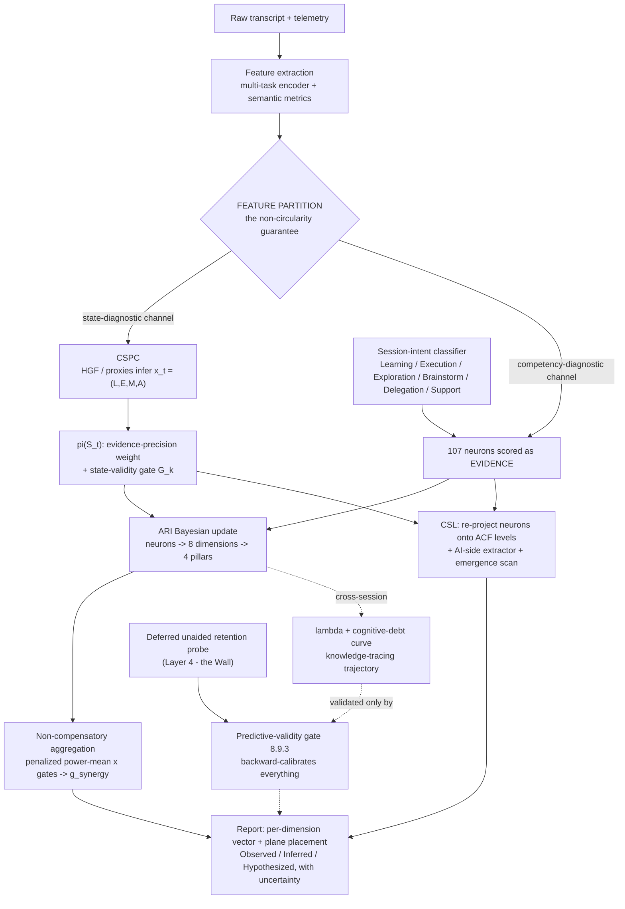

## 11.2 The feature partition (why ordering is safe)

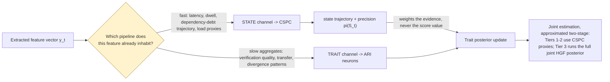

> The partition — **not** the ordering — removes the circularity. Running CSPC "first" is safe only because state is inferred from a *disjoint* channel; inferring state from the same VERIFY signal a neuron is scored from would double-count it. **Ordering without partition is the circularity, not its cure.**

## 11.3 Per-turn CSPC update (the HGF recursive loop)

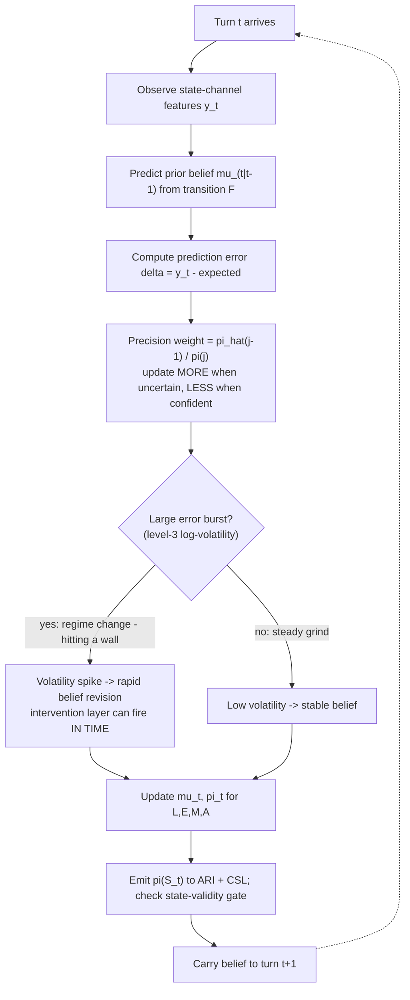

## 11.4 Cognitive-surrender detection (the coupled cascade firing)

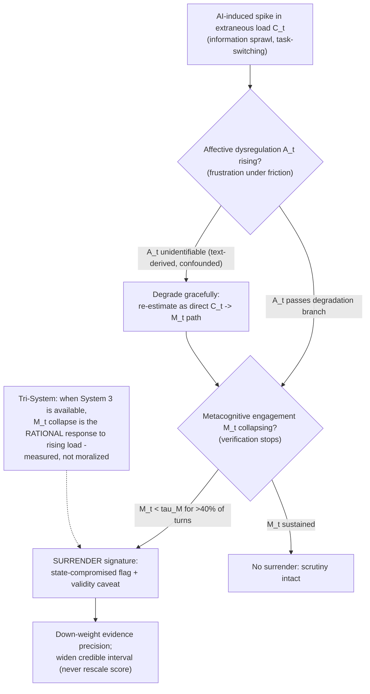

## 11.5 Per-chat scoring kernel (Tier 1 — the Chat Analyser)

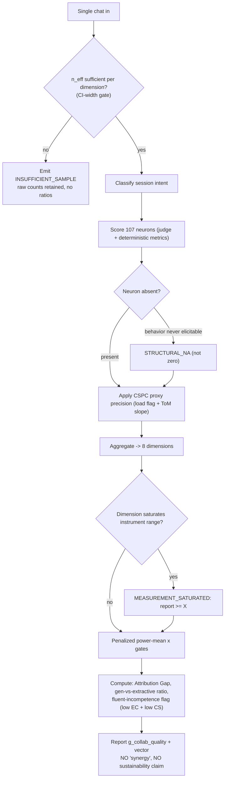

## 11.6 Session-complete aggregation and cross-session λ / debt update

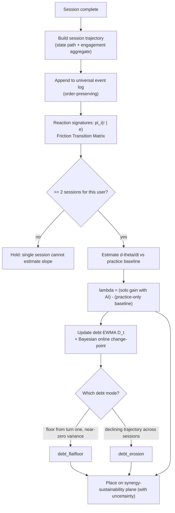

## 11.7 λ × S_human regime classification (the Skilled-Outsourcer 2×2)

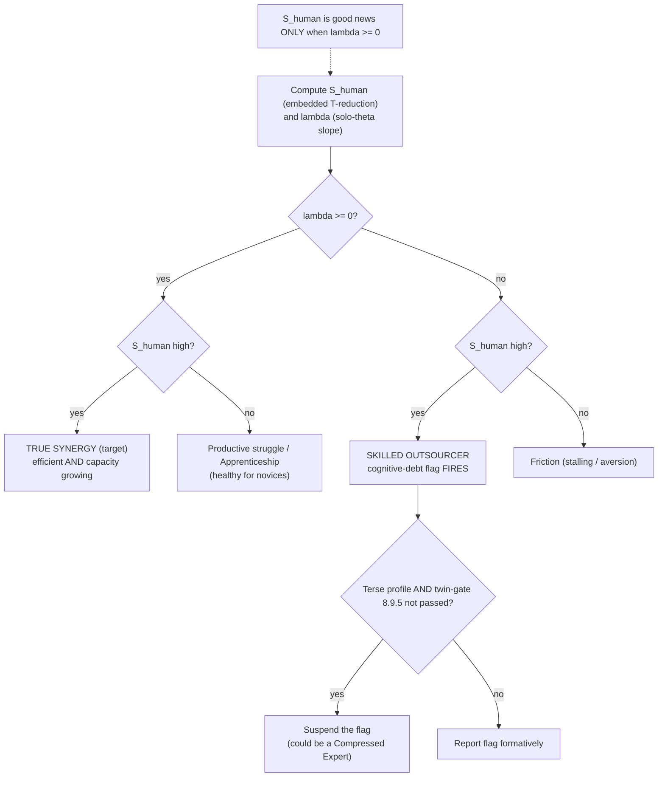

## 11.8 Retention probe → the predictive-validity gate (the Wall crossing)

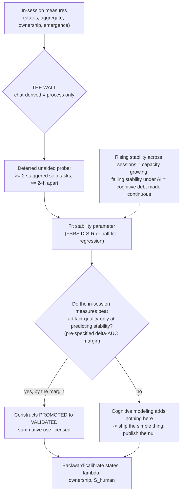

## 11.9 CSL — ownership map + emergence + reporting

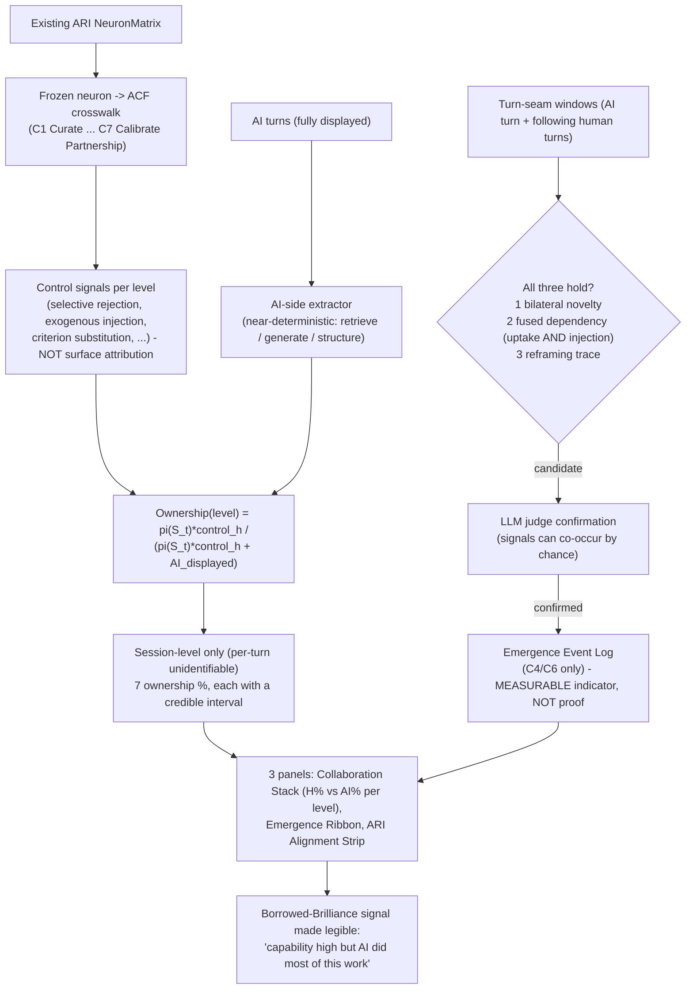

## 11.10 Three-tier deployment data flow & claims gating

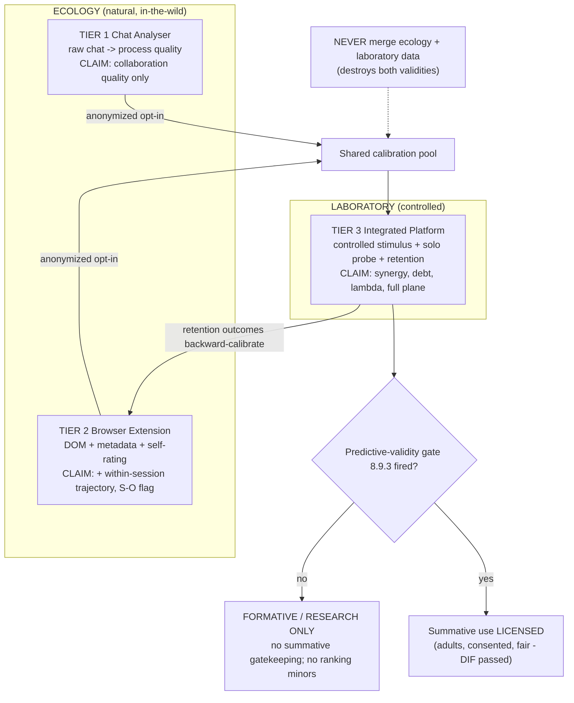

## 11.11 The four-rung claims ladder (promotion flow)

```mermaid
flowchart LR
    D["DESIGNED<br/>architecture built to measure it<br/>(no data)"] -->|"computable from real inputs<br/>+ reliability evidence (ICC, CI)"| M["MEASURABLE<br/>report the number WITH its error<br/>(formative use)"]
    M -->|"passes its predictive/criterion gate<br/>(8.9.3 - beats baseline at the probe)"| V["VALIDATED<br/>SUMMATIVE use licensed"]
    A["ASPIRATIONAL<br/>vision flag - explicitly NOT a capability"] -.kept strictly separate.-> D
    V -->|"no minor ranked/gated below this rung"| GUARD["Stakes never outrun validity"]
    classDef val fill:#d4edda,stroke:#155724;
    classDef asp fill:#f8d7da,stroke:#721c24;
    V:::val
    A:::asp
```

## 11.12 The annotation & bias-reconciliation event

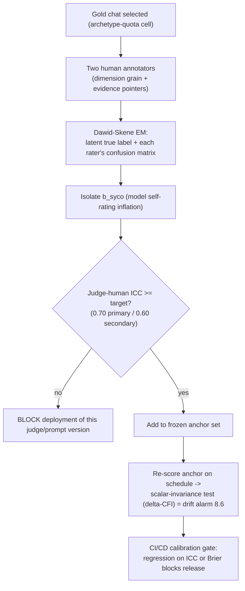

---

# APPENDIX A — NOTATION

| Symbol | Meaning |
|---|---|
| $\mathbf{x}_t = (L_t,E_t,M_t,A_t)$ | Latent cognitive state at turn $t$ (the CSPC 4D state) |
| $L_t$ | Germane cognitive load (tracked productive state; want high) |
| $C_t$ | Extraneous load (contaminant + intervention trigger; want low) |
| $E_t, M_t, A_t$ | Epistemic orientation; metacognitive engagement (the within-session surrender index); affective regulation |
| $\mathbf{F}$ | Coupled state-transition matrix (off-diagonal $C\!\to\!A\!\to\!M$) |
| $\mathbf{Q}(\nu_t)$ | Volatility-coupled process noise; $\nu_t$ = latent log-volatility (HGF level 3) |
| $\boldsymbol{\Lambda}$ | Observation loading matrix (features ← states) |
| $\mathbf{b}_t = \mathbf{b}^{\text{syco}}_t + \mathbf{b}^{\text{meta}}_t$ | Dual bias (model sycophancy + user metacognitive inflation) |
| $\pi(S_t)$ | State-derived evidence-precision weight (the conditioning mechanism; never a score multiplier) |
| $\theta_i$ | User $i$ solo (individual) ability (IRT) |
| $\kappa^H_i,\ \kappa^{AI}_m,\ \kappa^{\text{total}}$ | Collaborative ability (human, model, dyad) |
| $\beta_j,\ \gamma_j$ | Item difficulty; collaborative difficulty shift |
| $a_j, b_{jk}$ | GRM discrimination; ordered category thresholds |
| $\rho_{HM}$ | Human–model latent error correlation (the complementarity bound) |
| $g_{\text{syn}}$ / $g_{\text{collab\_quality}}$ | General synergy factor (bifactor headline) / its Tier-1 name where no solo baseline exists |
| $\lambda_i$ | Human Learning Coefficient (difference-in-slopes of solo θ; AI-attributable, practice-adjusted) |
| $\Lambda_i$ | Latent learning factor (convergent indicators around λ) |
| $S_{\text{human}}$ | Tokens saved by human intellect (embedded within-conversation estimator) |
| $r_{\text{auto}},\ r_{\text{steer}}$ | Redundancy rate in autonomous-continuation vs. steered spans (per 1k tokens) |
| $\Delta R = r_{\text{auto}}-r_{\text{steer}}$ | Redundancy-rate reduction attributable to human steering (the embedded counterfactual) |
| $\kappa^{H}_{\text{token}}$ | Collaborative-efficiency ability (token-domain IRT; inferred from $S_{\text{human}}$, never a multiplier) |
| $\Delta H_t$ | Entropy reduction in the model's continuation distribution caused by human turn $t$ (logprob estimator) |
| $\mathcal{E}_{\text{session}}$ | Session-level germane-engagement aggregate |
| $D_t$ | Cognitive-debt EWMA; `debt_flatfloor` / `debt_erosion` the two modes |
| $\hat{s}_i$ | Calibration slope (acceptance-vs-claim-risk regression per user) |
| $\hat{R}(c,m)$ | Partner reliability for risk-class $c$, model-era $m$ (the partner reliability map) |
| $\text{TR}_i$ | Verification theater rate (verification acts with null downstream delta) |
| $n_{\text{eff}}$ | Effective sample size $= n(1-\phi)/(1+\phi)$ (the scorability quantity) |
| EI, DD, TS | Element interactivity; dependency debt; task switching (Lepine load features) |
| $Q^*$ | Domain-expert quality gate for the $S_{\text{human}}$ validity check |
| $G_k$ | Non-compensatory gate $k \in (0,1]$ (state-validity, scorability, verification) |
| $\alpha_d$ | CDM discrete attribute-mastery readout of dimension $d$ (twin of GRM $\theta_d$) |
| Φ | Absolute generalizability coefficient (criterion-referenced; not the relative G-coefficient) |
| ACF C1…C7 | Augmented Cognition Framework levels (Curate, Discriminate, Specify & Verify, Frame & Integrate, Critique Criteria, Direct Cognitive Product, Calibrate Partnership) |

---

# APPENDIX B — THE COMPLETE 107-NEURON CATALOGUE (v6.0 FINAL)

This is the authoritative, exhaustive enumeration. Every neuron has a code, name, and verbatim definition. **107 total = AL 13 + PR 15 + EC 14 + ES 14 + CS 11 + CD 11 + AUI 12 + CA 17.** Neurons are **observable items**, scored as floats 0.0–1.0, aggregating bottom-up into the 8 dimensions and 4 pillars. **An absent neuron is N/A (structural or insufficient-sample), never scored zero.** The full per-neuron contract (type, extractor, valence, applicability condition, micro-rubric, sector-universality, near-pair discriminant, trait_w / state_w, falsifiability clause) lives in `contract_table.yaml`; the catalogue below is the human-readable index.

## LAYER 1 — ENGAGE (Foundational Interaction)

### ARI 1 · AI Literacy (AL) — 13 neurons
*Core epistemic model of how AI systems function — the mental foundation on which all other dimensions depend.*

| Code | Neuron — definition |
|---|---|
| AL-01 | **Probabilistic Reasoning Calibration** — distinguishing a model's linguistic confidence from factual accuracy, preventing fluency from being mistaken for correctness. |
| AL-02 | **Algorithmic Mechanism Grasp** — understanding that AI derives answers via statistical pattern completion, not logical deduction or true world-modeling. |
| AL-03 | **Context Window Awareness** — tracking and anticipating memory degradation over extended interactions, enabling proactive re-anchoring of critical context. |
| AL-04 | **Structural Brittleness Anticipation** — foreseeing exactly where an AI will break nested data, complex formatting, deep conditionality, or recursive logic. |
| AL-05 | **Domain-Grounding Aptitude** — establishing a specific knowledge environment and custom parameters before directing AI on specialized or sensitive tasks. |
| AL-06 | **Stochastic Output Variance Awareness** — understanding that identical prompts can produce meaningfully different outputs across invocations, requiring probabilistic rather than deterministic expectations. |
| AL-07 | **Capability Boundary Mapping** — active mental cartography of what a model can reliably execute versus where its performance characteristically degrades. |
| AL-08 | **Training Data Recency Sensitivity** — awareness of a model's knowledge cutoff and the instinct to flag temporally sensitive claims for independent verification. |
| AL-09 | **Model-Task Fit Assessment** — meta-judgment of whether a given model's architecture, training modality, and capability profile is appropriate for the task. |
| AL-10 | **AI Epistemic State Modeling** — mentally simulating what information the AI does and does not have in its current context window, predicting its likely failure modes before output. |
| AL-11 | **Multi-modal Situational Literacy** — understanding that AI processes images, code, audio, structured data, and text with different reliability profiles, adjusting verification depth per modality. |
| AL-12 | **System Constraint Awareness** — recognizing the invisible instruction layers (system prompts, safety filters, alignment) that bound behavior, distinguishing constraint-imposed refusal from genuine capability failure. |
| AL-13 | **Prompt Injection Vulnerability Awareness** — security awareness that externally sourced content can carry malicious instructions that hijack AI behavior, prompting sandboxing and source verification. |

### ARI 2 · Prompt Reasoning (PR) — 15 neurons
*Executive language and cognitive-engineering skills that translate internal human intent into machine-executable directives.*

| Code | Neuron — definition |
|---|---|
| PR-01 | **Negative Constraint Application** — explicitly defining exclusion parameters (what the AI must not produce/assume/include) to eliminate unwanted output space. |
| PR-02 | **Cognitive Scaffolding** — structuring a directive to force sequential, multi-step reasoning rather than a single-shot probabilistic guess. |
| PR-03 | **Contextual Density Optimization** — calibrating the ratio of background context to core directive to maximize signal-to-noise without overwhelming generative focus. |
| PR-04 | **Strategic Query Pivoting** — abandoning a failed linguistic framing and reconstructing the query from a structurally different angle rather than repeating it. |
| PR-05 | **Output Topology Definition** — mentally visualizing and explicitly commanding the structural architecture of the output before generation. |
| PR-06 | **Persona Anchoring** — defining a specific expert role/epistemic posture for the AI to inhabit, modulating the character of its reasoning. |
| PR-07 | **Inductive Example Provisioning** — supplying few-shot pattern templates that establish desired behavior by concrete demonstration rather than abstract instruction. |
| PR-08 | **Decomposition Precision** — atomizing complex goals into minimal, non-overlapping sub-tasks so each AI invocation has a single unambiguous objective. |
| PR-09 | **Constraint Hierarchy Definition** — explicitly ranking constraint priority so the AI resolves conflicts predictably under competing directives. |
| PR-10 | **Ambiguity Pre-emption** — identifying semantic misinterpretation points before submission and resolving lexical/referential ambiguity proactively. |
| PR-11 | **Verification Checkpoint Embedding** — building explicit self-audit instructions into the directive, directing the AI to test its output against criteria before concluding. |
| PR-12 | **Iterative Refinement Patience** — treating prompt construction as progressive multi-cycle optimization, tolerating refinement loops without premature closure. |
| PR-13 | **Semantic Precision Sensitivity** — awareness that minor lexical choices (synonyms, tense, quantifiers, presuppositions) produce divergent outputs, driving word-level optimization beyond mere clarity. |
| PR-14 | **Recursive Self-Critique Elicitation** — directing the AI to adversarially evaluate its own prior output, engineering an endogenous quality-control loop before human review. |
| PR-15 | **Parallel Task Architecture** — identifying which decomposed sub-tasks are logically independent and can be dispatched simultaneously, exploiting parallelism for throughput. |

## LAYER 2 — MANAGE (Critical Evaluation)

### ARI 3 · Error Correction (EC) — 14 neurons · ⚠ HIGHEST WEIGHT
*Active vigilance to audit AI output across all error modalities — what is stated incorrectly, what is silently absent, and what is invisibly assumed.*

| Code | Neuron — definition |
|---|---|
| EC-01 | **Factual Hallucination Detection** — identifying fabricated, confabulated, or misattributed information presented with the surface texture of established fact. |
| EC-02 | **Syntactical and Structural Debugging** — identifying logic gaps, missing steps, broken dependencies, or code misalignments in procedural/technical output. |
| EC-03 | **Internal Contradiction Recognition** — catching conflicting logic, changing premises, or self-negating arguments within a single response. |
| EC-04 | **Algorithmic Traceability** — stepping backward through AI logic to identify the precise origin of an error within a single output. |
| EC-05 | **Physical and Spatial Logic Verification** — validating AI descriptions of physical laws, spatial relationships, and systems logic against real-world constraints. |
| EC-06 | **Isolated Verification Rigor** — testing AI-generated claims/code/logic in a conceptually isolated sandbox before integrating into live production. |
| EC-07 | **Omission Detection** — identifying content silently left out of the AI's reasoning *within a single response* (missing qualifications, absent steps). Scope distinct from EC-13 and EC-14. |
| EC-08 | **Statistical Plausibility Assessment** — order-of-magnitude sanity-checking of numerical claims, statistics, and quantitative outputs before acceptance. |
| EC-09 | **Temporal Coherence Validation** — verifying that AI sequences, timelines, and causal chains maintain consistent temporal ordering and directional causality. |
| EC-10 | **Scope Boundary Enforcement** — detecting when output has silently expanded beyond defined task parameters, adding unrequested, unreviewed scope. |
| EC-11 | **Confidence-Accuracy Decoupling** — resisting the treatment of assertive, fluent output as implicitly more accurate; uniform scrutiny regardless of surface confidence. |
| EC-12 | **Error Propagation Tracing** — recognizing that an early seeded error has cascaded through locally-consistent but systemically-compromised downstream outputs. |
| EC-13 | **Edge Case Coverage Audit** — systematically enumerating boundary conditions and minority scenarios that statistically-anchored defaults silently excluded. |
| EC-14 | **Hidden Assumption Excavation** — surfacing and challenging the invisible load-bearing premises an AI's reasoning depends on but never states. |

### ARI 4 · Ethics Sensitivity (ES) — 14 neurons
*Ethical and governance vigilance over privacy, bias, accountability, and societal-scale consequence.*

| Code | Neuron — definition |
|---|---|
| ES-01 | **Privacy and Anonymization Foresight** — filtering and stripping PII and confidential information before it enters an AI interaction. |
| ES-02 | **Demographic and Cultural Bias Detection** — identifying skewed assumptions, statistical stereotyping, or cultural blindness in AI reasoning/content. |
| ES-03 | **Regulatory Compliance Adherence** — evaluating outputs against external legal, safety, professional, or enterprise governance frameworks. |
| ES-04 | **Epistemic Vigilance** — refusing AI as a primary authority; reflexively cross-referencing claims against primary sources. |
| ES-05 | **Intellectual Property Sensitivity** — recognizing when output reproduces, paraphrases, or structurally derives copyrighted/proprietary work without transformation. |
| ES-06 | **Dual-Use Risk Assessment** — evaluating whether a legitimate output could be weaponized or cause harm in a different context or by a different actor. |
| ES-07 | **Psychological Manipulation Detection** — identifying when persuasive output crosses from legitimate influence into manipulation exploiting cognitive/emotional vulnerabilities. |
| ES-08 | **AI Disclosure Judgment** — knowing when transparency about AI's role is legally required, organizationally mandated, or morally necessary, and acting unprompted. |
| ES-09 | **Value-Outcome Alignment Verification** — confirming recommendations are congruent with actual human/organizational values and long-term goals, not merely constraint-compliant. |
| ES-10 | **Autonomy-Preservation Vigilance** — awareness that habitual deference erodes independent decision-making, with the counter-reflex to exercise judgment on consequential decisions. |
| ES-11 | **Accountability Attribution Clarity** — explicitly assigning professional/legal/moral responsibility for an AI-assisted output to a specific human before deployment. |
| ES-12 | **Systemic Scale Impact Reasoning** — reasoning beyond single-use to second- and third-order societal consequences of the same output pattern deployed at population scale. |
| ES-13 | **Data Provenance Interrogation** — examining the likely composition and embedded biases of the training data behind an output, especially in minority/non-Western domains. |
| ES-14 | **Consent and Agency Stewardship** — verifying that outputs representing or affecting other humans preserve their consent, autonomy, dignity, and material interests, including in automated contexts. |

## LAYER 3 — CREATE (Integrative Synthesis)

### ARI 5 · Contextual Synthesis (CS) — 11 neurons · ⚠ HIGHEST WEIGHT
*Integrating AI output into a coherent human artifact without offloading the synthesis itself.*

| Code | Neuron — definition |
|---|---|
| CS-01 | **Semantic Blending** — smoothing transitions between human- and AI-authored blocks, eliminating tonal discontinuity in the final artifact. |
| CS-02 | **Dependency Preservation** — integrating output without breaking existing logical dependencies, narrative threads, data pipelines, or hierarchies. |
| CS-03 | **Information Density Pruning** — stripping verbose, repetitive AI filler to extract only high-signal insight. |
| CS-04 | **Authorial Tone Alignment** — editing AI vocabulary, syntax, and cadence to match a pre-established human or organizational voice. |
| CS-05 | **Cross-Domain Translation** — restructuring technical output for a non-specialist audience without loss of accuracy. |
| CS-06 | **Inferential Gap Bridging** — completing logical/contextual gaps the AI left implicit but which a human reader requires made explicit. |
| CS-07 | **Salience Hierarchy Reconstruction** — re-ranking information by actual domain relevance rather than the AI's default statistical co-occurrence ordering. |
| CS-08 | **Multi-Source Coherence Integration** — maintaining consistency when synthesizing outputs across multiple AI calls, sessions, or modalities. |
| CS-09 | **Attribution Tracking** — bookkeeping which contributions originated from human reasoning versus AI generation within a synthesized artifact. |
| CS-10 | **Register Modulation** — calibrating formality, technicality, and assumed shared knowledge for the specific deployment audience and relationship. |
| CS-11 | **Uncertainty Transparency Calibration** — restoring appropriate epistemic hedges to AI claims, counteracting AI's over-assertive stripping of probabilistic hedging. |

### ARI 6 · Creative Divergence (CD) — 11 neurons
*Driving the human–model error correlation (ρ_HM) down — the only mechanism by which genuine synergy can increase.*

| Code | Neuron — definition |
|---|---|
| CD-01 | **Statistical Homogenization Resistance** — rejecting the AI's most statistically probable/averaged/safe response in favor of the genuinely interesting. |
| CD-02 | **Lateral Concept Injection** — introducing metaphors, cultural frames, and references outside the AI's training distribution, forcing genuine novelty. (The cleanest human-origination signal at the Frame-and-Integrate level — see CSL C4 exogenous injection.) |
| CD-03 | **Counter-Factual Probing** — using hypothetical inversions and "what if" scenarios to stress-test and expand the AI's initial hypothesis. |
| CD-04 | **Stylistic Idiosyncrasy Retention** — defending unique formatting, pacing, humor, and edge-case perspectives against the AI's normalizing tendency. |
| CD-05 | **Aesthetic Discernment** — evaluating creative output against an internalized human standard of taste, resonance, and intended emotional impact. |
| CD-06 | **Constraint-Transcendence Instinct** — recognizing when deliberately violating a stated constraint yields a qualitatively superior outcome than strict compliance. |
| CD-07 | **Narrative Tension Injection** — introducing productive conflict, stakes, or irresolution that AI tends to prematurely smooth into consensus. |
| CD-08 | **Analogical Novelty Generation** — producing novel analogical mappings and cross-domain metaphors outside AI's statistical co-occurrence patterns. |
| CD-09 | **Surprise Preservation** — protecting counterintuitive or unconventional elements from the AI's normalizing tendency. |
| CD-10 | **Embodied Experience Injection** — infusing work with sensory, physical, kinesthetic experience unavailable to AI, producing a quality of felt truth. |
| CD-11 | **Audience Empathy Modeling** — maintaining a rich, specific model of the audience's emotional state, prior knowledge, and unstated needs (a Theory-of-Mind signature; loads on $E_t$). |

## LAYER 4 — DESIGN (Executive Control)

### ARI 7 · Augmentation Instinct (AUI) — 12 neurons
*Trust calibration, delegation judgment, and anti-dependency vigilance. (The v1.0 architecture splits this into OR = orchestration and AUT = autonomy; EFA may justify that split.)*

| Code | Neuron — definition |
|---|---|
| AUI-01 | **Cognitive Friction Recognition** — identifying the moment a task's demand exceeds optimal manual effort, triggering delegation. |
| AUI-02 | **Task-Type Delegation Judgment** — routing rote/high-volume work to AI while reserving high-nuance, high-stakes, or ethically consequential work for human cognition. |
| AUI-03 | **Modality Appropriateness** — matching the correct type of AI system (generative, analytical, retrieval) to the structural requirements of the problem. |
| AUI-04 | **Interaction ROI Intuition** — recognizing the tipping point where direct human effort beats the compounding cost of debugging a failing prompt chain. |
| AUI-05 | **Working Memory Offloading** — using AI as an external scratchpad to externalize intermediate states, freeing executive function for higher-order reasoning. |
| AUI-06 | **Cognitive Load Self-Monitoring** — real-time awareness of one's own saturation, enabling strategic offloading at the moment of productive overload before degradation. |
| AUI-07 | **Prompt Investment Calibration** — judging how much effort to invest in prompt crafting versus the expected return in output quality. |
| AUI-08 | **Dependency Risk Awareness** — recognizing that sustained delegation creates progressive skill atrophy and cognitive fragility in one's own profile. |
| AUI-09 | **Handoff Timing Precision** — judging exactly when to reclaim agentic control mid-task before autonomous completion introduces irreversible errors or goal drift. |
| AUI-10 | **Skill-Gap Self-Awareness** — inventorying one's own knowledge gaps so AI supplements genuine expertise rather than silently substituting for absent understanding. |
| AUI-11 | **Verification Effort Calibration** — allocating deep review to high-stakes output and lighter review to routine output, optimizing the total verification budget. |
| AUI-12 | **Agentic Permission Scoping** — defining minimum necessary authority, resource access, and reversibility constraints before delegating to autonomous agents. |

### ARI 8 · Collaborative Agency (CA) — 17 neurons
*Psychological sovereignty, metacognition, and the active maintenance of independent judgment across the session.*

| Code | Neuron — definition |
|---|---|
| CA-01 | **Sovereign Override Capacity** — the willingness to reject AI authority, overrule outputs, and rewrite its core assumptions when they conflict with human judgment. |
| CA-02 | **Cognitive Momentum Maintenance** — sustaining parallel productive human thinking rather than going cognitively idle during AI generation waits. |
| CA-03 | **Contextual Compartmentalization** — isolating different problems into separate cognitive frames, preventing context cross-contamination across unrelated tasks. |
| CA-04 | **Interactional Resilience** — rapidly diagnosing, restructuring, and recovering a workflow when AI has hallucinated or lost context. |
| CA-05 | **Terminal Feedback Provisioning** — closing the loop by feeding errors, corrections, and observations back into the session to progressively align AI performance. |
| CA-06 | **Adaptive Trust Calibration** — evidence-based adjustment of deference based on real-time performance, preventing both chronic over-trust and paralyzing under-trust. |
| CA-07 | **Goal Integrity Maintenance** — maintaining fidelity to original intent across multi-turn interactions, resisting AI-induced goal drift. |
| CA-08 | **Metacognitive Self-Monitoring** — continuous awareness of one's own cognitive state, biases, and judgment quality during deep collaboration. (Hosts the Brier calibration field; loads on $M_t$.) |
| CA-09 | **Process Auditability Discipline** — maintaining a workflow record sufficient for retrospective audit, attribution, and legal defensibility. |
| CA-10 | **Selective Attention Governance** — resisting AI scope expansions and tangential elaborations, anchoring deliberately on the core objective. |
| CA-11 | **Affective Regulation Under Failure** — preventing frustration or impatience from degrading decision quality when AI repeatedly fails or hallucinates. (Indexes $A_t$.) |
| CA-12 | **Cross-Session Transfer Learning** — extracting generalizable heuristics and failure patterns from past interactions and applying them to novel future tasks. |
| CA-13 | **Identity Authorship Preservation** — maintaining a continuous, defensible sense of one's intellectual contribution and creative voice through deep collaboration. |
| CA-14 | **Intra-Session Pattern Recognition** — detecting recurring failure patterns and biases in the AI's current-session responses, enabling proactive strategy adjustment. |
| CA-15 | **AI Sycophancy Resistance** — recognizing that AI is trained to affirm the user (making agreement unreliable as confirmation) and soliciting adversarial challenge anyway. (The inverse signal for over-deference / relational-AI over-attachment.) |
| CA-16 | **Pre-Generation Epistemic Independence** — forming one's own hypothesis *before* reading AI output, preserving an independent baseline against anchoring. |
| CA-17 | **Vigilance Sustainment** — maintaining rigorous scrutiny across long sessions, counteracting the temporal decay of evaluation quality from habituation, fatigue, and complacency. (Overwhelmingly a within-session state phenomenon: high state_w, low trait_w.) |

---

# APPENDIX C — THE COMPLETE HIERARCHY TREE (4 → 8 → 107)

**Master structural tree** (root → 4 pillars → 8 dimensions). The two ⚠-marked dimensions (EC, CS) carry the highest weight in scoring and gate the Fluent-Incompetence flag (low EC + low CS).

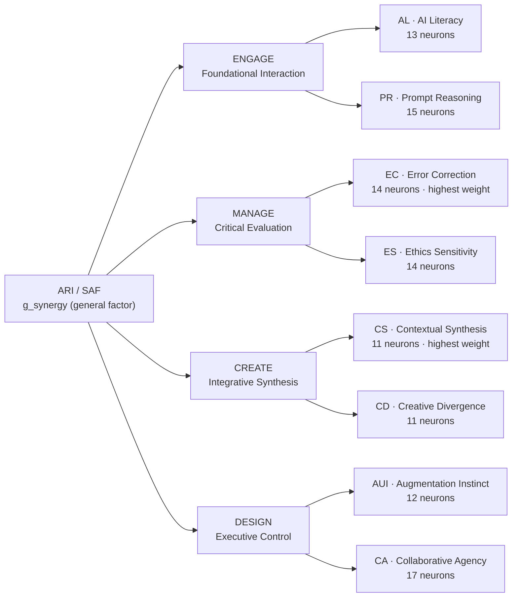

**Tree 1 — ENGAGE → {AL, PR} (28 neurons)**

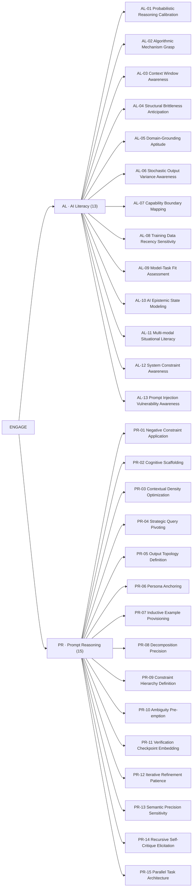

**Tree 2 — MANAGE → {EC, ES} (28 neurons)**

```mermaid
flowchart LR
    M["MANAGE"] --> EC["EC · Error Correction (14) · highest weight"]
    M --> ES["ES · Ethics Sensitivity (14)"]
    EC --> EC01["EC-01 Factual Hallucination Detection"]
    EC --> EC02["EC-02 Syntactical and Structural Debugging"]
    EC --> EC03["EC-03 Internal Contradiction Recognition"]
    EC --> EC04["EC-04 Algorithmic Traceability"]
    EC --> EC05["EC-05 Physical and Spatial Logic Verification"]
    EC --> EC06["EC-06 Isolated Verification Rigor"]
    EC --> EC07["EC-07 Omission Detection"]
    EC --> EC08["EC-08 Statistical Plausibility Assessment"]
    EC --> EC09["EC-09 Temporal Coherence Validation"]
    EC --> EC10["EC-10 Scope Boundary Enforcement"]
    EC --> EC11["EC-11 Confidence-Accuracy Decoupling"]
    EC --> EC12["EC-12 Error Propagation Tracing"]
    EC --> EC13["EC-13 Edge Case Coverage Audit"]
    EC --> EC14["EC-14 Hidden Assumption Excavation"]
    ES --> ES01["ES-01 Privacy and Anonymization Foresight"]
    ES --> ES02["ES-02 Demographic and Cultural Bias Detection"]
    ES --> ES03["ES-03 Regulatory Compliance Adherence"]
    ES --> ES04["ES-04 Epistemic Vigilance"]
    ES --> ES05["ES-05 Intellectual Property Sensitivity"]
    ES --> ES06["ES-06 Dual-Use Risk Assessment"]
    ES --> ES07["ES-07 Psychological Manipulation Detection"]
    ES --> ES08["ES-08 AI Disclosure Judgment"]
    ES --> ES09["ES-09 Value-Outcome Alignment Verification"]
    ES --> ES10["ES-10 Autonomy-Preservation Vigilance"]
    ES --> ES11["ES-11 Accountability Attribution Clarity"]
    ES --> ES12["ES-12 Systemic Scale Impact Reasoning"]
    ES --> ES13["ES-13 Data Provenance Interrogation"]
    ES --> ES14["ES-14 Consent and Agency Stewardship"]
```

**Tree 3 — CREATE → {CS, CD} (22 neurons)**

```mermaid
flowchart LR
    CR["CREATE"] --> CS["CS · Contextual Synthesis (11) · highest weight"]
    CR --> CD["CD · Creative Divergence (11)"]
    CS --> CS01["CS-01 Semantic Blending"]
    CS --> CS02["CS-02 Dependency Preservation"]
    CS --> CS03["CS-03 Information Density Pruning"]
    CS --> CS04["CS-04 Authorial Tone Alignment"]
    CS --> CS05["CS-05 Cross-Domain Translation"]
    CS --> CS06["CS-06 Inferential Gap Bridging"]
    CS --> CS07["CS-07 Salience Hierarchy Reconstruction"]
    CS --> CS08["CS-08 Multi-Source Coherence Integration"]
    CS --> CS09["CS-09 Attribution Tracking"]
    CS --> CS10["CS-10 Register Modulation"]
    CS --> CS11["CS-11 Uncertainty Transparency Calibration"]
    CD --> CD01["CD-01 Statistical Homogenization Resistance"]
    CD --> CD02["CD-02 Lateral Concept Injection"]
    CD --> CD03["CD-03 Counter-Factual Probing"]
    CD --> CD04["CD-04 Stylistic Idiosyncrasy Retention"]
    CD --> CD05["CD-05 Aesthetic Discernment"]
    CD --> CD06["CD-06 Constraint-Transcendence Instinct"]
    CD --> CD07["CD-07 Narrative Tension Injection"]
    CD --> CD08["CD-08 Analogical Novelty Generation"]
    CD --> CD09["CD-09 Surprise Preservation"]
    CD --> CD10["CD-10 Embodied Experience Injection"]
    CD --> CD11["CD-11 Audience Empathy Modeling"]
```

**Tree 4 — DESIGN → {AUI, CA} (29 neurons)**

```mermaid
flowchart LR
    D["DESIGN"] --> AUI["AUI · Augmentation Instinct (12)"]
    D --> CA["CA · Collaborative Agency (17)"]
    AUI --> AUI01["AUI-01 Cognitive Friction Recognition"]
    AUI --> AUI02["AUI-02 Task-Type Delegation Judgment"]
    AUI --> AUI03["AUI-03 Modality Appropriateness"]
    AUI --> AUI04["AUI-04 Interaction ROI Intuition"]
    AUI --> AUI05["AUI-05 Working Memory Offloading"]
    AUI --> AUI06["AUI-06 Cognitive Load Self-Monitoring"]
    AUI --> AUI07["AUI-07 Prompt Investment Calibration"]
    AUI --> AUI08["AUI-08 Dependency Risk Awareness"]
    AUI --> AUI09["AUI-09 Handoff Timing Precision"]
    AUI --> AUI10["AUI-10 Skill-Gap Self-Awareness"]
    AUI --> AUI11["AUI-11 Verification Effort Calibration"]
    AUI --> AUI12["AUI-12 Agentic Permission Scoping"]
    CA --> CA01["CA-01 Sovereign Override Capacity"]
    CA --> CA02["CA-02 Cognitive Momentum Maintenance"]
    CA --> CA03["CA-03 Contextual Compartmentalization"]
    CA --> CA04["CA-04 Interactional Resilience"]
    CA --> CA05["CA-05 Terminal Feedback Provisioning"]
    CA --> CA06["CA-06 Adaptive Trust Calibration"]
    CA --> CA07["CA-07 Goal Integrity Maintenance"]
    CA --> CA08["CA-08 Metacognitive Self-Monitoring"]
    CA --> CA09["CA-09 Process Auditability Discipline"]
    CA --> CA10["CA-10 Selective Attention Governance"]
    CA --> CA11["CA-11 Affective Regulation Under Failure"]
    CA --> CA12["CA-12 Cross-Session Transfer Learning"]
    CA --> CA13["CA-13 Identity Authorship Preservation"]
    CA --> CA14["CA-14 Intra-Session Pattern Recognition"]
    CA --> CA15["CA-15 AI Sycophancy Resistance"]
    CA --> CA16["CA-16 Pre-Generation Epistemic Independence"]
    CA --> CA17["CA-17 Vigilance Sustainment"]
```

> **Reading the tree against the rest of the framework.** A neuron is the unit of *observation*; the dimension is the unit of *competency* (recovered by EFA); the pillar is the unit of *development* (OECD/AILit-aligned). The same neurons feed both the trait pipeline (slow, EFA → dimensions) and the state pipeline (fast, HGF observation model) under the feature partition (§2.2) — e.g. AL-03, PR-02, PR-08 load on germane load $L_t$; CA-08, CA-14, CA-17 index metacognitive engagement $M_t$; CA-11 indexes affective regulation $A_t$; CD-11 carries the ToM signature for $E_t$. EC and CS being highest-weight is why the non-compensatory aggregator (§3.7) and the Fluent-Incompetence gate sit where they do. The same neurons are *re-projected* onto the seven ACF levels for CSL (Part V) — one extraction, two aggregations.

---

# APPENDIX D — VERSION LINEAGE (v1 → v3.21)

The body of this document is **self-contained and final-form**; it refers to no prior version for its content. This appendix exists only to record *how the final form was reached* — the historical trajectory the user asked to see preserved — so that the *reason* a given mechanism is shaped as it is remains legible. Each version solved a different class of problem; nothing here is a live dependency of the body above.

## D.1 The trajectory, in one line per version

| Version | Name / role | What it contributed (the net new) |
|---|---|---|
| **v0** | The taxonomy | The first behavioral vocabulary of human–AI interaction. |
| **v1** | Ritesh: the neuron bank | The 107-neuron bank, the redundancy critique, and the decision to use **IRT** as the scoring spine rather than ad-hoc weights. |
| **v1.0** | The full measurement instrument | First end-to-end instrument: neurons → dimensions → pillars, the bifactor hypothesis, the 3-super-factor structure. |
| **v1.1** | The pipeline | The 3-extractor pipeline, normalization (length residualization, rate-per-1000), the first 23-chat gold anchor, ICC gating, and the **minimum-across-pillars** non-compensatory rule. |
| **v1.2** | Sustainability primitives | **λ** (the Human Learning Coefficient) and **S_human** introduced; the **λ × S_human 2×2** regime surface — the operational heart of Skilled-Outsourcer detection. |
| **v1.3** | Sensing & ground truth | Judge feasibility established; the **three-layer sensing** stack; the **retention probe** as the ground-truth anchor. |
| **v2.0** | The unified engine | The neuron **contract schema** (`contract_table.yaml`); the **N/A gate** (structural vs insufficient-sample); embedded state flags; flexible N-dimensions; the **translation layer** (commitment 7). |
| **v2 (rigor)** | The measurement-engine & scientific-rigor revision | **Partition-guarded state conditioning**; **precision-not-multipliers**; the **soft non-compensatory aggregator** (penalized power mean); the **$n_{\text{eff}}$ scorability gate**; the **four-rung claims ladder**; per-construct **falsifiability contracts**; the **ecology/laboratory** bifurcation; the maturation roadmap; the **rejection/deferral log + dated ontology freeze**. |
| **v2.1** | The humanity revision | The **humanity charter** and five governing ethics; the **archetype sampling frame** (10 archetypes) + **quota corpus**; the **censored-sample principle** and allocation policy + task menus; per-dimension measurement notes; **model-era cohort norming**; the **$A_t$ degradation branch**; EC **provenance / calibration-slope / theater** + the partner-reliability map; dimension-grain annotation; the generative-recall 48-h probe; the **twin-discrimination gate (§8.9.5)**; data dignity. |
| **v2.2** | Interaction-dynamics integration | The **universal event log**; the **Event-Conditioned Response** layer + **Friction Transition Matrix** + five transition metrics; the **descriptive regime overlay**; **embedded micro-probes** (MP-1/2/3) with randomized exposure; **commitment 9 (manufacture the counterfactual)**; the **shared-gold bets protocol (§8.9.6)** adjudicating the AEGIS disagreements. |
| **v3** | The validation-and-standards revision | Reliability as a **G-study**; the **judge non-determinism protocol**; **`MEASUREMENT_SATURATED`**; the recognition that the neuron→dimension map is a **Q-matrix** + **CDM (DINA/DINO/G-DINA)** backend; **LCA/LPA** archetype discovery; the **knowledge-tracing** sustainability backend; the retention probe upgraded to a **fitted decay curve (FSRS DSR)**; **question-asking science (EIG/OED)**; drift as **measurement invariance / Response Shift**; the **fairness three-level discipline**; the **appropriate-reliance** re-grounding (WoA, switch fraction); the **scope-honesty / claims-ladder correction** ("on single-chat synergy, the apparatus is a calibrated wrapper; the irreplaceable value is the sustainability axis + the validation apparatus"); **benchmark vs pilot** formalized; operating under the **AERA/APA/NCME Standards** + QWK. |
| **v3.1** | The scope-discipline & grounding revision | The **"relevance is not scope"** clause; the **population-observatory layer**; **Brier** as a metacognitive-calibration field; the **causal-DAG pre-registration** (hypothesis frozen, fitting deferred); the **iatrogenic-risk disclosure gate**; **relational-AI-psychology** and **behavioral-economics** grounding for existing CA/AUI/EC neurons; the **A/B disclosure-effects** pre-registration. Triaged a six-dimension expansion proposal down to the freeze-compliant subset. |
| **v3.2** | The cognitive-work layer | **CSL** (the Cognitive Session Layer): the **ACF crosswalk**, ownership as **cognitive control not surface attribution**, the **emergence event log**, the ten analytics triaged; the **five calibration mechanisms** as precision conditioners (JAF/WoA, grounding, vigilance, Dawid–Skene sycophancy, interaction entropy); the **infrastructure fixes** (security P0, determinism, never-collapse). |
| **v3.21** | **This document — the unified master specification** | No new ontology. Folds the entire lineage into one final, from-scratch, standalone reference; embeds the functional graphs; consolidates the four-layer stack, the claims ladder, the Wall, and the deferral register into a single canonical artifact. |

## D.2 The four discipline-defining inflection points

Across the whole trajectory, four corrections did the most to make the instrument honest, and they are the load-bearing posture of v3.21:

1. **From hard-minimum to soft non-compensatory aggregation (v2).** A single noisy floor-level dimension was nuking the composite and destroying all discrimination. The penalized power mean preserved the anti-gaming intent without the brittleness.
2. **From score multipliers to precision-weighting (v2).** "State modifies confidence, not capability" became *automatic* (the HGF's own update) rather than a bolted-on constant — and the **partition**, not the ordering, became the non-circularity guarantee.
3. **From "we measure synergy" to the four-rung ladder + the Wall (v2 → v2.2 → v3).** The single largest risk was always rhetorical drift. The ladder, the Wall, and the manufactured-counterfactual commitment keep every claim pinned to the evidence that licenses it.
4. **From "more dimensions = more rigor" to the ontology freeze + "relevance is not scope" (v2 → v3.1).** Reliability grows faster than complexity only if complexity stops moving. The freeze redirected all energy from architecture to evidence; the observatory layer gave the genuinely-out-of-scope concerns a legitimate home.

---

# APPENDIX E — CONCEPT GLOSSARY

A consolidated index of every load-bearing term, for fast reference. Definitions in the body (§1.3 especially) are authoritative; this is the lookup table.

**The two outcomes**
- **Synergy** — dyad performance vs **max(human alone, AI alone)** (the stringent, asymmetric bar). Rare.
- **Augmentation** — dyad performance vs **human alone** (the weaker bar most dyads clear).
- **Sustainability** — whether the human's *independent* capacity is growing or eroding across sessions.

**The four quadrants** — **Amplification** (high synergy, growing capacity — the target); **Apprenticeship** (low synergy, growing capacity — healthy for novices); **Borrowed Brilliance** (high synergy, eroding capacity — the Skilled-Outsourcer risk); **Dependent Decline** (low synergy, eroding capacity).

**The four layers** — **ARI** (Layer 1, the competency trait: 107 neurons → 8 dimensions → 4 pillars); **CSPC** (Layer 2, the 4D cognitive state via HGF); **CSL** (Layer 3, who-did-what / ownership + emergence); **the retention probe** (Layer 4, the unaided outcome — the only thing that crosses the Wall).

**The claims ladder** — **DESIGNED** (built to measure it) → **MEASURABLE** (computed now, with reliability evidence) → **VALIDATED** (predicts the outcome; licenses summative use) → **ASPIRATIONAL** (a vision flag, never a current capability).

**Core constructs**
- **The Wall** — the boundary between chat-derived process (Layers 1–3) and outcome (Layer 4). No claim crosses it without probe data.
- **Cognitive surrender** — the *within-session* failure: adopting AI output with minimal scrutiny, overriding System 1 and System 2. Indexed by $M_t$ collapse.
- **Cognitive debt** — the *across-session* accumulation: unbuilt schemas from absent germane processing, "coming due later." Two modes: **flat-floor** (arrived already extracting) and **erosion** (began engaged, became dependent).
- **The Skilled Outsourcer** — the Borrowed-Brilliance user: efficient output, accruing debt. The pathology the whole instrument exists to expose.
- **Fluent incompetence** — sophisticated-looking output with no underlying comprehension; surface-identical to genuine competence. Triggered by simultaneously low EC + CS.
- **The twin pair** — **Compressed Expert** (archetype 10, calibrated mastery) and **Delegating Manager** (archetype 5, hollow): surface-identical, sustainability-opposite. The §8.9.5 gate exists to separate them; CSL ownership measures *control* (not attribution) for the same reason.
- **The censored-sample problem** — transcripts only observe tasks the user chose to externalize; preserved solo capacities never enter the data. A structural limit on all transcript-based claims.

**Latent quantities**
- **θ** — solo ability. **κ^H / κ^AI / κ^total** — collaborative ability (human / model / dyad). **Boost** = κ_total − θ.
- **λ (Human Learning Coefficient)** — the AI-attributable, practice-adjusted slope of *solo* capacity across sessions. A rate, not a detector. Measured from downstream solo performance, never from in-session confidence.
- **ρ_HM** — latent human–model error correlation; the complementarity ceiling. CD drives it down.
- **The 4D state** — $L_t$ (germane load), $E_t$ (epistemic orientation), $M_t$ (metacognitive engagement — the surrender index), $A_t$ (affective regulation). $C_t$ = extraneous load. The coupled cascade: $C_t \to A_t \to M_t$.
- **S_human** — tokens saved by human intellect, via the **embedded T-reduction estimator** (within-conversation autonomous-stretch baseline). Reported only paired with λ.
- **π(S_t)** — the CSPC precision weight that conditions evidence in Layers 1 and 3 (never a score multiplier).
- **g_syn / g_collab_quality** — the bifactor headline (renamed *collaboration quality* at Tier 1, where no solo baseline exists).

**CSL terms**
- **Re-projection** — aggregating existing ARI neuron firings onto the ACF axis instead of (or in addition to) the 8-dimension axis. A second view, not a re-measurement.
- **Foundation evidence** — observable traces that a Distributed-mode act rested on the Individual-mode competence the ACF dependency column requires. The measurement target for ownership, replacing surface activity.
- **Control signal** — the level-specific foundation evidence (selective rejection, exogenous injection, criterion substitution, …) that requires the underlying competence to produce, and therefore cannot be faked by surface volume.
- **Displayed ownership** — ownership measured from the transcript (MEASURABLE); distinct from *genuine* ownership (requires Layer 4).
- **Emergence event** — a discrete turn-seam event satisfying bilateral-novelty + fused-dependency + reframing-trace, judge-confirmed; a synergy *indicator*, never synergy *proof*.

**Method / governance terms**
- **The ontology freeze** — no new neurons/dimensions/pillars/latent variables for the validation year; only new *fields*, methods, validation, and governance permitted.
- **The N/A states (never collapsed)** — `STRUCTURAL_NA` (behavior never elicitable), `INSUFFICIENT_SAMPLE` ($n_{\text{eff}}$ below threshold), `MEASUREMENT_SATURATED` (right-censored ceiling), and a genuine score. Four distinct labels, never merged.
- **The partition** — the disjoint feature channels (state-diagnostic / competency-diagnostic / AI-side) that make the state-conditioned scoring loop identifiable. *Ordering without partition is the circularity, not its cure.*
- **Capture-don't-condition** — telemetry and affective state are recorded now but must not condition live scores until their validity gates clear.
- **The deferral register** — surviving external proposals held with epistemic tags and reinstatement triggers, never absorbed on proposal quality alone.

---

*End of the SAF/ARI v3.21 Unified Master Specification.*

> This document is the single, self-contained reference for how SAF/ARI operates: the **synergy–sustainability plane** (the thesis); the **107 → 8 → 4 competency hierarchy** and its **IRT / GRM / CDM** mathematics (the trait axis, Layer 1); the **CSPC's HGF-inferred 4D state** with the coupled $C \to A \to M$ cascade (the state axis, Layer 2); the **CSL** ownership-and-emergence layer with the ACF crosswalk (the work-distribution axis, Layer 3); the **cognitive-surrender / cognitive-debt instrumentation** with **λ**, **S_human**, the fitted retention curve, and the knowledge-tracing backend (the sustainability axis, Layer 4); the **AI/ML/DL apparatus** with per-subproblem algorithm-selection rationale; the **calibration, reliability, fairness, and pre-registered falsifiability** machinery; the **three-tier claims charter** and its governance; and the **functional graphs** that connect them. Every claim carries its rung; every construct names what would disprove it; the **Wall** holds throughout. The instrument is **DESIGNED and MEASURABLE today; it becomes VALIDATED only when the deferred unaided retention probe returns data.** That is the work of earning the right to call it the first *validated* psychometric tool for human–AI interaction — and this specification is the blueprint for that work.
